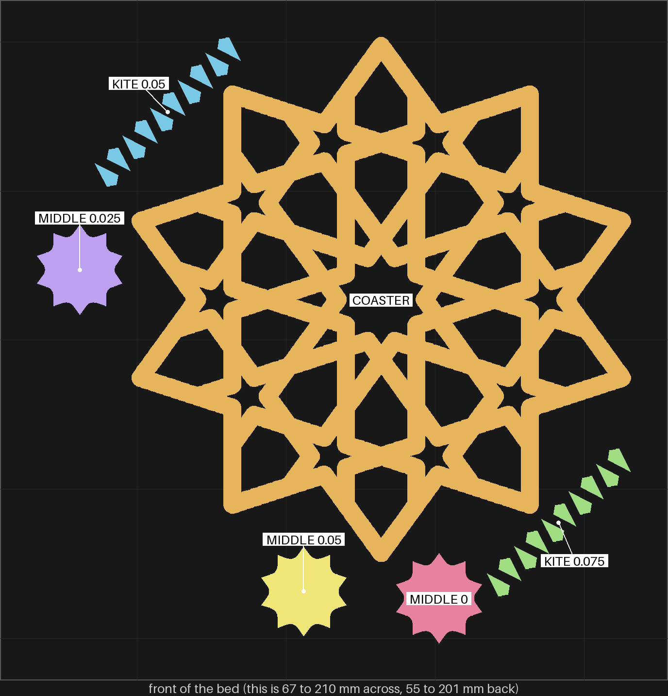
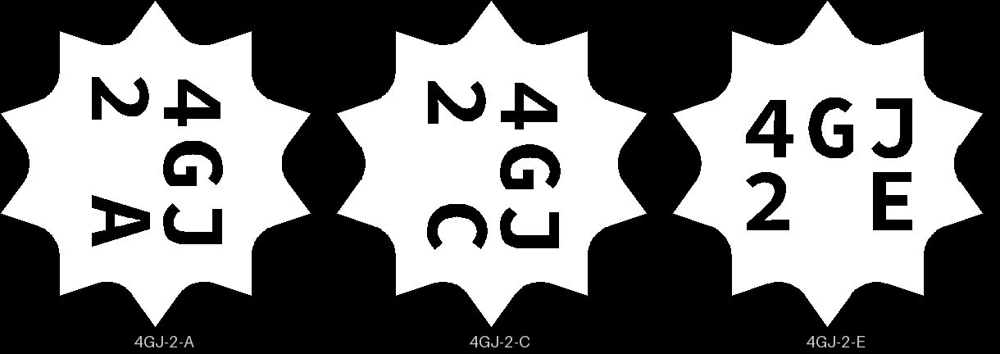
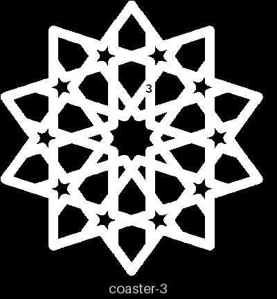
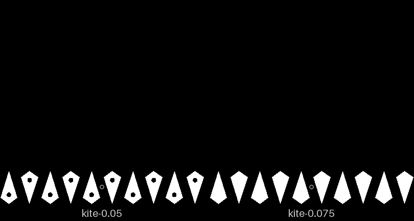

# sheets-04g-fit3 — the 0.025 middle piece again, and a looser kite

**In short.** On [sheets-04g-fit2](sheets-04g-fit2.md) you picked the middle piece at 0.025 mm
("4gh ic is winner") and said the 0.05 kites "could be a bit smaller, tought to insert". But the
pieces that printed on both fit plates did not feel the same on both, though the files, the
settings and the spot on the bed were the same ([the issue](../../issues/sheets-04g-fit.md#the-same-file-a-different-fit)).
So one win is a good sign, not a settled gap. This plate prints the 0.025 piece again beside its
two controls, the kites at 0.05 and at a looser 0.075, and a fresh coaster to try them in.

## What it is

Recipe: [sheets-04g-fit3.yaml](sheets-04g-fit3.yaml). The same size as sheets-04g-fit2 (112.5 mm
across, 3.75 mm straps, 4.4 mm tall).

- **The coaster:** the gBV minimal coaster, as sheets-04g-fit2 printed it, with `3` on its
  bottom (fit and fit2 both carried `Z`).
- **The middle piece at the same three gaps as fit2:** 0, 0.025 and 0.05 mm per face, with the
  same dots (three, two, one) and the same letters (A, C, E). The code `4GJ` tells them from
  fit2's `4GH` pieces.
- **Ten kites at 0.05, one dot each:** the control. On fit2 they were tough to push in. The
  outline is fit2's; the dot is new, so the file is not the same one.
- **Ten kites at 0.075, no dot.** This is an assumption, not a decision: halfway between 0.05
  ("tought to insert") and sheets-04g-fit's 0.10 ("too small/lost"). A kite has no room for a
  carved id, so the dot is how the two piles are told apart. The dot is in the top, so it does
  not change the fit.

## Why print it

- **The question:** does `4GJ 2C` (0.025) sit firmer than `4GJ 2E` and go in easier than
  `4GJ 2A` again? And does a 0.075 kite go in easier than a 0.05 one and still stay in upside down?
- **The bet it moves:** CAL-LSE-01, the loose-piece gap per face by shape in a straps-only frame
  ([bets.md](../../../.claude/skills/calibrate/bets.md)).
- **What it lets us decide:** the middle piece's gap and the kites' gap on the next sheets-04g
  iteration.
- **What to read off it:** for each piece, does it go in by hand, does it stay with the coaster
  upside down, and does it come out too easily.

## After the print

What gets asked when the plate comes off the bed, one row at a time (the review-print skill asks
them). Each middle piece is named by the id cut into its bottom: `4GJ 2A` reads 4GJ over 2 A
(the 2 is the recipe's second version; the first, with a `Z` coaster, was never printed). The
fresh coaster carries a small `3`, not the `Z` that fit's and fit2's coasters carry, so the three
coasters are never mixed up. The kites have no id: the 0.05 ones have one dot in the top, the
0.075 ones none. Keep this plate's pieces apart from fit2's; the codes differ (4GJ here, 4GH
there), but fit2's kites look like this plate's plain ones.

| Pieces | The question | What we expect, and why | What each answer changes |
|---|---|---|---|
| `4GJ 2A` (gap 0, three dots on top), `4GJ 2E` (0.05, one dot), the fresh coaster (`3` on its bottom) | **Do:** Push `4GJ 2A` by hand into the middle hole of the `3` coaster, then take it out. Do the same with `4GJ 2E`. **Look for:** Is `4GJ 2A` very tight, as `4GH 1A` was? Is `4GJ 2E` loose, as `4GH 1E` was? Say each by its id. | The same as on fit2: 2A very tight, 2E loose. | Same: this coaster's holes match fit2's, and the next row is read as it is. Different: the holes moved again, so the next row is read against these two, not against fit2. |
| `4GJ 2C` (0.025, two dots), the `3` coaster | **Do:** Push `4GJ 2C` by hand into the middle hole of the `3` coaster. Hold the coaster upside down over the table, then pull the piece out with a fingertip. **Look for:** Does it go in without forcing? Does it stay in upside down? Is it firmer than `4GJ 2E` and easier than `4GJ 2A`? | The winner again: in by hand, stays upside down, between the two. | Yes: 0.025 is the middle piece's gap, now on two prints. No: the step is inside how much the fit moves from print to print, and the gap is picked from the controls you like best over both plates. |
| The kites with one dot (0.05), the kites with no dot (0.075), the `3` coaster | **Do:** Push three dotted kites by hand into three kite holes of the `3` coaster, and three plain kites into three others. Then hold the coaster upside down over the table. **Look for:** Which go in easier? Do both kinds stay in upside down? | The plain 0.075 kites go in easier than the dotted 0.05 ones, and both stay in. | Plain easier and staying: 0.075 is the kites' gap. Plain falling out: the gap sits between 0.05 and 0.075, and 0.05 stays for now. Both the same: the 0.025 step is lost in the print, as above. |

## Pictures

The slice from above (2026-10-10), front of the bed at the bottom, drawn only over the part of the
bed the pieces take. Each piece has its own color and a label. The two kite rows sit at opposite
corners of the bed, so each comes off as its own pile.

| Where | What | In the picture |
|---|---|---|
| the middle | COASTER | amber |
| back left, one diagonal row of kites | KITE 0.05 (one dot each) | blue |
| front right, one diagonal row of kites | KITE 0.075 (no dot) | green |
| left | MIDDLE 0.025 (`4GJ 2C`) | purple |
| front, the left one of two | MIDDLE 0.05 (`4GJ 2E`) | yellow |
| front, the right one of two | MIDDLE 0 (`4GJ 2A`) | pink |

The ids cut into the three middle pieces' bed faces, seen from below (D-109): A is the 0 gap, C
0.025 and E 0.05, the same letters as on fit2 under a new code.

The coaster from below: a small `3`, 2.6 by 3.5 mm, cut into a strap near the middle.

The two kite rungs from above (`tools/print_review.py art`, the tops only): one dot in each 0.05
kite, none in the 0.075. The dot is 1 mm across.

## What the slice lays down

A 0.025 mm step on a piece this small could be rounded away by the slicer, and then the third
question's answer would say nothing about the print. It is not rounded away. Read off the slice's
own wall paths with `python3 tools/fit_gap.py walls <plate.3mf> <frame.stl> <piece.stl>...`,
against the coaster and both kite groups rendered where their holes are, the gap per face:

| Height | kites at 0.05 | kites at 0.075 |
|---|---|---|
| 0.2 mm, the first layer | +0.265 | +0.287 |
| 2.0 mm, the straight wall | +0.044 | +0.069 |
| 3.8 mm, under the top round | +0.251 | +0.275 |

At every height the two stay 0.022 to 0.025 apart. On the first layer one extra loop joins the
coaster's holes (the carved `3` most likely), so read that row as rough. Reading the kites took a
fix to `fit_gap.py`: it used to hand each wall loop to the nearest expected size, and with two
groups 0.3 mm² apart every loop went to the 0.05 group. It now pairs whole slice objects to groups
by size. So the step is there in the walls the printer is told to lay down: if the two kite piles
feel the same, the cause is in the print, not the slice.

The middle pieces have the same outlines as fit2's (only the carved id differs), and their slice
check is on [fit2's page](sheets-04g-fit2.md#what-the-slice-lays-down); re-read with the fixed
tool, fit2's three still come out +0.001, +0.025 and +0.051 at 2.0 mm.

The coaster's mesh is not closed: the carved `3` leaves small defects in it (bikar's own check
fails it; with no id it passes). The slicer patches them, as it did for the `Z` on fit and fit2,
both of which printed. The fix is in the print-infrastructure backlog.

## Cost and risk

One bed, 70 minutes, about 19.4 g (local slice, 2026-10-10, X2D preset and PLA Basic, the glacier
plate sliced as the High Temp Plate, no slicer warnings, no brim, support or raft, nothing sent).
One color, so no swaps. fit2's slice said 67 minutes and the print took 75.

**Risk: watch.** Twenty kites of about 0.05 cm³ each are small loose pieces, the kind that can lift
or get knocked by the nozzle. sheets-04g, sheets-04g-fit and fit2 printed the same kites at this
size without trouble.

## Your call

- [ ] **Approve as it stands**: the coaster, the three middle pieces and the two kite rungs.
  Say the color with the yes.
- [ ] **Hold**: say why in the notes.

Notes:

## Approvals

Every yes or hold Omar gives this plate, one row each, oldest first (D-096). A tick under Your call, or a yes in chat, becomes a row here through the manage-approvals skill's `plate_approve.py`; a send spends the open approval, and a recipe change resets it.

| Date | Decision | By | Covers | Spent by |
|---|---|---|---|---|

## Timeline

| Date | What happened | Where it is written |
|---|---|---|
| 2026-10-10 | proposed: the middle piece at 0, 0.025 and 0.05 mm again, the kites at 0.05 and 0.075, and a fresh coaster, after fit2 picked 0.025 and found the 0.05 kites tough to push in, and the same files fit differently on two prints | [sheets-04g-fit2](sheets-04g-fit2.md), [the issue](../../issues/sheets-04g-fit.md#the-same-file-a-different-fit) |
| 2026-10-10 | sliced: local slice fits one bed, 70 minutes, 19.4 g, no slicer warnings; iteration 2 gives the coaster a `3` in place of `Z`; the carved ids read `4GJ 2A`, `2C` and `2E` from below, the 0.05 kites carry their dot, and the 0.025 kite step survives the slice | this page |
