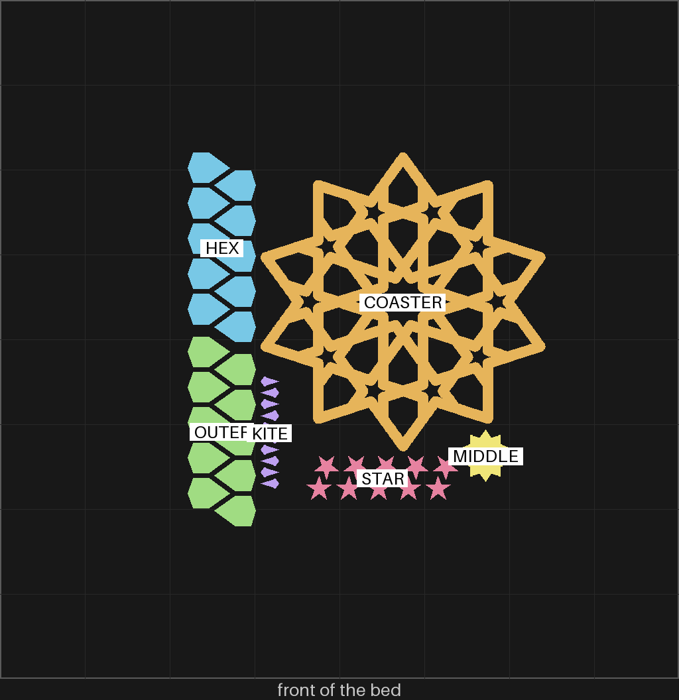

# sheets-04g — the bigger gBV coaster and all its pieces, on one plate, in one color

**In short.** You said "i dont want to do multi color plate anymore, instead i want to go back to
single plate with all the pieces ... then have the option to choose color at print time". The
bigger coaster and its pieces had been split over three plates, the coaster in green and two sets
of pieces in pink and black. On the coaster's plate you wrote "i want ot remove this plate all
together and design too - won't be printing it". So those three plates are gone, and this one puts
the coaster and one set of its pieces back on one bed, the way [sheets-04](sheets-04.md) printed
the first coaster with its pieces. The plate is [`sheets-04g.yaml`](sheets-04g.yaml). One bed,
86 minutes, about 27 g, in the color you pick when you say yes.

## What it is

- **The coaster.** The gBV minimal coaster (gBV_JTt3Kxk, CS-13), the one
  [sheets-04c](sheets-04c.md) printed, at the bigger size you asked for: 112.5 mm across (was 90),
  3.75 mm straps (was 3), 4.4 mm tall (was 4), 1.25 mm rounding (was 1).
- **Its 41 pieces**, at the same size, cut to its holes:
  - MIDDLE: the twenty-sided piece in the middle (1)
  - KITE: the small four-sided kites (10)
  - HEX: the inner ring of six-sided pieces (10)
  - STAR: the ten-pointed stars (10)
  - OUTER: the outer ring of six-sided pieces (10)

Each ring prints packed, not in its circle: every piece turned the same way, half in one row, the
other row turned round and slid half a step so the tips interlace, as you asked for the kites
("two roes of kites facing eqch other olaces in a zipper like fashhion").

**The color is picked at the send.** The recipe names no color, so the slice carries Bambu
Studio's default green. When you say yes, name the color with it ("yes, in pink"), and the send
feeds the whole plate from the tray that holds that color: `bambu print send … --color "#F5547C"`.
Loaded now: pink, blue, black and green in the AMS. A color no tray holds is refused, not guessed.

**What I assumed, for you to change:**

- **One set of pieces.** The two sets in two colors were for the multi-color plates. One coaster's
  worth is what fills one coaster.
- **No gap** between a piece and its hole, as on sheets-04e: from [sheets-04b](sheets-04b.md),
  where you said "in the experiment the bottom row fir bitter in minimal construction".
- **The phone and the gummy bear are left off.** They rode on the coaster's old plate as extras,
  not as part of the construction, and phones-01 and phones-02 have printed the phone since.

## Why print it

It answers both questions the three plates were asking, in one print: does the coaster read and
hold together at the bigger size, and do its pieces fill it at no gap. With everything in one
color, the pieces can be pressed into the coaster straight off the bed.

## Pictures

The coaster's review sheet, drawn for its old plate: the ten-point star, every hole open (openness
0.38, nothing solid, no empty wedge, ten-fold symmetry).

The pieces' review sheet: the five kinds of piece, each solid, as they come off the plate.

The slice: the coaster in the middle, the two six-sided rows down the left with the kites beside
them, the stars and the middle piece in front. The places come from the sliced plate, read back
from the slicer.

## Cost and risk

One bed, 86 minutes, about 27 g (local slice, 2026-10-04, X2D preset and PLA Basic, sliced for
the Textured PEI plate Bambu Studio has saved, no slicer warnings, no brim, support or raft,
nothing sent). One color, so no swaps: phones-02, in one color, took 13 minutes against 12 sliced.

**Risk: watch.** The kites and stars are small loose pieces (about 0.05 and 0.12 cm³ each), the
kind that can lift or get knocked by the nozzle. The slicer flags none of them.

## Your call

- [ ] **Approve as it stands** — the coaster and all 41 pieces, no gap; say the color with the yes
- [ ] **Hold** — say why in the notes

Notes:

## Approvals

Every yes or hold Omar gives this plate, one row each, oldest first (D-096). A tick under Your call, or a yes in chat, becomes a row here through the manage-approvals skill's `plate_approve.py`; a send spends the open approval, and a recipe change resets it.

| Date | Decision | By | Covers | Spent by |
|---|---|---|---|---|

## Timeline

| Date | What happened | Where it is written |
|---|---|---|
| 2026-10-04 | proposed — at Omar's ask: the coaster and its pieces back on one plate, color picked at the send; replaces sheets-04d, 04e and 04f, which are removed | this page |
| 2026-10-04 | sliced — local slice fits one bed, 86 minutes, 27 g, no slicer warnings | this page |
