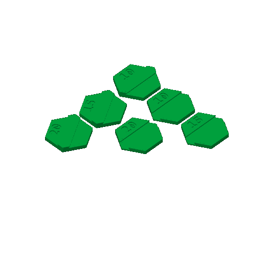
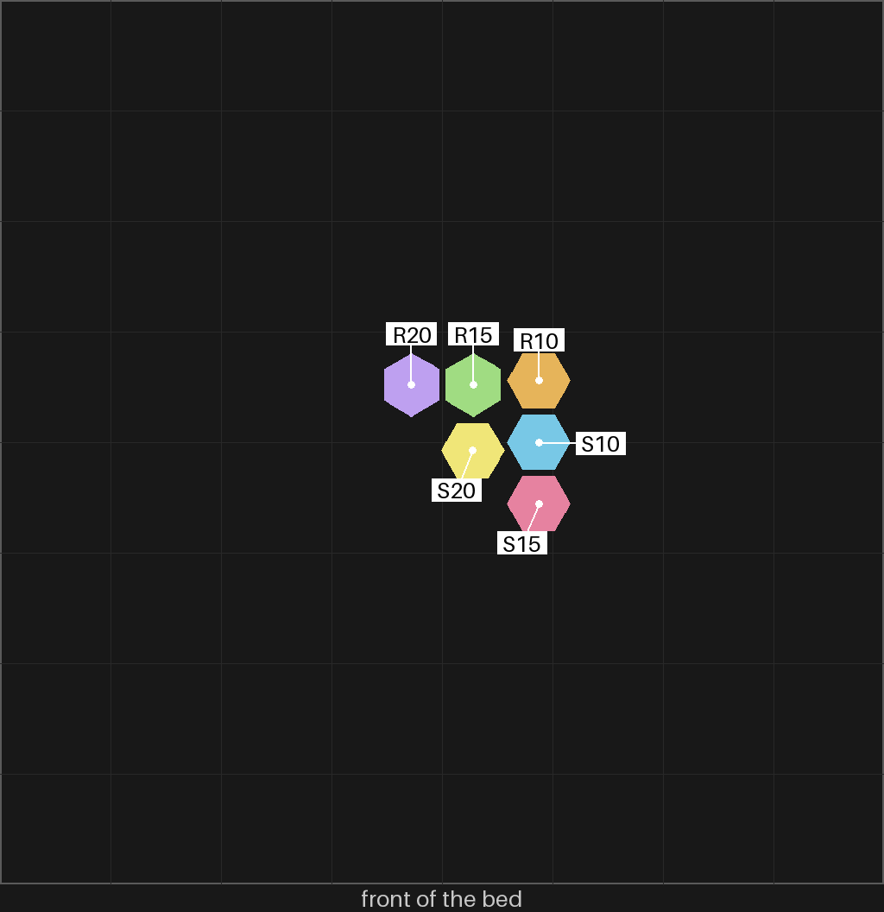

# sld-1 — the dovetail coupon: can a small dovetail join two piece halves?

**In short.** You said "for joints i want to try the dovetail" (D-107). A split coaster's loose
piece is two 1.6 mm halves, each printed face down so both faces come out glossy. This plate asks
whether a dovetail across the cut faces joins the two halves into one piece by hand: slide the
rail into the slot from one end, and the pair can then only slide back out, not lift apart. Three
pairs of hexagon halves, one per gap. The plate is [`sld-1.yaml`](sld-1.yaml), the reasoning is
[the joining note §2](../pieces/join-halves-design.md#2-slide-a-dovetail-across-the-cut). One bed,
12 minutes, about 2.4 g, in the color you pick when you say yes.

## What it is

- **The halves.** A regular hexagon 18.3 mm point to point, 1.6 mm thick, printed face down. It
  is about the area of gBV's hexagon at 1.25×, a stand-in by area and not by shape: gBV's
  hexagon is longer than it is wide.
- **The rail** stands on the rail half's top as printed, running point to point through the
  middle: 4 mm wide at its root, 0.8 mm tall in four 0.2 mm layers, each layer 0.1 mm a side
  wider than the one under it.
- **The slot** is cut into the slot half the same way, one layer deeper (1.0 mm) so the rail's
  top never reaches its floor and the cut faces close flat, and wider by the gap on each side. It
  leaves 0.6 mm of floor, the floor bikar already keeps under a debossed pocket.
- **Each half is engraved with its gap** in hundredths of a mm, beside the rail or slot, so the
  pairs can be matched off the bed.
  - R10, S10: rail and slot at 0.10 mm a side (1 each)
  - R15, S15: rail and slot at 0.15 mm a side (1 each)
  - R20, S20: rail and slot at 0.20 mm a side (1 each)

**The color is picked at the send**, as on sheets-04g: say it with the yes ("yes, in green").

**What I assumed, for you to change:**

- **Slope 2, not woodworking's 6.** At a rail this short, slope 6 makes the top only 0.1 mm a side
  wider than the root, no more than the gap, so it would lift straight out. At slope 2 the top is
  0.3 mm a side wider, which still beats the widest gap by 0.1 mm. bikar refuses a dovetail that
  does not lock.
- **Three gaps, 0.10 to 0.20.** The only dovetail fit with a print behind it here is bikar's
  0.15 mm, which came out "a bit loose" on minis-03; the three pairs straddle it.
- **No kite pair yet.** The note adds a kite pair at the gap that reads best. That waits for this
  print to say which gap.
- **The rail runs point to point**, the longest way across, so the most rail holds. On a real
  piece the direction would follow the piece.

## Why print it

It is the cheapest print that tells us whether the dovetail can work at all at this size. If one
gap slides in by hand and stays when shaken, the split piece needs no glue and no tool, and way a
of the split design loses one of its costs. If none does, the dovetail is out before any bikar
work goes into real pieces.

## Pictures

A cut across the middle of both halves, square to the rail: the slot half above, the slot narrow
at its mouth and widening in steps going down; the rail half below, the rail widening in steps
going up. Drawn by `tools/print_review.py side` from the bikar meshes at 0.15.

The slice as Bambu Studio draws it: six hexagons, each with its rail or slot and its number.

Where each half sits on the bed.

## Cost and risk

One bed, 12 minutes, about 2.4 g (local slice, 2026-10-05, X2D preset and PLA Basic, sliced for
the Textured PEI plate Bambu Studio has saved, no slicer warnings, nothing sent). One color, so
no swaps.

**Risk: watch.** The rail's layers each overhang the one under by 0.1 mm, and the slot's ceiling
edges overhang by the same; both may droop a little, which is the look to judge, not a risk to the
printer. The halves are small and could lift or get knocked by the nozzle.

## Your call

- [ ] **Approve as it stands** — say the color with the yes
- [ ] **Hold** — say why in the notes

Notes:

## Approvals

Every yes or hold Omar gives this plate, one row each, oldest first (D-096). A tick under Your call, or a yes in chat, becomes a row here through the manage-approvals skill's `plate_approve.py`; a send spends the open approval, and a recipe change resets it.

| Date | Decision | By | Covers | Spent by |
|---|---|---|---|---|
| 2026-10-07 | approved | Omar, tick on the 2026-10-06 calls page: "Yes, in pink" | iteration 1 @ eac8f0f4f2 | sent 2026-10-07 |

## Timeline

| Date | What happened | Where it is written |
|---|---|---|
| 2026-10-05 | proposed — Omar picked the dovetail to try first (D-107) | this page |
| 2026-10-05 | sliced — local slice from bikar main after bikar #309, fits one bed, 12 minutes, 2.4 g, no slicer warnings | this page |
| 2026-10-07 | sent — by `bambu print send`; spends the approval of 2026-10-07, iteration 1 @ eac8f0f4f2 | this page |
| 2026-10-07 | printed — on the X2D, one bed, all 12 layers, about 13 minutes against the slicer's 12, after two stops on the glacier plate and a swap to the gold one; Omar: "alos 10, 15, and 20 all worked ..." | [the record](../../prints/2026-10-07-sld-1/index.md) |
