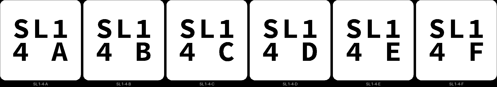
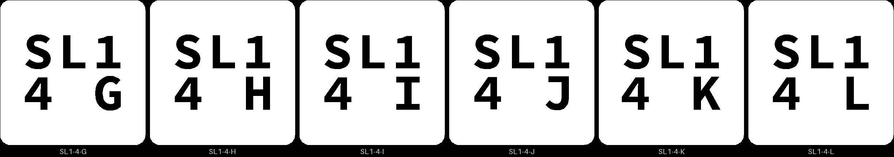
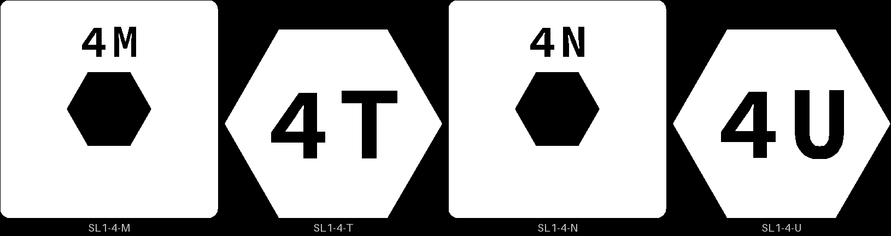

# spl-1 — the split coupon: how tight a stud, how thick a floor, does a lip hold a piece

**In short.** A split coaster is printed as two halves and glued at the cut. Studs on the lower
half sit in sockets in the upper half and line the two up. Before a full split coaster prints,
this plate asks three things in the hand: which stud fit holds, whether a socket shows through
the top face, and whether a lip keeps a loose piece trapped between the halves. It is the first
plan item of [the split design §9](../pieces/split-with-studs-design.md). The plate is
[`spl-1.yaml`](spl-1.yaml). One bed, 49 minutes, about 18.5 g, in the color you pick when you say
yes.

## What it is

- **Fit pairs**, twelve of them: bikar's `Split-Fit-Coupon`, a 15 mm square tile 4.4 mm tall, cut
  at 2.2 mm, with one stud in the middle (bikar #319). Each pair is an L tile (the stud half) and
  a U tile (the socket half) with the same label. The gap is the socket's width less the stud's;
  below zero the socket is narrower than the stud, a press fit.
  - G-10, G-05, G00, G05, G10, G15: a 2 mm stud at gaps −0.10 to 0.15 mm, floor 0.6
  - S00, S05: a 1.5 mm stud at gaps 0 and 0.05
  - B00, B05: a 3 mm stud at gaps 0 and 0.05
  - F08, F10: floors of 0.8 and 1.0 mm over the socket, gap 0.05 (the 0.6 floor is G05). A
    thicker floor makes the stud that much shorter.
- **Trap pairs**, two: bikar's `Split-Trap-Coupon`, a 25 mm tile whose halves each have a
  hexagonal opening with a 0.8 mm lip, and a loose hexagon (P) that sits between them. At room 0
  (T0) the piece is as tall as its cavity; at room 0.2 (T2) it is 0.2 mm shorter and can rattle.
- **Each pair carries its letter** (iteration 2, on your comment of 2026-10-06: "can we have
  minimal letters printiend on each AT AB (a top, a bottom), BT, BB, ETC"). The letter is cut
  2.5 mm tall into both cut faces: the lower tile reads `AB`, the upper `AT`. The cut faces meet
  when a pair closes, so the letters show only when it is open. A trap's loose hexagon has no
  letter; it stays with its tiles. The letters, and the names on the bed picture below, are in
  the table that follows.

| Letter | Bed name | What the pair is |
|---|---|---|
| A to F | G-10, G-05, G00, G05, G10, G15 | 2 mm stud, gaps −0.10 to 0.15 mm, in that order |
| G, H | S00, S05 | 1.5 mm stud, gaps 0 and 0.05 |
| I, J | B00, B05 | 3 mm stud, gaps 0 and 0.05 |
| K, L | F08, F10 | floors 0.8 and 1.0 mm, gap 0.05 |
| M, N | T0, T2 | trap pairs, room 0 and 0.2 |

^ge14rb

pkt-1 goes on from O, so no two coupons share a letter.

**The color is picked at the send**, as on sld-1: say it with the yes. The show-through check
wants the lightest color you have loaded.

**What I assumed, for you to change:**

- **The ladder values** are the split design's §9 values. None of them is a measured fit yet;
  that is what this print is for.
- **One stud per tile**, in the middle. A real split coaster has several, and two studs can bind
  where one would not. That waits for a real coaster.
- **No kite trap pair yet.** The design asks for one; it comes after this print shows whether the
  lip holds at all.
- **No side cut picture.** bikar hands both halves over as printed, each 2.2 mm tall from the
  bed, so the side-cut tool would draw them on top of each other instead of stacked.

## Why print it

It is the cheapest print that settles the split coaster's open numbers. A full split coaster
costs far more filament and time, and if its studs bind or its sockets show through, the whole
print is lost. Here each wrong answer costs one 15 mm tile.

The stud split coaster waits on it: [split-01](split-01.md) is cut at whatever stud gap and floor
this plate picks, and so is the stud-layout plate that comes after it. The trap pairs also bear
on [split-02](split-02.md), which holds its pieces by a flange instead of a lip and has no studs.

## After the print

Judged by hand, as [the split design §9](../pieces/split-with-studs-design.md#9-the-coupon-spl-1)
says: press each pair together, shake it, pull it apart. These are the questions asked after the
print, one at a time. Each row names the tiles by the marks cut into them, as the
[pictures](#pictures) show, never by their bed names:

- a fit lower by the id on its bottom: `SL1 4A` is the one reading SL1 over 4 A;
- an upper by the letter on its cut face, `AT` to `NT`, since no upper has an id on its bottom;
- a trap lower by the id on its bottom, `4M` or `4N`, and a loose hexagon by `4T` or `4U`.

| Pieces | The question | What we expect, and why | What each answer changes |
|---|---|---|---|
| `SL1 4A` to `SL1 4F`, each with the upper of its letter, `AT` to `FT` (2 mm stud, gaps −0.10, −0.05, 0, 0.05, 0.10 and 0.15 mm, in that order) | **Do:** Take each lower with its upper (`SL1 4A` with `AT`, and so on). Press the stud into the socket with your thumbs, cut faces together, `AB` against `AT`. Shake the closed pair hard, then pull it apart. **Look for:** Which letters press together by hand at all? Of those, which stay closed when shaken? Which come apart only by breaking the stud off? | Nobody knows yet. The sources disagree on which way to size a printed stud, and none measured an X2D; our polygon pieces fit best at 0 and below ([§4.1](../pieces/split-with-studs-design.md#41-the-stud-and-socket)). | The tightest gap that holds becomes the stud gap on split-01 and the stud-layout plate (split-02 has no studs). If every gap is loose, the ladder moves tighter; if every gap binds, looser, and the plate is printed again. |
| `SL1 4G` with `GT`, `SL1 4H` with `HT` (1.5 mm stud, gaps 0 and 0.05 mm) | **Do:** Before pressing, look into the socket on the cut face of `GT` and `HT`, and at the stud on `SL1 4G` and `SL1 4H`. Then press, shake and pull apart each pair as in the row above. **Look for:** Is each socket an open round hole, or partly filled with plastic? Does each stud stand whole? Does the closed pair hold when shaken? | Doubtful: 2 mm is the smallest hole the printing rules we follow call printable. | Holds: smaller studs are allowed where gBV's straps are narrow, so more places for a stud. Fails: 2 mm is the smallest stud. |
| `SL1 4I` with `IT`, `SL1 4J` with `JT` (3 mm stud, gaps 0 and 0.05 mm) | **Do:** Press, shake and pull apart each pair as in the first row. **Look for:** Does the 3 mm stud hold when shaken, and come apart without breaking, on a letter where the 2 mm stud (`SL1 4A` to `SL1 4F`) snapped? | Only matters if A to F snap when pulled apart. | 2 mm snaps and 3 mm holds: split coasters use 3 mm studs, with room for fewer of them (8 at 25 mm apart on gBV, §3). |
| The uppers `KT` (0.8 mm floor), `LT` (1.0 mm) and `DT` (0.6 mm) | **Do:** Hold each upper up to a window, its top face toward you: the flat face with no letter, the one that printed on the bed. **Look for:** Can you see the socket behind it, as a darker round spot or a dent in the middle? Which of `KT`, `LT` and `DT` show it? | The 0.6 mm floor is our usual deboss floor, but there it is never the face you look at. | None show: the floor stays 0.6 mm. 0.6 shows: the floor goes up to the thinnest that does not show, and the stud gets that much shorter. |
| `4M` with `MT` and the hexagon `4T` (room 0); `4N` with `NT` and the hexagon `4U` (room 0.2) | **Do:** Lay `4M` and `4N` cut face up. Drop `4T` into the opening of `4M` and `4U` into `4N`, without pressing. Close `MT` over `4M` and `NT` over `4N`, `MB` against `MT`. Lay each closed pair on the table, then shake it next to your ear. Last, push hard with your thumb on the hexagon, from one face and then the other. **Look for:** Does each hexagon drop in by its own weight? Does each pair close flat, with no gap at the cut? Does `4N` rattle, and does `4M`? Under the push, does the hexagon stay in, or does the lip round it bend or break so it pushes out? | Room 0 closes tight and room 0.2 rattles a little; whether the lip holds is the open part. | Lip holds: loose pieces in a split coaster are held by a lip (split-01). Lip gives way: the flange (split-02) is the way, or the lip gets wider. A rattle at 0.2 sets how much room a piece gets. |

## Pictures

Where each tile sits on the bed, with its name on it. Only the part of the bed the pieces take is
drawn; the trap tiles are the four big squares, their loose pieces the two small hexagons.

The slice as Bambu Studio draws it: the stud or socket shows as a dot in the middle of each small
tile.

The ids cut into the bed faces, seen from below as you pick them off the bed (D-109). A Fit
Lower carries the whole id: the plate, then the iteration and its pair letter.

The trap tiles and their loose hexagons have room only for the short id, the iteration and a
letter (D-114): the lowers read 4M and 4N, their pair letters, and the hexagons 4T and 4U. No
upper half carries an id: it prints face down, so its bed face is the top you see, and an id is
cut only on a face hidden in use. Its pair letter on the cut face tells it apart.
[the carved-id fit note](../../issues/carved-id-fit.md) says how the short form came about.

## Cost and risk

One bed, 49 minutes, about 18.5 g (local slice, 2026-10-07, from bikar main after bikar #323,
X2D preset and PLA Basic, sliced for the Textured PEI plate, no slicer warnings, nothing sent).
One color, so no swaps. Without the letters it was 43 minutes and 18.3 g (2026-10-06); the letters
are the only change, so the six minutes are theirs.

**Risk: watch.** The studs are 2 mm wide and 1.4 mm tall at the 0.6 floor; a small stud can be
knocked off by the nozzle, which is the fit coupon failing, not the printer. The tiles are small
and could lift at a corner.

## Your call

- [ ] **Approve as it stands** — say the color with the yes
- [ ] **Hold** — say why in the notes

Notes:

## Approvals

Every yes or hold Omar gives this plate, one row each, oldest first (D-096). A tick under Your call, or a yes in chat, becomes a row here through the manage-approvals skill's `plate_approve.py`; a send spends the open approval, and a recipe change resets it.

| Date | Decision | By | Covers | Spent by |
|---|---|---|---|---|
| 2026-10-08 | approved | Omar, in chat, in pink | iteration 2 @ fcdbac0237 | reset 2026-10-08 |
| 2026-10-08 | approved | Omar, in chat, in pink | iteration 4 @ d99e8c88b1 in #F5547C | sent 2026-10-08 |

## Timeline

| Date | What happened | Where it is written |
|---|---|---|
| 2026-10-06 | proposed — the split design's first plan item (§9) | this page |
| 2026-10-06 | sliced — local slice from bikar main after bikar #319, fits one bed, 43 minutes, 18.3 g, no slicer warnings | this page |
| 2026-10-07 | changed (iteration 2): a letter on each pair's cut faces, A to N, on Omar's comment on the 2026-10-06 calls page (bikar #323) | [the calls page](../../working-model/feedback-requests/2026-10-06-open-calls.md) |
| 2026-10-07 | sliced — local slice from bikar main after bikar #323, fits one bed, 49 minutes, 18.5 g, no slicer warnings | this page |
| 2026-10-08 | sent — by `bambu print send`; spends the approval of 2026-10-08, iteration 4 @ d99e8c88b1 in #F5547C | this page |
