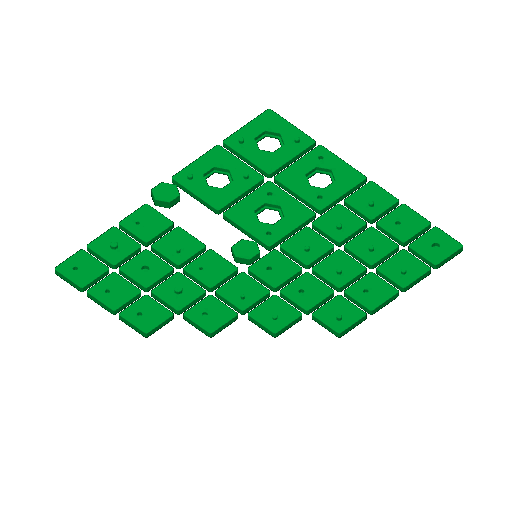

# spl-1 — the split coupon: how tight a stud, how thick a floor, does a lip hold a piece

**In short.** A split coaster is printed as two halves and glued at the cut. Studs on the lower
half sit in sockets in the upper half and line the two up. Before a full split coaster prints,
this plate asks three things in the hand: which stud fit holds, whether a socket shows through
the top face, and whether a lip keeps a loose piece trapped between the halves. It is the first
plan item of [the split design §9](../pieces/split-with-studs-design.md). The plate is
[`spl-1.yaml`](spl-1.yaml). One bed, 49 minutes, about 18.5 g, in the color you pick when you say
yes.

## What it is

- **Fit pairs**, twelve of them: bikar's `Split-Fit-Coupon`, a 15 mm square tile 4.4 mm tall, cut
  at 2.2 mm, with one stud in the middle (bikar #319). Each pair is an L tile (the stud half) and
  a U tile (the socket half) with the same label. The gap is the socket's width less the stud's;
  below zero the socket is narrower than the stud, a press fit.
  - G-10, G-05, G00, G05, G10, G15: a 2 mm stud at gaps −0.10 to 0.15 mm, floor 0.6
  - S00, S05: a 1.5 mm stud at gaps 0 and 0.05
  - B00, B05: a 3 mm stud at gaps 0 and 0.05
  - F08, F10: floors of 0.8 and 1.0 mm over the socket, gap 0.05 (the 0.6 floor is G05). A
    thicker floor makes the stud that much shorter.
- **Trap pairs**, two: bikar's `Split-Trap-Coupon`, a 25 mm tile whose halves each have a
  hexagonal opening with a 0.8 mm lip, and a loose hexagon (P) that sits between them. At room 0
  (T0) the piece is as tall as its cavity; at room 0.2 (T2) it is 0.2 mm shorter and can rattle.
- **Each pair carries its letter** (iteration 2, on your comment of 2026-10-06: "can we have
  minimal letters printiend on each AT AB (a top, a bottom), BT, BB, ETC"). The letter is cut
  2.5 mm tall into both cut faces: the lower tile reads `AB`, the upper `AT`. The cut faces meet
  when a pair closes, so the letters show only when it is open. A trap's loose hexagon has no
  letter; it stays with its tiles. The letters, and the names on the bed picture below, are in
  the table that follows.

| Letter | Bed name | What the pair is |
|---|---|---|
| A to F | G-10, G-05, G00, G05, G10, G15 | 2 mm stud, gaps −0.10 to 0.15 mm, in that order |
| G, H | S00, S05 | 1.5 mm stud, gaps 0 and 0.05 |
| I, J | B00, B05 | 3 mm stud, gaps 0 and 0.05 |
| K, L | F08, F10 | floors 0.8 and 1.0 mm, gap 0.05 |
| M, N | T0, T2 | trap pairs, room 0 and 0.2 |

^ge14rb

pkt-1 goes on from O, so no two coupons share a letter.

**The color is picked at the send**, as on sld-1: say it with the yes. The show-through check
wants the lightest color you have loaded.

**What I assumed, for you to change:**

- **The ladder values** are the split design's §9 values. None of them is a measured fit yet;
  that is what this print is for.
- **One stud per tile**, in the middle. A real split coaster has several, and two studs can bind
  where one would not. That waits for a real coaster.
- **No kite trap pair yet.** The design asks for one; it comes after this print shows whether the
  lip holds at all.
- **No side cut picture.** bikar hands both halves over as printed, each 2.2 mm tall from the
  bed, so the side-cut tool would draw them on top of each other instead of stacked.

## Why print it

It is the cheapest print that settles the split coaster's open numbers. A full split coaster
costs far more filament and time, and if its studs bind or its sockets show through, the whole
print is lost. Here each wrong answer costs one 15 mm tile.

The stud split coaster waits on it: [split-01](split-01.md) is cut at whatever stud gap and floor
this plate picks, and so is the stud-layout plate that comes after it. The trap pairs also bear
on [split-02](split-02.md), which holds its pieces by a flange instead of a lip and has no studs.

## After the print

Judged by hand, as [the split design §9](../pieces/split-with-studs-design.md#9-the-coupon-spl-1)
says: press each pair together, shake it, pull it apart. These are the questions asked after the
print, one at a time.

| Pieces | The question | What we expect, and why | What each answer changes |
|---|---|---|---|
| A to F (2 mm stud, gaps −0.10 to 0.15) | Which gap presses in by hand, holds when shaken, and comes apart without breaking? | Nobody knows yet. The sources disagree on which way to size a printed stud, and none measured an X2D; our polygon pieces fit best at 0 and below ([§4.1](../pieces/split-with-studs-design.md#41-the-stud-and-socket)). | The tightest gap that holds becomes the stud gap on split-01 and the stud-layout plate (split-02 has no studs). If every gap is loose, the ladder moves tighter; if every gap binds, looser, and the plate is printed again. |
| G, H (1.5 mm stud) | Does a socket under 2 mm print open, and does the stud hold? | Doubtful: 2 mm is the smallest hole the printing rules we follow call printable. | Holds: smaller studs are allowed where gBV's straps are narrow, so more places for a stud. Fails: 2 mm is the smallest stud. |
| I, J (3 mm stud) | Does the 3 mm stud hold where a 2 mm one snaps? | Only matters if A to F snap when pulled apart. | 2 mm snaps and 3 mm holds: split coasters use 3 mm studs, with room for fewer of them (8 at 25 mm apart on gBV, §3). |
| K, L and D (floors 0.8, 1.0 and 0.6 mm) | Held to a window, face down, does the socket show through the top face? | The 0.6 mm floor is our usual deboss floor, but there it is never the face you look at. | None show: the floor stays 0.6 mm. 0.6 shows: the floor goes up to the thinnest that does not show, and the stud gets that much shorter. |
| M, N (trap pairs, room 0 and 0.2) | Does the piece drop in, does the pair close flat over it, does it rattle, and does the 0.8 mm lip hold it against a hard thumb push? | Room 0 closes tight and room 0.2 rattles a little; whether the lip holds is the open part. | Lip holds: loose pieces in a split coaster are held by a lip (split-01). Lip gives way: the flange (split-02) is the way, or the lip gets wider. A rattle at 0.2 sets how much room a piece gets. |

## Pictures

Where each tile sits on the bed, with its name on it. Only the part of the bed the pieces take is
drawn; the trap tiles are the four big squares, their loose pieces the two small hexagons.

The slice as Bambu Studio draws it: the stud or socket shows as a dot in the middle of each small
tile.

## Cost and risk

One bed, 49 minutes, about 18.5 g (local slice, 2026-10-07, from bikar main after bikar #323,
X2D preset and PLA Basic, sliced for the Textured PEI plate, no slicer warnings, nothing sent).
One color, so no swaps. Without the letters it was 43 minutes and 18.3 g (2026-10-06); the letters
are the only change, so the six minutes are theirs.

**Risk: watch.** The studs are 2 mm wide and 1.4 mm tall at the 0.6 floor; a small stud can be
knocked off by the nozzle, which is the fit coupon failing, not the printer. The tiles are small
and could lift at a corner.

## Your call

- [ ] **Approve as it stands** — say the color with the yes
- [ ] **Hold** — say why in the notes

Notes:

## Approvals

Every yes or hold Omar gives this plate, one row each, oldest first (D-096). A tick under Your call, or a yes in chat, becomes a row here through the manage-approvals skill's `plate_approve.py`; a send spends the open approval, and a recipe change resets it.

| Date | Decision | By | Covers | Spent by |
|---|---|---|---|---|
| 2026-10-08 | approved | Omar, in chat, in pink | iteration 2 @ fcdbac0237 | |

## Timeline

| Date | What happened | Where it is written |
|---|---|---|
| 2026-10-06 | proposed — the split design's first plan item (§9) | this page |
| 2026-10-06 | sliced — local slice from bikar main after bikar #319, fits one bed, 43 minutes, 18.3 g, no slicer warnings | this page |
| 2026-10-07 | changed (iteration 2): a letter on each pair's cut faces, A to N, on Omar's comment on the 2026-10-06 calls page (bikar #323) | [the calls page](../../working-model/feedback-requests/2026-10-06-open-calls.md) |
| 2026-10-07 | sliced — local slice from bikar main after bikar #323, fits one bed, 49 minutes, 18.5 g, no slicer warnings | this page |
