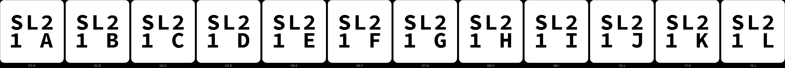
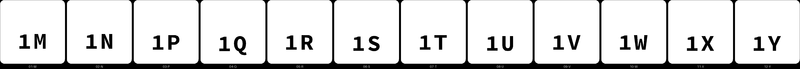

# spl-2 — the split coupon again, looser: at what gap does a stud go in by hand

**In short.** On [spl-1](spl-1.md) every stud pair needed a hammer to close, from a gap of −0.10 mm
to 0.15 mm; 0.15 came closest. The slice kept every gap as drawn, so the tightness comes from the
printer, and the fit lies further out. This plate goes on from there: the same 15 mm tile and
2 mm stud, at six gaps from 0.15 to 0.40 mm, two pairs at each. The plate is
[`spl-2.yaml`](spl-2.yaml). One bed, 45 minutes, about 13 g, in the color you pick when you say
yes.

## What it is

- **Fit pairs**, twelve: bikar's `Split-Fit-Coupon`, a 15 mm square tile 4.4 mm tall, cut at
  2.2 mm, one 2 mm stud, a 0.6 mm floor over the socket. Each pair is a lower tile (the stud half)
  and an upper tile (the socket half). The gap is the socket's width less the stud's.
- **Six gaps, two pairs each:** 0.15, 0.20, 0.25, 0.30, 0.35 and 0.40 mm. Two pairs per gap so
  one odd pair cannot decide it. 0.15 is spl-1's best gap again (`SL1 4F`), so if it goes in by
  hand here and did not there, the printer is varying from print to print.
- **Left out, because spl-1 settled them:** the floor stays 0.6 mm (no socket showed through),
  the stud stays 2 mm, and both lips held, so no floor, stud-size or trap pairs.
- **Every piece carries an id you can see once the pair is closed.** A lower carries the whole
  id on its bottom, `SL2/1 A`, as on spl-1. An upper now carries a short id on its outer face, the
  top of the coaster: `1M`, and so on. On spl-1 the upper's only mark was its letter on the cut
  face, and that is hidden once the pair closes; your lesson was "label should have been on
  other side" ([D-115](../../working-model/decisions-log.md)). The cut faces still carry the pair
  letter, `AB` on the lower and `AT` on the upper.

| Gap | Pair 1: lower, upper | Pair 2: lower, upper | Bed names |
|---|---|---|---|
| 0.15 mm | `SL2 1A`, `1M` | `SL2 1B`, `1N` | G15a, G15b |
| 0.20 mm | `SL2 1C`, `1P` | `SL2 1D`, `1Q` | G20a, G20b |
| 0.25 mm | `SL2 1E`, `1R` | `SL2 1F`, `1S` | G25a, G25b |
| 0.30 mm | `SL2 1G`, `1T` | `SL2 1H`, `1U` | G30a, G30b |
| 0.35 mm | `SL2 1I`, `1V` | `SL2 1J`, `1W` | G35a, G35b |
| 0.40 mm | `SL2 1K`, `1X` | `SL2 1L`, `1Y` | G40a, G40b |

There is no `O` among the ids, so none reads as a zero.

**The color is picked at the send**: say it with the yes.

**What I assumed, for you to change:**

- **The ladder runs 0.15 to 0.40 in 0.05 steps.** If 0.40 still needs a hammer, the next plate
  goes looser again; if 0.20 already rattles, the answer is between 0.15 and 0.20.
- **The upper's id on its top face** is for coupons only (D-115). A coaster you sell still
  carries no id on a face that shows (D-114).
- **One stud per tile**, as on spl-1. A real coaster has several, and several can bind where one
  does not; stud-1 asks that, at whatever gap this plate picks.

## Why print it

spl-1 showed the fit is not where we looked. Until a gap closes by hand, split-01 and stud-1
would be cut at a gap that needs a hammer, and a whole coaster that needs a hammer cracks or
does not close. Each wrong answer here costs one 15 mm tile.

## After the print

Judged by hand. Each row names the pieces by the ids cut into them, as the [pictures](#pictures)
show: a lower by the id on its bottom (`SL2 1A` reads SL2 over 1 A), an upper by the id on its
top face (`1M`). The table above pairs them.

| Pieces | The question | What we expect, and why | What each answer changes |
|---|---|---|---|
| All twelve pairs: `SL2 1A` with `1M`, `SL2 1B` with `1N`, and so on to `SL2 1L` with `1Y`, as the table pairs them | **Do:** Take each lower with its upper. Put the stud into the socket, the faces with `AB` and `AT` together. Press with your thumbs only. **Look for:** For each pair, one of: won't go in by hand; goes in but leaves a gap at the seam; closes flush by hand; closes flush and rattles when shaken. | `SL2 1A` and `1B` (0.15) close nearly flush, as `SL1 4F` did; somewhere from 0.20 to 0.30 closes flush by hand; 0.40 may rattle. Not measured: the printer's holes and studs have not been measured with calipers. | The tightest gap whose two pairs both close flush by hand, and do not rattle, becomes the stud gap on split-01 and stud-1. If the two pairs at one gap disagree, the looser of the two gaps around it wins. If none closes flush by hand, the next plate goes past 0.40. |
| The pairs that closed flush by hand | **Do:** Hold each closed pair by its lower. Shake it hard. Pull the halves apart by hand. **Look for:** Does it stay closed when shaken? Does it come apart by hand without breaking the stud? | The tighter of the flush gaps hold; the loosest fall apart when shaken. | A gap that falls apart when shaken is too loose, even if it closed flush. A stud that breaks when pulled means the pair should be glued, not pulled apart again. |
| The uppers `1M` to `1Y` | **Do:** Look at the top face of each closed pair, the flat face with the id. **Look for:** Can you read the id? Does it look like a mark you would accept on a coupon? | It reads, as the lowers' ids did on spl-1. | Reads: coupon uppers keep their id on top. Does not read: the id goes bigger, or back to the cut face. |

## Pictures

Where each tile sits on the bed, with its bed name on it.

The ids cut into the lowers' bottoms, seen from below as you pick them off the bed (D-109): the
plate, then the iteration and the pair letter.

The ids cut into the uppers' outer faces, seen from below as you pick them off the bed: the
iteration and the upper's letter, M to Y (D-114's short form, D-115's face).

## Cost and risk

One bed, 45 minutes, about 13 g (local slice, 2026-10-09, X2D preset and PLA Basic, for the Textured PEI plate; on the glacier plate it is sliced again for that plate before the send). One color,
so no swaps. spl-1 took about 63 minutes against its slice's 49 on the glacier plate.

**Risk: watch.** As on spl-1: the studs are 2 mm wide and small enough for the nozzle to knock
off, which is the coupon failing, not the printer, and the tiles are small and could lift at a
corner.

## Your call

- [ ] **Approve as it stands** — say the color with the yes
- [ ] **Hold** — say why in the notes

Notes:

## Approvals

Every yes or hold Omar gives this plate, one row each, oldest first (D-096). A tick under Your call, or a yes in chat, becomes a row here through the manage-approvals skill's `plate_approve.py`; a send spends the open approval, and a recipe change resets it.

| Date | Decision | By | Covers | Spent by |
|---|---|---|---|---|
| 2026-10-09 | approved | Omar, in chat: "Yes, in pink" | iteration 1 @ 84ecead3d5 in #F5547C | sent 2026-10-09 |

## Timeline

| Date | What happened | Where it is written |
|---|---|---|
| 2026-10-09 | proposed — spl-1 found every stud gap up to 0.15 mm needed a hammer, so the ladder goes on to 0.40 | [spl-1's record](../../prints/2026-10-09-spl-1/index.md) |
| 2026-10-09 | sent — by `bambu print send`; spends the approval of 2026-10-09, iteration 1 @ 84ecead3d5 in #F5547C | this page |
| 2026-10-09 | printed — on the X2D, glacier plate, one bed, all 18 layers, about 50 minutes against the slicer's 45; judged by id: every pair closed by hand, `SL2 1A` to `SL2 1E` (0.15 to 0.25 mm) held when shaken and `SL2 1F` on (0.25 to 0.40) were very loose and fell apart; none broke when pulled; every upper's id on its top face reads (D-115 stands), though B and D, and M and N, look alike; Omar set the stud gap at 0.25 mm, `1E` (D-116) | [the record](../../prints/2026-10-09-spl-2/index.md) |
