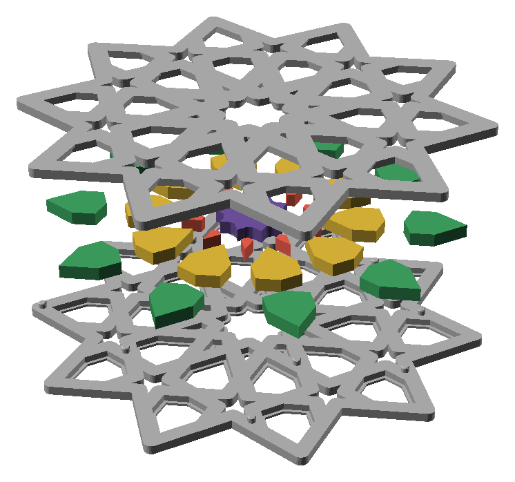
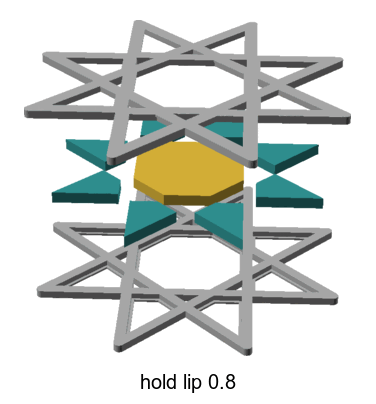
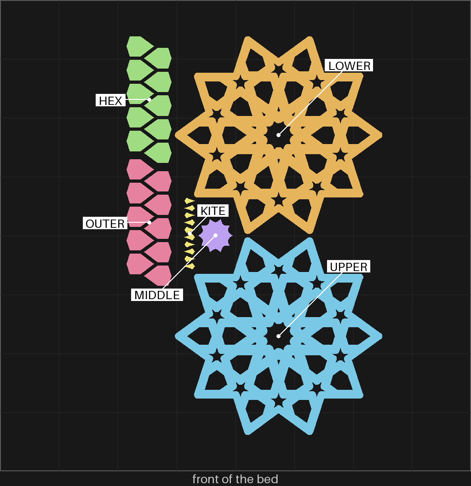
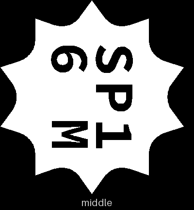
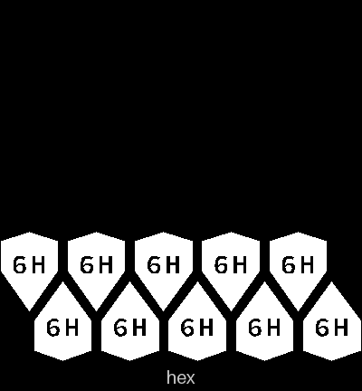
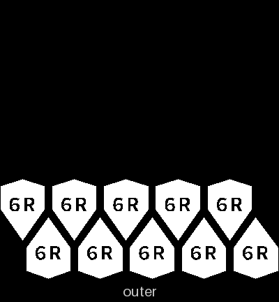

# split-01 — the split gBV coaster that holds its pieces under a lip (option A)

**In short.** You asked, for the split coaster's call 6, "i want a olate hat tries a and c ...
these shoukd be different options in coaster lab". This is A, the lip. The gBV coaster at the size
sheets-04g printed is cut flat through the middle into two halves. Each half's holes are a little
narrower at its outer face, so a piece dropped into the lower half cannot fall through, and the
upper half closes over it. C, the flange, is [split-02](split-02.md). The plate is
[`split-01.yaml`](split-01.yaml). One bed, 89 minutes, about 30 g, in the color you pick
when you say yes.

## What it is

- **The two halves.** The gBV minimal coaster (gBV_JTt3Kxk), 112.5 mm across, 3.75 mm straps,
  4.4 mm tall when closed, cut at half its height. Both halves print face down, so both faces of
  the closed coaster are bed faces.
  - LOWER: the lower half, with its studs standing up on the cut face (1)
  - UPPER: the upper half, with the sockets for the studs (1)
- **The lip.** Every hole is 0.8 mm narrower all round for the first 0.6 mm in from each face. The
  lip is the first three layers of each half, laid on the bed.
- **Its 31 pieces**, plain blocks 3.2 mm tall, 0.25 mm smaller than their holes on every side, so
  they drop in. They sit 0.6 mm in from each face, under the lips.
  - MIDDLE: the twenty-sided piece in the middle (1)
  - KITE: the small four-sided kites (10)
  - HEX: the inner ring of six-sided pieces (10)
  - OUTER: the outer ring of six-sided pieces (10)
- **The stars stay open holes**, as in the minimal coaster. A star's hole made 0.8 mm narrower all
  round closes up its arms, so there would be no star to see; bikar refuses a lip that does that.
  The flange version holds the stars too.
- **Studs** 2 mm across, at least 25 mm apart, on the lower half, so the halves line up. Each
  socket is 0.25 mm wider than its stud, the gap you picked off spl-2: "it should be 1e"
  ([D-116](../../working-model/decisions-log.md#d-116--a-split-coasters-stud-gap-is-025-mm)). The
  coaster file's default is 0.05; on spl-1 every gap up to 0.15 needed a hammer to close or to sit flush.
- **Its id, 1** (iteration 2, on your comment of 2026-10-06: "every proptoty should have an id"),
  so it can be told from split-02 and every later prototype. The cut faces are mostly pocket, so
  the id is cut 2.5 mm tall into the lower half's bottom face, the face the coaster stands on,
  mirrored so it reads the right way round when you turn the coaster over. At 112.5 mm the lip
  coaster has room for any id from 1 to 9.

**The color is picked at the send**, as on sheets-04g: say it with the yes ("yes, in pink").

**What I assumed, for you to change:**

- **Two plates, not one.** You asked for "a plate". Each coaster's halves are about 113 mm across,
  and four of them fill the 256 mm bed with no room for pieces, so A and C are a plate each.
- **The bikar defaults:** lip 0.8 mm wide and 0.6 mm thick, gap 0.25 mm, no extra room above the
  pieces. They come from the [split design §11.2](../pieces/split-with-studs-design.md#112-how-it-is-built),
  and the print is what tests them.
- **No glue.** Whether the halves are glued is call 3 of the split design, still open. Pressed
  together, the studs hold them.

## Why print it

It is the first print of a split coaster. It answers whether the pieces drop in, whether the upper
half closes over them, whether the studs line the halves up, and how the lip looks: the straps read
0.8 mm wider from each face, and the pieces sit in a little.

## After the print

What gets asked when it comes off the bed, one row at a time (the review-print skill asks them).
Each row names the pieces by the id cut into their bottoms, as the [pictures](#pictures) show:
`SP1 6M` is the middle piece, reading SP1 over 6 M; the lower half carries the coaster's `1`. A
piece with no id is named by its shape: the kites, and the upper half, which prints face down.
split-02's hex and outer pieces read `5H` and `5R`, one digit off these, so keep the two
coasters' pieces apart off the bed.

| Pieces | The question | What we expect, and why | What each answer changes |
|---|---|---|---|
| `SP1 6M`, the ten `6H`, the ten `6R` and the ten kites (no id), into the lower half (`1` on its bottom) | **Do:** Lay the lower half on the table, cut face and studs up. Drop each piece into its hole without pressing: `SP1 6M` in the middle, the `6H` pieces in the inner ring of six-sided holes, the `6R` pieces in the outer ring, a kite in each small four-sided hole. **Look for:** Does each piece drop in by its own weight? Does it stop on the lip, the ledge at the bottom of its hole, or does any fall through onto the table? Say which, by its id or as a kite. | They drop in and stop: each is 0.25 mm smaller than its hole on every side, and the lip is 0.8 mm narrower than the hole. | Drop in and stop: 0.25 mm and 0.8 mm stay the split coaster's defaults. Too tight: the gap goes up. One falls through: the lip goes wider, as a new iteration. |
| The lower half (`1` on its bottom, studs on its cut face) and the upper half (no id: sockets on its cut face, a plain top) | **Do:** With the pieces in, lay the upper half over the lower, cut faces together, each stud into a socket, and press it down evenly. Lay the coaster on the table, then pick it up by its rim and turn it over. **Look for:** Does it sit flat all round, or rock? Do the two halves' rims line up, with no step at the edge? Turned over, does it stay closed, or does a half drop away? | Flat and lined up: on spl-2 the 0.25 mm pair `1E` closed by hand and held (D-116). The other 0.25 mm pair, `1F`, came apart, so a whole coaster may hold less well than that coupon did. | Closes and holds: a whole gBV split closes (split design plan item 4). Rocks or will not close: the pieces get room above them, or the stud gap changes. |
| The closed coaster (`1` on its bottom) | **Do:** Hold the closed coaster flat by its rim next to your ear and shake it side to side, then up and down. **Look for:** Silent, a faint rattle, or a loud one? If you can feel which pieces move, say which: `SP1 6M`, the `6H` ring, the `6R` ring or the kites. | A faint rattle: 0.25 mm all round lets a piece slide, and nothing above or below lets it tip. | Silent or faint: kept as it is. Loud: a smaller gap, or glue (split design call 3). |
| The closed coaster, both faces: the bottom with `1`, and the upper half's plain top | **Do:** Lay the closed coaster top face up and look at it at arm's length, then turn it over and look at the bottom the same way. **Look for:** The lip makes the straps 0.8 mm wider from each face and sets the pieces 0.6 mm in. Does that read as a frame round each piece, or as a flaw? | Plainly visible: the straps read heavier than on sheets-04g. | A frame: the lip stays in the running against split-02's flange (D-100). A flaw: the flange is the way, unless split-02 fails. |
| The lower half's bottom face (`1`, 2.5 mm tall) | **Do:** Turn the closed coaster over so it rests on its top, and look at the bottom face. **Look for:** Can you find the `1` and read it without tilting the coaster? Is it the right way round, not mirrored? | Readable: it is 2.5 mm tall and cut into a bed face. | Readable: that size and place are kept for split coasters. Not: bikar's id size or mirroring is fixed before the next split plate. |

## Pictures

Opened up: the lower half with its studs, the pieces lifted over their holes, and the upper half
above them. Drawn by bikar and OpenSCAD from the coaster file, with the pieces' packing taken out
so each sits over its own hole (`tools/cookbook_render.py --file`).

How the lip holds, on the cookbook's small star: the piece is narrower than the hole at each face.

The slice: both halves on the right, the HEX and OUTER rows at the left with the kites beside them, the middle piece between.

The ids cut into the bed faces, seen from below (D-109). The middle piece carries the whole id:
the plate, the iteration and M. The hex and outer rings come out of bikar as one render of ten
pieces, and bikar now cuts the id into each of the ten (bikar #331). They take the short form only
(D-114): 6H on each hex piece and 6R on each outer piece, since an O would read as a zero. The
kites have no room for one. The upper half prints face down, so its bed face is the top you see.
[The recipe](split-01.yaml) says how each piece is told apart, and
[the carved-id fit note](../../issues/carved-id-fit.md) says why.

## Cost and risk

One bed, 89 minutes, about 30 g (local slice, 2026-10-09, X2D preset and PLA Basic, sliced
for the Textured PEI plate Bambu Studio has saved, no slicer warnings, nothing sent). One color, so no swaps.

**Risk: watch.** The kites are small loose pieces, the kind that can lift or get knocked by the
nozzle. The lips are three layers thick; a piece pushed in hard could snap one, which is a
cosmetic loss, not one for the printer.

## Your call

- [ ] **Approve as it stands** — say the color with the yes
- [ ] **Hold** — say why in the notes

Notes:

## Approvals

Every yes or hold Omar gives this plate, one row each, oldest first (D-096). A tick under Your call, or a yes in chat, becomes a row here through the manage-approvals skill's `plate_approve.py`; a send spends the open approval, and a recipe change resets it.

| Date | Decision | By | Covers | Spent by |
|---|---|---|---|---|
| 2026-10-07 | approved | Omar, tick on the 2026-10-06 calls page: "Yes, after spl-1, in pink" | iteration 1 @ d0e7506f93 | reset 2026-10-07 |
| 2026-10-08 | approved | Omar, in chat, in pink | iteration 2 @ fcdbac0237 | reset 2026-10-08 |
| 2026-10-08 | approved | Omar, in chat, in pink | iteration 4 @ d99e8c88b1 in #F5547C | reset 2026-10-08 |
| 2026-10-08 | approved | Omar, in chat | iteration 5 @ dd8df3a20b in #F5547C | reset 2026-10-09 |

## Timeline

| Date | What happened | Where it is written |
|---|---|---|
| 2026-10-05 | proposed — at Omar's ask, option A of the split design's call 6, beside split-02 (C) | this page |
| 2026-10-05 | sliced — local slice against bikar #305, fits one bed, 89 minutes, 30 g, no slicer warnings | this page |
| 2026-10-07 | changed (iteration 2): its id, 1, cut into the lower half's bottom face, on Omar's comment on the 2026-10-06 calls page (bikar #323); the yes in pink given before it is reset | [the calls page](../../working-model/feedback-requests/2026-10-06-open-calls.md) |
| 2026-10-07 | sliced — local slice from bikar main after bikar #323, fits one bed, 89 minutes, 30 g, no slicer warnings; the id did not change the time | this page |
| 2026-10-08 | changed (iteration 5): the short id cut into each hex piece (5H) and each outer piece (5R), now that bikar cuts one into each piece of a ring (bikar #331); the middle piece reads SP1/5 M; the yes in pink given for iteration 4 is reset | this page |
| 2026-10-09 | changed (iteration 6): stud gap 0.25 mm, Omar's pick off spl-2, "it should be 1e" (D-116); the ids now read SP1/6 M, 6H and 6R; the yes in pink given for iteration 5 is reset | [D-116](../../working-model/decisions-log.md#d-116--a-split-coasters-stud-gap-is-025-mm) |
| 2026-10-09 | sliced — local slice from bikar main, fits one bed, 89 minutes, 30 g, no slicer warnings; the wider sockets did not change the time | this page |
