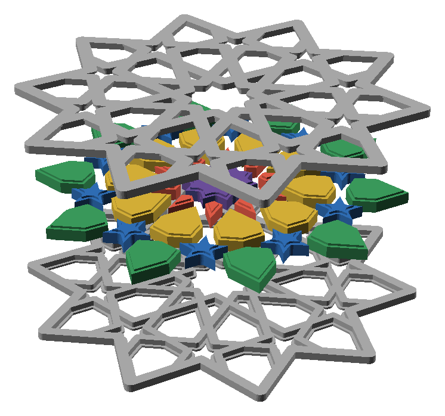
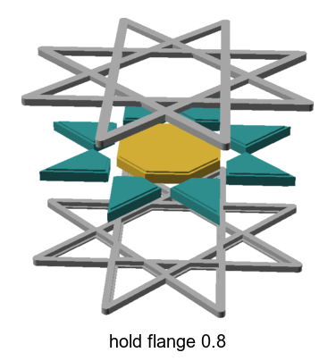
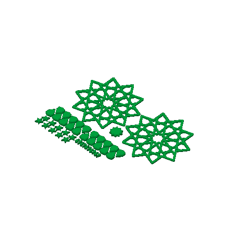

# split-02 — the split gBV coaster whose pieces carry a flange (option C)

**In short.** You asked, for the split coaster's call 6, "i want a olate hat tries a and c ...
these shoukd be different options in coaster lab". This is C, the flange. The gBV coaster at the
size sheets-04g printed is cut flat through the middle into two halves. Each piece has a band
round its middle that is wider than its hole at the faces, and the two halves close on that band,
so both faces look like today's coaster with the pieces flush. A, the lip, is
[split-01](split-01.md). The plate is [`split-02.yaml`](split-02.yaml). One bed, 107 minutes,
about 31 g, in the color you pick when you say yes.

## What it is

- **The two halves.** The gBV minimal coaster (gBV_JTt3Kxk), 112.5 mm across, 3.75 mm straps,
  4.4 mm tall when closed, cut at half its height. Both halves print face down, so both faces of
  the closed coaster are bed faces.
  - LOWER: the lower half (1)
  - UPPER: the upper half (1)
- **The undercut.** At the cut, each hole is 0.8 mm wider all round, for the band. The faces keep
  the holes' own shape.
- **Its 41 pieces**, each a 0.6 mm block the shape of its hole, then a band 0.8 mm wider all round
  for the middle 3.2 mm, then another 0.6 mm block, 0.25 mm smaller than the hole on every side.
  - MIDDLE: the twenty-sided piece in the middle (1)
  - KITE: the small four-sided kites (10)
  - HEX: the inner ring of six-sided pieces (10)
  - STAR: the ten-pointed stars (10)
  - OUTER: the outer ring of six-sided pieces (10)
- **No studs.** The undercuts take 0.8 mm from each side of every strap at the cut, leaving no
  strap wide enough beside them for a 2 mm stud. The halves line up by their outlines and by the
  pieces sitting in both.

**The color is picked at the send**, as on sheets-04g: say it with the yes ("yes, in pink").

**What I assumed, for you to change:**

- **Two plates, not one.** You asked for "a plate". Each coaster's halves are about 113 mm across,
  and four of them fill the 256 mm bed with no room for pieces, so A and C are a plate each.
- **The bikar defaults:** flange 0.8 mm, gap 0.25 mm. bikar refuses a flange that leaves less than
  0.8 mm of strap between two undercuts.
- **No glue.** Whether the halves are glued is call 3 of the split design, still open. With no
  studs, how the closed halves stay together unglued is part of what this print shows.

## Why print it

It tries the look you would get with no change to the faces: the coaster as it is today, pieces
flush. It answers whether the flanged pieces print clean, whether they go into the lower half and
the upper half closes over them, and whether the halves line up and stay together without studs.

## Pictures

Opened up: the lower half, the pieces lifted over their holes with the band showing as a step on
each, and the upper half above them. Drawn by bikar and OpenSCAD from the coaster file, with the
pieces' packing taken out so each sits over its own hole (`tools/cookbook_render.py --file`).

How the flange holds, on the cookbook's small star: each piece's band is wider than its hole at the
faces.

The slice: both halves on the right, the HEX and OUTER rows at the left with the stars and kites beside them, the middle piece between.

## Cost and risk

One bed, 107 minutes, about 31 g (local slice, 2026-10-05, X2D preset and PLA Basic, sliced
for the Textured PEI plate Bambu Studio has saved, no slicer warnings, nothing sent). One color, so no swaps.

**Risk: watch.** Each piece's band starts 0.6 mm up and sticks out 0.8 mm with nothing under it,
two lines of overhang that may droop; that is a look to judge, not a risk to the printer. The
kites and stars are small loose pieces that can lift or get knocked by the nozzle.

## Your call

- [ ] **Approve as it stands** — say the color with the yes
- [ ] **Hold** — say why in the notes

Notes:

## Approvals

Every yes or hold Omar gives this plate, one row each, oldest first (D-096). A tick under Your call, or a yes in chat, becomes a row here through the manage-approvals skill's `plate_approve.py`; a send spends the open approval, and a recipe change resets it.

| Date | Decision | By | Covers | Spent by |
|---|---|---|---|---|

## Timeline

| Date | What happened | Where it is written |
|---|---|---|
| 2026-10-05 | proposed — at Omar's ask, option C of the split design's call 6, beside split-01 (A) | this page |
| 2026-10-05 | sliced — local slice against bikar #305, fits one bed, 107 minutes, 31 g, no slicer warnings | this page |
