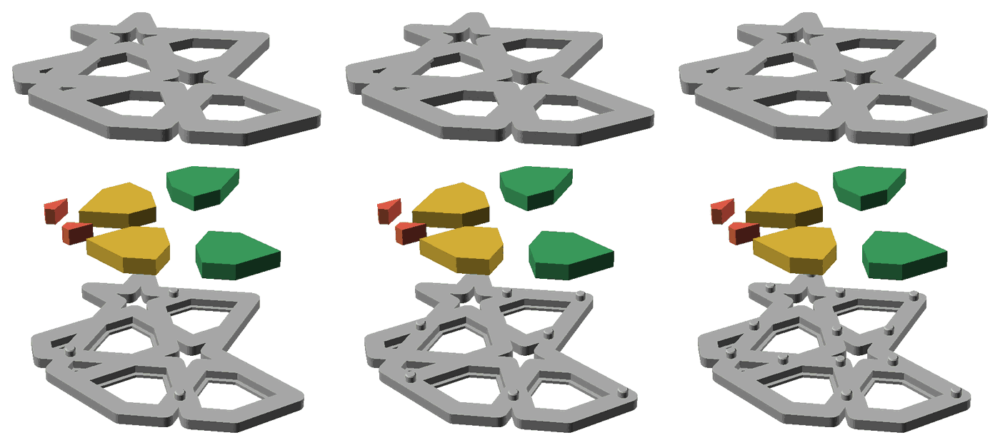
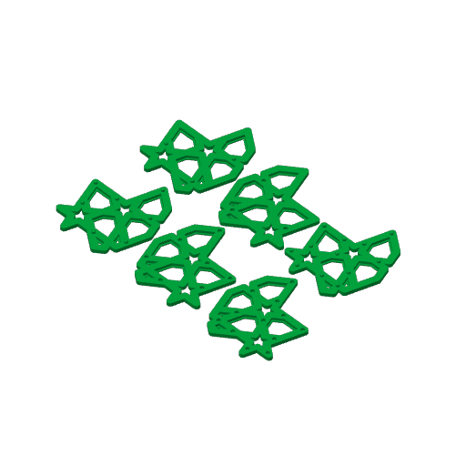
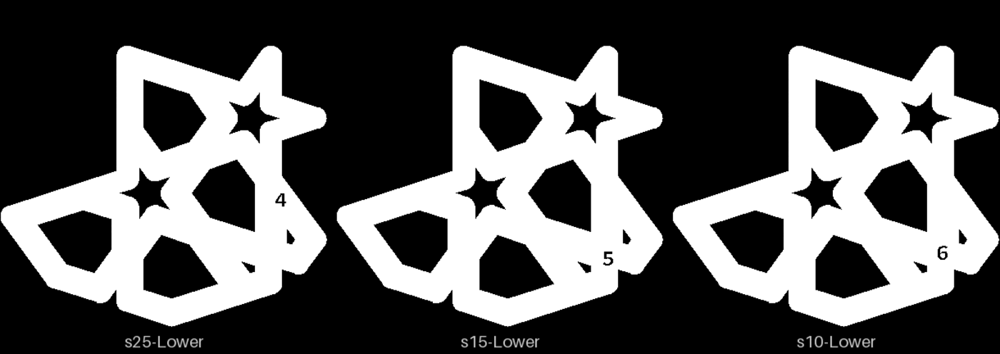

# stud-1 — how far apart the studs go on a split coaster

**In short.** Three slices of [split-01](split-01.md)'s lip coaster, a fifth of the coaster each,
the same in every way but how far apart their studs are: 25 mm (3 studs on the slice), 15 mm (7)
and 10 mm (13). Each slice is a lower half and an upper half that press together. It answers the
split design's [call 4, how many studs](../pieces/split-with-studs-design.md#10-open-calls-for-omar):
the fewest studs that hold the halves flat and lined up. The plate is
[`stud-1.yaml`](stud-1.yaml). One bed, 48 minutes, about 16 g, in the color you pick when you say
yes. The stud gap is the one you picked off [spl-2](spl-2.md), 0.25 mm: "it should be 1e"
([D-116](../../working-model/decisions-log.md#d-116--a-split-coasters-stud-gap-is-025-mm)).

## What it is

- **The coaster.** bikar's `gBV_JTt3Kxk-split-lip-coaster.bkr`, split-01's coaster: the gBV
  minimal coaster at 112.5 mm, 3.75 mm straps, 4.4 mm tall closed, cut at half its height, with the
  0.8 mm lip on each face. Both halves print face down.
- **The slice.** Only the faces whose centres lie in a 72-degree slice, from 9 degrees, are kept
  (bikar #332, `wedge 72 from 9`): eight faces, two of them stars, which stay open holes as on
  split-01. bikar picks the studs again on the slice, so each slice carries whole studs and whole
  sockets, never one cut through. A fifth of the coaster is a fifth of the bed and the time, and
  still has the straps, the lip, the holes and the studs of the whole coaster.
- **The three pairs.** The studs are 2 mm across with a 0.25 mm socket gap, as on split-01 (D-116). Only
  the least distance between two studs changes:

  | Lower (its id) | Upper | Studs at least this far apart | Studs on the slice | On the whole coaster |
  |---|---|---|---|---|
  | LOWER25 (`4`) | UPPER25 | 25 mm, split-01's | 3 | 10 |
  | LOWER15 (`5`) | UPPER15 | 15 mm | 7 | 31 |
  | LOWER10 (`6`) | UPPER10 | 10 mm | 13 | 59 |

  The whole-coaster counts are from bikar rendering the same coaster at `wedge 360`; bikar refuses
  any spacing where less than a socket wall stands between two sockets.
- **The ids.** Each lower half carries its coaster id, `4`, `5` or `6`, cut 2.5 mm tall into its
  bottom face and mirrored so it reads the right way round there, as split-01 carries `1`.
  split-01 has 1, split-02 has 2 and pkt-2 has 3. bikar took all three on the slice and put each
  where it found room, so the number sits in a different place on each lower (see
  [the pictures](#pictures)).
- **The uppers carry no id.** Each prints face down, so its bed face is the top that shows, and
  its cut face is mostly pocket. Count the sockets on its cut face instead: 3, 7 or 13, matching
  its lower's studs.

**Left off: the loose pieces.** split-01 asks whether the pieces drop in and stay at full size.
With pieces in the slice, a pair that rocks or will not close could be the pieces or the studs,
and this plate's one question would get mixed up with split-01's. Without them the slice's holes
stay open, which is fine: the studs sit on the straps, not in the holes.

**The color is picked at the send**: say it with the yes ("yes, in pink").

**What I assumed, for you to change:**

- **The 2 mm stud.** Nothing snapped on spl-1 at 1.5, 2 or 3 mm, so the plate keeps split-01's
  2 mm. The stud gap is no longer an assumption: it is 0.25 mm, your pick (D-116).
- **25, 15 and 10 mm.** 25 is split-01's and gives the whole coaster ten studs; 10 is the other
  end of call 4, every crossing; 15 is between them. Nothing closer than 10, the closest call 4
  names.
- **A slice tells you about the whole coaster.** It holds where it has studs and lifts between
  them the same way, because a slice has the same straps and the same stud spacing. What it cannot
  show is a whole coaster bowing over 112.5 mm; split-01 shows that.
- **A fifth, from 9 degrees.** Every face centre on gBV sits on a multiple of 18 degrees, so 9
  puts the slice's edges halfway between faces.

## Why print it

split-01 is cut at 25 mm, three studs to a slice and ten to the coaster. The design said those
are easy to press but that the straps between them "can lift a little". Printing the whole coaster
three times to find out would take three beds; one bed of slices answers it at about a fifth of
the cost, and the answer sets the stud spacing on every split coaster after it.

## After the print

What gets asked when it comes off the bed, one row at a time (the review-print skill asks them).
Each lower is named by the id cut into its bottom, `4`, `5` or `6`. The uppers carry no id, so
each is named by the sockets on its cut face: 3, 7 or 13. Keep each upper with its lower off the
bed: `4` with the upper of 3 sockets, `5` with 7, `6` with 13.

| Pieces | The question | What we expect, and why | What each answer changes |
|---|---|---|---|
| Lower `4` with the upper of 3 sockets, `5` with 7, `6` with 13 | **Do:** Take each lower with its upper. Lay them cut faces together, each stud over its socket, and press them closed with your thumbs. **Look for:** Which pairs close all the way by hand, with no gap at the cut? Which take a lot of force, or will not close? Say which by the lower's id. | All three close. `6` takes the most force: 13 snug studs at once, where `4` has 3. | All close: the spacing is picked on the next rows. `6` will not close by hand: 10 mm is out at this gap. None close: 0.25 mm is too tight on a slice, and D-116 is looked at again. |
| The three closed pairs: `4`, `5`, `6` | **Do:** Run a fingertip along the outside edge of each closed pair, across the line where the halves meet, all the way round. **Look for:** Can you feel a step, one half sticking out past the other? Where, and on which pair? | No step on any: two studs are enough to fix one half on the other, and even `4` has three. | No step on `4`: three studs line up a slice, and the coaster's ten line it up. A step on `4`: spacing goes down to the closest pair with no step. |
| The three closed pairs: `4`, `5`, `6` | **Do:** Hold each closed pair by its lower half, upper half facing down, and shake it. Then lay it on the table and push a fingernail under the upper half's straps at the far corners and between studs. **Look for:** Does an upper half fall off? Does a strap lift away from the lower half, and show a gap, when you push it? On which pair, and where? | `4` may lift a little between its studs, the design's own warning; `5` and `6` should not. | The fewest studs where nothing lifts or falls becomes the stud spacing on every split coaster (call 4), and split-01 is cut again at it if that is not 25 mm. |
| The three pairs: `4`, `5`, `6` | **Do:** Pull each closed pair apart by hand. **Look for:** Do the halves come apart with every stud whole? Does a stud snap off, or a strap crack beside a socket? On which pair? | They come apart whole. `6`, with 13 studs, takes the most pull; bikar keeps a socket wall between every two sockets, so the straps should not crack. | Whole: the spacing stands. Studs snap on `6` only: 10 mm is out, the next spacing up is kept. A crack beside a socket: bikar's least wall between sockets goes up. |
| The lowers' bottom faces: `4`, `5`, `6` | **Do:** Turn each lower half over and look at its bottom face. **Look for:** Can you find the number and read it without tilting? Is it the right way round, not mirrored? | Readable, as split-01's `1`: the same size, cut into a bed face. bikar placed each in a different spot. | Readable: ids on a slice work the same as on the whole coaster. Not: bikar's id placement on a slice is fixed before the next one. |

## Pictures

The three pairs opened up, 25 mm on the left, 15 in the middle, 10 on the right: the lower half
with its studs at the bottom, the upper half turned over above. Drawn by bikar and OpenSCAD from
the coaster file (`tools/cookbook_render.py --file`). The colored pieces in the middle are the
slice's loose pieces, drawn only to show where they would go: **this plate leaves them off**.

The bed, from the local slice: six halves, with room to spare.

The lowers' bottom faces seen from below (`tools/print_review.py bottom`): `4`, `5` and `6` read
the right way round, each in the spot bikar found room for it.

The review sheet (`tools/print_review.py sheet`, review-print) reads the same for all six halves:
a quarter of each is open, ten holes each, no part near solid. The studs and sockets are too small
to change those numbers, so the three spacings look alike from above and below.

## Cost and risk

One bed, 48 minutes, about 16 g (local slice, 2026-10-09, against bikar main, X2D preset
and PLA Basic, sliced for the Textured PEI plate Bambu Studio has saved, no slicer warnings,
nothing sent). One color, so no swaps.

**Risk: ok.** Six flat halves, no loose pieces. The studs are the smallest parts, 2 mm across on
top of the lowers; a stud the nozzle knocks off is a lost data point, not a risk to the printer.

## Your call

- [ ] **Approve as it stands** — say the color with the yes
- [ ] **Hold** — say why in the notes

Notes:

## Approvals

Every yes or hold Omar gives this plate, one row each, oldest first (D-096). A tick under Your call, or a yes in chat, becomes a row here through the manage-approvals skill's `plate_approve.py`; a send spends the open approval, and a recipe change resets it.

| Date | Decision | By | Covers | Spent by |
|---|---|---|---|---|

## Timeline

| Date | What happened | Where it is written |
|---|---|---|
| 2026-10-08 | proposed — task #241, after bikar #332 gave the split coaster a stud spacing and a slice; planned until spl-1 is judged | this page |
| 2026-10-08 | sliced — local slice from bikar main at #332, fits one bed, 53 minutes, 16 g, no slicer warnings | this page |
| 2026-10-09 | changed (iteration 2): stud gap 0.25 mm, Omar's pick off spl-2, "it should be 1e" (D-116); no longer waits on spl-1; no yes to reset | [D-116](../../working-model/decisions-log.md#d-116--a-split-coasters-stud-gap-is-025-mm) |
| 2026-10-09 | sliced — local slice from bikar main, fits one bed, 48 minutes, 16 g, no slicer warnings; 5 minutes less than the last slice, cause not looked into | this page |
