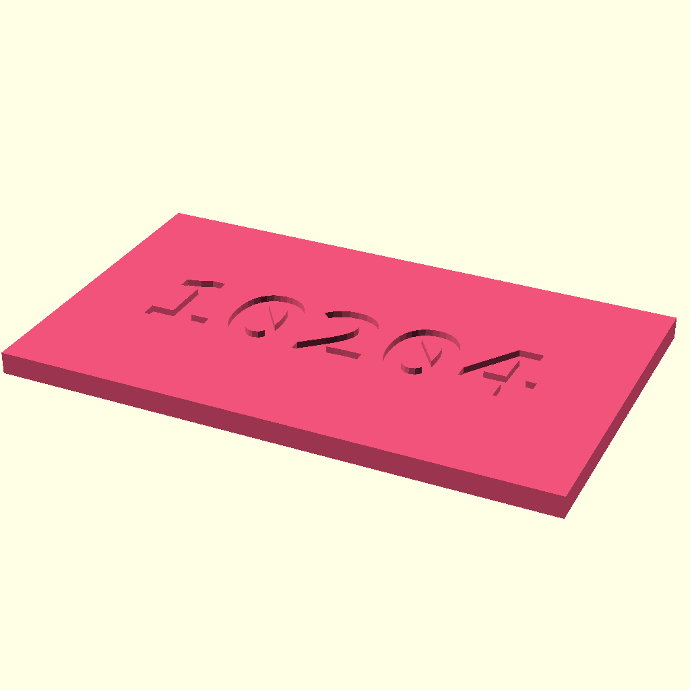
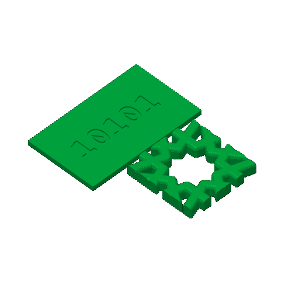

# swatch-10101 — a swatch of PLA Basic Black

**In short.** You picked our own swatch card over bought sample packs (D-105): "our swatch/samples
will be erived form bambu ... but we might buy other faimelnt too eventually". This is the swatch
for PLA Basic Black, code 10101, one color, #000000. On the printer now, so it can print as soon as you say yes. The plate is
[`swatch-10101.yaml`](swatch-10101.yaml). One bed, 18 minutes, about 5.45 g.

## What it is

- **CHIP:** a 50 x 30 mm card, 2 mm thick, with 10101 engraved in the top. The top shows the
  surface and the sheen; the bottom shows the bed face, the side a coaster sits on.
- **WINDOW:** a 30 mm window of the gBV coaster [sheets-04g](sheets-04g.md) printed, cut at its
  star, so the color is seen on our own straps and edges.

**The color is picked at the send:** `bambu print send … --color "#000000"`.

**What I assumed, for you to change:**

- **The code is the label.** It is the number on the spool, so a chip names the spool to buy again.
- **A window of the coaster, not a whole one,** to keep a swatch to a few grams.

## Why print it

A picture on a screen is not the color a coaster comes out in. The chip settles it for this spool,
and sits beside the others when picking a theme.

## Pictures

The chip, drawn from bikar's `Swatch-Chip.bkr` (every swatch's chip, with its own code).

The slice: the chip and the coaster window on the bed.

## Cost and risk

One bed, 18 minutes, about 5.45 g (local slice, 2026-10-05, X2D preset and PLA Basic,
sliced for the Textured PEI plate Bambu Studio has saved, nothing sent). One color, so no swaps.

**Risk: ok.** Two flat pieces, no loose small parts.

## Your call

- [ ] **Approve as it stands**
- [ ] **Hold** — say why in the notes

Notes:

## Approvals

Every yes or hold Omar gives this plate, one row each, oldest first (D-096). A tick under Your call, or a yes in chat, becomes a row here through the manage-approvals skill's `plate_approve.py`; a send spends the open approval, and a recipe change resets it.

| Date | Decision | By | Covers | Spent by |
|---|---|---|---|---|

## Timeline

| Date | What happened | Where it is written |
|---|---|---|
| 2026-10-05 | proposed — the swatch for 10101, by the color-themes skill's swatch.py (D-105) | this page |
| 2026-10-05 | sliced — local slice fits one bed, 18 minutes, 5.45 g | this page |
