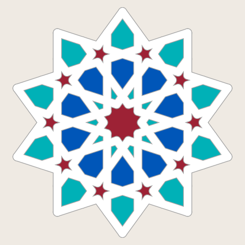
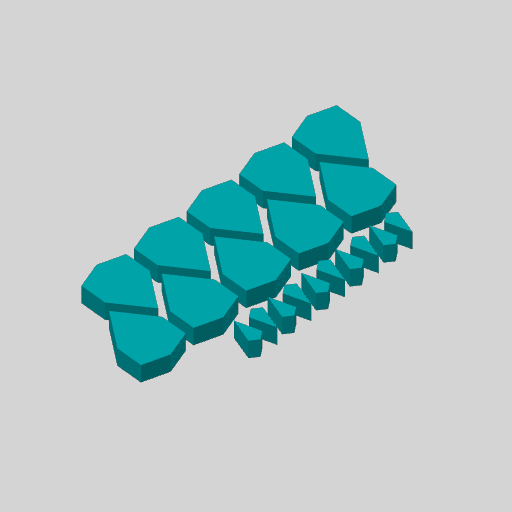

# theme-iznik-tile-10605 — Iznik tile in Turquoise

**In short.** You picked Iznik tile as one of the first four themes to print (D-106: "all the
bottom row"). It prints as one plate per color, 4 plates in all; this one is PLA Basic Turquoise (10605):
Kite ×10, Outer ×10. Not on the printer: it prints once the spool is bought and loaded (see the buy list). The plate is [`theme-iznik-tile-10605.yaml`](theme-iznik-tile-10605.yaml). One bed, 18 minutes, about
4.83 g, $0.08 of filament. The other plates and the colors to buy are on
[the theme plates page](../coaster/themes/gbv-theme-plates.md).

## What it is

- **Kite ×10, Outer ×10**, every one in PLA Basic Turquoise (10605), the gBV coaster at sheets-04g's size
  (112.5 mm).
- White ground, cobalt and turquoise with a red accent, after the glazed tiles of Ottoman Iznik.

**Before you say yes:**

- **The pieces are cut at `gap: 0`, as sheets-04g printed them, and that fit was off:** the kites were too tight and the middle too loose. [sheets-04g-fit](sheets-04g-fit.md) tries kites from 0.05 to 0.25 mm and the middle from 0 to 0.15 mm, and has not printed (CAL-LSE-01). Printing this plate first repeats the old fit; printing the fit plate first lets these plates take its gaps, as a new iteration of each recipe.

## Why print it

A theme on a screen is a guess at how the colors sit together. Printing its plates and putting the
pieces in the frame settles it for this theme. The persona scores beside each theme are simulated,
not customer research; these prints are the first thing to hold them against.

## Pictures

The theme as the gallery draws it.

The slice: this plate's pieces on the bed.

## Cost and risk

One bed, 18 minutes, about 4.83 g, $0.08 of filament (local slice, 2026-10-05, the X2D preset and
PLA Basic's own filament preset, nothing sent). One color, so no swaps.

**Risk: ok.** Loose small pieces on one bed, as sheets-04g printed them.

## Your call

- [ ] **Approve as it stands**
- [ ] **Hold** — say why in the notes

Notes:

## Approvals

Every yes or hold Omar gives this plate, one row each, oldest first (D-096). A tick under Your call, or a yes in chat, becomes a row here through the manage-approvals skill's `plate_approve.py`; a send spends the open approval, and a recipe change resets it.

| Date | Decision | By | Covers | Spent by |
|---|---|---|---|---|

## Timeline

| Date | What happened | Where it is written |
|---|---|---|
| 2026-10-05 | proposed — Iznik tile in Turquoise, by the color-themes skill's theme_plates.py (D-106) | this page |
| 2026-10-05 | sliced — local slice, 18 minutes, 4.83 g | this page |
