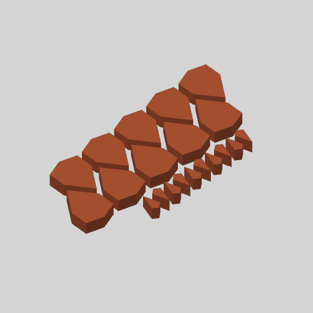

# theme-terracotta-souk-11203 — Terracotta souk in Terracotta

**In short.** You picked Terracotta souk as one of the first four themes to print (D-106: "all the
bottom row"). It prints as one plate per color, 4 plates in all; this one is PLA Matte Terracotta (11203):
Kite ×10, Hex ×10. Not on the printer: it prints once the spool is bought and loaded (see the buy list). The plate is [`theme-terracotta-souk-11203.yaml`](theme-terracotta-souk-11203.yaml). One bed, 18 minutes, about
5.19 g, $0.08 of filament. The other plates and the colors to buy are on
[the theme plates page](../coaster/themes/gbv-theme-plates.md).

## What it is

- **Kite ×10, Hex ×10**, every one in PLA Matte Terracotta (11203), the gBV coaster at sheets-04g's size
  (112.5 mm).
- Fired clay, brass and sand in a black frame, like a market stall of pots and lamps.

**The color is picked at the send:** `bambu print send … --color "#B15533"`.
The recipe names no color (call 18), so say the color with the yes.

**Before you say yes:**

- **The pieces are cut at `gap: 0`, as sheets-04g printed them, and that fit was off:** the kites were too tight and the middle too loose. [sheets-04g-fit](sheets-04g-fit.md) tries kites from 0.05 to 0.25 mm and the middle from 0 to 0.15 mm, and has not printed (CAL-LSE-01). Printing this plate first repeats the old fit; printing the fit plate first lets these plates take its gaps, as a new iteration of each recipe.

## Why print it

A theme on a screen is a guess at how the colors sit together. Printing its plates and putting the
pieces in the frame settles it for this theme. The persona scores beside each theme are simulated,
not customer research; these prints are the first thing to hold them against.

## After the print

What gets asked when it comes off the bed, one row at a time (the review-print skill asks them).

| Pieces | The question | What we expect, and why | What each answer changes |
|---|---|---|---|
| Kite ×10, Hex ×10 | Does Terracotta look the way the theme picture draws it, beside the theme's other colors in the frame? | Close, not exact: the picture draws the color catalog's screen color, not a printed surface. | Looks right: the color stays in the theme. Off: the color-themes skill swaps in the nearest color and draws the theme again, and this plate is cut again in it. |
| Kite ×10, Hex ×10, in the frame | Do the pieces drop into the frame and stay, without pressing? | The kites too tight and the middle too loose: they are cut at gap 0, the fit sheets-04g printed and found off. | Drop in and stay: the gap is kept for every theme plate. Tight or loose: every theme plate is cut again at the gaps sheets-04g-fit settles, each as a new iteration of its recipe. |

## Pictures

The theme as the gallery draws it.

The slice: this plate's pieces on the bed.

## Cost and risk

One bed, 18 minutes, about 5.19 g, $0.08 of filament (local slice, 2026-10-05, the X2D preset and
PLA Matte's own filament preset, nothing sent). One color, so no swaps.

**Risk: ok.** Loose small pieces on one bed, as sheets-04g printed them.

## Your call

- [ ] **Approve as it stands**
- [ ] **Hold** — say why in the notes

Notes:

## Approvals

Every yes or hold Omar gives this plate, one row each, oldest first (D-096). A tick under Your call, or a yes in chat, becomes a row here through the manage-approvals skill's `plate_approve.py`; a send spends the open approval, and a recipe change resets it.

| Date | Decision | By | Covers | Spent by |
|---|---|---|---|---|

## Timeline

| Date | What happened | Where it is written |
|---|---|---|
| 2026-10-05 | proposed — Terracotta souk in Terracotta, by the color-themes skill's theme_plates.py (D-106) | this page |
| 2026-10-05 | sliced — local slice, 18 minutes, 5.19 g | this page |
