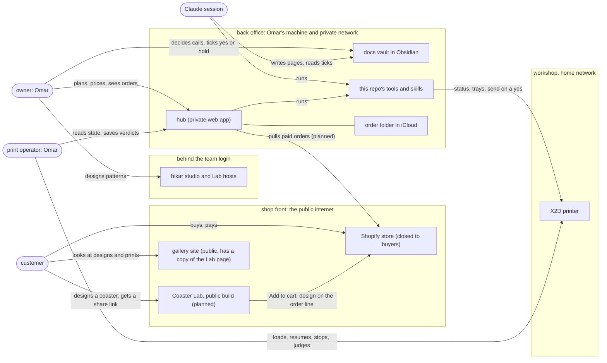
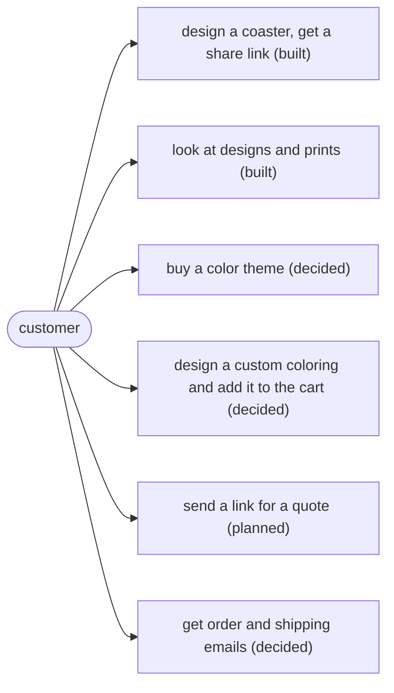
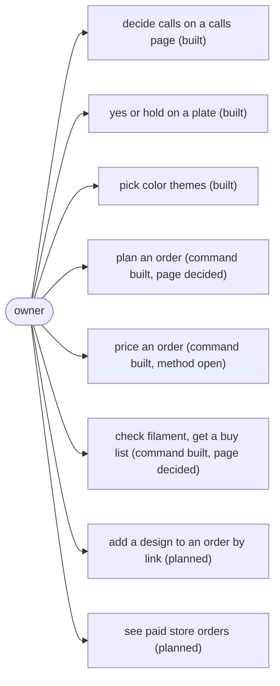
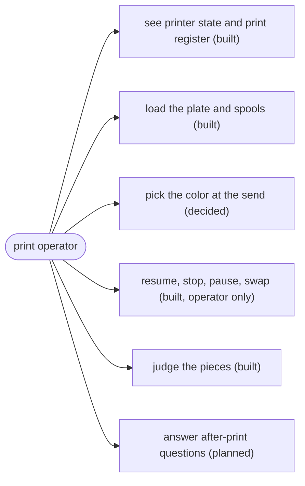
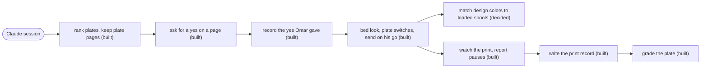
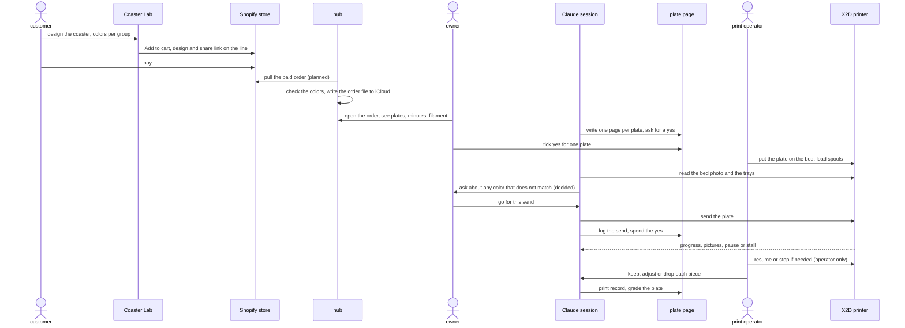
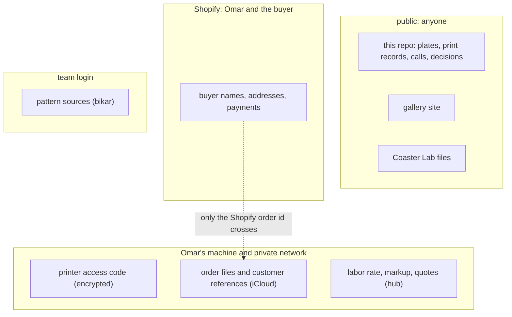

# Who uses what: the people, the pages and the tools behind the coasters

This doc says, for the whole coaster business, who the users are, which page or tool each one
uses, and what each one can and cannot do there. It is the map the other design docs zoom into:
the order design, the store design and the print skills each draw their own slice, and none of
them draws the whole.

> Status: draft, 2026-10-08. Most of what it describes is built and in use. Where a part is only
> decided, or only planned, the doc says so in the same line. It changes nothing by itself. One
> call is left for Omar, in [§10](#10-open-calls-for-omar).

## 1. The problem: two labs, a hub, and no page that says who each is for

On 2026-10-08, in the middle of deciding where the order pages should live, Omar asked "whats the
difference between coaster lab and hub?" and then "who is the main user of the hub?". Then:
"do we have a design.md that properly distinguishes the users and use cases?"

We had two partial answers. The [order design](../coaster/order-driven-lab-design.md#5-context-who-uses-it-and-what-it-touches)
draws a customer, an owner and a print operator, but only for orders. The
[store design](../storefront/shopify-storefront-design.md#7-use-cases) draws a buyer and Omar, but
only for selling. They also disagree on one point. The order design gives the Coaster Lab[^lab] an
"Add to order" button that tells a customer "Send this link to the shop to order". The store
design replaces that text with an "Add to cart" button in a public build of the Lab. A reader of
either one cannot tell which is current, or how the printing side fits in.

So someone new, or Omar mid-decision, has to rebuild the picture from five docs and a dozen
skills. That is how a question like "who is the hub for?" ends up asked at the moment it matters.

## 2. Why now

- **Three calls answered on 2026-10-08 move work between places.** The color of a plate is always
  picked at the send (call 18). Colors from a design are matched to the loaded spools at print
  time, by a skill, and the hub[^hub] gets a read-only printer service on Omar's private network
  (call 19). The order pages live in the hub (call 20). Each one is clearer once the places are
  drawn.
- **The store exists and is closed to buyers.** It was created on 2026-10-05
  ([D-102](../../working-model/decisions-log.md#d-102--the-stores-first-setup-basic-plan-priced-by-finish-set-and-colors-etsy-later)).
  Before it opens, every person who can reach each page should be written down.
- **The printing side has grown a loop.** Seven skills now take a plate from "worth printing?" to
  "how did it come out?". Each one says what it does, but not who does which step: Omar, or a
  Claude session working for him.

## 3. The idea: a shop front, a back office and a workshop

Think of a small shop. **The shop front** is open to anyone: the store, the public Coaster Lab and
the gallery. **The back office** is Omar's alone: the hub, the docs he decides in, and the tools.
**The workshop** is the printer, on his home network. Things only cross between rooms through a
few fixed doors:

1. **A share link[^sharelink]** carries a design from the shop front to the back office. It holds
   the pattern, its settings and its colors, and nothing about the person.
2. **The back office pulls; nothing pushes into it.** The hub fetches new store orders. No page on
   the internet can call the hub.
3. **Nothing reaches the workshop without Omar's yes for that send.** A Claude session can run
   every step up to the send, and the send itself only on his word.

Four kinds of user move through these rooms: the **customer**, the **owner**, the **print
operator**, and a **Claude session** doing work for the owner. Today the owner and the print
operator are the same person, Omar. They are drawn apart because they act at different times, and
because a helper at the printer would take one role and not the other.

### A worked example

A buyer wants four gBV coasters[^gbv] in the Ice to navy theme[^theme], with a gold middle piece.

1. **Customer, shop front.** They open the Lab from the store's product page, make the middle piece
   gold, and press Add to cart. Shopify takes the payment. *(Decided, not built: the store is
   closed and the Lab's store mode does not exist yet.)*
2. **Owner, back office.** The hub pulls the paid order, checks that the colors are ones we sell,
   and writes an order file into Omar's private iCloud folder. Omar opens the order in the hub and
   sees the plates, the minutes and the filament. *(The planning command is built. The hub's
   Orders pages and the store pull are not.)*
3. **Claude session, back office.** It ranks the order's plates beside the experiments waiting,
   writes each plate's page, and asks Omar for a yes on each one. *(Built for experiment plates.)*
4. **Print operator, workshop.** Omar puts the plate on the bed and loads the spools. The session
   looks at the bed photo, matches the gold to a loaded spool and asks about any color that does
   not match, then sends on his go. *(The send and the bed look are built. Matching colors at print
   time is decided and not built.)*
5. **Session, then operator.** The session watches the print and reports a pause or a stall.
   Resuming or stopping is Omar's alone. When it ends, Omar judges the pieces and the session
   writes the print record.

## 4. The people

| Role | Who, today | What they do | What they never do |
|---|---|---|---|
| **Customer** (buyer) | Anyone on the internet | Design a coaster in the Lab, buy in the store, send a share link for a quote | Reach the hub, the docs vault or the printer; see a price setting or another buyer |
| **Owner** | Omar | Designs and sells; decides open calls; says yes or hold to each plate; plans and prices orders | — the owner can do anything; the rules below are what he set for the others |
| **Print operator** | Omar | Loads spools and plates, watches the printer, resumes or stops it, judges the pieces | Send a plate without a yes for that send |
| **Claude session** | A Claude Code session on Omar's machine | Runs the skills and tools: ranks plates, writes pages, slices, sends on his go, watches prints, writes records, changes the tools through pull requests | Write a yes Omar did not give; resume, stop, pause or swap a print; change any printer setting except the two plate switches; put anything private in this public repo |

The Claude session's limits are written rules, not habits. Each send needs its own yes, recorded
on the plate page ([D-093](../../working-model/decisions-log.md#d-093--omars-yes-to-a-send-lives-on-the-plate-page-one-per-send)).
The two plate switches are the one printer setting it may change without asking, and only to fit
the plate the bed photo shows
([D-108](../../working-model/decisions-log.md#d-108--the-two-plate-switches-follow-the-bed-photo-set-by-claude-at-the-sends-bed-look)).
Resuming, stopping, pausing and swapping are Omar's
([monitor-print](../../../.claude/skills/monitor-print/SKILL.md)).

The order design also names a **developer**, who runs the made-up test orders before a change
merges. Today that is a Claude session or Omar, so it is not a separate row here.

## 5. The rooms and what crosses between them

**In the diagram:** Coaster Lab[^lab]; share link[^sharelink]; gallery[^gallery]; bikar
studio[^studio]; hub[^hub]; docs vault[^vault]; skill[^skill]; X2D[^x2d]; send[^send].

Read it left to right as rooms. Nothing in the shop front has an arrow into the back office: the
hub pulls from the store, never the other way. The only arrow into the workshop comes from the
tools, and a send down it needs Omar's yes. Omar, as the print operator, also acts on the printer
by hand.

## 6. The surfaces

Each page or tool, where it runs, who can reach it, and what it is for.

| Surface | Runs where | Who can reach it | What it is for | What it never does | State |
|---|---|---|---|---|---|
| **Coaster Lab** | In the browser; served from bikar's hosts | Team login on bikar's hosts. A copy is public on the gallery. A public store build is planned | Design a coaster: pattern, knobs, piece colors; the share link | Send to the printer. The printer picker's choice stays in the browser and is never put in a share link | Built. The store build, with a store mode that hides the code, the file downloads, the printer picker and the print history, is decided and not built |
| **bikar studio** | bikar's web host | Team members, through an org login | Write and test patterns | Face a customer | Built |
| **Gallery** | This repo's public site | Anyone | Show the designs, the print history, and a copy of the Coaster Lab page | Hold a secret or an order | Built. Its Lab copy shows team-only parts today, which is why the store needs its own build |
| **Shopify store** | Shopify | Anyone, once open | Product pages, cart, checkout, order emails | Know the plates or the printer | Created 2026-10-05, closed to buyers; the [launch checklist](../../../.claude/skills/launch-store/checklist.md) tracks what is left |
| **Hub** | Omar's own computer, served on his private network | Devices signed in to his private network. It has no login of its own | Today: the printer's state, the print register, saving a verdict per piece (it opens a pull request here), the plate queue to look at. Decided: the Orders pages. Planned: a read-only printer service, and pulling store orders | Answer the internet; send a plate. Its queue is read-only, and a send from it would need its own confirmation | Partly built |
| **Docs vault** | This repo's docs, opened in Obsidian | Omar and Claude sessions on his machine; the files are public on GitHub | Calls pages with tick boxes, plate pages with their Approvals table, comments on any doc | Hold anything private: the repo is public | Built |
| **Tools and skills** | A terminal on Omar's machine | Omar and Claude sessions | The `bambu` command (status, trays, slice, send, watch, order plan, order price, shelf), the plate tools, and the skills that string them together | Run from a web page | Built |
| **X2D printer** | Omar's home network | The tools, using a pinned certificate and an access code; Omar at the machine | Print | — | Built |

## 7. Use cases, by role

"Built" means it works today. "Decided" means Omar chose it and it is not built yet. "Planned"
means a design describes it and nothing is decided or built.

### 7.1 The customer

| Use case | Where | State |
|---|---|---|
| Design a coaster and get a share link | Coaster Lab (the gallery copy today) | Built |
| Look at designs and past prints | Gallery | Built |
| Buy a color theme from a product page | Shopify store | Decided, store closed |
| Design a custom coloring and add it to the cart | Coaster Lab in the store's product page | Decided, not built |
| Send a share link for a quote or a large order | By message to the owner, then a Shopify draft order | Planned |
| Get order, shipped and tracking emails | Shopify | Decided, store closed |

**In the diagram:** share link[^sharelink]; color theme[^theme].

### 7.2 The owner

| Use case | Where | State |
|---|---|---|
| Decide open calls, by ticks and comments on a calls page | Docs vault | Built |
| Say yes or hold to a plate | Plate page in the docs vault, or in chat | Built |
| Pick color themes for a coaster | Theme pages in the docs vault | Built |
| Plan an order: plates, minutes, filament by color | `bambu order plan` today; the hub's Orders pages | Command built; pages decided 2026-10-08 (call 20) |
| Price an order | `bambu order price` today; the hub's Price page | Command built with every price setting empty; how the price is set is still open (calls 21 and 22) |
| Check filament on hand and get a buy list | `bambu shelf show` today; the hub's Stock page | Command built; page decided |
| Add a design to an order by its share link | The hub, from the Lab's button on his own devices | Planned (see [§10](#10-open-calls-for-omar)) |
| See paid store orders, with their colors | The hub, pulled from Shopify | Planned |
| Set store prices and retire a theme | Shopify admin and the hub | Planned |

**In the diagram:** plate[^plate]; color theme[^theme]; hub[^hub].

### 7.3 The print operator

| Use case | Where | State |
|---|---|---|
| See the printer's state and the print register | Hub | Built |
| Put a plate on the bed and load the spools | At the printer | Built |
| Pick the plate's color at the send | The send, by the session, on the operator's word | The send is built. "Always at the send" was decided 2026-10-08 (call 18); today a single-color plate can still carry its color in its recipe |
| Resume, stop, pause or swap a print | At the printer, or on his word in chat | Built, and his alone |
| Judge the pieces: keep, adjust or drop, with a note | The hub's verdict editor, or in chat | Built |
| Answer a plate's after-print questions, one at a time | Chat, with the plate page open | Planned |

**In the diagram:** send[^send]; plate[^plate]; hub[^hub].

### 7.4 The Claude session

This is the print loop, in the order a plate moves through it, plus the work around it.

| Use case | Skill | State |
|---|---|---|
| Rank the plates waiting and keep each plate's page current | [prioritize-prints](../../../.claude/skills/prioritize-prints/SKILL.md) | Built |
| Put open calls on a page with pictures and tick boxes, and read the ticks back | [request-feedback](../../../.claude/skills/request-feedback/SKILL.md) | Built |
| Record a yes or hold Omar gave; reset it when the recipe changes | [manage-approvals](../../../.claude/skills/manage-approvals/SKILL.md) | Built |
| Check the yes, slice, check the printer is idle, look at the bed photo, set the two plate switches, send | [send-plate](../../../.claude/skills/send-plate/SKILL.md) | Built |
| Match a design's colors to the loaded spools at print time, asking about each mismatch | send-plate, with the hub's read-only printer service | Decided 2026-10-08 (call 19), not built; its design is being written |
| Watch the print, a picture every 10 minutes, report a pause or a stall | [monitor-print](../../../.claude/skills/monitor-print/SKILL.md) | Built |
| Write the print record, a verdict per piece | [review-print](../../../.claude/skills/review-print/SKILL.md) | Built |
| Grade the plate: experiment, repeatable or production | [grade-plate](../../../.claude/skills/grade-plate/SKILL.md) | Built |
| Change the tools, run the checks, open and merge pull requests | — | Built |

**In the diagram:** skill[^skill]; plate[^plate]; send[^send]; print record[^record].

## 8. One order, end to end

The worked example from §3 as a sequence, with each step's room. The store path is drawn. A design
that comes in by message instead joins at the "add to order" step.

**In the diagram:** Coaster Lab[^lab]; share link[^sharelink]; hub[^hub]; plate[^plate];
send[^send]; print record[^record].

## 9. Where secrets and private data live

The repo this doc sits in is public, and so is the gallery. Everything private sits in the back
office or with Shopify.

| What | Where it lives | Who can read it |
|---|---|---|
| The printer's access code | On Omar's machine, in this repo's encrypted settings file, which is never committed. The `bambu` tools decrypt it. The hub's README says both that it holds the code server-side and that it holds no secret of its own because the tools decrypt this repo's file; either way it stays on Omar's machine and never reaches a browser | The tools, run by Omar, a session or the hub |
| Store keys and the order-event secret | coffee-house-storefront's encrypted settings, and the hub | The store's tools and the hub |
| The Coaster Lab | No secret at all: it runs in the browser | Anyone it is served to |
| bikar studio's keys | bikar's encrypted settings | The team |
| Orders and the reference to each customer | An iCloud folder outside every repo ([D-101](../../working-model/decisions-log.md#d-101--orders-never-go-in-this-repo-they-live-in-an-icloud-folder)), read by the hub | Omar's devices |
| Labor rate, markup, quotes | The hub | Omar |
| Pattern sources | bikar, a private repo | The team |
| Plate recipes, print records, calls and decisions, this doc | This repo | Anyone |

**In the diagram:** hub[^hub]; Coaster Lab[^lab]; gallery[^gallery].

The one dotted arrow is the only thing about a person that leaves Shopify: the store design keeps
just Shopify's order id in the hub, and reads no name or address there.

## 10. Open calls for Omar

### Call 1: once the store opens, can a customer still order by sending a link?

The store design gives the public Lab an Add to cart button. The order design gives the owner's
own Lab an Add to order button, for designs that arrive by message. Both can be true at once, or
the store can be the only door.

| | **Both: the store for buyers, a link by message for quotes (recommended)** | The store only | Links by message only, until the store opens |
|---|---|---|---|
| Pros | Large and unusual orders, which the store design already prices as Shopify draft orders, have a way in; a friend or a café can still send a link | One door, one checkout, one set of order emails | Nothing to build in the store before an order can come in |
| Cons | Two ways in to keep in step; the hub's Add to order page has to exist as well as the store pull | A quote or a two-dozen order has to fit a product page | Payment and the address are chased by hand |
| Implications | The order pages take orders from both, and an order from a link carries no Shopify id until its draft order is made | The Lab's Add to order button and the owner-side order entry are dropped from the order design | The store pull waits; the order pages are fed by hand first |
| What it verifies | Each order, either way in, is checked by the hub against the colors we sell | The same check, through one way in | Nothing about the customer's colors until Omar retypes them |

**Pick both**, because the store design already plans quotes as draft orders made from the hub's
pricer, and that needs a way for a design to reach the hub without a cart.

- [ ] Both: the store for buyers, a link by message for quotes (recommended)
- [ ] The store only
- [ ] Links by message only, until the store opens
- Notes:

**Not a call yet, but would change this doc:** the hub has no login of its own, so anyone signed in
to Omar's private network can save a verdict, and could use the planned printer service. Today that
network is his own devices. A second person at the printer would need a login on the hub first.

## 11. What this doc is not

It names who uses what. How each part works is in its own doc:

- **Orders, the shelf and the price:** [order design](../coaster/order-driven-lab-design.md).
- **The store:** [store design](../storefront/shopify-storefront-design.md), and coffee-house-storefront's own design, which hosts the public Lab.
- **Piece colors and plates by color:** [piece colors design](../coaster/infill-color-ux-design.md).
  Matching design colors to loaded spools at print time, and the hub's read-only printer service,
  are in their own design, open for review as pull request #626 on 2026-10-08.
- **The print loop:** the skills linked in [§7.4](#74-the-claude-session), and the plate pages in
  [docs/design/plates](../plates/).
- **Where the Coaster Lab lives and why:** decided 2026-09-17, recorded in the order design's
  glossary and in the store design's §4.

## Glossary

[^lab]: **Coaster Lab** — the web page, built in bikar, where a coaster is designed: pick a
    pattern, turn its knobs, color its pieces, and see it in 3D. It runs entirely in the browser.
[^sharelink]: **share link** — the Coaster Lab's address for one design: the pattern, every knob
    changed from its default, and the colors. It never carries the printer choice.
[^hub]: **hub** — 3d-model-hub, a private web app that runs on Omar's own computer and is reached
    only from devices on his private network (Tailscale, a service that links one person's
    devices). It shows the printer and the print register and runs this repo's tools.
[^gallery]: **gallery** — this repo's public website: the designs, the print history and a copy
    of the Coaster Lab page.
[^studio]: **bikar studio** — bikar's web app for writing and testing patterns, behind an org
    login.
[^vault]: **docs vault** — this repo's `docs/` folder opened in Obsidian, a note-taking app. Calls
    pages, plate pages and comments live there.
[^skill]: **skill** — a written procedure a Claude session follows for one job, kept in this
    repo's `.claude/skills/`, with its own scripts.
[^x2d]: **X2D** — the Bambu Lab printer these coasters print on.
[^send]: **send** — handing one sliced plate to the printer to start. Each one needs Omar's yes.
[^plate]: **plate** — one bed's worth of pieces, printed in one go, with its own page and recipe.
[^record]: **print record** — what came off one print: when it ran, how long it took, and a
    verdict per piece.
[^gbv]: **gBV coaster** — the flagship coaster: a frame with 41 loose pieces in five groups.
[^theme]: **color theme** — a named set of filament colors, one for the frame and one per group of
    pieces, such as Ice to navy.

## Appendix: what was read

- The hub's README (private repo, read 2026-10-08): runs from a launch agent on Omar's machine,
  served through Tailscale Serve and never Funnel, no login of its own, verdicts open a pull request
  here, the plate queue is read-only, and the two statements about the access code quoted in §9.
- coffee-house-storefront's DESIGN.md §3 (read 2026-10-08): the Lab in a frame on the product page,
  hosted on its own static site; the store mode bikar needs first; the hub asks Shopify for orders.
- The store design §3, §4, §7, §8 and §13, and the order design §5, §6 and §9.4, in this repo.
- bikar's `packages/web/public-surface.json` at main: the studio hosts are behind the team login.
- The `bambu` command's `order plan`, `order price`, `shelf show` and `plates by-color`
  subcommands, in `tools/bambu/src/commands/`.
- Omar's answers in chat on 2026-10-08 to calls 18, 19 and 20 of the
  [2026-10-06 calls page](../../working-model/feedback-requests/2026-10-06-open-calls.md#orders-and-pricing-calls-20-to-22).
