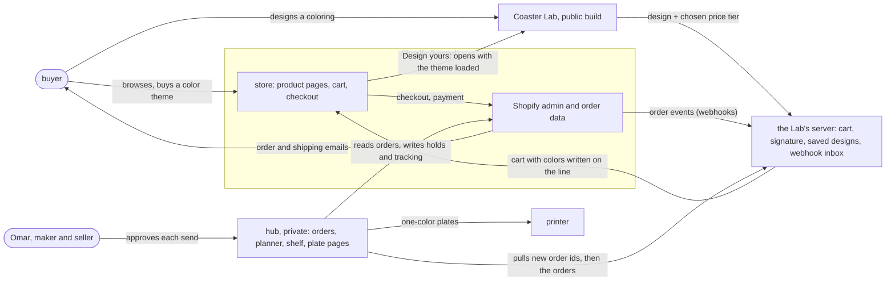
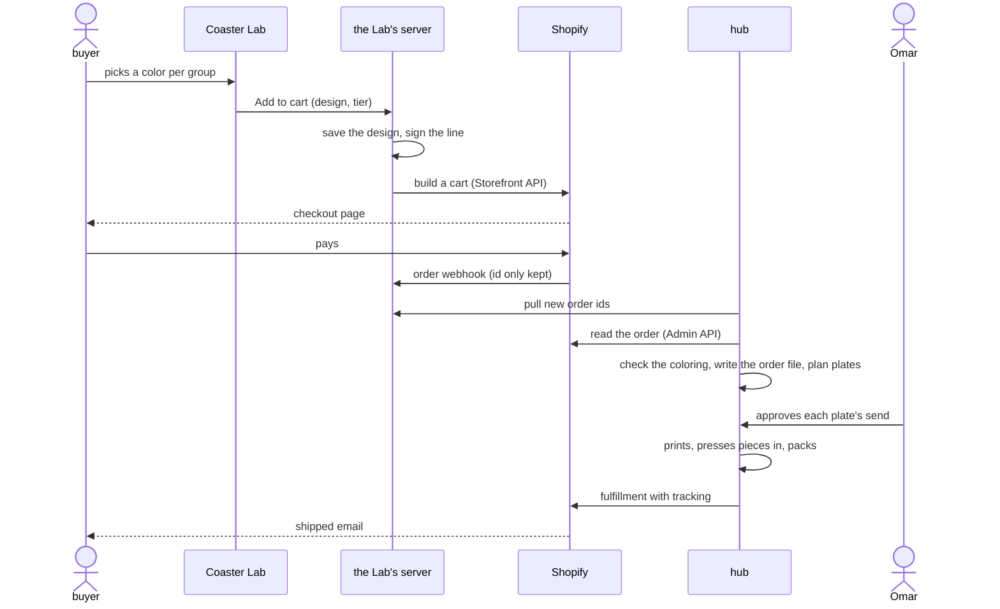
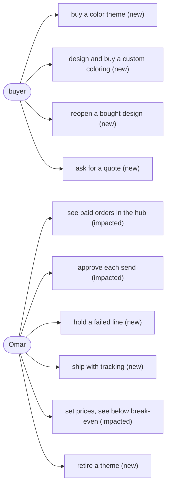
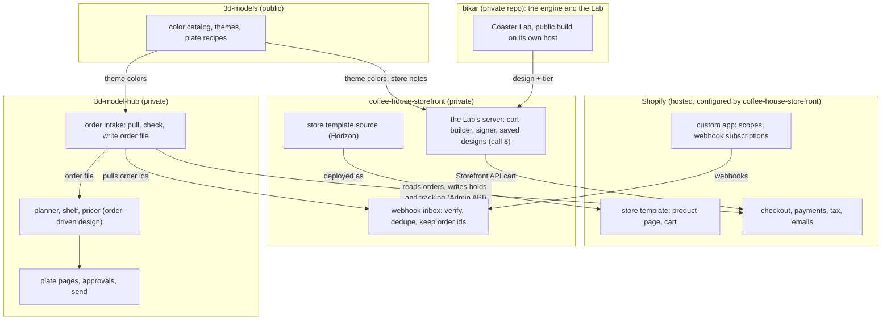
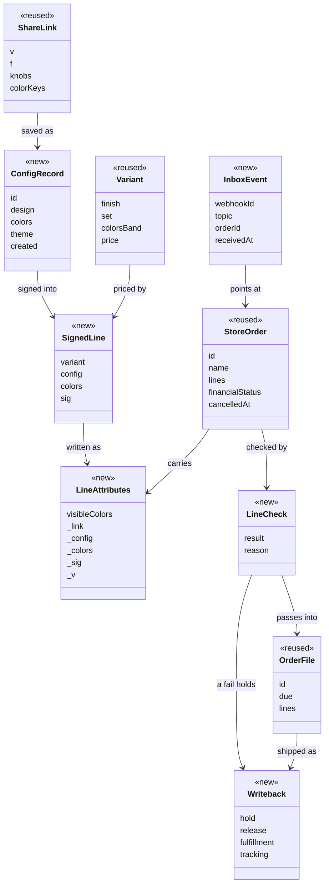

# The coaster store: what a Shopify store has to do to sell made-to-order coasters

This is a handoff spec for an online store, built on Shopify[^shopify], that sells 3D-printed
coasters each buyer colors to taste, and hands every paid order to the workshop that prints it.
The store is built in another repo, **coffee-house-storefront**
([D-099](../../working-model/decisions-log.md#d-099--the-shopify-store-is-built-in-coffee-house-storefront)).
This document is everything that repo needs to know about the coasters, written for someone who
has never opened this one. [§17](#17-handoff-starting-a-fresh-session-in-coffee-house-storefront)
is the handoff: where everything is, what to read first, and what a session there can start now.

> Status: draft, 2026-10-04. Nothing here is built, and no price is set: every price setting is
> still empty on purpose. The Shopify store itself exists, on the Basic plan, created 2026-10-05
> (UTC) and closed to buyers. All ten calls are decided: 1 and 4 first, the other eight on
> 2026-10-05 ([D-102](../../working-model/decisions-log.md#d-102--the-stores-first-setup-basic-plan-priced-by-finish-set-and-colors-etsy-later),
> [D-103](../../working-model/decisions-log.md#d-103--a-custom-order-prints-one-plate-per-color-so-each-new-coloring-gets-its-own-yes)). Omar, who
> designs, prints and sells the coasters, made them in
> [§16](#16-decisions-to-make-for-the-store), along with the questions a test settles and the
> values only he sets. Each requirement below says whether it is decided, recommended here, open
> on a call, or only assumed.

## 1. The problem: a coaster can be designed but not bought

Our coasters are a frame with loose pieces that press into it, like a stained-glass window whose
panes are separate parts. The flagship has 41 pieces in five groups, and each group can be a
different color. A web app we built, the Coaster Lab[^lab], lets someone pick those colors and
see the result, and gives them a share link[^sharelink] that reopens the same design.

That is where it stops. There is no way to pay. Today an order would be a share link sent to Omar
by message, a price worked out by hand, a payment chased by hand, and an address copied by hand.
The team's own Lab hosts sit behind a login. One copy of the Coaster Lab page is public, on the
gallery site ([its coaster page](https://blog.bytesofpurpose.com/3d-models/coaster.html), which loaded with no login on
2026-10-04), but it shows everything the team sees: the design's code, the file downloads and the
printer picker. It is not a page a buyer should land on.

Picture a buyer who wants four coasters in blues for a friend's new kitchen. They should be able
to pick "Ice to navy" on a product page and pay, or open the Lab, make the middle piece gold
instead, and pay for that. Omar should then see an order with exactly those colors, make it, and
mark it shipped, without retyping anything and without the buyer's address ever landing in a
public repo.

## 2. Why now

- **The pieces exist.** The coaster prints, the Lab colors it, and ready-made color themes[^theme]
  exist with names and pictures.
- **The order side is designed.** The [order-driven Lab design](../coaster/order-driven-lab-design.md)
  turns one typed order into plates[^plate], time, filament and a price. It assumes orders arrive
  by hand. A store is what makes them arrive on their own, and it has to speak that design's
  format.
- **The research is done and checked.** Two independent passes and a checker settled what
  Shopify can and cannot do for this on 2026-10-04
  ([the consolidated research](../../research/2026-10-04-shopify-storefront.md)). Its findings
  decide most of the mechanics below.
- **Assumptions are scattered.** About fifty things the store must do are already implied across
  a dozen docs, some of them contradicting each other. This doc gathers them in one place, so the
  other repo builds against one list.

## 3. The idea

Shopify sells and takes the money; our own tools do everything that is about the coaster itself.
Think of Shopify as the shop counter and our workshop as the back room: the counter knows the
product, the price and the buyer, the back room knows the colors, the plates and the printer, and
an order slip passes between them carrying the design and nothing about the person.

Four rules carry the whole design:

1. **Colors are written on the order line, never made into products.** Five groups times about a
   hundred colors is far more combinations than any store can list, so each line carries its
   colors as notes, and the product only says what changes the price.
2. **The Lab hands the design to Shopify's cart, and Shopify's checkout takes the money.** How
   it hands it over is open (call 8). This doc drew a small server beside the Lab that builds
   the cart and stamps the line with a signature proving it priced it. coffee-house-storefront's
   design puts the Lab in a frame on the product page, which adds the design to the cart itself.
   §11.2 and §12 describe the signed version; call 8 compares the two.
3. **The workshop pulls; nothing pushes into it.** The private hub[^hub] where Omar plans and
   prints is not reachable from the internet, and stays that way. It asks Shopify for new orders.
4. **Nothing prints without Omar's yes.** A paid order is a request to print, not a print. The
   existing rule that every send to the printer needs his approval still holds.

## 4. Context: the store and what it talks to



**In the diagram:** Shopify[^shopify]; Coaster Lab[^lab]; the Lab's server[^labserver]; webhook[^webhook];
hub[^hub]; send[^send]; plate[^plate].

## 5. What the store sells, and what it cannot sell yet

**What it sells.** Made-to-order coasters. The flagship is the gBV coaster[^gbv]: a frame 112.5 mm
across with 41 loose pieces in five groups (Middle, Kite, Hex, Star, Outer), so six color choices
counting the frame. Each is printed after it is paid for and pressed together by hand. It comes
three ways:

- **A color theme,** a named, ready-made coloring such as Ice to navy or Espresso and crema, from
  the [gBV themes](../coaster/themes/gbv-themes.md).
- **A custom coloring,** any colors from the filament[^filament] catalog, designed in the Lab.
- **A set** of 4 or 6, the sizes other sellers list most
  ([pricing research](../../research/2026-10-04-coaster-pricing.md)). No holder for a set has been
  designed, so a set ships without one until it is.

**What it cannot sell yet:**

- **A design whose right to sell is not recorded.** That covers every design today, the flagship
  included. coffee-house-storefront's design names this as its most serious blocker: designs
  taken from GeoGebra files are shared under CC BY-NC-SA, which allows no commercial use without
  a licence, and designs from Broug's book are under copyright. The gBV coaster is redrawn from a
  tutorial video of the Itimad-ud-Daula tomb's ten-fold rosette, and nothing records whether it
  may be sold. Which designs may be sold, and who decides, is call 9.
- **PLA Silk Gold (code 13401)** is not on the US Bambu store as of 2026-10-04. A theme that uses
  it can only be made from a spool[^spool] already on hand, so it is offered only while that spool
  lasts, and retired after. Gilded Rose is sold only as a Silk Multi-Color spool.
- **Anything off the shelf.** No coaster is stock. Even the store's own color themes are printed
  per order.
- **Reviews from the theme personas.** Each theme has six scores from made-up coffee-drinker
  personas. They are simulated opinions and are never shown as reviews.

**No coaster plate is "production" yet, and every send needs Omar's yes.** A plate moves from
experiment to production[^maturity] after one good run as laid out
([D-098](../../working-model/decisions-log.md#d-098--production-is-one-good-run-as-laid-out-with-no-fill-bar)),
and only a production plate goes out on a standing yes
([D-095](../../working-model/decisions-log.md#d-095--production-plates-have-a-standing-approval-their-recipe-is-frozen-and-a-change-is-a-new-experiment-plate)).
Every other send needs Omar's yes on the plate's page, one per send
([D-093](../../working-model/decisions-log.md#d-093--omars-yes-to-a-send-lives-on-the-plate-page-one-per-send)).
The only production plate today holds phones, not coasters. For sales this means:

- **Every order waits for a person.** A paid order cannot print by itself. Lead time has to
  include the time it takes Omar to look and approve, every time, until coaster plates reach
  production.
- **"Made to order, checked by a person" is the honest promise.** The product page says so
  (the mockup in §8 does).
- **A custom coloring may stay an experiment longer than a theme.** Whether a new color on a
  production plate keeps its standing yes is call 3 in §16.

## 6. The journey, end to end

In plain words: the buyer picks colors, Shopify takes the money, the hub reads the order and plans
plates, Omar approves and prints, and the tracking number goes back to Shopify, which emails the
buyer.



**In the diagram:** Storefront API[^storefrontapi]; Admin API[^adminapi]; order file[^orderfile];
webhook[^webhook]; fulfillment[^fulfillment].

A buyer who picks a ready-made theme on the product page skips the Lab: Shopify's own product
form adds the line, and the rest is the same.

## 7. Use cases

| Actor | Use case | New or impacted |
|---|---|---|
| buyer | buy a color theme from a product page | new |
| buyer | design a custom coloring in the Lab and buy it | new (the Lab exists; buying from it is new) |
| buyer | reopen a bought design later from the order's link | new |
| buyer | ask for a quote for a large or unusual order | new |
| buyer | get order, shipped and tracking emails | new (Shopify's own emails) |
| Omar | see each paid order in the hub with its colors, no retyping | impacted (the hub's orders, designed in the order-driven doc) |
| Omar | approve and send each plate | impacted (unchanged rule, new source of orders) |
| Omar | hold a line whose coloring fails the check, and contact the buyer | new |
| Omar | mark a line shipped with tracking | new |
| Omar | set prices per variant and see which sit below break-even | impacted (the pricer, order-driven §9.3) |
| Omar | retire a color theme when its spool runs out | new |



**In the diagram:** color theme[^theme]; hub[^hub]; send[^send]; hold[^hold]; break-even[^breakeven].

## 8. What the buyer sees

The user-facing surface is new, in two apps:

- **The Shopify store** (a new site): a product page per coaster with a theme picker, a finish
  and a set picker, an **Add to cart** button and a **Design yours in the Lab** button; a cart
  that lists each group's color by name; Shopify's checkout; Shopify's order and shipping emails.
- **The Coaster Lab** (changed): a public build of it, opened from the product page with the
  theme loaded, and an **Add to cart** button in its Piece colors screen, which replaces the
  planned "Send this link to the shop to order" text from the order-driven design.

The hub gains no page from this doc; its Orders pages are the order-driven design's, fed by the
store instead of by hand.


[product-and-cart-mockup.html](shopify-storefront-media/product-and-cart-mockup.html). What is
real and what stands in:

| Part of the picture | Real or stand-in |
|---|---|
| The coaster, its size, its five groups and the frame | **Real**, the gBV coaster as the [gBV themes](../coaster/themes/gbv-themes.md) draw it |
| Ice to navy and its six colors, with names and swatches | **Real**, the [Ice to navy theme](../coaster/themes/gbv-themes.md#ice-to-navy), all PLA Matte |
| The shape of the hidden link, `?v=1&f=…&color.Middle=11601&…` | **Real**, the Lab's share-link format (§12.1) |
| The shop name, the preset id in the link, the config id and signature | Stand-ins, dotted underline |
| The finish and set choices | Stand-ins: which options carry a price is call 5 |
| Every price and the lead time | **Empty on purpose**: no price setting and no lead time is set |

## 9. The pieces and where they live

The store is built in coffee-house-storefront (call 1, decided:
[D-099](../../working-model/decisions-log.md#d-099--the-shopify-store-is-built-in-coffee-house-storefront)).
This section draws the split: coffee-house-storefront for everything facing the buyer, the
existing private hub for the workshop, and the Coaster Lab, built in bikar (a private repo) and
served from a public host of its own. Where the Lab's server sits, and whether there is one at
all, follows call 8; it is drawn here in coffee-house-storefront.



**In the diagram:** store template[^template]; custom app[^customapp]; the Lab's server[^labserver];
webhook[^webhook]; order file[^orderfile]; planner[^planner]; shelf[^shelf].

**The data model it touches,** at class level for the touched types only (ten):



| Type | Where | Status | Why it is touched |
|---|---|---|---|
| ShareLink | bikar, the Lab | reused | The design the buyer made; the store carries it and never adds to it |
| ConfigRecord | the Lab's server | new | A saved design with an id, so a design too long for a link still reaches the order (task #189's missing home) |
| SignedLine | the Lab's server | new | Proves our server matched this coloring to this price tier |
| LineAttributes | Shopify cart and order | new | Where the colors live on a line, since they cannot be variants |
| Variant | Shopify | reused | Carries the price tiers, nothing else |
| InboxEvent | the Lab's server | new | An order id and topic from a webhook, kept so the hub can pull; no person in it |
| StoreOrder | Shopify | reused | The paid order the hub reads |
| OrderFile | hub | reused | The order-driven design's input; the store must produce exactly it |
| LineCheck | hub | new | Whether a line's colors match its price tier and source |
| Writeback | hub to Shopify | new | Holds, releases and shipments written back, so Shopify's emails tell the buyer |

## 10. Requirements

Each requirement is a short "must", grouped as the assumption inventory groups them. Status:

- **decided**: settled by a decision-log entry, a fact the research confirmed, or a built rule;
- **recommended**: this doc's recommendation, still Omar's to accept;
- **assumed**: nothing settles it; it is written down so the other repo can build and Omar can
  correct it.

The source column links to where the assumption was found. The source anchors behind it are in
[Appendix B](#appendix-b-source-anchors).

### 10.1 Customer and configurator

| Id | The store must | Source | Status |
|---|---|---|---|
| SF-1 | let a buyer buy a color theme from the product page without opening the Lab | [gBV themes](../coaster/themes/gbv-themes.md) | recommended |
| SF-2 | let a buyer design a custom coloring in a public Lab build and add it to the cart from there | [order-driven §8](../coaster/order-driven-lab-design.md) | decided (calls 4 and 8: the Lab in the product page, the hub checks) |
| SF-3 | link from each product page into the Lab with the shown theme loaded | this doc | recommended |
| SF-4 | show each group's color by name on the cart, checkout and order; keep machine fields hidden from the buyer with a leading underscore | [storefront research](../../research/2026-10-04-shopify-storefront.md) | recommended |
| SF-5 | put a link on every line that reopens the bought design in the Lab | [piece colors design](../coaster/infill-color-ux-design.md) | recommended |
| SF-6 | never add printer details (printer, tray, slot) to a link or a line | [piece colors design](../coaster/infill-color-ux-design.md) | decided (a Lab rule) |
| SF-7 | never show the theme personas' scores as reviews or as customer opinion | review-theme skill rule | decided |
| SF-8 | carry a design too long for the 1800-character link to the order whole, through a saved config id | the Lab's link budget | recommended |
| SF-9 | say on a listing that uses a two-color spool that each coaster comes out different | [gBV themes](../coaster/themes/gbv-themes.md) | assumed |

### 10.2 Catalog

| Id | The store must | Source | Status |
|---|---|---|---|
| SF-10 | list one product per coaster design whose right to sell is recorded; the first is the gBV coaster at 112.5 mm, once its rights are | [gBV themes](../coaster/themes/gbv-themes.md), coffee-house-storefront's design | decided (call 9: a record per design) |
| SF-11 | carry each group's color as a line attribute, never as a variant (Shopify allows 2,048 variants and 3 options a product) | [storefront research](../../research/2026-10-04-shopify-storefront.md) | decided |
| SF-12 | use variants only for what moves the price, three options at most | [storefront research](../../research/2026-10-04-shopify-storefront.md) | recommended (call 5) |
| SF-13 | offer a color the US store does not sell only while a spool is on hand, and retire it when it runs out (Silk Gold 13401 today) | color palette store notes | recommended |
| SF-14 | sell sets of 4 and 6, and no holder until one is designed | [pricing research](../../research/2026-10-04-coaster-pricing.md) | assumed |
| SF-15 | keep Shopify's stock tracking off for coasters, since they are made to order; filament stock lives in the hub | [order-driven §9.2](../coaster/order-driven-lab-design.md) | recommended |
| SF-16 | label each product picture as a drawing or a photo of a real print | this doc, §11.8 | assumed (call 10) |
| SF-17 | say "made to order" and the lead time on every product page | this doc, §5 | assumed (call 7) |
| SF-53 | never use Bambu's product or spool photos; every picture is our drawing or our photo | owner rule, §11.8 | decided |

### 10.3 Pricing

| Id | The store must | Source | Status |
|---|---|---|---|
| SF-18 | take prices only from the variants Omar sets; no price is written in any repo until he sets it | [order-driven §9.3](../coaster/order-driven-lab-design.md#93-the-price) | recommended |
| SF-19 | feed the pricer a Shopify fee row (Basic: 2.9% + 30¢ a card sale, the plan's monthly cost spread over the month's orders) in place of the Etsy-only row | [pricing research](../../research/2026-10-04-coaster-pricing.md) | recommended |
| SF-20 | show in the hub which variant prices sit below break-even, and tag a launch or discount price | [order-driven §10](../coaster/order-driven-lab-design.md#10-open-calls-for-omar) | recommended |
| SF-21 | price quotes and large orders as draft orders from the hub's pricer | [storefront research](../../research/2026-10-04-shopify-storefront.md) | recommended |
| SF-22 | not use a cart transform to price a line at launch (our own app would need Plus, or a public App Store app) | [storefront research](../../research/2026-10-04-shopify-storefront.md) | decided |
| SF-23 | keep Shop Pay Installments off until its merchant fee is read in the store's admin | [storefront research](../../research/2026-10-04-shopify-storefront.md) | recommended |

### 10.4 Orders and fulfillment

| Id | The store must | Source | Status |
|---|---|---|---|
| SF-24 | turn every paid order into an order file in the order-driven format, naming no person | [order-driven §9.1](../coaster/order-driven-lab-design.md) | recommended |
| SF-25 | never print because an order was paid: each send still needs the plate's yes | [D-093](../../working-model/decisions-log.md#d-093--omars-yes-to-a-send-lives-on-the-plate-page-one-per-send), [D-095](../../working-model/decisions-log.md#d-095--production-plates-have-a-standing-approval-their-recipe-is-frozen-and-a-change-is-a-new-experiment-plate) | decided |
| SF-26 | hold, not print, a line whose colors fail the check (§11.3) | [storefront research](../../research/2026-10-04-shopify-storefront.md) | recommended |
| SF-27 | give one order file per order however many times, late or out of order its webhooks arrive | [storefront research](../../research/2026-10-04-shopify-storefront.md) | decided (Shopify guarantees neither order nor delivery) |
| SF-28 | run a catch-up sweep that finds orders the webhooks missed, inside Shopify's 60-day window | [storefront research](../../research/2026-10-04-shopify-storefront.md) | recommended |
| SF-29 | release a cancelled order's filament and stop its unsent plates | [order-driven §9.2](../coaster/order-driven-lab-design.md) | recommended |
| SF-30 | write tracking back to Shopify when a line ships, and ship a set across plates only when every plate is done, or in parts | [storefront research](../../research/2026-10-04-shopify-storefront.md) | recommended |
| SF-31 | absorb a failed print: it moves the ship date, never the price | [D-092](../../working-model/decisions-log.md#d-092--failure-detection-is-the-printers-job-not-a-per-plate-yes) | assumed |
| SF-32 | tell the buyer about the order through Shopify's own emails (confirmation, on hold, shipped) | this doc | assumed |

### 10.5 Inventory

| Id | The store must | Source | Status |
|---|---|---|---|
| SF-33 | reserve a paid order's grams on the shelf, so the buy list shows what to order | [order-driven §9.2](../coaster/order-driven-lab-design.md) | recommended |
| SF-34 | never ask the home printer or the hub from the public store; any stock it shows comes from a pushed snapshot | [piece colors design](../coaster/infill-color-ux-design.md) | recommended |
| SF-35 | lengthen the lead time when a color has to be bought first | this doc | assumed |

### 10.6 Data and privacy

| Id | The store must | Source | Status |
|---|---|---|---|
| SF-36 | keep every customer name, address, email and order out of public git (3d-models, and the public Lab build's files) | [order-driven §9.4](../coaster/order-driven-lab-design.md#94-what-may-go-in-the-public-repo) | recommended (order-driven call 3) |
| SF-37 | keep only Shopify's order id in the hub as the customer reference, and read no name or address there | this doc, §11.5 | recommended |
| SF-38 | keep every token, webhook secret and signing key in a secret store, never in git or a log | this doc, §13 | recommended |
| SF-39 | answer the three privacy webhooks, though Shopify's pages require them only of App Store apps | [storefront research](../../research/2026-10-04-shopify-storefront.md) | recommended |
| SF-40 | keep saved designs free of any person: a design, its colors, a date | this doc | recommended |

### 10.7 Hosting

| Id | The store must | Source | Status |
|---|---|---|---|
| SF-41 | use Shopify's checkout; no page of ours ever takes card details | [storefront research](../../research/2026-10-04-shopify-storefront.md) | decided |
| SF-42 | keep the hub reachable only on the team's private network; it pulls, nothing calls into it | hub README | decided |
| SF-43 | never put a cart secret in a browser: a cart built from outside Shopify's pages is built on the Lab's server | [storefront research](../../research/2026-10-04-shopify-storefront.md) | decided (the rule; call 8 picked Shopify's own cart, so no cart is built from outside) |
| SF-44 | run a public, coasters-only Lab build on its own host, while the team's studio stays behind its login | team access memory, coffee-house-storefront's design | decided (call 4); the domain is open (§16.4) |
| SF-45 | answer each webhook within 5 seconds, after the signature check | [storefront research](../../research/2026-10-04-shopify-storefront.md) | decided |

### 10.8 Brand and market

| Id | The store must | Source | Status |
|---|---|---|---|
| SF-46 | sell under the Naqsh Coffee name, US first, in US dollars | [pricing research](../../research/2026-10-04-coaster-pricing.md) | assumed |
| SF-47 | speak to three buyers: gift givers, home coffee drinkers, cafés buying sets | review-theme personas | assumed |
| SF-48 | offer a gift note | [pricing research](../../research/2026-10-04-coaster-pricing.md) | assumed |
| SF-49 | name color themes as the catalog names them (Ice to navy, Espresso and crema, Iznik tile) | [gBV themes](../coaster/themes/gbv-themes.md) | assumed |

### 10.9 Shopify setup

| Id | The store must | Source | Status |
|---|---|---|---|
| SF-50 | start on Basic or Grow, picked by one install test (call 2); Starter is closed to new stores | [storefront research](../../research/2026-10-04-shopify-storefront.md) | decided (Starter); the store was created on Basic on 2026-10-05 (UTC), and the test decides whether it moves (call 2) |
| SF-51 | use one custom app made in Shopify's Dev Dashboard; custom apps made in the admin are closed to new apps | [storefront research](../../research/2026-10-04-shopify-storefront.md) | decided |
| SF-52 | turn on Shopify Tax; a store created on or after 2026-05-13 gets a lifetime $100,000 of US sales before its fee applies | [storefront research](../../research/2026-10-04-shopify-storefront.md) | recommended |

## 11. How it works: the Shopify mechanics

### 11.1 The product model: price tiers in variants, colors on the line

In plain words: a product says what you pay; the line says what you get.

A Shopify product can have up to three options and 2,048 variants[^variant]. Five groups and a
frame, each from about a hundred colors, is far past that, so colors cannot be variants. They go
on the cart line as line attributes[^attribute], which Shopify carries through checkout onto the
order.

Variants carry only what changes the price. The recommended three options (call 5):

| Option | Values | Why it moves the price |
|---|---|---|
| Finish | Matte, Silk+, Sparkle, … | Different filament per gram, and a different slice (the plate recipe names the filament line) |
| Set | Single, Set of 4, Set of 6 | More coasters; sets are planned as their own orders |
| Colors | 1, 2–3, 4–6 | Each color is its own plate, so each extra color adds a printer warm-up and a plate to clear |

The Colors option follows cost because of a rule set on 2026-10-04: one color per plate, picked
at the send. A coaster in five colors is five plates. Price each band at its most colors.

A ready-made color theme is not an option. It is a set of line attributes, filled by the product
page's own form when the buyer picks the theme, so adding a theme never adds a variant.

### 11.2 Add to cart from the Lab

In plain words: the Lab asks our server for a checkout page, and the server builds it.

This is option B of call 8, as this doc first drew it. coffee-house-storefront's design draws
option A instead: the Lab sits in a frame on the product page, sends the design up to the page
with `postMessage`, and the page adds it to the cart with Shopify's own `/cart/add.js`. Both are
kept here until call 8 is made. The steps below are option B.

1. In the Lab's Piece colors screen, the buyer presses **Add to cart**. The Lab sends the
   server the share link, the finish and the set size.
2. The server reads the design, counts its distinct colors, and picks the variant (finish, set,
   colors band).
3. It saves the design as a config record[^config] and gets an id.
4. It signs the line (§12.2) over the variant, the config id and the colors.
5. It creates a cart with Shopify's Storefront API[^storefrontapi] with one line: that variant,
   the quantity, and the attributes of §12.3.
6. It returns the cart's checkout URL, and the Lab sends the buyer there.

Why the server and not the browser: Shopify says the cart's secret must not go into "any
client-side code", and Shopify's simple cart endpoint works only on a Shopify-hosted page, not
from our own domain. A cart permalink[^permalink] (a URL that fills a cart) is kept for one-click
"buy this theme" links only; it carries attributes for the first product only, at most 25.

Not checked: whether a cart built this way and the cart on the Shopify store's own pages are the
same cart for one buyer. Until a test says they are, the Lab's Add to cart takes the buyer
straight to checkout for that one design.

### 11.3 The coloring check

In plain words: before anything is planned, the hub checks that each line's colors are ones our
server or our catalog priced.

Anyone can build a cart with any attributes on the cheapest variant. So every line is checked when
the order arrives, and a line that fails is held[^hold], never printed. This check is needed
whichever way call 8 goes; coffee-house-storefront's design asks for it too ("re-check every
ordered design on our side before printing"). What changes with call 8 is only the first bullet:

- **A custom line** must carry a `_sig` that verifies against the server's public key over the
  line's variant, config id and colors (§12.2). Under call 8 option A there is no signature, so
  the hub instead rebuilds the design from the line's link, checks the link's hash, counts its
  colors and compares the count with the variant's band.
- **A color theme line** must name a theme in the catalog, and its colors must equal that
  theme's colors exactly. These lines come from Shopify's own product form, which cannot sign; the
  form writes the same `_v` and `_colors` as hidden fields.
- **Both** must have a colors count inside the variant's band, and every color must exist in the
  catalog.

On a fail, the hub puts the line's fulfillment order on hold with the reason, and Omar contacts the
buyer. The buyer sees nothing at checkout; the check costs them nothing when they did nothing
wrong.

### 11.4 Quotes and large orders

A café wanting forty coasters, or anything the variants do not cover, gets a draft order[^draftorder]:
the hub's pricer works out the price (order-driven §9.3), and Omar sends the buyer Shopify's
invoice link. The draft order carries the same attributes, so it flows through §11.5 like any
other.

### 11.5 Order intake: webhooks into an inbox, the hub pulls

In plain words: Shopify rings a doorbell on our public server; the server writes down only which
order rang; the hub, which nobody can reach, comes and asks.

- **One custom app**[^customapp] made in Shopify's Dev Dashboard, with read access to orders and
  write access to fulfillments. It subscribes to `orders/create`, `orders/paid`,
  `orders/cancelled` and `orders/updated`.
- **The inbox** on the Lab's server checks each webhook's HMAC[^hmac] on the raw body, drops a
  repeat by its webhook id, keeps an inbox event (webhook id, topic, order id, time received),
  and answers 200 within Shopify's 5-second limit. It keeps nothing else from the body: no name,
  no address.
- **The hub pulls** the inbox over an outbound, authenticated request, then reads each order
  from Shopify's Admin API[^adminapi] by id. Order ids are the only thing that crosses the
  public server.
- **The sweep.** Shopify does not guarantee the order or the delivery of webhooks, and deletes a
  subscription made through its Admin API after 8 failures in a row. So the hub also asks Shopify
  on a timer for every order updated since its last sweep. A missed webhook only delays an order;
  it never loses one, as long as the sweep runs inside Shopify's default 60-day window.
- **What it writes.** For a paid order whose lines pass §11.3, the hub writes the order file of
  §12.5 into its private store, and the order-driven planner takes it from there. A cancelled
  order releases its filament and stops its unsent plates.

**Not checked:** whether the hub can read an order at all (Shopify's Level 1 customer data[^pii])
on Basic. The research checked Level 2 (names and addresses) only.

### 11.6 Writing back to Shopify

- **Hold** a line that fails §11.3 (`fulfillmentOrderHold`), and release it when Omar has
  sorted it out.
- **Ship** with `fulfillmentCreate` and the tracking number, which makes Shopify email the buyer.
  A set split over several plates may ship in parts.
- **Labels.** If shipping labels are bought in Shopify's admin, Shopify writes the tracking
  itself and the hub never needs the address. If they are bought elsewhere, the hub writes
  tracking only, still without reading the address. Whether Shopify's own labels are on the
  chosen plan was not checked.
- **In progress.** The research suggests marking a line in progress while its plates print; which
  call does that for a merchant's own location was not checked.

### 11.7 Plan, fees and tax

| Plan | Monthly | Billed yearly | Online card rate | Third-party gateway |
|---|---|---|---|---|
| Basic | $39 | $29 | 2.9% + 30¢ | +2% |
| Grow | $105 | $79 | 2.7% + 30¢ | +1% |
| Advanced | $399 | $299 | 2.5% + 30¢ | +0.6% |
| Plus | from $2,300 | not listed | 2.25% + 30¢ | +0.2% |

Shopify's pricing page, re-opened 2026-10-04 by the research; premium cards cost more on each
plan. Grow pays for itself on card fees alone only above about $25,000 of card sales a month. The
real reason to pick it is whether our app can read names and addresses on Basic, which two
Shopify pages disagree about (call 2). Starter is closed to new stores. Plus is the only plan on
which our own app can run a Shopify Function[^function], and nothing here needs one.

Shopify Tax is free for a new store's first $100,000 of US sales, then 0.35% on Basic to
Advanced. The Shop Pay Installments merchant fee was not found on any of the pages the research
re-opened; it has to be read in the admin before it goes in a price.

### 11.8 Product pictures: what a listing shows, and how each picture is made

A buyer cannot hold the coaster before buying it, so until it arrives the pictures are the
product. Most of them can be drawn from files we already have, before anything is printed: the
same tools that draw the gallery and the theme pages can draw a listing. What they cannot show is
how the real thing looks: the layer lines, the silk sheen in daylight, how big it is beside a mug.
Those need a photo of a real print. The approach is to start every listing on drawn pictures,
labeled as drawings, and add photos of real prints as they are made. Which of those the store may
open with is call 10.

**What each listing needs, and where each picture comes from today:**

| Picture | What it tells the buyer | Made by | Drawing or photo |
|---|---|---|---|
| Hero: the coaster in one theme, at an angle | What they are buying, in its colors | bikar's `--format preview` (below) | drawing |
| The theme, flat, with each finish drawn | Which color goes where; silk, sparkle and translucent shown as such | the color-themes skill's theme pictures | drawing |
| The colors by name | The filament colors behind the theme, with their names | the color-themes skill's swatch sheets | drawing, from the colors' published values, not a photo of a spool |
| The pattern alone, as line art | The geometry, for a buyer who cares about the pattern | bikar's `--format svg` or `--format views` | drawing |
| A buyer's own design | Their coloring, on the cart and in the confirmation | a screenshot of the Lab opened at the share link | drawing; not built (below) |
| The coaster on a table, with a mug, in a hand | Real color, real size, the surface | a camera, after a print | photo |
| The pieces pressing into the frame | That it is assembled from loose pieces, and how | a camera (a short video or GIF), after a print | photo |
| Made on our printer | That each one is made to order | monitor-print's timelapse GIF and chamber frames | photo, from the printer's camera |

**The commands that exist today.** Each runs from its repo's checkout; none needs a print.

- **The hero.** From the bikar checkout:
  `node packages/cli/dist/index.js render patterns/Constructions/<id>-coaster.bkr --coaster Coaster --param size=<mm> --format preview -o <out>.png`.
  It splits the coaster into its color bodies, colors each, draws them at the gallery's camera
  and writes a PNG with no background. `make coasters` in 3d-models already runs it for every
  coaster bikar can split, into `build/images/<id>.png`. A coaster the split refuses (openwork, some
  joins) gets no picture from it. `--mate dx,dy` adds a second copy beside the first.
  It draws the colors the `.bkr` declares unless told otherwise: `--color <name>=<#rrggbb>`
  (repeatable) repaints a palette color, or one region (`base`, `straps`, `border`), and refuses a
  name the coaster does not know or a hex that is not `#rrggbb`. A loose coaster's pieces file is
  drawn finished, every piece in its pocket in its color; `--no-slab` drops the slab that file
  carries for printing, which leaves the frame and pieces the minimal coaster prints. One
  difference remains: the pieces file's frame has no rounded top edge, so the hero draws it
  square. `--width <px>` sets the picture's size (1024 by default).
- **The theme pictures.** From 3d-models:
  `python3 .claude/skills/color-themes/scripts/themes.py render gbv --png <dir>` draws every gBV
  theme with its finishes, and `themes.py base gbv` the uncolored pattern. Today's drawings are
  checked in as `docs/design/coaster/themes/gbv/<theme>.svg`, one per theme (for example
  `docs/design/coaster/themes/gbv/ice-to-navy.svg`).
- **The swatch sheets.** `python3 .claude/skills/color-themes/scripts/catalog.py sheets` draws
  the filament colors by line and finish.
- **Line art.** `render … --format svg -o <out>.svg` for the flat pattern, or
  `--format views -o <dir>` for the coaster's top view as `<name>.top.svg`.
- **The printer's own pictures.** After a watched print, monitor-print leaves
  `.bambu/monitor/<plate>/timelapse.gif` and the frames beside it, and each send leaves a bed
  photo under `.bambu/bed/`. Both are in a gitignored folder. They are low-resolution and taken
  inside the machine: good for "made on our printer", not for the hero.

**A buyer's own design, from the Lab.** The Lab already draws a colored flat picture of whatever
the buyer picked, and its share link reopens the design exactly (§12.1). A headless browser
opened at the share link can screenshot that picture; bikar's tests already drive the Lab in
Playwright. That gives a picture for the cart line, the order confirmation and the hub's order
page. It is not built, and it runs on the Lab's server or in the hub, never in the buyer's
browser on our behalf.

**One command draws a listing's set.** Running the commands above by hand per theme does not
scale past one design, so the color-themes skill's `themes.py` has a `listing` subcommand:
`python3 .claude/skills/color-themes/scripts/themes.py listing gbv --out build/listing/gbv`. For
every theme of a design (or the ones named with `--theme`) it writes three pictures at one size
and on one background, named `<design>-<theme>-<kind>.png`:

- `hero`: bikar's preview of the finished coaster, with the theme's colors passed as `--color`
  and the slab dropped;
- `flat`: the theme picture, with its finishes;
- `colors`: a card naming each filament color, its line and where it goes, footed "A drawing,
  from each filament's published color, not a photo."

Beside them, `manifest.json` lists each file with its theme, its kind, the label "drawing", its
alt text and the command it came from, plus the bikar commit and the size. The alt text of a
theme with a multi-color spool says each coaster comes out different (SF-9). naqshop, in
coffee-house-storefront, reads the manifest to upload the pictures and to write each one's alt
text and its drawing or photo label. The drawing stays in 3d-models, because it uses only public
files; the upload stays in the store repo. The size is 2048 px square, because Shopify's help
page on product media says "For square product images, a size of 2048 x 2048 px usually displays
best" ([read 2026-10-05](https://help.shopify.com/en/manual/products/product-media/product-media-types));
whether an upload looks right is still §16.3's test. A picture of a set of 4 or 6 needs more than
`--mate`, which places one extra copy, and is not built.

**Rules for every picture:**

- **Label it.** Each picture says whether it is a drawing or a photo of a real print (SF-16), in
  its alt text and, on the page, in its caption.
- **Show the colors the buyer gets.** A drawing uses the theme's own filament colors, and a
  two-color spool's listing says each coaster comes out different (SF-9).
- **No Bambu product photos** (SF-53). They are Bambu's, and they show a spool, not our coaster.
- **No persona scores** anywhere near a picture (SF-7).
- **A photo is of a print we made.** No photo of a customer's coaster in a listing without their
  yes, and none in 3d-models at all (§13).
- **A scene made by an image generator** is an illustration, not a photo: only if call 10 allows
  it, labeled as such, and the coaster in it is our drawing, unchanged.

## 12. The contract between the store and our tools

### 12.1 The share link

The Lab's share link is a query string. Today it reads:

```
?v=1&f=<script id>&<knob>=<value>…&color.<Name>=<code or hex>…[&code=<design text>]
```

- `v` is the format version, `f` the design's id in the Lab, and each knob[^knob] appears only
  when it is not its default.
- **Colors are in the link,** one `color.<Name>=` per group, as a filament code (`11601`) or a hex
  value. There is no `theme=` key: a theme arrives as its colors. (The order-driven design said
  the link carried no colors; that is corrected in the same change as this doc.)
- The link has an 1800-character budget. When the design's own text (`code=`) would push it over,
  `code=` is left out, and the link names the design without carrying it. A link with colors is
  kept whole, since colors are short.
- The link never carries a printer, tray or slot.

The store treats the link as opaque: it stores it and passes it on, and never edits it.

### 12.2 The config record and the signature

```json
{
  "id": "cfg_<26 random characters>",
  "v": 1,
  "created": "2026-10-04T12:00:00Z",
  "link": "?v=1&f=…&color.Middle=11601&…",
  "design": { "script": "<script id>", "sha256": "<of the design text>", "text": "<the design text>" },
  "colors": { "Frame": "11100", "Middle": "11601", "Kite": "11603", "Hex": "11600", "Star": "11602", "Outer": "11602" },
  "finish": "PLA Matte",
  "theme": "ice-to-navy"
}
```

- `theme` is null for a custom coloring. The record names no person and holds no price.
- It is kept in a small key-value store beside the Lab's server, never in git.
- **The signature** is Ed25519[^ed25519] over the canonical JSON of
  `{ "variant": <variant id>, "config": <config id>, "colors": <the colors, keys sorted> }`,
  written as `_sig: ed25519:<base64url>`. The server holds the private key; the hub holds only the
  public key, so the hub can check a line and cannot make one.

### 12.3 The line attributes

Two lists exist, and one has to be agreed (call 8). This doc's list is below.
coffee-house-storefront's design lists visible `Design`, `Size` and a colors field, and hidden
`_design`, `_hash` and `_link`. The two agree on `_link` and on keeping machine fields behind a
leading underscore. They differ on whether colors travel as one hidden field by code (`_colors`)
or inside a design record (`_design`), whether the line proves itself by a signature (`_sig`) or
by a hash (`_hash`), and on spelling: this repo writes "color", and the store's buyer-facing
label is spelled the British way in its design. Whichever list wins, the hub parses only the
underscored fields.

| Attribute | Seen by the buyer | Example | Read by the hub |
|---|---|---|---|
| Theme | yes | Ice to navy, or Custom | no (display only) |
| Frame, Middle, Kite, Hex, Star, Outer | yes | Ice Blue | no (display only) |
| Design | yes | a URL that opens the Lab on `_link` | no |
| `_v` | no | 1 | yes: the attribute format version |
| `_config` | no | `cfg_…` | yes: the design, from the config record |
| `_link` | no | the share link | yes, when there is no `_config` |
| `_sig` | no | `ed25519:…` | yes: §11.3 |
| `_colors` | no | `Frame=11100;Middle=11601;…` | yes: the colors, by code |

The hub reads only underscored attributes. Names shown to the buyer are for the buyer, and are
never parsed. A leading underscore hides an attribute at checkout; Shopify's admin still shows it.
No size limit for an attribute was found in six Shopify pages, so the line carries ids and codes,
and the long design text stays in the config record.

### 12.4 The order the hub reads

From the Admin API, by order id: the order's id and name, when it was created, its financial
status, whether and when it was cancelled; each line's id, quantity, variant (with its options)
and attributes; and its fulfillment orders with their status. Not read: the customer, the
shipping address, the email, the phone.

### 12.5 The order file the hub writes

The order-driven design's format, unchanged ([§9.1](../coaster/order-driven-lab-design.md)):

| Order file field | From |
|---|---|
| `id` | Shopify's order name without the `#` |
| `due` | the paid date plus the lead time (call 7) |
| `lines[].count` | the line's quantity times the set size |
| `lines[].frame` | the config's frame construction, size and the Frame color |
| `lines[].pieces` | the config's pieces construction and each group's color, by palette name[^palette] |

The Shopify order id stays beside the order file in the hub's private store as the only customer
reference.

### 12.6 What goes back to Shopify

| Event in the hub | Write to Shopify |
|---|---|
| A line fails §11.3 | hold its fulfillment order, with the reason |
| Omar sorts out a held line | release the hold |
| A line's plates are printed, assembled, packed and labeled | create a fulfillment with tracking; Shopify emails the buyer |
| An order is cancelled in Shopify | nothing back; the hub stops unsent plates and releases filament |

## 13. What stays out of public git

| Thing | Where it lives |
|---|---|
| Customer names, addresses, emails, phones | Shopify only |
| Orders and order files | the hub's private store |
| The Admin API token, the Storefront API token, the app's client secret, the webhook secret | secret stores of coffee-house-storefront (its dotenvx-encrypted `.env`) and the hub |
| The signing private key | the Lab's server's secret store |
| Saved designs (config records) | the Lab's server's key-value store |
| The labor rate, the markup, quotes | the hub (order-driven §9.4) |
| Fixture orders (§14) | may be public: they say FIXTURE, name no one and hold no real price |

Public prices are on the store anyway, and public spool prices and channel fees stay in this
repo, as order-driven §9.4 already allows.

## 14. Checks

The order-driven design keeps a set of made-up orders that the planner, the shelf and the pricer
must each get right ([§9.6](../coaster/order-driven-lab-design.md#96-simulated-orders-the-regression-suite)).
This adds storefront fixtures in front of them: a made-up Shopify order goes in, and an order file
or a hold comes out. Storefront fixture S1's order file must equal that suite's fixture 1, so the
two suites join end to end. The storefront fixtures sit beside the intake code, which reads
orders and so lives in the hub; coffee-house-storefront keeps a copy of S1 to S8's Shopify orders
for its own tests. S2 and S3 are written for call 8 option B; under option A they become "a
custom line whose `_link` hash matches" and "a genuine five-color design on the 1-color variant".

| # | The order as Shopify sends it | Must come out | The hard case |
|---|---|---|---|
| S1 | 4 × gBV, color theme Ice to navy, Matte, Single, Colors 4–6 | an order file equal to order-driven fixture 1's | none; the join between the suites |
| S2 | a custom coloring with a valid `_sig` | an order file with exactly those colors | the visible names say one thing and `_colors` another: the hub must use `_colors` |
| S3 | a genuine signed five-color line, its attributes copied onto the cheaper 1-color variant | a hold, "signature does not match this line" | the signature, the config and every color are genuine; only the variant moved, so a check that rebuilds the signed payload from the config, which holds no variant, passes it |
| S4 | Theme: Ice to navy, with one color changed | a hold, "not that theme's colors" | every color is in the catalog, and the theme name is real |
| S5 | the same paid order sent twice, and `orders/updated` before `orders/create` | one order file | counting events instead of orders writes two |
| S6 | a paid order whose webhooks were all lost | one order file, from the sweep | the inbox never saw it |
| S7 | an order cancelled before any send | no plates queued, the filament released | the order was paid first, so its file exists |
| S8 | a design over the 1800-character budget, with `_config` | an order file with the full design | the link alone has no design text; without the config the line is held, "design missing" |

**Validator:** each storefront fixture comes out as its golden, line by line.

PASS: for each of S1 to S8, the hub's intake writes exactly the golden order files and holds,
compared line by line on the colors by group, the count and the construction, with one order file
per Shopify order; S1's file equals order-driven fixture 1's `order.yaml` but for `id` and `due`.

FAIL: S3 comes out as an order file, because the check rebuilt the signed payload from the config
record and never looked at the line's own variant. The signature only protects what it is checked
against, so the payload is always rebuilt from the line as Shopify sent it: its variant id, its
`_config`, its `_colors`. Also FAIL: S5 gives two order files, or S6 gives none.

**Validator:** no person reaches the hub's store, its logs or any public repo.

PASS: after S1 to S8 run with a test order that has a real-looking name and address (made up,
marked FIXTURE), a search of the hub's store, the inbox, every log and the public repos finds
neither.

FAIL: the inbox keeps the whole webhook body to debug a failure, and the made-up address is in
it. One stored body defeats the rule for every order after it, so the search covers the inbox
and logs, not only the order files.

**Validator:** the store's prices match what Omar set, and the hub flags the low ones.

PASS: every variant's price on the store equals the price Omar set for it in the hub, and each
variant whose price is below its band's break-even shows "below break-even" in the hub.

FAIL: one variant's price was changed in Shopify's admin and not in the hub; the store shows a
price the hub never priced. Comparing a sample misses it, so the check covers every variant.

## 15. Phases

In order of value. Each phase is done when its checks pass. Nothing opens to buyers before S5.
coffee-house-storefront's own roadmap runs phases 1 to 6 first (its `naqshop` tool, the store's
setup as files, the Horizon theme) and puts the Coaster Lab at its phase 7. S1 to S5 below are
the coaster part, so they sit inside its phase 7, after its phase 5 has a theme to add a product
section to.

| Phase | What | Needs first | Done when |
|---|---|---|---|
| S0 | The store exists on Basic (done, 2026-10-05 UTC), closed to buyers. Left: the custom app installed from inside the store's own organisation; one test order's shipping address read (call 2); the Installments fee read in the admin (§16.3) | nothing | call 2 is settled by the test |
| S1 | The catalog: the gBV product, its variants (prices empty), the product page with the theme picker, its drawn pictures (§11.8) and the Design yours button | S0, coffee-house-storefront's theme (its phase 5), call 5, the image-size test (§16.3) | a theme can be added to the cart on the closed store, and every picture carries its label |
| S2 | The public Lab build on its own host, and the hand-off to the cart | S0, calls 8 and 9; the domain (§16.4) | a custom design reaches checkout with the agreed attributes (§12.3) |
| S3 | Intake: the inbox, the hub's pull and sweep, the coloring check, holds, the order file | S1, S2, the order-driven planner (its phase 1) | S1 to S8 pass |
| S4 | Write-back: shipping with tracking, release of holds, cancellation | S3 | a test order goes from paid to shipped with Shopify's email |
| S5 | Open the store | S4; call 9 cleared for each listed design; prices set (order-driven phase 3); lead time and returns set (call 7); the pictures call 10 requires | the price check passes, and Omar opens it |
| Later | Etsy (call 6); a set holder; quotes from the hub's pages | S5 | |

## 16. Decisions to make for the store

Every decision the store still needs is in this section, in four kinds:

- **§16.1, the calls:** a choice between options, Omar's to make. All ten are decided: 1 and 4
  first, 3 as D-103 and the rest as D-102 (2026-10-05). Each lays the options side by side on what they buy, cost, commit
  you to, risk this quarter, own long-term and check. The recommendation is the first option.
- **§16.2, the order-driven design's calls:** five calls in another doc that the store waits on.
- **§16.3, questions a test settles:** facts nobody has checked, each settled by one test on the
  real store, not by a choice.
- **§16.4, values only Omar sets:** numbers and words no research can give.

The tick list for all of them is §16.5. A call with no tick stays open: nobody, in this repo or
in coffee-house-storefront, picks the recommended option for him.

### 16.1 The calls

#### Call 1. Which repo builds the store

**Decided 2026-10-04:** coffee-house-storefront, an existing private repo, not any of the three
options below →
[D-099](../../working-model/decisions-log.md#d-099--the-shopify-store-is-built-in-coffee-house-storefront).
Omar: "it will be in coffee-house-storefront". It is closest to the first option: a private repo
for the store, with the hub's intake left in the hub. The table is kept as the record of what was
offered. One con in it was wrong as offered: bikar is a private repo, not a public one (checked
2026-10-04); what is public is the Lab's built copy on the gallery.

| | A new private store repo **(recommended)** | Inside the hub | Split: server in bikar, template in a new repo |
|---|---|---|---|
| Pros | Holds the template, the server and the app setup together; private, so nothing leaks by accident | One fewer repo; the hub already owns orders | The server sits with the Lab it serves |
| Cons | A fourth repo to keep | The hub is tailnet-only; a public server cannot deploy from it cleanly, and it mixes public-facing code into the private workshop | bikar is public: any slip of a secret is public; two repos for one feature |
| Implies | The hub stays the workshop; the store repo is the counter | The hub must grow a public deploy | bikar takes on a store it does not otherwise need |
| Better version searched | Keep the hub's intake in the hub (it reads orders) and only the public-facing parts in the new repo: that is this option | — | — |
| This quarter | Create the repo, its secrets and its deploy | Untangle what deploys publicly from the hub | Two reviews per change |
| Build or reuse | Builds a small surface we own | Reuses the hub | Reuses bikar's deploy |
| What it checks | Its own fixtures S1 to S8 run in the hub, against real intake | Same | Same |

#### Call 2. Basic or Grow

**Decided 2026-10-05:** Basic, settled by the test order, billed monthly until it is done → [D-102](../../working-model/decisions-log.md#d-102--the-stores-first-setup-basic-plan-priced-by-finish-set-and-colors-etsy-later).

| | Basic, settled by the install test **(recommended)** | Grow from day one |
|---|---|---|
| Pros | $29 a month yearly, $39 monthly; a test on the real store settles the open question | No test needed; certain access to names and addresses |
| Cons | If the address comes back hidden, a move to Grow | $50 a month more on yearly billing, paid back by fees only above about $25,000 a month in card sales |
| Implies | If the hub never reads addresses (§11.6), Basic may be enough either way | Pays for a reading we may not need |
| Better version searched | Buy labels in Shopify's admin, so nothing of ours needs an address: then the test matters less | — |
| This quarter | One install and one test order | none |
| Build or reuse | Both reuse Shopify | |
| What it checks | Reads one real order's shipping address | Nothing; it assumes |

Bill monthly until the test is done; both plans are easy to change.

#### Call 3. How custom orders get approved to print

**Decided 2026-10-05:** one plate per color, as the planner plans now, which was not the recommended option, so each new coloring gets its own yes → [D-103](../../working-model/decisions-log.md#d-103--a-custom-order-prints-one-plate-per-color-so-each-new-coloring-gets-its-own-yes).

| | One plate per group, color picked at the send **(recommended)** | One plate per color, as the planner plans now | Each custom order is a new experiment plate |
|---|---|---|---|
| Pros | Every coloring reuses the same few plates, so once they reach production any coloring prints on their standing yes | Fewest plates and warm-ups per order | Strictest: every new coloring is looked at |
| Cons | More plates when groups share a color (a one-color coaster is six plates, not one) | A new coloring puts pieces on a new mix of plates, which is a new recipe, so a new yes each send | A yes per send, forever, for every custom order |
| Implies | The planner gains a "by group" mode | Lead time includes Omar's review on every custom order | Custom stays slow and premium |
| Better version searched | Use "by group" only for custom colorings and "by color" for themes, once those theme plates are production | — | — |
| This quarter | Getting five group plates to production | none | none |
| Build or reuse | A planner mode | Reuses the planner | Reuses D-093 as is |
| What it checks | Each plate's own production record | Each send's yes | Each send's yes |

This reads D-095 as letting a production plate go out in a new color, because the plate recipe
names the filament line and not the color. D-095 does not say so in words; that reading is part of
this call.

#### Call 4. A public Coaster Lab

**Decided 2026-10-04, in coffee-house-storefront's design:** the first option. Omar chose "a
native Shopify theme (Horizon), plus one part we own: the Coaster Lab, embedded in a product
page", and that design hosts the Lab on its own Cloudflare Pages site serving only the Lab's
static files, declared in bikar's `packages/web/public-surface.json`. It is recorded there, so
it takes no decision id here. Its store mode hides the code drawer, the file downloads, the
printer picker and the print history. The domain is still open (§16.4).

| | A separate public build of the Lab, coasters only **(recommended)** | Open one path of the current host past the login | The configurator built into the Shopify store |
|---|---|---|---|
| Pros | The team's studio stays behind its login; the public build shows only what a buyer needs | Least new hosting | The buyer never leaves the store |
| Cons | A second deploy to run | One wrong rule opens the whole studio | Rebuilds the Lab's colors screen in another stack; two code paths that will disagree |
| Implies | A coasters-only mode in the Lab | Every future studio page must be checked against the rule | The store repo owns a second configurator |
| Better version searched | Ship the same Lab code with a flag, so there is one code path and two deploys: that is this option | — | — |
| This quarter | A build flag and a host | One access rule | A port of the screen |
| Build or reuse | Reuses the Lab | Reuses the Lab | Builds a new one |
| What it checks | That the public build loads with the studio unreachable | Nothing beyond the rule | Nothing about the Lab |

#### Call 5. Which options carry the price

**Decided 2026-10-05:** finish, set size and how many colors → [D-102](../../working-model/decisions-log.md#d-102--the-stores-first-setup-basic-plan-priced-by-finish-set-and-colors-etsy-later).

| | Finish, Set, Colors band **(recommended)** | Size, Set (coffee-house-storefront's design) | Finish, Set, Theme or Custom | One price, custom by quote only |
|---|---|---|---|---|
| Pros | Follows cost: each color is a plate | Simplest for the buyer: adding a color never moves the price | Lets a custom coloring cost more for the review | Simplest store |
| Cons | A buyer who adds a color sees the price change | Colors are not priced, so a one-color coaster pays for a five-color one's plates; one size is designed today (112.5 mm), so Size has one value | A five-color theme and a one-color custom cost the same, though their plates differ | Every custom order waits for a quote |
| Implies | A custom surcharge, if wanted, is a separate add-on line | Every price carries the most-colors cost, or the Lab caps the colors | Colors count is not priced | Custom is not self-serve |
| Better version searched | Put the custom surcharge on an add-on product the Lab adds, keeping three options for cost | Add Colors band as its third option: that is the first option with Size added | — | — |
| This quarter | Finishes × 3 sets × 3 bands variants per product (27 with three finishes), far under 2,048 | Sizes × 3 sets | Finishes × 3 × 2 | none |
| Build or reuse | Variants only | Variants only | Variants only | Draft orders |
| What it checks | §11.3's band check | Nothing about colors | A theme check only | Each quote by hand |

The two designs differ here, and neither is decided. Shopify allows three options, so Finish, Set,
Colors band and Size cannot all be options; if a second size is designed, one of them goes.

#### Call 6. Etsy, now or later

**Decided 2026-10-05:** later, after the store sells → [D-102](../../working-model/decisions-log.md#d-102--the-stores-first-setup-basic-plan-priced-by-finish-set-and-colors-etsy-later).

| | Later, after the store sells **(recommended)** | Now, through a sync app |
|---|---|---|
| Pros | One channel to get right first | Etsy's buyers from day one |
| Cons | Fewer buyers at the start | No first-party Etsy channel was found; whether an Etsy buyer's personalization reaches the Shopify order was not found in four pages, so a custom coloring may not arrive |
| Implies | Etsy is added once intake is proven | Etsy fees (about 11% on a $25 order, about 26% with an Offsite Ad) and an app at $9 to $59 a month |
| This quarter | none | A sync app and a way to carry colors |
| Build or reuse | | Reuses a third-party app at the center of intake |
| What it checks | | Nothing until a test Etsy order is read |

#### Call 7. Lead time and returns

**Decided 2026-10-05:** a stated range per order, custom colorings final sale except damage → [D-102](../../working-model/decisions-log.md#d-102--the-stores-first-setup-basic-plan-priced-by-finish-set-and-colors-etsy-later). The range itself and the wording are still Omar's (§16.4).

| | A stated range per order, made to order, final sale on custom colorings except damage **(recommended)** | A fixed promise for everything, returns on everything |
|---|---|---|
| Pros | Honest about Omar's yes and buying colors; protects custom work that cannot be resold | Simple for the buyer |
| Cons | A range is less exact | A missed promise when a color must be bought; a returned custom coaster has no second buyer |
| Implies | The order file's due date comes from the range; the product page shows it | |
| This quarter | Omar picks the range and the wording | Same |
| What it checks | Each order's due date against its plan's total time | Nothing per order |

No number is written here: the range and the policy are Omar's, and neither was researched.

#### Call 8. How a design reaches the cart, and which attributes it carries

**Decided 2026-10-05:** the Lab in a frame adds the design to Shopify's cart, and the hub checks every line → [D-102](../../working-model/decisions-log.md#d-102--the-stores-first-setup-basic-plan-priced-by-finish-set-and-colors-etsy-later).

This doc and coffee-house-storefront's design drew two different hand-offs. Both end at Shopify's
checkout, and both need the hub's check of §11.3, because a line can be edited by anyone either
way.

| | The Lab in a frame, the page adds it with `/cart/add.js`; the hub checks every line **(recommended)** | The Lab's server builds a signed cart (this doc's §11.2) | The frame and `/cart/add.js`, plus a small endpoint that signs the line first |
|---|---|---|---|
| Pros | No server, no signing key, no saved-design store to run; it is coffee-house-storefront's chosen design; the buyer stays on the product page, so there is one cart and §11.2's open question goes away | The hub can tell our server priced a coloring; a long design is saved whole as a config record, the home task #189 lacks | Keeps the signature and the one cart |
| Cons | Nothing proves a line before the hub sees it, so a tampered line is caught after payment and held; a design over the 1800-character link budget arrives without its text, so the hub rebuilds it from the design id in the link, and a design the hub cannot rebuild is held | A server, a private key and a key-value store to run and keep safe; the buyer leaves the product page for checkout; it is not what coffee-house-storefront decided | Still a server and a key, for the same check the hub runs anyway |
| Implies | The fixtures S2 and S3 are rewritten for a hash, not a signature (§14); the webhook inbox still needs a public home, or intake starts with the hub's sweep alone | coffee-house-storefront runs a server with secrets; the Lab calls it | Both pieces of work |
| Better version searched | Start intake with the sweep alone (the hub asks Shopify on a timer), and add the inbox only when the delay matters: no public server at all at launch | — | — |
| This quarter | The postMessage hand-off and the hub's check | The server, the signer, the store, the cart | All of the first, plus the signer |
| Build or reuse | Reuses Shopify's own cart | Builds a server we own | Builds both |
| What it checks | Every line at the hub, rebuilt from the line as Shopify sent it | The signature at the hub, over the line as sent | Same as the middle option |

**Either way, one attribute list.** §12.3 sets out where the two lists differ. Whichever option is
picked, the attribute names, which ones the hub parses, and the spelling of the visible labels are
written once, in this doc's §12.3, and coffee-house-storefront builds against it. My pick is the
first option, because the hub's check is needed in every option and the first deletes a server
and a secret to get the same result.

#### Call 9. Which designs may be sold

**Decided 2026-10-05:** a record per design, nothing listed without one → [D-102](../../working-model/decisions-log.md#d-102--the-stores-first-setup-basic-plan-priced-by-finish-set-and-colors-etsy-later).

No design's right to sell is recorded today, so no product can be listed until this is decided.
This doc does not say whether any design may be sold; it says only who decides and where the
answer is kept.

| | A record per design (its source, the source's terms, who cleared it and when), and nothing is listed without one **(recommended)** | The same record, after a lawyer reviews each source | Sell only designs drawn from scratch by us at launch |
|---|---|---|---|
| Pros | Cheap per design; a check can refuse a listing with no record; it is the "sellable flag and credit line" coffee-house-storefront asks bikar for (its change 1) | The most certain answer per design | No question about anyone else's rights |
| Cons | Someone has to judge each source's terms, and the judgment can be wrong | Cost and time, neither known | No such coaster exists; the gBV coaster and every design traced from a tutorial video are out |
| Implies | bikar gains the record and the Lab's store mode shows only cleared designs; the first product waits for gBV's record | Launch waits for the review | The first product waits for a new design |
| This quarter | Record gBV's source and its terms | Find and pay a reviewer | Design a new coaster |
| Build or reuse | A field in bikar's design files | The same field | Nothing new |
| What it checks | That every listed product's design has a record | The same, with a reviewer's name | Nothing |

#### Call 10. Which pictures the store opens with

**Decided 2026-10-05:** drawings now, and a photo of a real print of each design before opening → [D-102](../../working-model/decisions-log.md#d-102--the-stores-first-setup-basic-plan-priced-by-finish-set-and-colors-etsy-later). Everything still left before opening is on the [pre-launch checklist](../../../.claude/skills/launch-store/checklist.md).

Every listing can start on drawn pictures today (§11.8). The call is whether the store may open
to buyers on drawings alone, and whether a scene made by an image generator may stand in for a
photo.

| | Drawings now, and at least one photo of a real print per design before the store opens, each picture labeled **(recommended)** | Drawings only at opening, labeled; photos added as orders are printed | Drawings, plus scenes made by an image generator around our unchanged drawing, labeled as illustrations; photos later |
|---|---|---|---|
| Pros | The store can be built and tested on drawings now; a buyer sees the real surface, the real colors and the real size before paying | Opens soonest; no photo setup | A café-table look without a photo shoot |
| Cons | Opening waits on a print of each listed design and a photo setup (light, a background, a mug) | A drawing's colors are screen colors, not filament; no layer lines, no sheen; more "not what I expected" returns | A generated scene can get the size, the light or the finish wrong; another tool, with its own terms on commercial use |
| Implies | S5 needs a print and photos per listed design; the photo setup is Omar's | The first orders become the first photos | A written rule for what the generator may change (nothing on the coaster), and someone checks each scene |
| This quarter | The `listing` command (§11.8); one print of gBV in one theme, photographed | The `listing` command | The `listing` command, a generator and its rule |
| Build or reuse | Reuses the drawing tools; adds a camera step | Reuses the drawing tools | Reuses them, adds a generator |
| What it checks | That every listed design has at least one photo, and every picture a label | That every picture has a label | That every picture has a label; the scene rule is checked by eye |

### 16.2 The order-driven design's calls

The store waits on five calls in the
[order-driven Lab design](../coaster/order-driven-lab-design.md#10-open-calls-for-omar). They are
answered there, on their own tick boxes; this table says what each one holds up in the store.

| Call there | Recommended there | What it holds up here |
|---|---|---|
| 1. Where the orders, the shelf and the three pages live | The hub | S3: intake writes its order files where this call says (§12.5) |
| 2. How the price is set | Cost-plus with a market band | S5: no variant price can be set without it (SF-18) |
| 3. Orders as files in git | Never in this repo | SF-36, which every section here already assumes |
| 4. How to try out pricing ideas | The Scenarios view and its check, no skill | Nothing directly; it is how Omar arrives at the prices S5 needs |
| 5. A scenario priced below break-even | Shown and tagged; quoting it takes a reason | SF-20, the below-break-even flag on a variant |

### 16.3 Questions a test settles

Each is a fact nobody has checked. The test is cheap and the answer is not a choice. A session in
coffee-house-storefront can run every one that touches only the closed store; a test that
changes a setting or buys something is Omar's.

| Question | The test | Needed before |
|---|---|---|
| Can our app read an order at all on Basic (Shopify's Level 1)? | Install the custom app; read one test order | S0 |
| Can it read the shipping address on Basic (Level 2)? | The same test order's address (call 2) | S0 |
| Does a client-credentials token work on the live store for an app made inside the store's own organisation? | Mint a read-only token (coffee-house-storefront's open question 1, its phase 2) | S0 |
| What does Shop Pay Installments charge the merchant? | Read it in the store's admin | S5 |
| How long can one line attribute be? | Add a line with a long attribute on the closed store and read the order back | S2 |
| Does the Lab in a frame fit a phone screen? | Load the product page on a phone (coffee-house-storefront's research names it as the risk) | S2, under call 8's first option |
| Are a cart built from outside the store and the store's own cart the same cart? (§11.2) | Build one, then open the store | S2, only under call 8's middle option |
| Are Shopify's own shipping labels on Basic? (§11.6) | Look in the admin | S4 |
| Which call marks a line in progress for our own location? (§11.6) | Try it on a test order | S4 |
| Does an Etsy buyer's personalization reach the Shopify order? | One test Etsy order | only if call 6 goes "now" |
| How does an uploaded drawing look on a product page, and do GIF, video and 3D models work there? | The help page is read (2048 px square, §11.8); upload one listing set, the timelapse GIF and one STL-made 3D file to a closed product | S1 |
| How far are a drawing's colors from the printed coaster's? | Photograph a printed coaster beside its drawing on a screen, in daylight | S5, under call 10's second option |
| What do packaging and shipping cost per order? | Weigh and price a packed set | S5 |
| How long does pressing the pieces in take? (gap G14) | Time one assembly | S5 (the pricer's labor) |

### 16.4 Values only Omar sets

- **Every price:** each variant's price, and the pricer's settings in
  [order-driven §9.3](../coaster/order-driven-lab-design.md#93-the-price). Every one is empty on
  purpose.
- **The lead time range and the returns wording** (call 7).
- **The public Lab's domain,** and the Cloudflare settings behind it.
- **Publishing the store template.** coffee-house-storefront's rule: publishing is always a
  separate step Omar runs by hand.
- **Opening the store** to buyers (S5).

### 16.5 Your calls

- [x] [Call 1](#call-1-which-repo-builds-the-store): which repo builds the store. Decided: coffee-house-storefront, D-099
- [x] [Call 2](#call-2-basic-or-grow): Basic or Grow. Decided: Basic, settled by the test order, D-102
- [x] [Call 3](#call-3-how-custom-orders-get-approved-to-print): how custom orders get approved to print. Decided: one plate per color, D-103
- [x] [Call 4](#call-4-a-public-coaster-lab): a public Coaster Lab. Decided: its own build and host, in coffee-house-storefront's design
- [x] [Call 5](#call-5-which-options-carry-the-price): which options carry the price. Decided: finish, set size, colors, D-102
- [x] [Call 6](#call-6-etsy-now-or-later): Etsy, now or later. Decided: later, D-102
- [x] [Call 7](#call-7-lead-time-and-returns): lead time and returns. Decided: a range per order, D-102; the range and the wording are in §16.4
- [x] [Call 8](#call-8-how-a-design-reaches-the-cart-and-which-attributes-it-carries): how a design reaches the cart, and one attribute list. Decided: the Lab in a frame, the hub checks, D-102
- [x] [Call 9](#call-9-which-designs-may-be-sold): which designs may be sold. Decided: a record per design, D-102
- [x] [Call 10](#call-10-which-pictures-the-store-opens-with): which pictures the store opens with. Decided: drawings now, a photo per design before opening, D-102
- [ ] The order-driven design's calls 1 to 5, ticked on [their own page](../coaster/order-driven-lab-design.md#10-open-calls-for-omar)
- [ ] The values in §16.4

A call is ticked here only when its heading in §16.1 has a **Decided** line. The launch-store
skill's check holds the two together (`launch_check.py --ticks`, run by `make validate-orders`),
because this list said eight decided calls were open for a day. Everything still left before the
store opens, from every design, is on the
[pre-launch checklist](../../../.claude/skills/launch-store/checklist.md).

## 17. Handoff: starting a fresh session in coffee-house-storefront

This section is for a session that opens coffee-house-storefront with none of this repo's
history. It says where everything is, what to read, what it can start at once, and what it must
leave to Omar.

### 17.1 Where everything is

| What | Where |
|---|---|
| coffee-house-storefront (the store's repo) | `/Users/omareid/Workspace/git-naqshcoffee/coffee-house-storefront`, remote `git@github.com:NaqshCoffee/coffee-house-storefront.git`, private, branch `main` |
| Its own design (tool, theme, hosting) | `DESIGN.md` at that repo's root |
| This doc (the coasters) | `/Users/omareid/Workspace/git/3d-models/docs/design/storefront/shopify-storefront-design.md`, in the public repo `omars-lab/3d-models`, branch `master` |
| The Shopify research behind this doc | `/Users/omareid/Workspace/git/3d-models/docs/research/2026-10-04-shopify-storefront.md` |
| The order-driven design (order file, planner, pricer) | `/Users/omareid/Workspace/git/3d-models/docs/design/coaster/order-driven-lab-design.md` |
| The color themes and the palette | `/Users/omareid/Workspace/git/3d-models/docs/design/coaster/themes/gbv-themes.md`, and the filament colors in the `color-themes` skill's `palette.yaml` in that repo |
| bikar (the engine and the Coaster Lab), private | `omars-lab/bikar`, a bare repo at `/Users/omareid/Workspace/git/bikar`; read it in its `bikar-main` work tree, `/Users/omareid/Workspace/git/bikar-main`, after a fetch. The Lab is `packages/lab`; public hosts are declared in `packages/web/public-surface.json` |
| The hub (orders, plates, approvals, sends), private | `omars-lab/3d-model-hub`, at `/Users/omareid/Workspace/git/3d-model-hub`, branch `main` |
| The public copy of the Lab today | `https://blog.bytesofpurpose.com/3d-models/coaster.html` (the gallery; not a page for buyers) |

The 3d-models path is a checkout other sessions share. Read it at `origin/master`, not at
whatever happens to be checked out.

### 17.2 Read in this order

1. coffee-house-storefront's `DESIGN.md`, whole.
2. This doc's §3 (the four rules), §5 (what can and cannot be sold), §11 (the Shopify
   mechanics, with §11.8 on product pictures), §12 (the contract) and §16 (every open decision).
3. §14's fixtures, which are the acceptance test for intake.

### 17.3 Which doc wins where

- **coffee-house-storefront's `DESIGN.md` wins** on the store's tooling (`naqshop`), the theme,
  how the store's setup is kept as files, and where the Lab is hosted.
- **This doc wins** on the coaster: what is sold, how colors travel on a line, the order contract
  with the hub (§12), what stays out of public git (§13) and the checks (§14).
- **Where they disagree, it is a call in §16** (calls 5, 8 and 9 today). Neither side picks it.
  Write a new disagreement into §16 as a call, through a pull request to `omars-lab/3d-models`,
  or as an open question in `DESIGN.md`, and tell Omar.
- **Two facts in `DESIGN.md` are behind.** Colors are now in the share link: bikar PR #304,
  merged 2026-10-05 (UTC), added one `color.<Name>=` key per group (§12.1); the link still carries
  no hash. And the order-driven design is merged in 3d-models, not only on a branch.

### 17.4 What a session there can start now

None of these waits on a call:

1. coffee-house-storefront's own roadmap, phases 1 to 6 (`naqshop`, the store's setup as files,
   the theme). None of it touches coasters.
2. The tests of §16.3 that only read the closed store: Level 1 and Level 2 order access, the
   token, the Installments fee, the attribute length. Record each answer in this doc's §16.3,
   through a pull request to 3d-models, and in `DESIGN.md`.
3. Storefront fixtures S1 and S4 to S8 (§14) as made-up Shopify order bodies, marked FIXTURE,
   naming no real person. S2 and S3 wait on call 8.
4. Drawn pictures for the gBV listing, from the commands in §11.8: the theme pictures
   (`themes.py render gbv --png <dir>`, run in 3d-models) and the hero
   (`render … --format preview`, run in the bikar checkout). Write them into
   coffee-house-storefront, label each a drawing, and upload nothing to the live store. A hero in
   each theme waits on the gap §11.8 names; the `listing` command is a pull request to 3d-models,
   and its theme flag one to bikar.

### 17.5 What it must not do

- **Decide a call.** All ten store calls are decided (D-102, D-103); the order-driven design's
  calls that are still open are Omar's. A call with no tick stays open.
- **Use a Bambu product photo, or present a drawing as a photo** (SF-16, SF-53).
- **Set a price, a lead time or a returns policy,** publish the template, open the store, or
  change Cloudflare settings (§16.4).
- **List a design** whose right to sell is not recorded (call 9).
- **Put a customer's name, address, email or order** in 3d-models or in the public Lab's files
  (§13).
- **Edit 3d-models or bikar directly** from that session. Changes go as pull requests to their
  repos, each through its own checks.
- **Read or print a secret.** The store's tokens live in its dotenvx-encrypted `.env`.

### 17.6 A prompt to start the session

Paste this into a new session opened in coffee-house-storefront:

```text
You are working in coffee-house-storefront, the Naqsh Coffee Shopify store.
Read DESIGN.md here first. Then read the coaster storefront design at
/Users/omareid/Workspace/git/3d-models/docs/design/storefront/shopify-storefront-design.md
(read it at origin/master: run git fetch in that repo first), sections 3, 5, 11, 12, 14 and 16,
and its section 17, the handoff, whole.

Goal: get the store ready to sell made-to-order coasters, without deciding anything that
section 16 lists as Omar's call.

Start with what section 17.4 says can start now, in this order:
1. this repo's own roadmap phases 1 to 6, if not done;
2. the read-only tests of section 16.3 on the closed store;
3. the storefront fixtures S1 and S4 to S8 from section 14;
4. drawn pictures for the gBV listing, from the commands in section 11.8,
   each labeled a drawing (which pictures the store may open with is call 10).

Where this repo's DESIGN.md and that design disagree, do not pick: add an open
question here and tell Omar. Never print a secret, never publish the theme,
never use a Bambu product photo, and never put customer data in a public repo.
```

## Glossary

[^shopify]: **Shopify** — a hosted online-store service: product pages, cart, checkout, payments,
    tax and order emails, for a monthly fee and a cut of each card sale.
[^lab]: **Coaster Lab** — our web app for designing a coaster and picking a color for each group
    of pieces. Built in bikar, our pattern engine's repo.
[^sharelink]: **share link** — the Lab's URL that reopens a design exactly, colors included (§12.1).
[^theme]: **color theme** — a named, ready-made coloring of a coaster, such as Ice to navy. Not to
    be confused with Shopify's word "theme", which this doc calls the store template.
[^plate]: **plate** — one bed's worth of parts printed in one go. Here each plate is one color.
[^hub]: **hub** — 3d-model-hub, our private workshop app on the team's private network: orders,
    the planner, plate pages, approvals, sends to the printer.
[^send]: **send** — starting one plate on the printer. Each needs Omar's yes unless the plate is
    production.
[^gbv]: **gBV coaster** — the flagship design: a ten-fold star pattern, a frame with 41 loose
    pieces in five groups, 112.5 mm across. Named after the source video's id.
[^filament]: **filament** — the plastic the printer melts, sold on spools by color and finish
    (PLA Matte, Silk, Sparkle, …), each color with a numeric code.
[^spool]: **spool** — one reel of filament, usually 1 kg, of one color.
[^maturity]: **experiment and production** — a plate's maturity. An experiment needs a yes for
    every send; production, after one good run as laid out, has a standing yes.
[^labserver]: **the Lab's server** — a small server beside the public Lab that builds carts, signs
    lines, keeps saved designs and receives Shopify's webhooks. New; it does not exist today.
[^webhook]: **webhook** — a call Shopify makes to our server when something happens, such as an
    order being paid.
[^storefrontapi]: **Storefront API** — Shopify's interface for building carts and showing products
    from a site Shopify does not host.
[^adminapi]: **Admin API** — Shopify's interface for the shop owner's side: reading orders,
    holding them, marking them shipped.
[^orderfile]: **order file** — the order-driven design's plain-text order: which coaster, which
    colors, how many, by when. It names no person.
[^fulfillment]: **fulfillment** — Shopify's record that a line has shipped, with its tracking number.
[^hold]: **hold** — Shopify's pause on shipping a line, with a reason, until it is released.
[^breakeven]: **break-even** — the price at which a sale covers its cost and fees and earns nothing.
[^template]: **store template** — the pages of the Shopify store (Shopify calls it a theme).
[^customapp]: **custom app** — an app made for one store, here ours, in Shopify's Dev Dashboard;
    it holds the permissions and webhook subscriptions.
[^planner]: **planner** — the order-driven design's tool that turns an order file into one-color
    plates with minutes and grams.
[^shelf]: **shelf** — the hub's record of filament on hand and reserved by open orders.
[^variant]: **variant** — one purchasable version of a Shopify product, a mix of up to three option
    values, each with its own price.
[^attribute]: **line attribute** — a name and value on one cart line (Shopify also calls it a
    line item property), carried onto the order.
[^config]: **config record** — a saved design with an id, kept by the Lab's server (§12.2).
[^permalink]: **cart permalink** — a Shopify URL that fills a cart with given products.
[^draftorder]: **draft order** — an order the shop owner writes and prices in Shopify, then sends
    to the buyer as an invoice to pay.
[^hmac]: **HMAC** — a keyed checksum Shopify sends with each webhook, so our server can tell the
    call came from Shopify and was not changed.
[^pii]: **Level 1 and Level 2 customer data** — Shopify's access tiers for apps: Level 2 adds names,
    addresses, phones and emails.
[^function]: **Shopify Function** — custom code Shopify runs inside checkout, for example to change
    a line's price.
[^knob]: **knob** — one adjustable setting of a design in the Lab, such as its size.
[^ed25519]: **Ed25519** — a common signature method with a private key that signs and a public key
    that only checks.
[^palette]: **palette name** — the name of a group of pieces in a design (Middle, Kite, Hex, Star,
    Outer), used everywhere a color is picked.

## Appendix A. The gaps this doc was built to close

Gathered from a sweep of the three repos on 2026-10-04. Each gap names where this doc answers it.

| # | Gap | Answered in |
|---|---|---|
| G1 | The Lab is behind the team's login, yet buyers must use it | call 4 (decided: its own public build), SF-44 |
| G2 | The hub is private, yet orders must reach it | §11.5, SF-42 |
| G3 | One doc said the share link carries no colors; it does | §12.1, corrected in the order-driven design |
| G4 | The pricer's fee row is Etsy only | SF-19, §11.7 |
| G5 | A price worked out per coloring meets a fixed variant price | §11.1, call 5 |
| G6 | Custom orders wait for Omar's yes | §5, call 3 |
| G7 | No coaster plate is production | §5, call 3 |
| G8 | Packaging, shipping, tax, lead time, holder, returns and customer emails are missing | SF-14, SF-32, SF-52, call 7; packaging cost and shipping rates stay open, not researched |
| G9 | Market evidence is thin (four Islamic-pattern listings, three from one shop) | the store's own sales become the evidence; no claim here rests on the band |
| G10 | A theme can outlive its spool | SF-13 |
| G11 | Persona scores are not reviews | SF-7 |
| G12 | Long links have no saved home | §12.2, SF-8 |
| G13 | Sets have no product model | §11.1 (Set option), SF-14 |
| G14 | Pressing pieces in by hand is unpriced labor | stays with the pricer (order-driven §9.3); its minutes are not measured |
| G15 | Selling rights per design were not recorded (found in coffee-house-storefront's design) | call 9, SF-10 |
| G16 | No plan for product pictures, nor a way to draw one per theme | §11.8, call 10, SF-16, SF-53 |

## Appendix B. Source anchors

- The link budget: `bikar:packages/lab/src/url-state.ts:L12 "URL_BUDGET_CHARS = 1800"`
- Colors in the link: the `COLOR_KEY_PREFIX = 'color.'` constant in the same bikar file, added by
  bikar PR #304, which is newer than this repo's bikar pin, so it is cited by PR, not anchored.
- No printer detail in the link: `3d-models:docs/design/coaster/infill-color-ux-design.md:L136 "carries it, and the print target never enters the link"`
- Persona scores are simulated: `3d-models:.claude/skills/review-theme/SKILL.md:L12 "**These are simulated opinions.**"`
- Silk Gold not on the US store: `3d-models:.claude/skills/color-themes/palette.yaml:L62 "not on the US store, 2026-10-04"`
- A two-color spool differs per coaster: `3d-models:docs/design/coaster/themes/gbv/themes.yaml:L135 "every coaster comes out a little different"`
- One yes per send: `3d-models:docs/working-model/decisions-log.md:L5790 "D-093 — Omar's yes to a send lives on the plate page, one per send"`
- Production has a standing yes: `3d-models:docs/working-model/decisions-log.md:L5875 "D-095 — Production plates have a standing approval"`
- Production is one good run: `3d-models:docs/working-model/decisions-log.md:L6016 "D-098 — Production is one good run as laid out"`
- The only production plate: `3d-models:docs/working-model/decisions-log.md:L6047 "phones-02 is the first production plate,"`
- Shopify's fee row in the pricing research: `3d-models:docs/research/2026-10-04-coaster-pricing.md:L255 "Shopify fees"`
- The plate recipe holds no color: `3d-models:docs/design/plates/sheets-04g.yaml:L15 "No color here, on purpose."`
- The hub is private and served only on the team's private network: the 3d-model-hub README (a private repo, so cited in words).
- Both Lab hosts redirect to the team's login: the team's access notes, verified live 2026-09-02.
- The store's tooling, theme, hosting and its rights blocker: coffee-house-storefront's
  `DESIGN.md`, 2026-10-04 (a private repo, so cited in words).
- The hero picture's command: `bikar:packages/cli/src/index.ts:L1129 "function renderCoasterPreview"`
- The gallery already draws every splittable coaster with it: `3d-models:Makefile:L834 "--format preview"`
