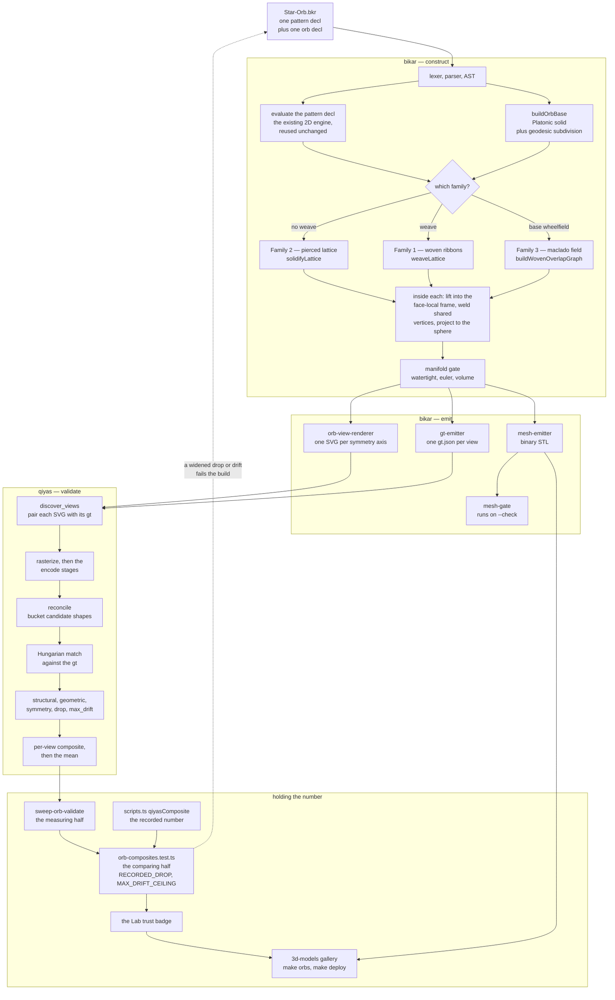

# The orb pipeline, source to badge

**Status:** Living map · **Date:** 2026-08-17 · **Repos:** bikar (construct + emit),
qiyas (validate), 3d-models (publish)

One `.bkr` file becomes a printable STL, a set of per-axis SVG views, a ground-truth
JSON, a score, and a badge in the Lab. That path crosses three repositories, and no
single repo's docs own it: [`orb-lab-design.md`](orb-lab-design.md) describes the
product end, bikar's `docs/architecture.md` the engine end, and
[`qiyas-wheelfield-validation-design.md`](qiyas-wheelfield-validation-design.md) the
scoring end. This file is the seam between them — the picture a reader needs before
any of the three make sense.

## What this document claims, and how the claims are checked

A diagram full of code pointers is a document full of things that can quietly stop
being true. This repo has already measured that failure: on 2026-08-02, 23 of 44
use-case pointers had drifted while every run reported *"all valid"*
([D-020](decisions-log.md)). So the split here is deliberate:

- **The diagram is for orientation.** Its nodes name stages and functions. It carries
  no line numbers and no `click` URLs, because a URL in a diagram node is checked by
  nothing.
- **The table under each lane is the truth.** Every row is an *anchored* pointer of the
  form `` `bikar:packages/core/src/kernel3d/weld.ts:L43 "export class VertexPool"` ``,
  the same syntax the use-case map uses: repo, path, line, and the literal that must be
  on that line. `.claude/skills/maintain-use-cases/validate.py` reads each one out of
  the named repo at the commit the map pins and fails if the literal is not in range —
  and when the target has moved, it says which line it moved to.

**No third pointer form was invented for this document.** The first draft of this file
used bare paths, on the reasoning that a stage has no literal to pin. That was wrong
twice over: the diagram names *functions*, which are exactly literals, and a bare path
only ever claimed the file exists — so a row could name a module whose function had
been deleted and still pass. Anchoring makes the row assert what the diagram says.

One row is deliberately still a bare path: `qiyas:docs/local-ci-runbook.md` postdates
this map's qiyas pin, so there is no line there to anchor against yet. A bare path is
resolved by `.claude/gates/doc_pointers.py` instead, which is a weaker check honestly
labelled rather than a stronger one faked.

What the diagram therefore does **not** assert: that the stages shown are the only
stages, or that a named function is the only entry point into its module. It shows the
path an orb actually takes, at the granularity where the names are stable.

## The map

### Reading the two edges that surprise people

**`gt-emitter` is on the bikar side.** The ground truth qiyas scores against is a
*product of the engine*, not an input qiyas brings. bikar states what it drew; qiyas
independently encodes the picture and the two are compared. Read the other way round —
as though qiyas held the answer key — the whole arrangement looks circular, and it is
the single fact readers get wrong most often.

**The dashed edge back to the source is what makes this a system.** `sweep-orb-validate.ts`
measures, `orb-composites.test.ts` compares that measurement against the number recorded
in `scripts.ts`, and a divergence fails the build. Without that edge this is a pipeline
that produces a number nobody is accountable to; with it, a geometry change that quietly
degrades a score cannot merge. Its own docstring calls the re-run *"a tripwire"*.

## Lane 1 — bikar, construct

| stage | pointer |
|---|---|
| declaration dispatch | `bikar:packages/core/src/dsl/evaluator.ts:L1268 "function evaluateOrbDecl("` |
| base solid, subdivision, duals | `bikar:packages/core/src/kernel3d/polyhedra.ts:L210 "export function subdivideGeodesic("` |
| face-local 2D ↔ 3D frame (`B8`) | `bikar:packages/core/src/kernel3d/face-frame.ts:L93 "export function makeFaceLift("` |
| vertex weld (`B8`) | `bikar:packages/core/src/kernel3d/weld.ts:L43 "export class VertexPool"` |
| Family 2 — pierced lattice (`B5`) | `bikar:packages/core/src/kernel3d/solidify-lattice.ts:L193 "export function solidifyLattice("` |
| Family 1 — over/under solve and ribbons (`B6`) | `bikar:packages/core/src/kernel3d/weave.ts:L557 "export function weaveLattice("` |
| Family 3 — maclado field | `bikar:packages/core/src/kernel3d/maclado-field.ts:L284 "export function buildMacladoField("` |
| Family 3 — welded woven overlap (`B7`) | `bikar:packages/core/src/kernel3d/maclado-woven.ts:L95 "export function buildWovenOverlapGraph("` |
| 2D over/under precedent the 3D solve reuses | `bikar:packages/core/src/kernel/strapwork.ts:L411 "export function detectCrossings("` |
| void polygons the lattice pierces | `bikar:packages/core/src/graph/face-extractor.ts:L298 "export function getBoundedFaces("` |

The branch at `B4` is a real fork in `evaluator.ts`, not a diagram convenience: a
`weave` statement routes to the ribbon path, a `base wheelfield` declaration routes to
a separate evaluator that never touches `inscribe` at all, and the absence of both
falls through to the pierced lattice.

`B8` is drawn as one node because all three solidifiers do the same three things —
each imports `makeFaceLift` from `face-frame.ts` and constructs a `VertexPool` from
`weld.ts`. It is a stage *inside* each solidifier, not a stage between them, and the
diagram compresses that.

## Lane 2 — bikar, emit

| stage | pointer |
|---|---|
| binary STL (`E1`) | `bikar:packages/core/src/render/mesh-emitter.ts:L17 "export function emitBinarySTL("` |
| per-axis orthographic SVG (`E2`) | `bikar:packages/core/src/render/orb-view-renderer.ts:L72 "export function renderOrbViewSVG("` |
| symmetry axes and front-cap projection | `bikar:packages/core/src/kernel3d/orb-views.ts:L39 "export function symmetryViewAxes("` |
| ribbon projection into a view | `bikar:packages/core/src/kernel3d/orb-ribbons.ts:L163 "export function projectRibbonPasses("` |
| ground truth per view (`E3`) | `bikar:packages/core/src/render/gt-emitter.ts:L1911 "export function emitGroundTruth("` |
| mesh gate behind `--check` (`E4`) | `bikar:packages/core/src/kernel3d/mesh-gate.ts:L88 "export function meshGate("` |
| the CLI that fans these out | `bikar:packages/cli/src/index.ts:L924 "case 'render': {"` |

The CLI's `--format` switch is where the fan-out is visible from a shell:
`--format stl` writes the mesh, `--format views` writes the SVG set. `--check` is what
turns the mesh gate on; without it an STL is emitted unexamined beyond the evaluator's
own watertight assertion.

## Lane 3 — qiyas, validate

| stage | pointer |
|---|---|
| view discovery (`Q1`) | `qiyas:src/qiyas/orb_validate.py:L104 "def discover_views("` |
| per-view scoring (`Q5`, `Q6`) | `qiyas:src/qiyas/orb_validate.py:L189 "def score_encoding_against_gt("` |
| shape reconciliation and bucketing (`Q3`) | `qiyas:src/qiyas/stages/detectors/reconcile.py:L184 "def reconcile("` |
| SVG-side primitives (`Q2`) | `qiyas:src/qiyas/stages/svg_primitives.py:L145 "def _read_bikar_metadata("` |
| symmetry stage | `qiyas:src/qiyas/stages/symmetry.py:L107 "def detect_symmetry("` |
| the envelope both sides type against | `qiyas:src/qiyas/schema.py:L564 "class Encoding(BaseModel):"` |
| running CI locally when Actions cannot | `qiyas:docs/local-ci-runbook.md` |

`reconcile` earns its own node rather than folding into the encode stages, because it
is where the last validator defect lived: three bucketing gates that all read bounding
boxes and scalars could not tell *one region found twice* from *two regions either
side of a shared edge*, and two rosette orbs carried a shortfall for three weeks that
was qiyas's, not bikar's ([D-035](decisions-log.md)).

Note what `Q5` implies about reading a single number. `geometric` is not monotone in
the input — an element moving further away can raise it — which is why `drop` sits
beside it and why the per-view gate counts rather than tolerances. The composite alone
also cannot see shape *type*, so a run can score 1.000 with most bands encoded as the
wrong primitive. Both facts are recorded at the definitions above; the diagram cannot
carry them, which is the honest limit of a diagram.

## Lane 4 — holding the number

| stage | pointer |
|---|---|
| the sweep that measures (`H1`) | `bikar:scripts/sweep-orb-validate.ts:L146 "QIYAS_IMAGE and QIYAS_DIR are both set"` |
| the test that compares (`H2`) | `bikar:packages/lab/tests/orb-composites.test.ts:L87 "const RECORDED_DROP"` |
| the drift ceiling that test holds | `bikar:packages/lab/tests/orb-composites.test.ts:L121 "const MAX_DRIFT_CEILING"` |
| the recorded composites (`H3`) | `bikar:packages/lab/src/scripts.ts:L63 "readonly qiyasComposite"` |
| the build target that publishes (`H5`) | `3d-models:Makefile:L223 "orbs:"` |
| the gallery design | [`orb-lab-design.md`](orb-lab-design.md) |

`sweep-orb-validate.ts` will not guess where qiyas comes from: it requires either a
pinned container image or an explicit sibling checkout, because *"a sweep against a
pinned qiyas and a sweep against working-tree qiyas are different claims."* That
refusal is the reason the recorded numbers mean something.

## What this map deliberately does not draw

- **Any number.** Composites, drops and drift ceilings live in the files above and in
  [`decisions-log.md`](decisions-log.md), where a change to one is a reviewed edit. A
  number copied into a diagram is a number with no owner — the failure this repo
  withdrew a printer-accuracy figure over.
- **The 2D pattern engine's internals.** `B2` is a single node standing for the whole
  girih/hankin/star/rosette evaluation, which the orb work reuses unchanged. It is
  bikar's `docs/language-reference.md` and `docs/architecture.md` that decompose it.
- **Open defects.** As of this date, two views in the sweep are surplus to the gt and
  the composites carry a recorded shortfall rather than a clean 1.000 across the set.
  That is a state, not a stage; it belongs in the tracker and the decisions log, and
  drawing it here would make the map wrong the moment it is fixed.
- **The CI wiring.** Which workflow runs which half is the subject of
  `qiyas:docs/local-ci-runbook.md`, which covers all three repos and changes on a
  different clock than the geometry does.
