# Plate-builder frontend experience — design doc (pre-implementation)

Status: **DRAFT, DESIGN ONLY — NOT A BUILD COMMITMENT.** This doc proposes a frontend
experience; it builds nothing and pins no schedule. Every path it gives for a *new*
verb, page, or module is a **target**, not a shipped file. The pivotal question — *where
the experience lives*, given the printer is LAN-only — **has been decided by Omar
(2026-09-17): a separate internal web app, served privately over Tailscale and carrying
its own skills/tooling, NOT a gh-pages static page** (§3, PB-1 → Option D). The build
itself is still unscheduled; what remains open is build-or-not and app scope, not the
architecture.

Provenance: produced 2026-09-17 by a subagent for Omar's request — *"a frontend 'plate
builder experience' where we can choose specific iteration of our prints, which ones to
add to same plate, query printer, see if enough room, get current time and grams, etc."*
Grounded in the in-repo design docs, the `bambu` CLI, the print-model skill, and the
web-grounded transport research read for §1; no new web research was performed, and where
a transport or `.3mf`-internal fact is not verified in this repo it is hedged as such
(K1/K2). This doc is a **frontend over data the sibling docs own** — it references their
schemas and flows and redefines none of them
([`CLAUDE.md`](../CLAUDE.md), "A migration never buys a fork",
[D-052](decisions-log.md)).

The owners this doc consumes and does not fork:

- **Iteration model + per-iteration estimates + reprint + plate↔iteration map** —
  [`print-metadata-and-reprint-design.md`](print-metadata-and-reprint-design.md)
  (iteration id `it-<sha12>` §2; the `estimates:` block §3.3; the reprint flow §4; the
  `objects[].iteration` mapping §5). The estimate-vs-actual split and the quantity-aware
  reprint rule are its PMR-3/PMR-4.
- **The existing prints frontend** —
  [`prints-tab-design.md`](prints-tab-design.md) (the record schema §4.1, the manifest
  the page reads §8, and the deliberate omission of cost/time/grams from the tab §11 /
  [D-046](decisions-log.md), amended 2026-09-17 to store AND show — see §1).
- **Arrangement, the owner gate, and the print judgement** —
  [`print-model-design.md`](print-model-design.md) (plate arrangement / grid-pack /
  rotate-to-fit §5.4; the owner-gate handoff §9; the two lifecycle axes §3) and the
  shipped [`print-model` skill](../.claude/skills/print-model/SKILL.md).
- **Transport + slicing + records** — the [`bambu` CLI](../.claude/skills/bambu/SKILL.md)
  ([`tools/bambu/README.md`](../tools/bambu/README.md)) and its verbs (`status show`,
  `slice plate`, `print list`, `validate record`, owner-gated `print send`).

---

## 1. What exists today, and the gap this fills

Almost every *datum* the plate builder needs is already designed or shipped; what does
not exist is the **composition surface** that lets a user assemble a new plate from
chosen iterations and see it costed and fitted before it goes to the owner gate.

| Capability the builder needs | Present today? | Where |
|---|---|---|
| A stable, browsable **iteration identity** (`it-<sha12>`, label) | designed | [`print-metadata-and-reprint-design.md`](print-metadata-and-reprint-design.md) §2 |
| **Per-iteration estimates** (grams, filament length, time) as a stored block | designed | [`print-metadata-and-reprint-design.md`](print-metadata-and-reprint-design.md) §3.3 |
| **Plate ↔ iteration mapping** (`objects[].iteration`, per-object `count`) | designed | [`print-metadata-and-reprint-design.md`](print-metadata-and-reprint-design.md) §5; [`prints-tab-design.md`](prints-tab-design.md) §4.1 (R8) |
| **List / project iterations & metrics** from the records | designed | [`print-metadata-and-reprint-design.md`](print-metadata-and-reprint-design.md) §6 (`print stats`); [`print-list.ts`](../tools/bambu/src/commands/print-list.ts) (`print list`) |
| **Live printer query** (state / AMS / progress) | **shipped**, read-only | [`bambu status show`](../tools/bambu/src/commands/print.ts); [`research/print-model-research.md`](research/print-model-research.md) Topic 2/7 |
| **Bed-fit arrangement** (grid-pack, rotate-to-fit) | designed | [`print-model-design.md`](print-model-design.md) §5.4 |
| **Slice a plate → `.3mf` + preview** | **shipped** | [`slice.ts`](../tools/bambu/src/commands/slice.ts) |
| **Owner-gated dispatch** (fail-closed, never auto-`--yes`) | **shipped** | [`print.ts`](../tools/bambu/src/commands/print.ts); [`print-model-design.md`](print-model-design.md) §9 |
| The prints **web page** the site already vendors | **shipped** (zero-state) | [`prints-tab-design.md`](prints-tab-design.md) §8 ([`build/prints_manifest.py`](../build/prints_manifest.py)) |
| **A composition surface** — pick iterations, add copies, live fit + grams + time, hand to the gate | **no** | — the gap this doc fills |

**The gap in one sentence.** The pieces to *identify*, *estimate*, *arrange*, *query*,
and *dispatch* a print exist as CLI verbs and stored data; nothing lets a user **compose
a new multi-iteration plate interactively** and watch it cost and fit as they build it.
The plate builder is that composition surface — a frontend *over* the owned data, not a
new engine.

**The K1 qualifier on estimates (carried, not stripped).**
[`prints-tab-design.md`](prints-tab-design.md) §11 / [D-046](decisions-log.md)
deliberately kept cost / print-time / filament-grams **off the prints-tab display** —
"the tab records what a plate taught, not what it cost." That is a decision about the
*tab's display surface*, not a ban on computing estimates. Omar's answer PMR-8
([`print-metadata-and-reprint-design.md`](print-metadata-and-reprint-design.md) §7)
reverses the display omission — *store AND show* — and **landed 2026-09-17 (PR #217):
D-046 is amended and estimates + MQTT actuals now surface on the tab.** This doc treats
"per-iteration estimates are surface-able" as a **given, now discharged**, and does not
re-decide it; the builder's live estimates panel (§6) is therefore unblocked (PB-7, §8).

---

## 2. The user journey

The experience is one loop: **browse iterations → add copies to a plate → watch fit +
grams + time update → hand the composed plate to the owner gate.** It reads throughout;
the only hardware write is downstream of the gate and outside this experience (as in
[`print-model-design.md`](print-model-design.md) §4).

```mermaid
flowchart TD
    A[Open plate builder] --> B[Browse iteration history: it-&lt;sha12&gt; + label + per-iteration estimates]
    B --> C[Pick an iteration, set copy count N]
    C --> D[Add to the plate selection]
    D --> E[Live panel updates: composite grams &#40;exact&#41; + composite time &#40;FLOOR&#41;]
    E --> F[Bed-fit advisory: rough grid-pack of footprints, rotate-to-fit hint]
    F --> G{Add more?}
    G -- yes --> B
    G -- no --> H[Query printer: bambu status show &#8594; state / loaded AMS / progress]
    H --> I{Bed free AND filament loaded matches?}
    I -- no / mismatch --> J[Surface as advisory; user revises selection]
    J --> B
    I -- ok --> K[Slice the REAL arrangement: bambu slice plate &#8594; .3mf + preview + EXACT time]
    K --> L[Validate the composed plate: bambu validate record / plate]
    L --> M[Owner gate: print owner-gate notice; show plan + preview + exact estimate]
    M --> N&#40;[STOP &#8212; dispatch is Omar's bambu print send, never auto --yes]&#41;
```

The journey has an honest seam at **E→K**: everything left of the slice (E, F) is a
*preview from stored per-iteration numbers* — additive-exact for material, a floor for
time (§6). The *exact* plate time and the *authoritative* bed fit only exist once the
real arrangement is sliced (K). The builder never presents the preview as the exact
answer (§6, PB-2; §5, PB-3).

---

## 3. Where it lives — the pivotal architecture fork (PB-1)

**This was the one-way-door decision; Omar decided it 2026-09-17 → Option D (§8).** It is
surfaced here in full because the printer's transport determines what a *web* frontend can
and cannot verify, and the repo's grain is to name what each option **verifies**, not only
what it costs ([`CLAUDE.md`](../CLAUDE.md), "Robustness over ease"). Options A–C below are
kept as the considered space that Option D supersedes — the record of *why* a served app,
not a static page, is the answer.

**The transport constraint.** The X2D is **LAN-only**: live status is first-party
**MQTT over TLS on 8883** (user `bblp`, the printer's **access code** as password), and
dispatch adds an **FTPS upload on 990** plus a signed MQTT control command — all
requiring the printer's Developer Mode / LAN Mode
([`research/print-model-research.md`](research/print-model-research.md) Topics 1–2;
[`tools/bambu/README.md`](../tools/bambu/README.md)). This repo's frontends ship as
**static gh-pages** ([`prints-tab-design.md`](prints-tab-design.md) §8). A browser on a
static page **cannot** reach the printer directly: it cannot open a raw MQTT/TLS socket
or an FTPS connection (neither is HTTP), the printer serves no CORS-permitting HTTP API,
and the access code is a **secret that must never reach a browser** (PB-5). So "query
printer / see if enough room / get current time and grams" cannot be served by a static
page alone — the *live* and *slice* steps need a process on the LAN that already holds
the credentials: the `bambu` CLI.

> **K10 — the transfer condition for the site's static-frontend pattern.** The gh-pages
> pattern ([`prints-tab-design.md`](prints-tab-design.md) §8) transfers to the *browse +
> compose + estimate* half of this experience **because** that half reads only
> checked-in data (the records manifest and stored per-iteration estimates) and computes
> only additive material — no network, no secret. It does **not** transfer to the *query
> printer / slice / dispatch* half, which needs LAN transport and the access code. The
> two halves are drawn apart for exactly this reason; a design that put the live half in
> the static page would be asserting a reachability the transport does not have.

> **The Tailscale resolution (Omar, 2026-09-17).** The constraint above is specifically a
> constraint on a **static gh-pages** frontend. It dissolves the moment the frontend is a
> **served app on a host that sits on the LAN** rather than a static page in a stranger's
> browser: then the browser talks plain **HTTP to the app**, and the **app** — not the
> browser — opens the MQTT/TLS and FTPS sockets to the printer and holds the access code
> **server-side** (PB-5 is satisfied by construction, the secret never leaving the host).
> The remaining objection to such an app — "an internal server is not something this repo
> exposes publicly" — is answered by **Tailscale**: the app is published only on the
> owner's **tailnet**, authenticated by Tailscale's identity, never on the public internet
> and never on gh-pages. This is why Option D supersedes the hybrid: it delivers the whole
> visual experience *and* every live capability from one place, with the credential surface
> reduced to a single private host.

Four placements were considered here (K2 — these four, not "the only possible
architectures"), each with what it *verifies*:

| Option | Shape | What it VERIFIES | What it costs / cannot verify |
|---|---|---|---|
| **D — Internal app on Tailscale (CHOSEN):** a **served** web app (its own UI + backend + skills/tooling) running on a LAN host, published privately over the **tailnet**; the browser talks HTTP to the app, the app talks MQTT/FTPS to the X2D and holds the access code server-side | The full visual browse/compose/estimate experience **and** every live capability Omar named — a real `status`, a real fit-slice, exact time — from one place, each labelled estimate-vs-actual; the secret stays on the host (PB-5) and the app is reachable only on the owner's tailnet | Not a public gh-pages page (by design — it is internal); a running host + a Tailscale-published service to build and keep up; more surface than a CLI verb, which is the cost paid for the visual experience Omar asked for |
| **A — Hybrid:** static gh-pages page for **browse + compose + estimate**, a **local `bambu` bridge** (a localhost server wrapping the CLI) for **query / slice / dispatch** | The page everyone can open shows history + additive grams + a fit *advisory* offline; the live half lights up only when the operator runs the bridge on the LAN | Offline: "these iterations exist and their material sums to X g" (from checked-in data). Bridge-on: "the printer is reachable, the real arrangement fits, exact time = T" (a real slice + a real `status`) — each half says which it proves | Two surfaces, split brain: a public page that can verify nothing live plus a localhost bridge; the operator runs a local process anyway, so Option D's single served app is simpler for the same reach |
| **B — CLI / TUI only:** the "frontend" is the `bambu` CLI extended with a `plate` verb group; composition happens in a terminal picker | Everything the CLI already can — a real `status`, a real slice, the real owner gate — with no new transport surface and no secret leaving the machine | Not a *visual* browse/drag experience; no shareable page for a gallery visitor; the repo's frontends are web pages, so this diverges from that grain |
| **C — Static-only composition:** the page is a pure planner (browse + compose + additive estimate + fit advisory) and **emits a spec** the operator feeds to the CLI for the live/slice/dispatch steps | The page verifies exactly the offline claims (identity + additive material + a rough fit); it makes **no** live claim and says so | Cannot query the printer or show exact time at all from the page — the "query printer / current time" parts of Omar's ask are answered only in the CLI, off-page |

**Decision (Omar, 2026-09-17): Option D — a separate internal app served over Tailscale,
with its own skills.** It is the *robust-and-simple* choice over the *cheap-and-easy* one
([`CLAUDE.md`](../CLAUDE.md)): one served app delivers the visual experience and every live
capability Omar named — *query printer, exact fit, exact time* — because the **app**, not a
browser, holds the access code (PB-5) and opens the LAN sockets, and Tailscale keeps it
private without putting it on gh-pages. The hybrid (Option A) reaches the same printer but
splits into a public page that verifies nothing live plus a localhost bridge the operator
must run anyway — two surfaces for one job, the fork a migration never buys. The cheap
option (embed live data in a static page, or fake it) verifies nothing and is not offered.
**The build is still unscheduled — this decision fixes the architecture, not a timeline.**

```mermaid
flowchart LR
    subgraph Tailnet [Internal app on the owner's tailnet &#40;Tailscale-authenticated&#41;]
      subgraph App [Served plate-builder app on a LAN host]
        P1[Browse iterations from manifest]
        P2[Compose selection + copy counts]
        P3[Additive grams / floor time]
        P4[Fit advisory &#40;rough grid-pack&#41;]
        B1[status show &#8594; state / AMS / progress]
        B2[slice plate &#8594; .3mf + exact time]
        B3[validate + owner gate]
      end
      Browser[Browser on the tailnet] -. HTTP .-> App
    end
    Manifest[(prints-manifest.json + stored estimates)] --> P1
    P2 --> P3 --> P4 --> B1 --> B2 --> B3
    App -- access code held server-side --- Printer
    Printer[[X2D over LAN: MQTT 8883 / FTPS 990]]
```



---

## 4. Data the builder reads (all cited, none redefined)

The builder is a projection over four owned data sources. It stores **no second copy** of
any of them (the C4 derivable-data hazard, [`CLAUDE.md`](../CLAUDE.md)):

- **Iteration identity + label** — `it-<sha12>` and its optional human handle, from the
  records, projected the way [`print-list.ts`](../tools/bambu/src/commands/print-list.ts)
  already projects records and the way
  [`print-metadata-and-reprint-design.md`](print-metadata-and-reprint-design.md) §6's
  `print stats --by iteration` aggregates them. The builder's browse list **is** that
  projection rendered; it does not maintain an iteration registry
  ([`print-metadata-and-reprint-design.md`](print-metadata-and-reprint-design.md) §3.1,
  "one store, projected").
- **Per-iteration estimates** — the `estimates:` block
  ([`print-metadata-and-reprint-design.md`](print-metadata-and-reprint-design.md) §3.3):
  `filament_g`, `filament_mm`, `print_time_s`, and their `source` (`slice-3mf` |
  `manual` | `~`). The builder shows the value **and its source honesty** — a `~`
  estimate renders as "unknown", never as zero (that doc's PMR-5).
- **Plate ↔ iteration map** — `objects[].iteration` and per-object `count`
  ([`print-metadata-and-reprint-design.md`](print-metadata-and-reprint-design.md) §5;
  [`prints-tab-design.md`](prints-tab-design.md) §4.1 R8). This is how the builder knows
  which existing plates already carry an iteration, and it is the shape the builder
  *writes* when it composes a new selection (a set of `{iteration, count}` rows).
- **Live printer state** — `bambu status show`'s report frame: `gcode_state`
  (IDLE/RUNNING/PAUSE/FINISH/FAILED), the AMS `ams[].tray[]` + external `vt_tray`
  (`tray_type`, `remain`; `-1` = unknown), and job progress
  ([`research/print-model-research.md`](research/print-model-research.md) Topics 2, 7;
  [`print-model-design.md`](print-model-design.md) §5.5). Read-only, and only via the
  bridge/CLI (§3), never the browser.

---

## 5. The bed-fit check

**Reuse, do not reinvent.** The authoritative arrangement is
[`print-model-design.md`](print-model-design.md) §5.4: libnest2d No-Fit-Polygon packing
(the nesting library BambuStudio/Orca use) over the part footprints, trying the four
angles 0/45/90/135° — the *rotate-to-fit* advisory Omar called out ("9 fit as-is;
rotating 45° fits 12"). That runs in the slicer / CLI, not the browser.

The builder therefore has **two fit surfaces**, and their honesty gap is load-bearing:

- **In-page fit ADVISORY (offline).** A rough 2-D grid-pack of each iteration's footprint
  bounding box against the bed rectangle — enough to say "this comfortably fits" or "this
  likely won't" as the user composes. It is *advisory only*.
- **Authoritative fit (slice-time).** The real NFP arrangement from `bambu slice plate`
  of the composed selection. Only this proves the plate fits and yields the exact time
  (§6).

> **K10 — the transfer condition for the fit heuristic.** §5.4's arrangement result
> transfers to the builder's *authoritative* fit **because** the builder invokes the same
> `slice`/nesting path on the same footprints. It does **not** transfer to the *in-page*
> advisory: a browser bounding-box grid-pack is a weaker check than NFP (it ignores
> concave interlock and true no-fit polygons), so it can only ever say "probably" and
> must be labelled advisory — porting the §5.4 confidence onto a bbox estimate would be
> the silent-porting hazard [`CLAUDE.md`](../CLAUDE.md) K10 warns of.

**Validator:** the in-page fit advisory is well-formed iff, for a composed selection, it
reports one of `{fits, tight, unlikely, must-slice-to-know}` and **never** reports
`fits`/`unlikely` as a guarantee — the authoritative verdict is the slice's.

PASS: a selection whose footprints' total area is a small fraction of the bed and whose
largest part is well within bed bounds renders `fits (advisory — confirm at slice)`.

FAIL: the *hard* case — a selection of oddly-shaped parts that *tile* by interlock — total
bbox area exceeds the bed so the grid-pack says `unlikely`, yet the real NFP arrangement
would nest them. The advisory must present `unlikely` as *advisory*, not as a refusal,
so the user can still slice and let the authoritative arrangement decide. (An aggregate
"bbox area > bed area" cannot discharge the per-arrangement claim that *these* parts
don't nest — K6/D2, [`CLAUDE.md`](../CLAUDE.md).)

---

## 6. The live estimates panel — grams exact, time a floor

As pieces are added, the panel updates composite **material** and **time**. The two are
**not** the same kind of number, and conflating them would be a K1 honesty failure.

**Composite material — additive and exact.** For a selection of `{iteration, count}`
rows, composite grams `= Σ (count × iteration.filament_g)` and composite length
`= Σ (count × iteration.filament_mm)`. This is exact because material is conserved
per copy: N copies of a piece deposit N × the unit's filament, whatever else shares the
plate ([`print-metadata-and-reprint-design.md`](print-metadata-and-reprint-design.md)
§3.3; the foundation's *single-piece estimation slice* — one copy sliced alone, cached
by iteration id, yields the additive unit numbers). The panel updates this live, exactly,
as rows change.

**Composite time — a FLOOR only, said so.** Summing per-piece unit times gives a **lower
bound**, not the plate time: a real multi-object plate adds inter-object travel and can
raise per-layer minimum times, so *plate time ≥ Σ unit times*
([`print-metadata-and-reprint-design.md`](print-metadata-and-reprint-design.md) §3.3
names the unit time as a per-piece floor). The panel therefore shows composite time as
**"≥ Hh Mm (floor — slice for exact)"**, with a one-click *slice the real arrangement*
action (§2, K) that replaces the floor with the slicer's exact prediction. It never
shows a summed number as *the* time (PB-2).

> **K10 — why material transfers additively and time does not.** The additive rule
> transfers to *grams/length* because per-copy material is independent of plate layout.
> It explicitly does **not** transfer to *time*, because time depends on the arrangement
> (travel, per-layer minimums) that the unit slice never saw. Writing this non-transfer
> down is the whole point of the honesty note.

**Estimate vs actual (PMR-4, carried).** Everything in this panel is an **estimate** —
from the `.3mf` / estimation-slice
([`print-metadata-and-reprint-design.md`](print-metadata-and-reprint-design.md) §3.3,
PMR-4). The **actual** grams/time (ground truth) come from the printer's MQTT device
report *after* a print and land on the record, not in the builder. The panel labels its
figures "estimate", and a completed print's actuals are shown (if present) beside them as
a separate, measured column — never overwriting the estimate with a guess.

**Validator:** the estimates panel is well-formed iff every material figure is presented
as exact-additive and every time figure is presented as a floor (`≥`), and any
`iteration.filament_g: ~` contributes "unknown", not 0, to the composite.

PASS: two rows, both with `filament_g` known, render composite grams as an exact sum and
composite time as `≥ …`.

FAIL: the *hard* case — one row's `filament_g` is `~` (never sliced). The panel must render
composite grams as "≥ known-sum, + 1 unknown" — **not** silently drop the unknown row to
make a clean total (which would under-report material and read as a measurement). An
aggregate "we have a grams column" cannot discharge the per-row claim that *this* row's
grams is known (K6/D2).

---

## 7. The dispatch path — stays owner-gated, almost always a re-slice

The builder composes a **new arrangement**, so it almost never qualifies for a
byte-identical replay. Per
[`print-metadata-and-reprint-design.md`](print-metadata-and-reprint-design.md) §4.2 /
PMR-3, exact replay of a stored `.3mf` is valid **only** for the *identical* plate with
its stored `.3mf` sha intact; **any** quantity or arrangement change forces a re-slice.
Composing a fresh multi-iteration plate *is* an arrangement change — so:

- **The builder's output is a re-slice**, not a replay. It resolves each selected
  iteration's recipe (`iteration.key`:
  source + params + slice_profile,
  [`print-metadata-and-reprint-design.md`](print-metadata-and-reprint-design.md) §3.2),
  arranges the requested copies (§5.4), and calls `bambu slice plate` to produce a
  **new** plate `.3mf` + preview. The one case that *is* a replay — the user reselects
  exactly one existing plate, unchanged — is delegated to
  [`print-metadata-and-reprint-design.md`](print-metadata-and-reprint-design.md) §4's
  `reprint` verb, not re-implemented here.
- **Validation then the gate.** The composed `.3mf` is checked
  (`bambu validate record` / `validate plate`,
  [`tools/bambu/README.md`](../tools/bambu/README.md)) and handed to the **existing
  owner gate** — the builder shows the plan + preview + *exact* (post-slice) estimate and
  **stops**. Physical dispatch stays the fail-closed
  [`bambu print send`](../tools/bambu/src/commands/print.ts)
  ([`print-model-design.md`](print-model-design.md) §9, Option A). The builder **never**
  passes `--yes`; the first filament and every send are Omar's call (memory
  *owner-gated-and-on-hold*).

> **K1 — carry the hedge on dispatch itself.** Live *dispatch* over LAN is **not yet
> ported** off the defunct griches MCP and, on X2D firmware, needs **signed** MQTT
> control commands ([`print-model-design.md`](print-model-design.md) §9;
> [`research/print-model-research.md`](research/print-model-research.md) Topic 1,
> tagged `[X2D-UNCONFIRMED — H2-proxy]` for the exact signing rule on X2D). So the
> builder is designed to be **complete and useful without dispatch**: composing a costed,
> fitted, validated plate handed to the gate is the whole deliverable, exactly as
> print-model's Option A is. When dispatch is ported, the gate gains a button; nothing
> in this design changes.

---

## 8. Decisions

Local ids (`PB-*`), scoped to this doc — **not** entries in
[`decisions-log.md`](decisions-log.md), which this doc does not touch; promote them there
only if the design is accepted. Each names the options, the recommendation (first), and
what it verifies.

| # | Decision | Options | Recommendation & why |
|---|---|---|---|
| **PB-1** | **Where the experience lives (the architecture fork)** | (d) internal app served over Tailscale, its own skills; (a) hybrid: static page + local `bambu` bridge; (b) CLI/TUI only; (c) static-only composition, live/slice off-page in the CLI | **(d) — DECIDED by Omar 2026-09-17.** A served app on a LAN host, published privately on the tailnet: the browser talks HTTP to the app, the app opens the MQTT/FTPS sockets and holds the access code server-side (PB-5), so it delivers the full visual experience *and* every live capability from one place — no gh-pages, no browser-held secret. (a) reaches the same printer but splits into a public page (verifies nothing live) + a localhost bridge the operator runs anyway — two surfaces for one job; (b) verifies all live claims but is not the visual experience asked for; (c) verifies only offline. **One-way-door, and made.** |
| **PB-2** | Composite time presentation | (a) show Σ unit times as a **floor** `≥ …` + a *slice-for-exact* action; (b) show a single "estimated time" number | **(a).** Plate time ≥ Σ unit times ([`print-metadata-and-reprint-design.md`](print-metadata-and-reprint-design.md) §3.3); (b) presents a lower bound as the answer — a K1 honesty failure. |
| **PB-3** | Bed-fit surface | (a) in-page **advisory** grid-pack + authoritative fit only at slice; (b) claim authoritative fit in the browser | **(a).** A browser bbox pack is weaker than NFP (§5, K10); only the real slice's arrangement is authoritative. (b) would over-claim reachability the browser lacks. |
| **PB-4** | Compose → build | (a) **re-slice** the composed arrangement; replay only the unchanged single-plate case (delegated to `reprint`) | **(a).** Any arrangement/quantity change forces a re-slice (PMR-3); a new multi-iteration plate is always such a change. Byte-identical replay is a different verb, not this one. |
| **PB-5** | Access-code / secret handling | (a) the **served app holds the access code server-side** (same env block the CLI reads, [`tools/bambu/README.md`](../tools/bambu/README.md)); the browser talks HTTP to the app, never to the printer; (b) put the code in the page | **(a).** The access code is the MQTT password; it must never reach a browser or stdout (memory *secret-check-no-stdout-leak*). Under PB-1 = Option D the app is the only holder, and the tailnet is the only place it is reachable. (b) verifies nothing and leaks a secret — not offered as viable. |
| **PB-6** | Iteration browse data source | (a) **project the records** (manifest / `print stats`); (b) a second iteration store the builder maintains | **(a).** Records are the single source of truth; a second store drifts on any hand-edit — the C4 derivable-data hazard ([`CLAUDE.md`](../CLAUDE.md)). |
| **PB-7** | Estimates surfacing dependency | inherit PMR-8 (store **and** show estimates) as given | **Satisfied — PMR-8 resolved 2026-09-17 (PR #217) = "store AND show".** The live panel (§6) needed PMR-8 to land "show", and it did (D-046 amended; estimates + MQTT actuals surface on the tab). No longer a blocker; kept here as the dependency that was discharged. |

### Owner decisions — resolved and still open

**Resolved (2026-09-17):**

1. **PB-1 — the architecture fork (pivotal, one-way-door). DECIDED → Option D:** a
   separate internal app served over Tailscale, with its own skills — not gh-pages, not a
   localhost bridge. The served app holds the access code and opens the LAN sockets; the
   tailnet keeps it private. (§3.)
2. **PB-7 — dependency on PMR-8. DISCHARGED:** PMR-8 resolved to "store AND show"
   (PR #217), so the live estimates panel §6 is unblocked.

**Still open (for Omar):**

3. **Build-or-not / sequencing.** This is design-only. Whether the plate builder is built
   at all, and whether before or after the print-metadata verbs (`reprint`, `stats`) it
   consumes ship, is a scope/priority call for Omar. (The architecture is settled; the
   timeline is not.)
4. **App scope + stack, once build is greenlit.** What the served app is concretely — the
   backend that wraps the `bambu` verbs (a thin HTTP service over `status`/`slice`/
   `validate`/gated `send`), the host it runs on, how it is published on the tailnet, and
   the shape of "its own skills" — is a follow-on design, flagged so it is not assumed.

---

## 9. Read against itself (K7)

- **The journey (§2) is buildable by the machinery cited.** Browse projects the records
  (§4, like `print list`), the estimate panel sums the stored `estimates:` block (§6),
  the fit advisory is a bbox pack with the authoritative fit deferred to `slice` (§5),
  and dispatch is the existing owner gate (§7) — no new engine, no forked store.
- **The architecture fork was stated as a fork, then decided (§3, PB-1 → Option D).** The
  doc laid out all four placements with what each verifies, and Omar chose the served
  Tailscale app (2026-09-17); §3, §8's PB-1, and the intro now agree on Option D and on
  *why* — a static gh-pages page cannot verify the live half, so a served app on the LAN
  does. The superseded options A–C are kept as the considered space, not hidden.
- **Grams-exact vs time-floor is consistent everywhere.** §2 (E→K seam), §6 (the panel),
  and PB-2 all say material is additive-exact and time is a floor until a real slice — no
  section shows a summed time as the answer.
- **Every claim carries its hedge (K1/K2).** The estimates omission was a *display*
  decision, now amended by PMR-8 (resolved "store AND show", PR #217), never a ban (§1);
  the four architecture options are "considered here", not "the only architectures" (§3);
  dispatch is unported and needs signed MQTT on X2D, tagged `[X2D-UNCONFIRMED]` (§7); the
  `.3mf` estimate members are the sibling doc's unverified-here probe (inherited, §4).
- **Transfer conditions are written where a rule is ported (K10).** The static-frontend
  pattern (§3), the arrangement heuristic (§5), and the additive rule (§6) each state
  what must hold for the port, and each names the half that does *not* transfer.
- **No rule ships without its counterexample.** The two Validators (§5 fit advisory, §6
  estimates panel) each carry a PASS and a *hard* by-design FAIL (the interlock-nests
  case; the unknown-grams row), per the repo's gate-with-a-self-test discipline — though
  this doc specifies no gate, it holds its own invariants to that bar.
- **Every backticked path resolves on disk or is a placeholder.** Files referenced exist
  (verified); new artifacts appear only as placeholder/bare forms (`bambu plate serve`,
  `it-<sha12>`), so no pointer is stale.
