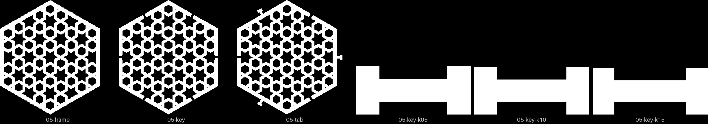
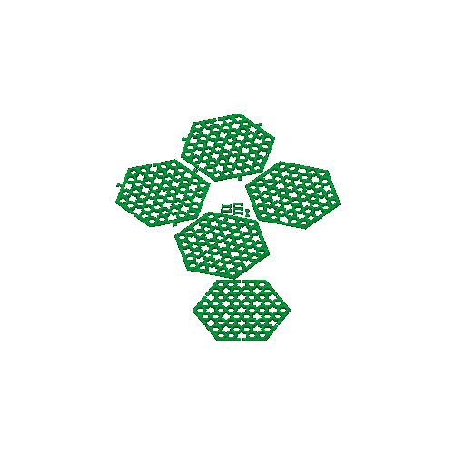
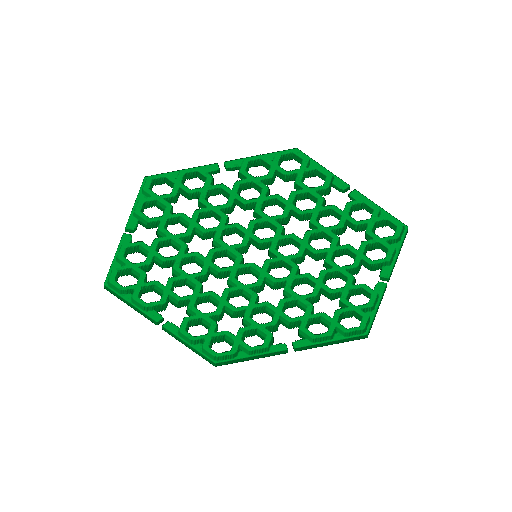
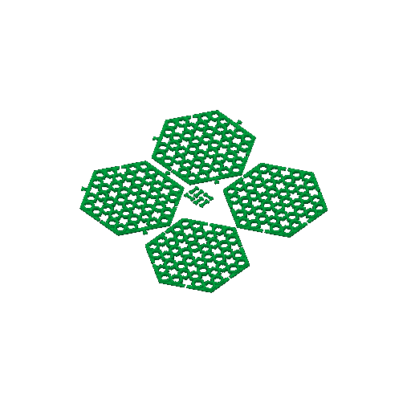

# minis-05 — the thin joins, side by side

**In short.** Three pairs of 80 mm CS-1 coasters: a plain pair, a pair held by loose
butterfly keys, and a pair held by tabs built into the coaster. There are also six keys at
three clearances, to find the one that is neither loose nor stuck. It answers which thin
join to build on, and it moves the dovetail-neck bet. **Fix one thing before you approve it:**
the slicer could not fit the plate on one bed. One of the two key coasters went onto a second
bed, so printing bed 1 alone would test the keys with no pair to put them in. The options are
below; my pick is to drop the plain pair.

## What it is

Recipe: [minis-05.yaml](minis-05.yaml). Everything is at size 80, height 1.4, the 2 mm strap.

- **Plain frame ×2** (`-minimal-frame-coaster`). Nothing holds the pair. It is the band the
  others are held to, 6.0 mm.
- **Butterfly-key coaster ×2** (`-minimal-key-coaster`, piece Coaster). A notch at each edge
  midpoint; band 5.7 mm.
- **Keys ×6** (piece Key). Two each at clearance 0.05, 0.10 and 0.15 mm.
- **Tab coaster ×2** (`-minimal-tab-coaster`, clearance 0.10). A tab into the neighbour's
  opening; band 5.8 mm.

Its other half is [minis-06](minis-06.md), the two dovetails. The joins and what each one is
for are in the [joins design](../design/coaster/coaster-borderless-joins-design.md).

## Why print it

- **The question:** which thin join holds a pair best, in the hand, next to today's plain
  band?
- **The bet it moves:** CAL-CST-06, the narrowest loaded neck that survives mating by hand. The
  key's waist and the tab's 2 mm neck both ride on it
  ([bets.md](../../.claude/skills/calibrate/bets.md)).
- **What it lets us decide:** the joins design's
  [open questions](../design/coaster/coaster-borderless-joins-design.md#8-open-questions-for-omar)
  1 (loose keys or built-in tabs) and 2 (do notches look wrong on a coaster used alone). The
  key ladder also gives the key file its clearance.
- **What to read off it:** the band of each pair; the pull feel of each key clearance, and
  whether a key falls out when one coaster is lifted; whether a coaster alone looks wrong; whether
  the tab's neck survives a few matings.

## Pictures

The review sheet: every coaster reads as the pattern, with the art filling the hexagon.
Openness is 0.47 for the frame, 0.43 for the key coaster and 0.45 for the tab; the keys are
solid bow-ties.

The slice as the recipe stands, on two beds. Bed 1 holds five coasters and the keys; bed 2 holds
the sixth coaster, a key coaster.

 

## Cost and risk

| | As the recipe stands | Without the plain pair |
|---|---|---|
| Beds | 2 | 1 |
| Time | 4 h 21 m + 56 m | 3 h 31 m |
| Filament | about 52 g | about 29 g |

Both columns are local slices from 2026-09-30 on the X2D preset, with nothing sent.

**Risk: watch.** The keys are about 8 × 4 mm and 1.4 mm tall: seven layers on a small
footprint. A key that lifts can be dragged by the nozzle, which is the kind of failure that
can hurt the machine, not only the print. Watch the first layer, and keep spaghetti detection
on. A key knocked loose is a failed key, not a reason to stop; one being dragged is. The 1.4 mm
frame and tab are thin too, but if they snap that is the answer we want, not a risk to the
machine.

## Fix before approval: the second bed

`bambu slice compose` packed ten objects on bed 1 and put the eleventh coaster on a bed 2.
`bambu validate sliced` reported "objects: 11" and did not mention the second bed. So a send
of bed 1 alone would have passed every check and printed a key coaster with no partner. Since
2026-09-30 the tools catch it: `slice compose` refuses this recipe and names the key coaster
on bed 2, and `validate sliced` reports "objects: 12" and "beds: 2" and fails. To keep two
beds, the recipe needs `beds: 2`.

| | As it stands, two beds | Drop the plain pair (my pick) | Move the plain pair to minis-06 |
|---|---|---|---|
| **Pros** | No recipe change; every pair on the plates | One bed, 3 h 31 m, 29 g; both key coasters print together; keeps minis-06's dovetail pair | One bed each; the plain pair still prints |
| **Cons** | Both beds must be sent, one run each; the key pair prints on two runs | The plain reference is the one CS-1 frame from [minis-04](minis-04.md), sliced on the fallback presets; the band is geometry, so the slice barely matters | minis-06 loses its dovetail control pair, the retest of the new slot against minis-04's "pegs too tight" |
| **What it leads to** | The recipe gets `beds: 2`, which the tools now check | ROI goes from 1.72 to about 2.6, so minis-05 moves to the top of the queue | minis-06's header already allows it; the slot retest waits for another plate |

## Your call

- [ ] **Approve without the plain pair** — I change the recipe and re-slice it, and the page
  goes to approved
- [ ] **Approve as it stands** — two beds, both sent
- [ ] **Approve with the plain pair moved to minis-06**
- [ ] **Hold** — say why in the notes

Notes:

## Timeline

| Date | What happened | Where it is written |
|---|---|---|
| 2026-09-26 | proposed — the recipe, with minis-06, as the KEY-1 plate | 3d-models #334 |
| 2026-09-30 | reviewed — review sheet read; local slice found the second bed | this page |
