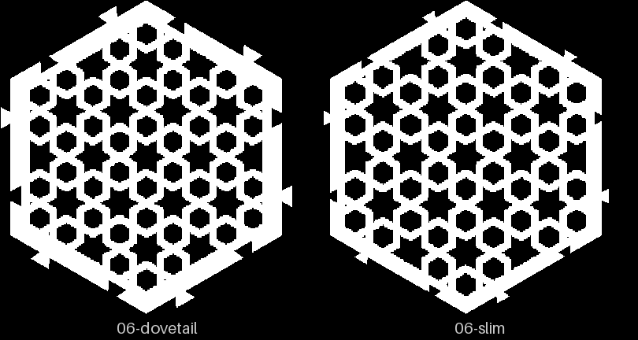
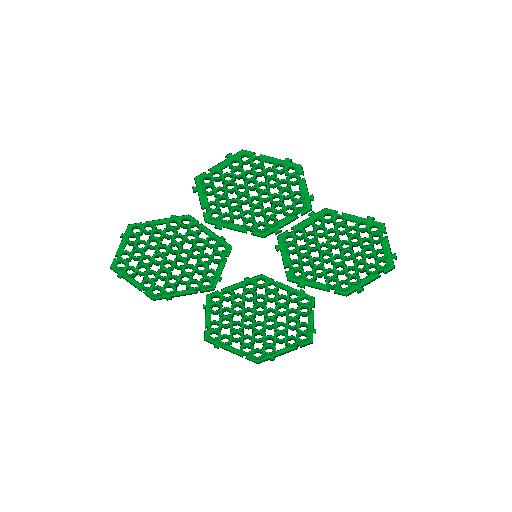

# minis-06 — the two dovetails

**In short.** Two pairs of 80 mm CS-1 coasters that lock together with dovetails: today's
dovetail and a slim one with a 2 mm neck. The slim band is 8.4 mm against the dovetail's
11.1 mm. It answers how thin the band can go before the neck gives, and whether bikar's new
slot fixes the "pegs too tight" of [minis-04](minis-04.md). It fits one bed in about 3½ hours,
and it is first in the queue.

## What it is

Recipe: [minis-06.yaml](minis-06.yaml). Size 80, height 1.4, the 2 mm strap, clearance 0.10.

- **Dovetail ×2** (`-minimal-pegs-coaster`). Band 11.1 mm, the same pair minis-04 printed;
  this time it has the true-offset slot from bikar #262.
- **Slim dovetail ×2** (same file, neck 2, depth 2, wall 2.1, the Lab's preset). Band 8.4 mm.

Its other half is [minis-05](minis-05.md), the thinner joins.

## Why print it

- **The question:** how thin can the outer band go and still hold a pair together by hand?
- **The bet it moves:** CAL-CST-06, the narrowest loaded neck that survives mating by hand. The
  slim neck is 2 mm ([bets.md](../../.claude/skills/calibrate/bets.md)).
- **What it lets us decide:** the joins design's
  [open question](../design/coaster/coaster-borderless-joins-design.md#8-open-questions-for-omar)
  3, the band width. It also checks the fix to minis-04's slot, which minis-04's pegs were too
  tight to test.
- **What to read off it:** does each pair slide together by hand; does the slim neck survive a
  few matings; do the pegs feel tight, right or loose at 0.10.

## Pictures

The review sheet: both read as the pattern. Openness is 0.38 for the dovetail and 0.43 for the
slim one, which gives back some of the pattern the wider band hides.

The slice: one bed, four coasters.

## Cost and risk

One bed, 3 h 29 m, about 31 g (local slice, 2026-09-30, X2D preset, nothing sent).

**Risk: ok.** Four flat 80 mm coasters with no small loose parts. A snapped slim neck is the
answer we want, not a risk to the machine.

## Your call

The dovetail pair repeats minis-04's. The recipe keeps it as the control for the slot fix. If
the minis-04 pair already tells you enough, the pair can go, and minis-05's plain pair could
take its place (see minis-05's second-bed options).

- [ ] **Approve as it stands** — both pairs
- [ ] **Approve the slim pair alone** — I take the dovetail pair off the recipe first
- [ ] **Hold** — say why in the notes

Notes:

## Timeline

| Date | What happened | Where it is written |
|---|---|---|
| 2026-09-26 | proposed — the recipe, with minis-05, as the KEY-1 plate | 3d-models #334 |
| 2026-09-30 | reviewed — review sheet read; local slice fits one bed | this page |
