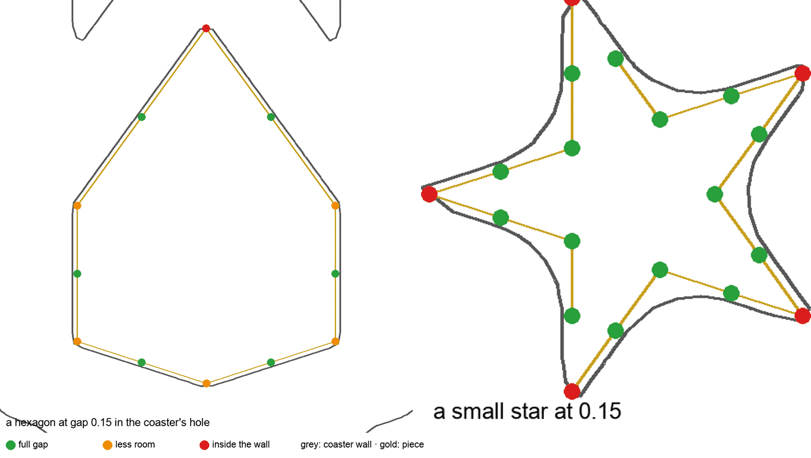
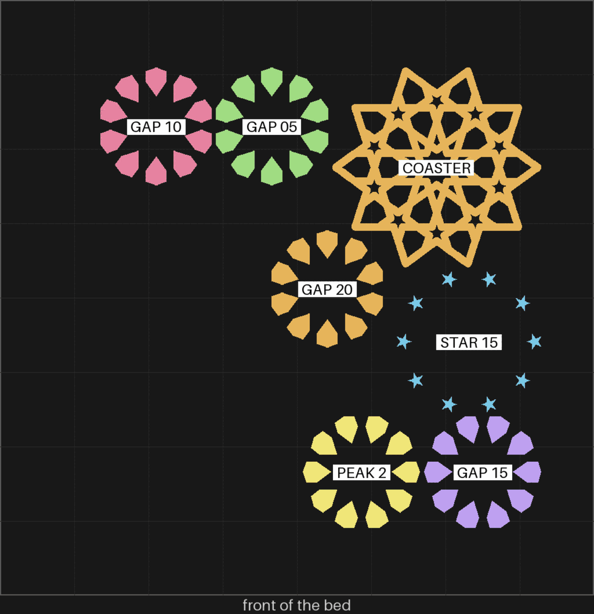
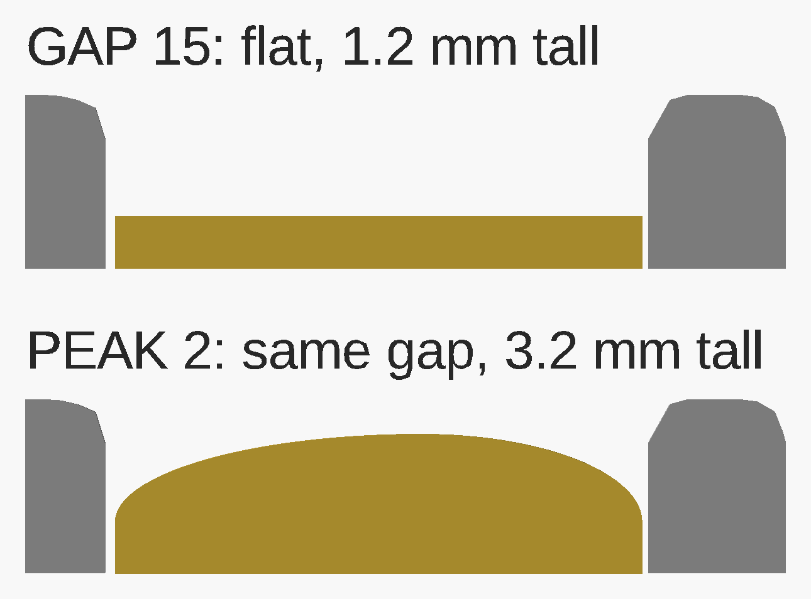
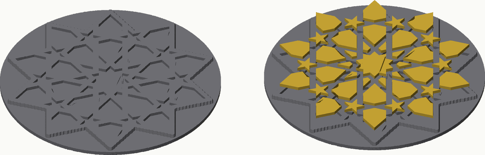

# sheets-04 — the gBV fit

**In short.** The gBV minimal coaster itself (the straps only, 4 mm tall, no base), printed once,
and loose pieces for one ring of it at four gaps per face: 0.05, 0.10, 0.15 and 0.20 mm. The small
five-point stars come at 0.15 only, to see whether their tips catch. One more set of the middle
ring at 0.15 has a 2 mm peak on top, so the flat and peaked pieces can be compared side by side
([D-091](../working-model/decisions-log.md#d-091--peaked-loose-pieces-2-mm-tried-on-the-gbv-fit-sheet)). It answers
[loose-pieces call 4](../design/coaster/loose-pieces-design.md#7-open-calls-for-omar) with the gaps that page proposes, read in
the real coaster rather than a test frame. The pieces come from bikar's `Loose-Fit-Coupon.bkr`
(bikar #296) and the plate is [`sheets-04.yaml`](sheets-04.yaml). One bed, about 62 minutes and 17 g.

**Measured before printing:** every piece keeps exactly its gap in the coaster's holes, star tips
included. See [the fit](#the-fit-in-the-coaster).

## What it is

The [sampler sheets design](../design/coaster/sampler-sheets-design.md#3-the-sheets), sheet 4. Unlike sheets 1 to 3 there is no card:
the coaster is the whole test, and the pieces sit loose in its holes.

| Code | What it is |
|---|---|
| COASTER | the gBV minimal coaster, once: 90 mm, 3 mm straps, 4 mm tall, no base |
| GAP 05, GAP 10, GAP 15, GAP 20 | the middle ring (orbit 2): ten six-sided pieces at radius 19.9 mm, at that gap per face |
| STAR 15 | the next ring out (orbit 3): ten small five-point stars at radius 28.3 mm, at 0.15 |
| PEAK 2 | the middle ring again at 0.15, each piece with a 2 mm peak: the same wall, then a low round dome up to the middle |

The pieces are 1.2 mm thick, so in the 4 mm coaster they sit below the top and the fit is read on
the walls. The peaked set is 3.2 mm in the middle, still under the top. The rings were read off `bikar bands`. The gap is taken off the piece, so one coaster
takes every set. Each set is its own plate item and goes in its own bag straight off the plate,
labelled with its code, because the sets look alike. The bed map below says which set is where.

Changed 2026-10-02 at Omar's ask: the first version printed the coupon's frame, a 2 mm round slab
with the straps on it and a pocket in every cell. From above it reads as a plain disk; the real
coaster is the better test, and it takes less filament (15 g against 22, in the same 56 minutes).

## Why print it

- **The question:** at which gap does a piece drop in by hand and stay put, and do the star tips
  catch at the default?
- **The bets it moves:** CAL-FIT-01 (the gap ladder) and CAL-HOL-01 (how much a printed hole
  shrinks) ([bets.md](../../.claude/skills/calibrate/bets.md)).
- **What it lets us decide:** loose-pieces call 4, and the gap the F3 openwork frame reuses
  ([D-090](../working-model/decisions-log.md#d-090--lines-and-loose-pieces-in-two-colors-true-edges-first)).
- **What to read off it:** for each bag, drops in / pressed in / will not go; tips catch or not.
  For PEAK 2, also whether 2 mm reads as the look you wanted in the hand
  ([the peaked-pieces page](../working-model/feedback-requests/2026-10-02-peaked-pieces.md)),
  and whether the dome prints clean.

## The fit in the coaster

Every piece keeps exactly the gap it was given, at every corner, so the sheet measures the gap and
nothing else. Measured on the coaster from bikar main and the pieces at mid height, 2026-10-02.
Room is the distance from a piece corner to the nearest coaster wall; below zero would mean the
corner is inside the wall.

| Set | Least room | Corners inside the wall |
|---|---|---|
| GAP 05 | +0.050 mm | none of 120 |
| GAP 10 | +0.100 mm | none of 120 |
| GAP 15 | +0.150 mm | none of 120 |
| GAP 20 | +0.200 mm | none of 120 |
| STAR 15 | +0.150 mm | none of 200 |
| PEAK 2 | +0.150 mm | none of 120 |

It did not start that way. The first slice of this plate traced the coaster's holes on a grid,
and a wall drawn between two grid points cuts straight across a sharp corner. The holes came up
to 0.25 mm further in at a hexagon's points and blunted the star tips, so only GAP 20 cleared:
GAP 05 had 48 of its 120 corners inside the wall, GAP 10 had 22, GAP 15 had 6, and the stars 34
of 200, all at the tips. Printed that way, the sheet would have measured the mismatch, not the
gap. bikar #297 now cuts each hole on its exact outline, the face moved in by half a strap, the
same outline the pieces are cut from. A piece fits the real coaster by construction, and a test
in bikar reads every corner so the holes cannot drift back.

## Pictures

The bed as it will print, front edge at the bottom, each set named where it landed. The four hexagon
rings and the peaked ring look much the same from above, so bag them by this map. It is drawn from the sliced plate by
`print_review.py bed`, from the bed map compose writes beside the plate.

The two kinds of piece side by side, cut through the middle of one hexagon in its hole, true
scale: a flat GAP 15 piece on top, a PEAK 2 piece below. Grey is the coaster's straps, gold the
piece. The peaked piece keeps the same 1.2 mm wall and the same gap, then rises in a low round dome
to 3.2 mm in the middle, still under the coaster's 4 mm top. A cut across the piece the other way
looks the same.

The coupon's frame and its 41 loose pieces at 80 mm, all five rings at 0.15 mm, from the first
version of this plate: the frame alone on the left, the pieces lifted above their pockets on the
right. The pieces on this plate are the same; the frame is no longer on it. The odd sliver is the
drawing, not the mesh. The smallest piece is 2.4 mm across at its narrowest, and still 2.3 mm at
the loosest gap, 0.20.

## Cost and risk

One bed, 62 minutes, about 17 g (local slice of the plate, 2026-10-02, X2D preset and PLA Basic, no
slicer warnings, nothing sent).

**Risk: watch.** The pieces are the smallest things we would have printed, and a small piece that
comes loose can be dragged across the bed. The X2D's own failure detection covers that, so it is
not a separate yes before the print
([D-092](../working-model/decisions-log.md#d-092--failure-detection-is-the-printers-job-not-a-per-plate-yes)).

## How it was built

- The coaster: bikar's `gBV_JTt3Kxk-minimal-coaster.bkr` (CS-13), unchanged; since bikar #297 its
  holes are cut on their exact outline. It passes the mesh check: one closed body, 10.7 cm³.
- The pieces: bikar's `Loose-Fit-Coupon.bkr` (bikar #296) copies the gBV construction unchanged and
  keeps its size and strap, so the gap is read on the pieces the gBV coaster will have. It stands
  on the loose-piece output of bikar #292, whose pocket walls follow the outline exactly: the gap
  measured on every CS-1 piece is 0.150 mm all round.
- Every piece passes the mesh check: each hexagon set is ten bodies, 8.97 mm across at its
  narrowest at 0.05 and 8.67 mm at 0.20; the stars are ten bodies, 2.10 mm.
- The peaked set: the same file with `peak 2` (bikar #298). It passes the mesh check: ten bodies,
  3.2 mm tall, 8.77 mm across at its narrowest. Nothing has printed with a peak yet.
- The first peaked slice had a flat top. A 2 mm peak is lower than these hexes are from edge to
  middle, and the curve stopped part way in, leaving a flat lid over about 80% of each piece's top.
  bikar #299 makes a low peak a round dome that closes in the middle; the side cut above is drawn
  from the fixed pieces, and the plate is sliced on them.
- The plate gives each set a `label:`, and `bambu slice compose` writes the bed map from it.

## Your call

Two things, kept apart: whether to print it, and the printer question that comes with it.

- [x] **Approve as it stands**
- [ ] **Hold** — say why in the notes

Separately, loose-pieces call 4 asked for a yes to failure detection on and the first layer
watched for this plate.

**Decided 2026-10-02:** not a per-plate question, the X2D does its own failure detection →
[D-092](../working-model/decisions-log.md#d-092--failure-detection-is-the-printers-job-not-a-per-plate-yes)

Notes:

## Timeline

| Date | What happened | Where it is written |
|---|---|---|
| 2026-10-01 | proposed — designed as a sampler sheet; waits on the build listed above | the [sampler sheets design](../design/coaster/sampler-sheets-design.md) |
| 2026-10-01 | sliced — the file landed (bikar #296); local slice fits one bed, 56 minutes, 22 g, with a bed map | this page |
| 2026-10-02 | sliced — reworked at Omar's ask, the minimal coaster in place of the frame; 55 minutes, 15 g; the holes measured smaller than the pockets, only GAP 20 clears | this page |
| 2026-10-02 | sliced — re-sliced on the coaster with exact holes (bikar #297); every set keeps its full gap; 56 minutes, 15 g | this page |
| 2026-10-02 | approved — as it stands, by Omar on this page (ticked before the peaked set was added) | this page |
| 2026-10-02 | sliced — PEAK 2 added at Omar's call ([D-091](../working-model/decisions-log.md#d-091--peaked-loose-pieces-2-mm-tried-on-the-gbv-fit-sheet)), the middle ring at 0.15 with a 2 mm peak; 62 minutes, 17 g | this page |
| 2026-10-02 | sliced — re-sliced after bikar #299, which fixed the peaked pieces' flat top; both kinds of piece shown side by side, PEAK 2 keeps its full gap; 62 minutes, 17 g | this page |
| 2026-10-02 | approved — again, by Omar on this page, as it stands with both prints and the fixed peak; the failure-detection yes is still open | this page |
| 2026-10-02 | reviewed — Omar answered the failure-detection box: it is the X2D's own, not a per-plate yes; nothing is left blocking the print but the send | [D-092](../working-model/decisions-log.md#d-092--failure-detection-is-the-printers-job-not-a-per-plate-yes) |
