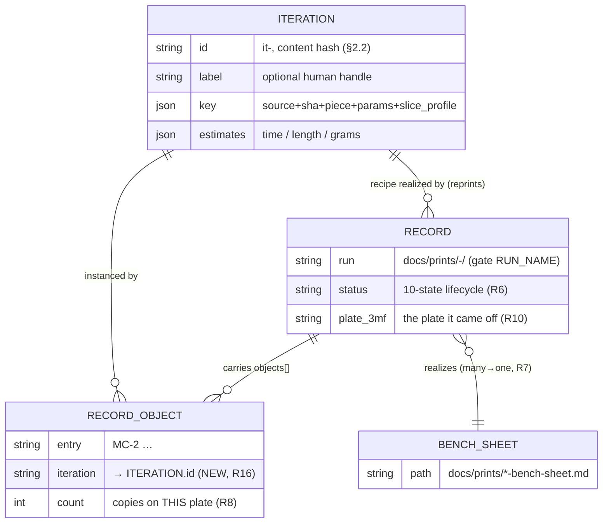

# Print metadata, per-iteration config, reprint & metrics — design doc (pre-implementation)

Status: **DRAFT, mostly NOT BUILT.** Every path this doc gives under
`tools/bambu/src/commands/` or `.claude/gates/` for a *new* verb, field, or rule is a
**target**, not a shipped file — this doc proposes changes, it does not make them. What
already exists is audited in §1 and is not re-specified here. **One exception, shipped
2026-09-21:** the post-print `actuals` block and the `bambu print capture` verb that
writes it (§3.3.1 "Shipped") — the iteration id, reprint, estimates, and metrics remain
targets.

Provenance: produced 2026-09-17 by a subagent for Omar's request — *cataloging +
reprint of a liked iteration, good `--help`, per-iteration / per-`.3mf` metadata,
good naming conventions, a YAML config per iteration, per-iteration feedback,
plate↔iteration mappings, and metrics (how many times a piece / iteration was
printed)*. Grounded in the in-repo files read for §1 (the prints gate, the `bambu`
CLI verbs, the two shipped design docs, the bench sheet); no new web research was
performed, and where a `.3mf`-internal fact is not verified in this repo it is
hedged as such (§3.3, K2/K10). The schema owner is
[`prints-tab-design.md`](prints-tab-design.md); the lifecycle owner is
[`print-model-design.md`](print-model-design.md). This doc **references** both and
proposes only *additive* fields, verbs, and gate rules — it forks neither
([`CLAUDE.md`](../CLAUDE.md), "A migration never buys a fork",
[D-052](decisions-log.md)).

---

## 1. What exists today

The print-metadata surface is already substantially built. The one-line summary:
**the record schema, its gate, and the `bambu print list`/`slice`/`validate` verbs
all exist; what is missing is a stable *iteration identity*, a reprint verb, an
estimates block (time / length / grams), and a metrics view.** Detail:

| Capability | Present? | Where |
|---|---|---|
| Per-run record schema (geometry + process + outcome + photos) | **yes** | [`prints-tab-design.md`](prints-tab-design.md) §4.1; enforced by [`.claude/gates/prints_gate.py`](../.claude/gates/prints_gate.py) |
| "A version is a `(geometry, process)` pair" — the identity concept | **yes** | [`prints-tab-design.md`](prints-tab-design.md) §3 |
| Geometry identity pins (`objects[].source`, `source_sha256`, `pins.bikar_ref`, `piece`, `params`) | **yes** | [`prints-tab-design.md`](prints-tab-design.md) §4.1; gate rule R1 |
| Process identity (nine-field `profile` block) | **yes** | [`prints-tab-design.md`](prints-tab-design.md) §4.1; gate `PROFILE_FIELDS` |
| Repeated-element multiplicity (`objects[].count`) | **yes** | [`prints-tab-design.md`](prints-tab-design.md) §4.1 (R8) |
| Feedback block (`feedback: {symptom, cause, next}`) | **yes, per-record** | [`prints-tab-design.md`](prints-tab-design.md) §4.1 (R9/R11) |
| `photos[]` with sha256 + cross-record uniqueness | **yes** | gate rule R2 |
| Sheet ↔ print mapping (many prints → one bench sheet) | **yes** | `sheet:` key, gate rule R7 |
| Ten-state lifecycle (`draft`…`abandoned`) + freshness rules | **yes** | [`print-model-design.md`](print-model-design.md) §3.1; gate R6, R10–R14 |
| Record dir naming `docs/prints/<YYYY-MM-DD>-<slug>/` | **yes** | gate `RUN_NAME`; draft staging under `.bambu/records/<date>-<slug>/` ([`records.ts`](../tools/bambu/src/records.ts)) |
| Cataloging / list verb (`print list`, `--how`, filters, `--json`) | **yes** | [`print-list.ts`](../tools/bambu/src/commands/print-list.ts) |
| Slice a model to a `.3mf` (`slice plate`, preset-name resolution) | **yes** | [`slice.ts`](../tools/bambu/src/commands/slice.ts) |
| Record validation verb | **yes** | `validate record` ([`validate.ts`](../tools/bambu/src/commands/validate.ts)) |
| Record scaffold on dispatch (`print send --record`) | **yes** | [`print.ts`](../tools/bambu/src/commands/print.ts) + [`records.ts`](../tools/bambu/src/records.ts) |
| **Post-print `actuals` capture (GUI prints → a counted draft, `print capture`)** | **yes, shipped 2026-09-21** | [`actuals.ts`](../tools/bambu/src/actuals.ts) + [`print.ts`](../tools/bambu/src/commands/print.ts) `capture` verb; §3.3.1 "Shipped" |
| Owner-gated dispatch (fail-closed, `--yes`/TTY confirm) | **yes** | [`print.ts`](../tools/bambu/src/commands/print.ts); [`print-model-design.md`](print-model-design.md) §9 |
| **Stable iteration id (a piece at a param-set + slice profile, re-derivable)** | **no** | — the gap (§2) |
| **`.3mf` ↔ its recipe (params + slice-profile inputs) stored per record** | **partial** | record names the `.3mf` (`plate_3mf`, R10) but not the params/profile inputs that produced it |
| **Print estimates: time, filament length, grams** | **no — deliberately omitted from the tab UX today** | [`prints-tab-design.md`](prints-tab-design.md) §11 names *cost / print time / filament grams* out of scope for the tab; `slice` reports only the `.3mf` file size in KB ([`slice.ts`](../tools/bambu/src/commands/slice.ts)) |
| **Reprint verb (resolve a liked iteration → owner gate)** | **no** | the gap (§4) |
| **Plate ↔ iteration links (each on-plate object → its iteration id)** | **no** | `objects[]` pins geometry but carries no iteration id (§5) |
| **Metrics ("how many times printed piece / iteration X?")** | **no** | the gap (§6) |

**The K1 qualifier on estimates.** [`prints-tab-design.md`](prints-tab-design.md) §11
does not say "never capture grams"; it says the *prints tab UX* deliberately does not
*display* cost / print time / filament grams, because "the tab records what a plate
taught, not what it cost." That is a decision about the **tab's display surface**
(owned by [D-046](decisions-log.md)), not a ban on *storing* a slice-time estimate for
reprint and planning. This doc proposes storing estimates as an additive per-iteration
block (§3.3) and treats *whether they surface in the tab* as an open owner decision
(PMR-8, §7) rather than silently overturning §11.

---

## 2. The iteration model and naming

### 2.1 An "iteration" is the existing `(geometry, process)` version — given an id

[`prints-tab-design.md`](prints-tab-design.md) §3 already defines the unit of identity:
a "version" is **not** a version string but the pair *(geometry identity, process
identity)* that together determine what a plate can teach. Omar's "iteration" is that
same unit — a **piece at a specific parameter set and slice profile** — plus the two
things §3 stopped short of: a *stable id* to name it by, and the machinery to *reprint*
and *count* it. So this doc does **not** introduce a parallel concept (that would be the
fork [`CLAUDE.md`](../CLAUDE.md) forbids); it names the one that already exists.

> **K10 — the transfer condition.** §3's `(geometry, process)` pair was defined to
> answer *"can two plates teach the same number?"* (calibration). Reusing it as a
> *reprint key* transfers **because** the same tuple that determines what a plate
> teaches also determines what a re-slice would produce: identical geometry pins +
> identical slice inputs ⇒ a deterministic identical plate. The one field the
> reprint use adds beyond §3's pair is the **slice-profile inputs** (the preset
> *display names* `slice` consumes, §3.2) — because those are not re-derivable from
> the nine-field process `profile` alone (a `slicer_profile` name is one of the nine;
> the machine + filament preset names are not).

### 2.2 The iteration id — content-addressed, human-labelled

An iteration id must be (a) **stable** — the same recipe yields the same id across
sessions and machines; (b) **re-derivable** — computable from data the record already
pins, so it cannot drift from what it names; and (c) **collision-safe** — two different
recipes never share an id. The repo already uses exactly this discipline for geometry
(gate R1 hashes the bikar blob at a pinned commit). Apply it to the whole recipe:

- **`iteration.id`** = `it-<sha12>` where `<sha12>` is the first 12 hex of the
  sha256 over the canonical JSON of the **iteration key**:
  `{source, source_sha256, piece, params, slice_profile}` (defined in §3). This is
  content-addressed: change any param or preset and the id changes, exactly as a new
  version should; reprint the *same* recipe and the id is stable.
- **`iteration.label`** — an optional human handle (`keyhole-r3`, `clip-fit-tight`).
  Advisory only, never the identity; two records may relabel the same `it-<sha12>` and
  the id still binds them. A label is to an iteration what `plate:` is to a record.

A content hash, not a monotonic `@vNN` counter, is recommended in PMR-1 (§7): a counter
needs a central allocator and two concurrent sessions collide on it (the exact failure
that produced the D-055 decision-id collision, memory *decision-id-collision-recurred*);
a content hash needs no allocator and is the repo's standing identity pattern.

### 2.3 Naming conventions — reconciled with what ships

Three names are in play; only the last is new. The first two are **gate-enforced and
must not change**:

| Thing | Convention | Owner |
|---|---|---|
| Record dir | `docs/prints/<YYYY-MM-DD>-<slug>/` (draft: `.bambu/records/<date>-<slug>/`) | gate `RUN_NAME` — **unchanged** |
| Photo files | `photos/<name>` listed in `photos[]` with sha256 | gate R2 — **unchanged** |
| `.3mf` filename | recommended `<slug>__<it-sha12>.3mf` | **new convention (advisory)**, §3.2 |
| Iteration id | `it-<sha12>` (+ optional label) | **new**, §2.2 |

A record is one **print event**; an iteration is a **recipe** that many events can
realize. So the iteration id is a *field inside* records, never the record dir name —
a piece with many iterations over time is many records, and one iteration reprinted
five times is five records that share one `iteration.id`. Embedding `<it-sha12>` in the
recommended `.3mf` filename makes a stored plate self-identifying: given a loose
`keyhole__it-9f3c1a2b4d5e.3mf` you can recover which iteration it is without opening it.
The `.3mf` name is *advisory* (unlike the dir name it is not gated) because the artifact
may be large/gitignored and named by an external slicer run.

---

## 3. The per-iteration YAML config

### 3.1 Additive to the record, not a second file

The record's `index.md` frontmatter is already YAML and already owns the geometry pins,
the process profile, the objects, the readings, and the feedback. An iteration config is
the *reusable recipe* — params + slice inputs + produced `.3mf` + estimates — that a
record realizes. Two placements were considered (PMR-2, §7); the recommended one is an
**additive `iteration:` (and `estimates:`) block inside the existing record
frontmatter**, because a separate `docs/prints/iterations/<id>.yaml` registry would
duplicate the geometry/process pins the record already owns — two code paths that can
disagree, the exact fork [`CLAUDE.md`](../CLAUDE.md) and [D-052](decisions-log.md)
forbid. Records that share an `iteration.id` carry identical recipe fields, and a
proposed gate rule (R15, §3.4) checks that consistency so the id cannot lie.

"A YAML config per iteration" is thus satisfied by the record frontmatter *being* that
YAML, plus a derived view (`bambu print iterations`, §6) that projects the distinct
iterations out of the records — one store, projected, exactly as `print list` already
projects records through the gate's read-only `--list` seam
([`print-list.ts`](../tools/bambu/src/commands/print-list.ts)).

### 3.2 The `iteration` block — worked example

The block below is **additive** to the §4.1 schema. Everything above `iteration:` is the
existing schema (abbreviated here — the owner is [`prints-tab-design.md`](prints-tab-design.md)
§4.1, not this doc); `iteration:`, its per-object echo, and `estimates:` are the new fields.

```yaml
# --- existing §4.1 schema (abbreviated — owned by prints-tab-design.md) ---
run:      2026-09-14-plate1-machine-card
plate:    "Plate 1 — Machine Card"
status:   printed
plate_3mf: keyhole__it-9f3c1a2b4d5e.3mf     # R10 — the plate this came off (new naming, §2.3)
profile:                                     # the nine-field process identity (unchanged)
  machine: "Bambu Lab X2D"
  material: "PLA Basic"
  # … spool, nozzle_mm, nozzle_type, layer_mm, slicer_profile, ambient_c, instrument …
pins:
  bikar_ref: 8dda702fc943d1876c56fe14b5b608ed53ea51e8
objects:
  - entry:         MC-2
    source:        bikar:patterns/Coupons/Machine-Card.bkr
    source_sha256: fdc100884e34c0aeffc517a5335d3df2ce79d718c9ee8a31a7f4330643d0a0e4
    piece:         keyhole
    count:         2
    params:        {}
    iteration:     it-9f3c1a2b4d5e           # NEW — which iteration THIS on-plate object is (§5)

# --- NEW additive blocks ---
iteration:                                   # the recipe this plate realizes (the "config per iteration")
  id:    it-9f3c1a2b4d5e                      # content hash over the iteration key (§2.2); re-derivable
  label: keyhole-r3                           # optional human handle; advisory, never the identity
  key:                                        # the exact tuple the id hashes — so the id is checkable
    source:        bikar:patterns/Coupons/Machine-Card.bkr
    source_sha256: fdc100884e34c0aeffc517a5335d3df2ce79d718c9ee8a31a7f4330643d0a0e4
    piece:         keyhole
    params:        {}                          # the bikar --param overrides that define this version
    slice_profile:                            # the preset DISPLAY NAMES `slice` consumes (one spelling, §3.5)
      settings:  "Bambu Lab X2D 0.4 nozzle;0.20mm Standard @BBL X2D"   # --settings (machine;process)
      filament:  "Bambu PLA Basic @BBL X2D 0.4 nozzle"                 # --filament
  produced:                                   # the .3mf this recipe sliced
    path:   keyhole__it-9f3c1a2b4d5e.3mf       # named, not resolved (may be gitignored/large — like R10)
    sha256: 3f9c…                              # of the .3mf bytes, so a replay can verify it is unchanged
estimates:                                    # slice-time PREDICTIONS (§3.3) — not measured outcomes
  source:          slice-3mf                   # where these came from: slice-3mf | manual | ~
  print_time_s:    5417                        # seconds, as the slicer predicted
  filament_mm:     4820                         # length, mm
  filament_g:      14.4                          # grams — see §3.3 on sourcing; ~ when unknown
  confirmed_by:    ~                            # a measured spool-delta later, if ever; ~ until then
```

### 3.3 Estimates — time, length, and grams (the honest bit)

Grams is **blank today** for a concrete reason: `bambu slice` reports only the sliced
`.3mf`'s file size in KB ([`slice.ts`](../tools/bambu/src/commands/slice.ts)); nothing
in the pipeline reads a filament weight. A sliced `.3mf` is a zip whose `Metadata/`
holds a plate preview and the plate gcode — verified in this repo
([`print-model-design.md`](print-model-design.md) §2 names the Metadata/plate_1.png
preview member; [`research/print-model-research.md`](research/print-model-research.md)
Topic 7 names the Metadata/plate_X.gcode member). BambuStudio is *documented elsewhere*
to also embed
per-filament weight/length and a time prediction in the sliced `.3mf`.

> **K2 — an unsearched claim, hedged.** The exact archive member and field names that
> carry filament weight/length/time in an **X2D** `.3mf` are **not verified in this
> repo** — only the preview and gcode members are (above). So the estimate parser
> (PMR-4) MUST be built as a *de-risk probe first* — slice one real X2D plate, open the
> `.3mf`, and record the actual member/field names in
> [`research/print-model-research.md`](research/print-model-research.md) — before any
> code hard-codes a path. Until that probe lands, `estimates.filament_g` is legitimately
> `~` and `estimates.source: ~`, and the record is still well-formed.

Sourcing options, recommended order (PMR-5, §7):

1. **`slice-3mf`** — parse the sliced `.3mf` for the slicer's own prediction. Preferred:
   the number is produced by the same slice that made the plate, so it cannot drift from
   it. Blocked only on the de-risk probe above.
2. **`manual`** — the operator types a figure from the Studio GUI slice summary. The
   honest fallback while (1) is unbuilt; marked `source: manual` so it is never mistaken
   for a parsed value.
3. **`~` (absent)** — unknown, and *said* to be unknown. Never a fabricated zero.

`estimates.confirmed_by` is left `~` unless a real post-print spool-delta ever measures
it — carrying the qualifier that a slicer prediction is a prediction, not a weighing.
Estimates are per-**iteration** (they depend only on geometry + slice inputs, which the
iteration key fixes), so all records sharing an `iteration.id` carry identical estimates;
R15 (§3.4) checks that.

### 3.3.1 Estimate vs actual, and per-piece vs per-plate (PMR-3 / PMR-4 resolved 2026-09-17)

Two distinctions §3.3 above collapsed, separated after Omar's answers. Conflating either
fabricates precision, which the bench-sheet rule forbids
([`plate-1-bench-sheet.md`](prints/plate-1-bench-sheet.md)).

**Estimate (pre-print) vs actual (post-print) — different fields, different sources.**

- **`estimates`** — the *pre-print prediction*, from the sliced `.3mf`'s own numbers
  (PMR-4 option (a), still behind the §3.3 de-risk probe) or from a single-piece
  estimation slice (below). It exists *before* the plate is dispatched, which is what the
  owner gate and the plate-builder frontend (tracked separately) need. It is a
  prediction, and stays labelled as one.
- **`actuals`** — the *post-print ground truth*, from the printer's **MQTT device
  report** (PMR-4 answer, Omar 2026-09-17), read over the same first-party MQTT transport
  `status show` already proves ([`status.ts`](../tools/bambu/src/commands/status.ts)).
  This is what the machine actually consumed — measured, not attributed, the repo's
  standing bias. It populates the `estimates.confirmed_by` field §3.3 left open, closing
  the loop: predicted X g, the device reported Y g.

MQTT reports an actual only *after* a print, so it cannot be the pre-print estimate — the
estimate stays the `.3mf`/estimation-slice number until the plate runs, then the MQTT
actual lands *beside* it. R15 (§3.4) governs `estimates` only (the prediction is
geometry-fixed, so it is identical across records sharing an iteration id); `actuals` are
per-**record** (two prints of one iteration can consume slightly different grams — spool
and moisture variance) and R15 does not constrain them.

> **Shipped (2026-09-21) — the `actuals` block + `bambu print capture`.** The metadata gap
> this closes: a record was only ever written by `print send --record`, so a print started
> from the **Studio GUI** was seen by nothing and `docs/prints/` under-counted what we
> actually printed (the record count *is* the metric, §6 — no separate counter, C4-safe).
> `bambu print capture` reads the printer's MQTT device report (**read-only** — a `pushall`
> status read, print-safe like `status show`; **no owner gate**, nothing is dispatched) and
> scaffolds a DRAFT under `.bambu/records/` carrying an `actuals:` block, which the operator
> fills and promotes to `docs/prints/` exactly as a `--record` draft.
> - **Honesty (the design's Validator, K1/K2).** [`buildActuals`](../tools/bambu/src/actuals.ts)
>   is a pure function that fills a field ONLY from a frame key that carried it: the
>   state/progress/layer/temperature keys `status show` already reads live off the X2D are
>   `filled`; **filament-consumed grams is `unconfirmed`** — not observed on the X2D report,
>   so it is *never* fabricated, and the verbatim frame is persisted to `device-report.json`
>   beside the record so the first real print (#63) settles the field name **with no code
>   change** (the same [X2D-UNCONFIRMED]-then-confirm discipline the dispatch payload uses).
>   `estimates.confirmed_by` therefore stays `~` until that field is confirmed — the loop is
>   wired, not yet closed on grams.
> - **No new gate rule (measure a rule before gating, [`CLAUDE.md`](../CLAUDE.md)).** The
>   block is additive frontmatter; [`prints_gate.py`](../.claude/gates/prints_gate.py) reads
>   required keys and ignores extras, so a captured draft passes with only the expected
>   placeholder-provenance findings until the operator pins real objects. When a real capture
>   exists, a rule over `actuals` can be added against *that* ground truth.
> - **Tests.** [`actuals.test.ts`](../tools/bambu/src/actuals.test.ts) (PASS: a running
>   frame; FAIL-guard: an idle frame fabricates nothing) and the capture-emission cases in
>   [`records.test.ts`](../tools/bambu/src/records.test.ts).

**Per-piece vs per-plate — the estimation slice.** A `.3mf` is a whole plate and may hold
several products (§5), so a whole-plate `.3mf` cannot answer "how much does *this one
piece* cost." The primitive that can:

> A **single-piece estimation slice** slices one copy of a piece *alone on the bed*, only
> to read its unit numbers. It is a fixture — **never dispatched** (not a plate we would
> print) — cached by the piece's `iteration.id` (slice-once, reuse).

What it yields, with the hedge each number carries (K1):

- **Filament length & grams — additive and exact for the piece's own extrusion.** A piece
  lays the same object filament whether alone or crowded, so `N copies ⇒ N × unit` holds
  for the material the *objects* consume. The hedge (K1): plate-level overhead — a
  prime/wipe tower, a purge on a filament change, the plate skirt/brim — is **not**
  per-piece and is counted once at the plate, never multiplied per copy. On a
  single-material plate that overhead is small; across a filament change it is real.
- **Time — a per-piece floor, not exact.** A real multi-object plate adds inter-object
  travel and can raise per-layer minimum-time waits, so `plate time ≥ Σ(unit times)`. An
  honest plate *time* needs slicing the real arrangement; the unit time is a lower bound
  and a composition hint, not a plate total.

So `plate estimate = Σ(unit estimates) + plate overhead` — exact for grams, a floor for
time. The grams math (area = π·(d/2)², volume × density) is already realized in
[`validate.ts`](../tools/bambu/src/commands/validate.ts)'s `deriveGrams`, so the
estimation slice reuses one spelling of it, not a second. This primitive feeds the reprint
quantity flow (§4.4): `reprint --qty n` can show the material a new quantity costs
*before* it re-slices, because grams compose.

### 3.4 Proposed gate rules (additive to `prints_gate.py`, NOT built here)

These are **proposals** for [`.claude/gates/prints_gate.py`](../.claude/gates/prints_gate.py),
to be implemented in a later PR alongside their `--self-test` by-design-failure fixtures
(the repo's graduation rule: a rule ships with the counterexample it rejects,
[`CLAUDE.md`](../CLAUDE.md)). They read the same parsed frontmatter as R1–R14 — one
parser, no second gate file.

- **R15 — an iteration id matches its key.** When an `iteration:` block is present,
  `iteration.id` must equal `it-` + the first 12 hex of sha256 over the canonical JSON
  of `iteration.key`. And every record sharing an `iteration.id` must carry the same
  `iteration.key` and the same `estimates` (an iteration is one recipe; two records
  claiming one id with different recipes is the id lying).
  - **PASS:** two records, both `iteration.id: it-9f3c1a2b4d5e`, identical `key` and
    `estimates`, and the id equals the hash of that key.
  - **FAIL (the hard case):** two records share `it-9f3c1a2b4d5e` but one has
    `params: {gap: 0.10}` and the other `params: {gap: 0.15}` — the aggregate "both
    parse" cannot discharge it; the differing key means one of them is mis-labelled.
    (K6/D2: an aggregate cannot discharge a per-part claim.)
- **R16 — an on-plate object names a known iteration (when iterations are in use).**
  When any `objects[].iteration` is set, its value resolves to an `iteration.id`
  declared by *some* record in the tree (this record or another), so a plate cannot
  point an object at an iteration that was never recorded.
  - **PASS:** `objects[].iteration: it-9f3c1a2b4d5e` and a record declares that id.
  - **FAIL:** `objects[].iteration: it-deadbeef0000` named by no record's
    `iteration.id`.

Both are **optional-when-absent**: a record with no `iteration:` block is exactly as
valid as today, so this is a pure migration — old records keep passing (R15/R16 fire
only on the new fields), and the schema is extended, not replaced (PMR-2, no fork).

### 3.5 One spelling of the slice profile

`bambu slice` takes the profile as `--settings "machine;process"` and `--filament
"<name>"`, resolving each preset *display name* to its bundled JSON
([`slice.ts`](../tools/bambu/src/commands/slice.ts); [`bambu` SKILL](../.claude/skills/bambu/SKILL.md)).
`iteration.key.slice_profile.settings` / `.filament` store **those exact strings**, so a
reprint feeds them straight back to `slice` with no re-spelling. This is deliberately
*not* re-derived from the nine-field `profile` block: the process `profile` is the
record's calibration identity (what it printed under, for a reading); `slice_profile` is
the *slicer input* (what to type to reproduce the `.3mf`). They overlap (both name the
process preset) but are not the same fact, and the reprint path needs the machine +
filament preset names that `profile` does not carry (§2.1, K10).

---

## 4. The reprint flow

### 4.1 The verb

**`bambu print reprint <iteration-id>`** (a new verb beside `print list` / `print send`
in `tools/bambu/src/commands/`) resolves a liked iteration and re-parks it at the same
owner gate a fresh print stops at — it **never dispatches**. It is the read-and-stage
verb; the physical send stays the existing owner-gated `print send`
([`print.ts`](../tools/bambu/src/commands/print.ts); [`print-model-design.md`](print-model-design.md)
§9, Option A).

```
bambu print reprint it-9f3c1a2b4d5e            # resolve → stage a draft record at the owner gate
bambu print reprint keyhole-r3                  # a label also resolves (→ its it-<sha12>)
bambu print reprint it-9f3c1a2b4d5e --qty 6     # sole-product-on-plate → re-slice 6 copies (§4.4)
bambu print reprint it-9f3c1a2b4d5e --re-slice  # rebuild the .3mf from the recipe instead of replaying
bambu print reprint it-9f3c1a2b4d5e --dry-run   # show what it WOULD stage, touch nothing
```

Resolution reads the records (single source of truth, via the gate's `--list`
projection extended to carry `iteration`): find the record(s) with that id, take the
newest as the canonical recipe.

### 4.2 Replay the stored `.3mf`, or re-slice from the recipe?

This is the load-bearing choice (PMR-3, §7). Both verify something; neither is free:

| Approach | What it does | Verifies | Costs |
|---|---|---|---|
| **Replay (default)** | reuse the stored `iteration.produced.path` `.3mf`, checking its sha256 | *byte-identical* to what printed before — the strongest "same plate" guarantee | the `.3mf` must still exist (may be gitignored/pruned); if absent, replay cannot proceed |
| **Re-slice (`--re-slice`)** | re-run `bambu slice` from `iteration.key` (source + params + slice_profile) | the recipe is *self-sufficient* — proves the plate is reproducible from stored inputs alone | depends on the slicer version + bundled presets being unchanged; a slicer upgrade can shift the `.3mf`, so it is not guaranteed byte-identical |

**Recommendation:** **replay by default, re-slice as an explicit `--re-slice`
fallback**, and when replaying, verify the stored `.3mf` against
`iteration.produced.sha256` and refuse on mismatch (a changed `.3mf` under a stable id
is the same lie R15 guards against). If the `.3mf` is gone, `reprint` says so and
suggests `--re-slice`. This makes the strong guarantee (byte-identical) the default and
the weaker-but-more-portable one (reproduce-from-recipe) a stated, opt-in choice — the
robustness-over-ease framing [`CLAUDE.md`](../CLAUDE.md) asks for: each path names what
it verifies.

**This default is narrowed by §4.4.** "Replay by default" holds **only when the request
is byte-identical to the stored plate** — same products, same arrangement, same quantity.
A change in quantity or product selection is not a case for the `--re-slice` fallback; it
makes re-slice the *correct* path, chosen automatically. §4.4 is the rule that decides
which case a given `reprint` is.

### 4.3 Staging and the gate

`reprint` scaffolds a **new draft record** under `.bambu/records/<today>-<slug>/`
(reusing [`records.ts`](../tools/bambu/src/records.ts)'s scaffolder), inheriting the
resolved `iteration.id`, `key`, `estimates`, and the geometry pins, and setting
`status: sliced` with the resolved `plate_3mf`. The operator fills readings/photos after
the print and promotes it to `docs/prints/` exactly as today — so a reprint is countable
(§6) as a distinct event that shares the prior iteration's id. `reprint` stops there; it
prints the owner-gate notice and hands off to `print send`, never passing `--yes`.

```mermaid
flowchart TD
    A["bambu print reprint <id>"] --> B[Read records via gate --list, resolve the iteration id/label]
    B --> S{Was it the sole product on its plate? §4.4}
    S -- one of several --> E[Re-slice just this piece at --qty]
    S -- sole product --> Q{--qty equals the stored plate's copy count?}
    Q -- no, different quantity --> E
    Q -- yes, identical plate --> C{Stored .3mf present AND sha256 matches?}
    C -- yes, default --> D[Replay: reuse the stored .3mf byte-for-byte]
    C -- no / --re-slice --> E
    E --> F{Slice produced a .3mf?}
    F -- no --> G[Error: recipe no longer slices — report why]
    F -- yes --> D
    D --> H[Scaffold a NEW draft record, inherit iteration.id + key + estimates]
    H --> I[Owner gate: print owner-gate notice]
    I --> J([STOP — dispatch is Omar's `print send --yes`])
```

### 4.4 Sole-product detection and quantity (PMR-3, refined by Omar 2026-09-17)

A `.3mf` is a whole plate, and the plate that carried a liked iteration may have held
*other* products (§5). So "reprint this iteration" is ambiguous until we know *how much of
what* — and the answer decides replay-vs-re-slice deterministically, without a guess:

1. **Sole-product detection.** From the plate's `objects[]` (§5), the target iteration was
   the plate's *sole product* iff every object on that plate resolves to the same
   `iteration.id`. `reprint` computes this from the record — no new store, no second
   source of truth (§6).
2. **Quantity.** When the iteration *was* the sole product, `reprint` asks for the copy
   count (`--qty <n>`, else it prompts). The stored plate already *is* some quantity — its
   `Σcopies` (R8/§6) — so the operator may ask for that many again, or a different number.
   When the iteration was *one of several* products, there is nothing to replay for "just
   this piece," so `--qty` is required (defaulting to the copies it had on that plate).
3. **The replay-vs-re-slice rule falls out of (1)–(2):**
   - **Exact replay is valid only for the identical plate** — the target was the sole
     product, `--qty` equals the stored `Σcopies`, *and* the stored `.3mf` is present with
     a matching sha256 (§4.2). Only then does the byte-identical guarantee hold.
   - **Any change forces a re-slice** — a different `--qty`, or pulling the sole product
     off a plate that also held other products. The arrangement changes, so the stored
     `.3mf` no longer describes what will print; `reprint` re-slices the piece at the
     requested quantity, packing it with the print-model arrangement / grid-pack
     ([`print-model-design.md`](print-model-design.md) §arrangement; PMR-2, no new
     packer). Replaying a mixed plate to get one piece, or replaying the old count to get
     a new one, would print the *wrong thing* — the footgun this rule removes.

So the §4.2 default is *narrowed, not contradicted* (K7): replay is the default **only**
on a byte-identical request; a quantity or product-selection change makes re-slice the
correct path chosen automatically, and the `--re-slice` flag remains only the explicit
override for "re-slice even though replay is valid" (e.g. after a slicer upgrade). Because
grams compose (§3.3.1), `reprint --qty n` can show the material a new quantity will cost
*before* it re-slices — the estimation slice and the quantity-aware reprint are the same
machinery seen twice.

> **Validator (PMR-3):** `reprint` replays iff *sole-product ∧ qty = stored Σcopies ∧
> `.3mf` present ∧ sha256 matches*; otherwise it re-slices.
> **PASS:** a plate whose only object is `it-9f3c…` ×4, `reprint it-9f3c… --qty 4` with the
> stored `.3mf` intact → byte-identical replay.
> **FAIL (the hard case):** the *same* plate, `reprint it-9f3c… --qty 6` → the arrangement
> is not the stored one, so a replay of the `.3mf` would print 4, not 6 — the rule must
> re-slice, and a "the `.3mf` exists and its sha matches" check alone (an aggregate on the
> file) cannot discharge the per-request quantity claim.

---

## 5. Plate ↔ iteration mapping

A plate (one record) carries `objects[]`; each object already pins one distinct
geometry with a `count` of copies (R8). The single additive field is
**`objects[].iteration`** — the `it-<sha12>` that on-plate object is an instance of
(shown in §3.2, gated by R16). This extends the existing repeated-element mapping rather
than replacing it: `count` stays the physical multiplicity of that object *on this
plate*, and `iteration` names *which recipe* those copies are.

The relationships that then hold:

- **One plate → many objects → each one iteration** (a plate mixes iterations: a
  `keyhole-r3` beside a `clip-fit-tight`).
- **One iteration → many plates** (the same recipe printed on plate 1 and again on
  plate 4 = two records whose `objects[].iteration` share an id) — this is what makes
  "how many plates carried iteration X?" answerable (§6).
- **One iteration → many records over time** (reprints, §4) — the reprint-count axis.



Note the iteration is *derived from and stored in* records (§3.1) — the ER diagram shows
the logical relationships, not two physical stores. There is one store (the records);
`ITERATION` is the projection §6's view materializes from them.

---

## 6. Metrics

The question "how many times did we print piece / iteration X?" is answered by **reading
the records** — the single source of truth — never a second counter store (which would
drift the moment a record was edited by hand). This is the same call
[`print-list.ts`](../tools/bambu/src/commands/print-list.ts) already makes: project
through the gate's read-only `--list` seam. Two shapes were considered (PMR-6, §7):

**Recommended: a new `bambu print stats` verb**, plus a `--count-by` on the existing
`print list`. `stats` reads every record and aggregates:

```
bambu print stats                       # all metrics, default grouping
bambu print stats --by iteration        # rows: iteration id/label → #records, #plates, Σcopies
bambu print stats --by piece            # rows: piece → #iterations, #records, Σcopies
bambu print stats --by source           # rows: bikar source path → …
```

The counts, defined precisely so they cannot equivocate (K2 — each is a claim about a
named set of records):

- **#records** = records whose `objects[].iteration` (or `piece`/`source`) matches — the
  number of *print events* (reprints included; a reprint is a distinct record, §4.3).
- **#plates** = distinct records carrying the group on any object (for an iteration this
  equals #records; for a *piece* it is records carrying any iteration of that piece).
- **Σcopies** = Σ of `objects[].count` across matching objects — the physical part
  count, honoring repeated-element multiplicity (R8).

Because reprints scaffold a fresh record sharing the prior `iteration.id` (§4.3), the
reprint tally is just #records for that id — no separate reprint field is stored (it
would be a derivable-count-stored-twice, the C4 hazard [`CLAUDE.md`](../CLAUDE.md) warns
of). When a written metric ever lands in a *committed doc* (e.g. a records summary), it
must carry a `<!--count:NAME-->` tag so `counts_gate.py` pins it to the tool that prints
it; a metric printed live by `stats` needs no tag (it is computed, not typed).

---

## 7. `--help` quality — assessment and improvements

**Current state.** Help is auto-generated by commander from each `.command().description()`
and `.option()` — usable, but three gaps:

1. **The `print` group description is stale and over-broad.** It reads *"dispatch +
   print control via the MCP (owner-gated)"* ([`print.ts`](../tools/bambu/src/commands/print.ts)),
   yet `print list` touches no hardware and is not owner-gated, `print send` now uses
   first-party MQTT for status (the MCP note is partly stale, [`index.ts` header](../tools/bambu/src/commands/print.ts)),
   and after this doc the group also gains `reprint` and `stats`. A reader of `bambu
   print --help` is told the whole group is an owner-gated MCP surface, which is a K7
   contradiction with its own subcommands.
2. **No examples.** No verb carries a worked invocation; the known-good X2D slice trio,
   the reprint call, and the `--how`/`--json` shapes live only in the SKILL doc
   ([`bambu` SKILL](../.claude/skills/bambu/SKILL.md)), not at `--help`.
3. **The owner gate is stated only in `send`'s one-line description**, not surfaced
   where a reader scanning the group would see it.

**Improvements (proposed, PMR-7):**

- Rewrite the `print` group description to name what it is: *"catalog, reprint, dispatch
  and control prints. `list`/`stats`/`reprint` are local and safe; `send`/`pause`/
  `stop` move real hardware and are owner-gated."*
- Add `.addHelpText("after", …)` to each of `slice`, `print send`, `print reprint`, and
  `print stats` with one real example apiece (the X2D trio for `slice`; an `it-<sha12>`
  resolve for `reprint`; a `--by iteration` row for `stats`; the dry-run for `send`).
- Put the owner-gate warning in the `reprint` help too, since `reprint` ends *at* the
  gate and a reader must know it stops rather than sends.
- Keep every example a single allow-listable command (no `cd &&`, no pipes) — the
  one-command discipline the [`bambu` SKILL](../.claude/skills/bambu/SKILL.md) already
  states.

---

## Decisions

Each names the options, the recommendation (first), and the reasoning. The repo's
standing biases apply: **a migration over a fork**, **a gate over a new tool**, and
**robust-and-simple over cheap-and-easy** ([`CLAUDE.md`](../CLAUDE.md)). These ids are
local to this doc (`PMR-*`); they are **not** entries in
[`decisions-log.md`](decisions-log.md), which this doc does not touch — promote them
there if and when the design is accepted.

| # | Decision | Options | Recommendation & why |
|---|---|---|---|
| PMR-1 | Iteration id shape | (a) content hash `it-<sha12>`; (b) monotonic `<piece>@vNN` | **(a).** No central allocator, so concurrent sessions cannot collide (the D-055 / *decision-id-collision-recurred* failure); re-derivable, matching gate R1's existing hash-at-a-commit identity discipline. |
| PMR-2 | Where the iteration config lives | (a) additive `iteration:` block in the record frontmatter; (b) a separate `docs/prints/iterations/<id>.yaml` registry | **(a).** (b) duplicates the geometry/process pins the record already owns — two paths that can disagree, the fork [D-052](decisions-log.md) forbids. Extend the schema; project the registry (§6). |
| PMR-3 | Reprint: replay vs re-slice | (a) replay stored `.3mf` by default, `--re-slice` opt-in; (b) always re-slice; (c) always replay | **(a), resolved & refined (Omar 2026-09-17, §4.4): quantity-aware.** Replay verifies *byte-identical*; re-slice verifies *reproducible-from-recipe*. A `.3mf` is a whole plate, so `reprint` first detects whether the target was the plate's *sole product* and asks `--qty`; replay is valid **only** on a byte-identical request (sole product, qty = stored Σcopies, `.3mf` sha intact), and any quantity/product change re-slices automatically. `--re-slice` stays the override for "re-slice even when replay is valid." |
| PMR-4 | Grams / estimate sourcing mechanism | (a) parse the sliced `.3mf` (`slice-3mf`); (b) MQTT device report; (c) manual entry only | **Resolved (Omar 2026-09-17): (b) for the post-print ACTUAL, (a) for the pre-print ESTIMATE (§3.3.1).** MQTT reports what the machine actually consumed — measured, not attributed — and populates `estimates.confirmed_by`; but it exists only *after* a print, so the pre-print estimate the owner gate needs stays (a) the `.3mf`/estimation-slice number (still behind the §3.3 de-risk probe), (c) the honest fallback. Two fields, two sources — not a contradiction, a completion. |
| PMR-5 | Estimate honesty when unknown | (a) `~` + `source: ~`; (b) a `0` default | **(a).** A fabricated `0` reads as "weighs nothing"; `~` reads as "not known" — never fake a measurement (the bench-sheet rule against filling a row from a preview, [`plate-1-bench-sheet.md`](prints/plate-1-bench-sheet.md)). |
| PMR-6 | Metrics surface | (a) `print stats` + `list --count-by`, reading records; (b) a second counter store | **(a).** Records are the single source of truth; a second store drifts on any hand-edit. Project, don't duplicate — the C4 derivable-count hazard ([`CLAUDE.md`](../CLAUDE.md)). |
| PMR-7 | `--help` | (a) fix group desc + per-verb examples + owner-gate note; (b) leave help to the SKILL doc | **(a).** The `--help` *is* the reference ([`bambu` SKILL](../.claude/skills/bambu/SKILL.md)); a stale group description is a K7 self-contradiction (§7). |
| PMR-8 | **Do estimates surface in the prints tab UX?** | (a) store estimates but keep the tab display as §11 (lessons, not cost); (b) add time/grams to the tab | **Resolved (Omar 2026-09-17): (b) — store AND show time/grams on the tab.** This reverses the specific §11 / [D-046](decisions-log.md) choice to keep cost/time/grams *off* the display. Recorded as a 2026-09-17 amendment to D-046 and a [`prints-tab-design.md`](prints-tab-design.md) §11 update — the display now surfaces the estimate (and, once a print runs, the MQTT actual, §3.3.1), while still holding the line D-046 actually cares about: no *second scheduler or bet registry*. Showing a number the record already stores is not that. |

---

## Read against itself (K7)

- **The worked example (§3.2) satisfies the id formula (§2.2).** `iteration.id`
  `it-9f3c1a2b4d5e` is stated to be the hash of the shown `iteration.key`; R15 (§3.4) is
  the gate that would enforce exactly that equality, and its FAIL case is the *hard* one
  (two records, one id, differing keys), not a trivially malformed file.
- **The flagship flow is buildable by the machinery proposed.** `reprint` (§4) resolves
  via the same `--list` projection §6's `stats` uses and stages via the same
  [`records.ts`](../tools/bambu/src/records.ts) scaffolder `print send --record` uses —
  no new store, no forked parser.
- **No new concept where one exists.** §2.1 binds "iteration" to §3's existing
  `(geometry, process)` version rather than inventing a parallel unit — consistent with
  PM-4 in [`print-model-design.md`](print-model-design.md) §10 and PMR-2 here.
- **The estimates claim carries its hedge (K1/K2).** §3.3 / §3.3.1 keep the X2D `.3mf`
  field names *unverified* (the PMR-4 de-risk probe still gates the parser), keep the
  estimate labelled a prediction distinct from the MQTT actual, and carry the grams-are-
  additive claim with its plate-overhead hedge — none hardened into a ruling. PMR-8 is now
  *resolved* to show-on-tab (Omar 2026-09-17); §11's reversal is recorded as an amendment
  to D-046, not a silent edit, and D-046's real subject (no second scheduler/registry) is
  left standing.
- **§4.2 and §4.4 agree, not contradict (K7).** §4.2 states "replay by default"; §4.4
  narrows that default to a byte-identical request and says so explicitly in both
  sections. The §4.3 flowchart routes sole-product/quantity *before* the sha check, so the
  diagram, §4.2 and §4.4 tell one story — a quantity change re-slices, it does not replay
  the wrong count.
- **No proposed rule ships without its counterexample.** R15 and R16 (§3.4) are each
  written with a PASS and a by-design FAIL, per the gate-with-a-self-test discipline;
  this doc does not add them to `prints_gate.py`, it specifies them for a later PR.
- **Every backticked path resolves on disk or is a placeholder.** Files referenced
  exist; new artifacts are written as `<placeholder>` forms (`docs/prints/<date>-<slug>/`,
  `<it-sha12>`) or as bare names, so no pointer is stale.
