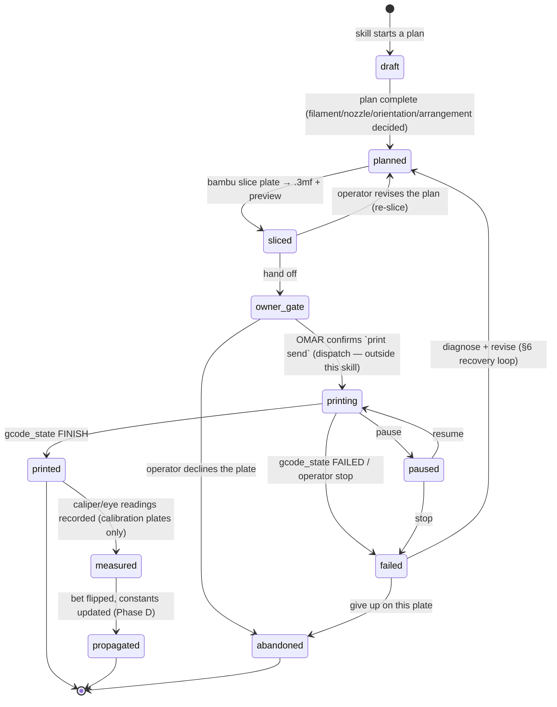
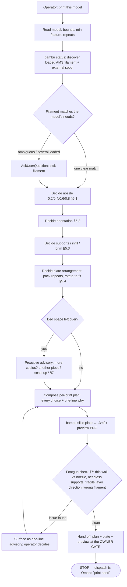

# print-model skill — design doc (pre-implementation)

Status: **DRAFT, NOT BUILT.** This doc and its companion research
([`research/print-model-research.md`](research/print-model-research.md)) are the
keystone: they land first and unblock the skill's build tasks (#31–#46). Nothing
in `.claude/skills/print-model/` exists yet; every path this doc gives under that
directory is a *target*, recorded in
[`.claude/gates/doc-pointer-baseline.json`](../.claude/gates/doc-pointer-baseline.json)
until the file it names ships.

Research: [`research/print-model-research.md`](research/print-model-research.md) —
web-grounded, provenance-headed; every load-bearing number below is attributed
there and its hedges are carried forward (K1). Where a fact is inferred from the
X2D's H2-family sibling rather than confirmed on X2D hardware, the research tags it
`[X2D-UNCONFIRMED — H2-proxy]` and this doc repeats the tag rather than hardening it
into a ruling.

Scope decision (2026-09-16, Omar): **Option A — the skill walks a model to the edge
of dispatch and stops.** Its deliverable is a reviewable *per-print plan + sliced
plate + preview*; the physical send stays the existing owner-gated
[`bambu print send`](../tools/bambu/src/commands/print.ts) (Omar's button). Porting
real dispatch off the defunct griches MCP is a separate, later, owner-gated PR (§9).

---

## 1. What the skill is, in one sentence

The **print-model** skill is a *sage master 3D-printer operator*: you ask it to
print a model and it makes sure you are not getting in your own way — it discovers
the loaded filament, reasons out nozzle / orientation / supports / infill / plate
arrangement the way an expert would, composes a per-print plan that says **what a
master would do and why**, and hands you a sliced plate + preview at the owner gate.
It **advises**; it never silently changes a setting, and it never dispatches.

## 2. The boundary — what it owns, presents, consumes, and refuses

The single design risk is the skill re-implementing a slicer, a transport, or the
record schema instead of orchestrating the ones that already exist. The boundary is
drawn so it absorbs exactly one unowned thing — *the judgement*:

- **Owns (new, unowned):** the reasoning that turns "print this" into a defensible
  per-print plan — filament match, nozzle choice, orientation, supports/infill/brim,
  grid arrangement of repeats, and the proactive advisories (§5, §7). This is the
  judgement a CLI verb cannot carry.
- **Presents (composed, not stored twice):** the plan artifact and the plate preview
  PNG pulled from the sliced `.3mf` (its Metadata/plate_1.png archive member), the
  same asset the bambu skill already extracts.
- **Consumes (owned elsewhere, read-only):** transport + slicing + records via the
  [`bambu` CLI](../.claude/skills/bambu/SKILL.md) (`status`, `slice plate`,
  `print list`, `print send`, `validate record`); geometry via bikar; the record
  schema via [`prints-tab-design.md`](prints-tab-design.md) and
  [`.claude/gates/prints_gate.py`](../.claude/gates/prints_gate.py); the bench-sheet
  calibration truth via [`prototype`](../.claude/skills/prototype/SKILL.md).
- **Refuses (Option A boundary):** dispatch. The skill stops at the owner gate. It
  produces the plate and the plan; it does not upload or start a print, and it never
  passes `--yes` on the operator's behalf.

> **K10 — the transfer condition for consuming the record schema.** The record
> format was designed for *calibration coupons*, where a plate's settings are
> **measurements fixed by the bench sheet, not preferences**
> ([`calibration-design.md`](calibration-design.md) §4). The print-model skill
> serves general models, where settings *are* choices. Those two never merge: the
> skill's advisories apply to general prints, and for any plate that carries a
> `settles: CAL-…` reading the skill **defers wholly to the bench sheet** and offers
> no advice. The calibration exception is stated everywhere it could be forgotten.

## 3. The lifecycle — two orthogonal axes, not one

Conflating "where the plate is in its physical life" with "where the record is in
its publication life" is a K7 trap. They are separate axes and the skill tracks both.

### 3.1 The plate axis (physical) — a state machine

The plate states below extend the record `status` enum already shipped in
[`prints-tab-design.md`](prints-tab-design.md) §4.1
(`sliced | printed | measured | propagated | abandoned`). The skill adds the
*pre-slice* states (`draft`, `planned`) it owns, and the *in-flight* states
(`printing`, `paused`, `failed`) read from the device. The in-flight set maps onto
the Bambu report frame's `gcode_state` (`IDLE / PREPARE / RUNNING / PAUSE / FINISH /
FAILED`) — the device-side enum the `status` verb already reads
([`research/print-model-research.md`](research/print-model-research.md) Topic 7).

`measured` and `propagated` are **this project's post-print additions with no prior
art** in the surveyed job-lifecycle systems (Moonraker, OctoPrint, OctoEverywhere);
the research says so and this doc carries that hedge (K1) rather than implying they
are standard.

**Validator:** a record's `status` is well-formed iff its value is one of
`{draft, planned, sliced, printing, paused, printed, failed, measured, propagated,
abandoned}` **and** the record carries the fields that state requires — a `sliced`
record names a `.3mf`; a `printed` record names the plate it came off; a `measured`
record carries at least one `readings[]` entry; a `propagated` record carries a
`readings[].settles` naming a bet. The freshness gate (§6.3, task #39) enforces this.

PASS: a record `status: sliced` whose frontmatter names the plate `.3mf` it sliced
and whose `objects[]` each resolve (R1) — a plate correctly parked at the owner gate.

FAIL: a record `status: propagated` whose every `readings[].settles` is `~` (no bet
named) — it claims to have moved a calibration constant while pointing at nothing, so
the gate must refuse it. (This is the *hard* case: an aggregate "the record has
readings" cannot discharge it — one reading with a real `settles` is required, per
the K6/D2 corollary in [`CLAUDE.md`](../CLAUDE.md).)

### 3.2 The record axis (publication) — draft → shipped

Orthogonal to the plate's physical state, the *record* moves from a gitignored draft
to a committed, gated artifact — the promotion already built into the records system:

- **draft:** `.bambu/records/<date>-<slug>/` — gitignored (`.gitignore` line pins
  `.bambu/`), written by `bambu print send --record` or scaffolded by the skill. The
  whole-tree `prints_gate.py` never sees it, so an incomplete draft blocks no commit.
- **shipped:** promoted to `docs/prints/<date>-<slug>/` once its TODOs and photos are
  filled and `bambu validate record` passes. Now the whole-tree gate holds it to
  R1/R2/R4/R5 (and R3 after a bet flips).

A plate can be physically `printed` while its record is still a `draft`; the two axes
do not move in lock-step, which is exactly why they are modelled apart.

## 4. The activity — how one run flows

One invocation of the skill, from "print this" to the owner gate. Read-only device
discovery and local reasoning throughout; the only hardware write is downstream of
the gate and outside this skill.

The calibration exception (§2, K10) short-circuits F–K: for a bench-sheet coupon the
skill skips all advisory decisions and prints the fixed profile from the sheet.

## 5. The decisions and the decision rubric

Each decision the skill makes is a small procedure: the *questions it answers*, the
*inputs it reads*, a grounded *default or heuristic*, and the *advisory it emits*
(always a one-line "what a master would do + why", never a silent change). The rubric
below is the skill's run-time checklist; it lives beside the skill's
`.claude/skills/print-model/SKILL.md` as `.claude/skills/print-model/rubric.md` so it
can sharpen without editing the skill body (global rule: a skill's rubric is a sibling
file read at run time).

| Decision | Questions we answer | Inputs read | Heuristic (grounded) | Advisory shape |
|---|---|---|---|---|
| **Filament** (§5.5) | Which loaded filament, and is it right for this part? | AMS `ams[].tray[]` + `vt_tray`; model use (functional/display) | Match `tray_type` to the part's need; if several plausible, **ask** | AskUserQuestion when ambiguous; else "using PLA in slot 2 because …" |
| **Nozzle** (§5.1) | 0.2 / 0.4 / 0.6 / 0.8? | model min feature; functional vs display; part size | see §5.1 rules | "0.6 mm — functional part, no fine detail, ~faster; 0.4 if you want the studs crisp" |
| **Orientation** (§5.2) | Which face down; minimize supports? | mesh overhangs, bottom area, contour | Tweaker-3 objective (minimize support volume) | "laid flat: least support; note layer lines run across the pin — weaker there" |
| **Supports** (§5.3) | Any? normal or tree? threshold angle? | overhang angles vs threshold | tree for point contacts; none if overhangs ≤ threshold | "no supports needed — max overhang 38° is under the fan limit" |
| **Infill** (§5.3) | Pattern and density? | functional vs display; wall count | **defer to profile default**; advise change only on cause | "leaving profile 15% — bump to 30% only if this bears load" |
| **Brim / raft** (§5.3) | Brim, raft, or neither? | footprint size, warp-prone corners, material | brim for small/warp-prone footprints; raft rarely | attributed to source, never asserted bare |
| **Arrangement** (§5.4) | How many fit; when to rotate to fit? | bed size, part footprint, repeat count | libnest2d NFP; try 0/45/90/135° | "9 fit at 0°; rotating 45° fits 12 — want the denser pack?" |
| **Scale / fill-bed** (§7) | Unused bed → more copies / another piece / bigger? | leftover bed area vs part footprint | proactive when leftover ≥ one more part | "room for 3 more — add copies, or scale 1.4× to fill the plate?" |

### 5.1 Nozzle diameter (0.2 / 0.4 / 0.6 / 0.8 mm)

The X2D ships all four profiles (proven locally: the profile family is installed —
memory *bambu-x2d-bringup*). The tradeoff axis, grounded in
[`research/print-model-research.md`](research/print-model-research.md) Topic 8:
smaller = finer detail / thinner minimum wall / slower; larger = more flow / faster /
often stronger Z-bonding / coarser detail.

**Default:** 0.4 mm as the general-purpose balance
([Bambu nozzle page](https://wiki.bambulab.com/en/filament-acc/acc/nozzles) — the
research flags this page as bot-blocked at fetch, so the figure is from the search
index and the skill treats it as advisory; see
[`research/print-model-research.md`](research/print-model-research.md) Topic 8). The
skill deviates only on a stated cause:

- **0.2 mm** when the model's minimum feature is ≲ 0.4 mm or fine surface text
  matters — worth the time penalty
  ([`research/print-model-research.md`](research/print-model-research.md) Topic 8).
- **0.6 mm** when the part is functional/large and detail is non-critical; a
  third-party head-to-head *reports* ~30–40% faster than 0.4 with negligible detail
  loss on functional parts — carried as an **attributed, non-official** figure, not a
  bare default ([`research/print-model-research.md`](research/print-model-research.md)
  Topic 8; the research flags the source as secondary and wanting a `CAL-*` bet).
- **0.8 mm** for draft prototyping and max-flow infill.

**Default:** layer height ≈ 25–75% of nozzle diameter, and minimum single-wall ≈ one
nozzle diameter
([Bambu layer-height page](https://wiki.bambulab.com/en/software/bambu-studio/layer-height)
— the research flags the exact endpoints as pending a live-page re-check, so the
skill treats them as advisory, not a hard gate; see
[`research/print-model-research.md`](research/print-model-research.md) Topic 8).

The **footgun** this catches: a model whose thinnest wall is below the chosen nozzle's
single-wall floor (a 0.5 mm wall on a 0.8 nozzle cannot print). The skill flags it
before slicing rather than letting the slicer silently drop the wall.

> **K2 — the dual-nozzle caveat, not hardened.** That *all four diameters ship
> per-nozzle on the dual-tool X2D specifically* is `[X2D-UNCONFIRMED — H2-proxy]`; the
> four-diameter lineup is the standard Bambu range across H2/X1/P1/A1. The X2D can
> also mix two diameters at once (OrcaSlicer mixed-nozzle guidance,
> [`research/print-model-research.md`](research/print-model-research.md) Topic 8);
> the skill treats mixed-nozzle as an open capability, not an assumed one.

### 5.2 Orientation

**Questions:** which face goes down, and does that minimize support while staying
printable? **Input:** the mesh's overhang area, bottom (contact) area, and contour
length. **Heuristic:** the Tweaker-3 objective — minimize support *volume* subject to
printability ([`research/print-model-research.md`](research/print-model-research.md)
Topic 3); the headless CLI is the scriptable path.

> **K1 — do not over-claim.** No orientation tool surveyed optimizes *layer-line
> strength / part anisotropy* — Tweaker and slicer auto-orient minimize
> support/overhang, not directional strength
> ([`research/print-model-research.md`](research/print-model-research.md) Topic 3).
> The skill therefore **reports** the layer-line direction as an advisory ("layer
> lines run across the pin — that is the weak axis") but does not claim to have
> optimized for strength.

### 5.3 Supports, infill, brim/raft

- **Supports:** normal vs **tree** — tree branches from a small base to point
  contacts, less material/time than a grid; interface layers cap the support under
  the model ([`research/print-model-research.md`](research/print-model-research.md)
  Topic 5). Generated when overhang angle exceeds the threshold; the skill's advisory
  names the max overhang so the operator can see why (or why not).
- **Infill:** the skill **defers to the slicer profile's default density and
  pattern** and advises a change only on a stated cause (load-bearing part → denser;
  display-only → lighter). No bare default number is asserted — the eight fill
  patterns the Bambu wiki lists (Concentric, Rectilinear, Monotonic, Monotonic Line,
  Aligned Rectilinear, Hilbert Curve, Archimedean Chords, Octagram Spiral) are named
  from the source ([`research/print-model-research.md`](research/print-model-research.md)
  Topic 5), not invented.
- **Brim vs raft:** **THIN SOURCE.** No authoritative Bambu page settles brim-vs-raft;
  the research found community guidance only
  ([`research/print-model-research.md`](research/print-model-research.md) Topic 5). The
  skill therefore attributes any brim/raft advice to the named community source (brim
  = adhesion for small footprints / warp-prone corners; raft = full base for very
  warpy material or an uneven bed) and never asserts it bare. If a plate ever settles
  this empirically, it graduates into the best-practices file (§8) with our own datum.

### 5.4 Plate arrangement — packing repeats and rotate-to-fit

**Questions:** how many copies fit, and when does rotating a part let more fit?
**Inputs:** bed dimensions, part footprint, requested copy count. **Heuristic:**
libnest2d No-Fit-Polygon packing — the same nesting library BambuStudio/Orca use —
trying at most the four angles 0/45/90/135°
([`research/print-model-research.md`](research/print-model-research.md) Topic 4). The
scriptable path is the OrcaSlicer headless CLI
(`--arrange --orient --rotate --scale --slice --export-3mf`; the research flags the
per-flag prose as needing a `--help` re-check, so the skill verifies flags at run
time before relying on them).

The **rotate-to-fit advisory** is the concrete case Omar called out: when a rotated
pack fits strictly more copies, the skill says so and lets the operator choose
("9 fit as-is; rotating 45° fits 12 — denser pack, slightly more travel").

> **K2 — dual-nozzle bed zoning is an open item.** A forum report notes auto-arrange
> not using the H2D's L/R-nozzle-only bed areas
> ([`research/print-model-research.md`](research/print-model-research.md) Topic 4,
> `[X2D-UNCONFIRMED]`). Dual-nozzle bed zoning on the X2D is unverified; the skill
> does not assume the whole bed is uniformly usable until confirmed on hardware.

### 5.5 Filament discovery and selection

The full report frame carries `print.ams.ams[]` (one entry per physical AMS unit,
each with a `tray[]`) and a separate `print.vt_tray` for the external spool (sentinel
`id":"254"`). Per-tray fields the skill reads:
`tray_type` (e.g. "PLA"), `tray_color` (hex `RRGGBBAA`), `tray_sub_brands`,
`tray_info_idx` (Bambu profile id), and `remain` (percent; **`-1` = no RFID / unknown**)
([`research/print-model-research.md`](research/print-model-research.md) Topic 2). On
newer firmware the external spool may appear under `print.vir_slot` in addition to /
instead of `vt_tray` — the skill watches both keys.

**Task #32 de-risk:** a read-only `bambu filament` verb lists the loaded trays first,
before any selection logic is built, to confirm the *X2D* frame actually carries
`ams`/`tray` as documented — the H2-family AMS schema had MQTT-validation churn
([`research/print-model-research.md`](research/print-model-research.md) Topic 2,
`[X2D-UNCONFIRMED — H2-proxy]`), so the skill parses `ams` defensively and never
assumes a tray shape it has not seen on this device.

Selection uses **AskUserQuestion** only when the choice is genuinely the operator's —
several plausible filaments loaded, or a material/colour trade the model does not
settle. One clear match is chosen and *stated*, not asked (global rule: bias to
action; reserve the question for the pivotal call).

## 6. Print-issue feedback and the recovery loop

When a print fails or disappoints, the skill runs a diagnose → revise loop that ends
back at `planned` (§3.1). It does not invent a defect taxonomy: it reads against the
named catalog.

### 6.1 The defect catalog it reads

Simplify3D's Print Quality Guide is the canonical named catalog (per-defect pages
with causes + fixes), paired with Bambu's own print-quality wiki
([`research/print-model-research.md`](research/print-model-research.md) Topic 6). The
defects the skill models — enumerated, not "all defects" (K2): warping / poor bed
adhesion, stringing / oozing, layer shift, under- / over-extrusion, elephant's foot,
support scarring, overhang droop.

### 6.2 The loop

1. Operator reports the symptom (or attaches a photo to the record's `feedback`).
2. The skill maps the symptom to the catalog defect and its documented cause.
3. It proposes the setting/orientation revision as a one-line advisory.
4. On the operator's say-so it revises the plan → re-slices → back to the owner gate.
5. If the finding is *physical and new*, it graduates into the best-practices file
   (§8) — this is the self-healing seam (task #46).

### 6.3 Freshness gate (task #39)

**Validator:** the metadata-freshness gate refuses to let a record drift out of sync
with reality — a record whose `status` names an in-flight or terminal physical state
must carry the evidence that state implies (see §3.1's Validator), and a record left
in `draft`/`planned` past a slice must be reconciled before it ships.

PASS: a `printed` record that names its plate and carries the operator's `feedback`
block (even if empty-but-present) — the record honestly reflects a finished plate.

FAIL: a record marked `measured` whose `readings[]` is empty — it claims a
measurement happened while carrying none; the gate refuses it rather than let the
lifecycle lie. (Hard case: the presence of a `feedback` block does not discharge it —
`measured` specifically requires a reading.)

Enforced as rules **R10–R14** of `.claude/gates/prints_gate.py` (the "freshness gate"
is that rule-set, not a second gate file): R10 a sliced-or-later record names its
`.3mf`; R11 a terminal-physical record carries a `feedback` block; R12 `measured`
carries a reading; R13 `propagated` names a bet; R14 a shipped record is past planning.
They live beside R1–R9 because they read the same parsed frontmatter — one parser, one
hook, one self-test, the no-fork rule ([`CLAUDE.md`](../CLAUDE.md)) applied. The
per-rule by-design failure is in the gate's `--self-test`. Details:
[`prints-tab-design.md`](prints-tab-design.md) §7.

## 7. Proactive advisories (the "sage" surface)

The advisories are what make the skill a master rather than a slicer front-end. Each
is a one-line offer, never an auto-change:

- **Fill unused bed:** leftover bed area ≥ one more part footprint → "room for N more
  copies, or another piece — want to fill the plate?"
- **Scale up:** a small part alone on a large bed → "this is 4 cm on a 25 cm bed;
  scale 2× if you meant it bigger?"
- **Footgun catches (before slicing):** wall thinner than the nozzle's single-wall
  floor (§5.1); supports generated where reorienting removes them (§5.2); a fragile
  layer-line direction on a load axis (§5.2, reported not claimed-optimized); the
  loaded filament wrong for the stated use (§5.5).

Each footgun is a line in the plan — "a master would not do X because Y" — and the
operator decides. The skill changes nothing on its own.

## 8. The best-practices reference and self-healing (tasks #45, #46)

A grounded reference file — `.claude/skills/print-model/best-practices.md`, read at
run time — holds the rules this doc grounds **plus our own real examples** as we
practice them. It is **self-healing**: physical-iteration findings graduate new rules
and examples into it, mirroring the repo's graduation rule
([`CLAUDE.md`](../CLAUDE.md), "The graduation rule"). A defect discovered on a plate
becomes a best-practices example that fails-before / passes-after the next plan — the
same fix-ships-a-test discipline, applied to printing.

The first seeded examples are the ones this project already produced: the known-good
X2D Plate-1 trio (machine `Bambu Lab X2D 0.4 nozzle` · process `0.20mm Standard @BBL
X2D` · filament `Bambu PLA Basic @BBL X2D 0.4 nozzle`), the MC-4 fan sliced with
**supports off**, and the three LEGO sources that slice clean at 0.4 mm — all recorded
in memory *bambu-x2d-bringup* and the Plate-1 bench sheet.

## 9. Why Option A stops at the owner gate (the dispatch gap)

Dispatch is not deferred for caution alone — it is materially harder than status, and
the research found why:

- `bambu print send` still imports the `McpBackend` (griches MCP), which is **not on
  npm** — so dispatch would fail at connect *exactly as status did before the
  first-party MQTT backend shipped* (memory *bambu-x2d-bringup*, D-055).
- Real submit is a two-step LAN flow: **FTPS** (implicit TLS, port 990,
  `bblp`/access-code) upload of the sliced `.gcode.3mf`, then an **MQTT**
  `project_file` command on `device/<serial>/request`
  ([`research/print-model-research.md`](research/print-model-research.md) Topic 1).
- **The load-bearing finding:** the X2D/H2D authorization-control firmware family
  **rejects unsigned control commands** (error `84033543`); control commands must be
  **signed RSA-SHA256** with a cert whose CN matches the serial. Status *reads* are
  unaffected — which is why reads already work here — but dispatch will require the
  signing path, not the plain publish that worked on older firmware
  ([`research/print-model-research.md`](research/print-model-research.md) Topic 1,
  `[X2D-UNCONFIRMED — H2-proxy]` on the exact code/CN rule for X2D specifically).

So the port is its own owner-gated PR, and the skill is designed to be complete and
useful *without* it: a plan + plate + preview handed to Omar is the whole deliverable
of Option A. When dispatch is ported, the owner gate gains a button; nothing else in
this design changes.

## 10. Decisions, resolved

| # | Decision | Resolution | Why |
|---|---|---|---|
| PM-1 | Scope | **Option A** — up to the owner gate, no dispatch port | Dispatch is the CAL-gated hardware verb we cannot use yet and needs RSA signing (§9); the judgement layer delivers value now |
| PM-2 | Own judgement, consume verbs | Skill owns reasoning; CLI keeps atomic verbs | Orchestration is a skill's job; re-implementing slicer/transport/schema is the §2 anti-pattern |
| PM-3 | Two lifecycle axes | Plate (physical) and record (publication) tracked separately | Conflating them is the K7 trap of §3 |
| PM-4 | Extend the record schema, don't fork it | Add lifecycle states + `feedback` + sheet↔print mapping to the existing record ([prints-tab-design](prints-tab-design.md)) | "A migration never buys a fork" ([`CLAUDE.md`](../CLAUDE.md)); one register, gated whole-tree |
| PM-5 | Infill/brim not asserted bare | Defer infill to profile; attribute brim/raft to source | The sources are thin/secondary (§5.3); D3 forbids a bare default |
| PM-6 | Dual-nozzle representation | Rides as a single-nozzle-labelled FDM target (already **D-053**) | Recorded corpus-wide; dual nozzle lives in the profile header, not a widened schema |
| PM-7 | Calibration exception | For any `settles: CAL-…` plate the skill gives no advice | Coupon settings are measurements, not preferences (§2, K10) |

Metadata-schema specifics — the `feedback` block, the sheet↔print many-to-one
mapping (several sheets combined on one plate), and repeated-element multiplicity —
are the subject of task #38, which **extends** `prints-tab-design.md`'s `readings[]` /
`objects[]`; this doc fixes the lifecycle axis those fields hang on (§3, PM-4) and
defers the field-level frontmatter to that PR so the schema is designed in one place.

## 11. Read against itself (K7)

- The plate state machine (§3.1) and its Validator agree: every terminal/measured
  state the diagram shows is a state the Validator lists and requires evidence for.
- The activity flow (§4) short-circuits F–K for calibration plates exactly as §2's
  K10 exception and §5's calibration carve-out require — no section advises a coupon.
- Every numeric claim (§5.1 nozzle, layer-height, the ~30–40% figure) carries the
  research file's own hedge (secondary / unconfirmed / pending re-check); none is
  hardened into a ruling (K1), and the sets named (four nozzles, eight fill patterns,
  seven modelled defects) are enumerated, not asserted exhaustive over an unsearched
  space (K2).
- §9's dispatch gap and §2's "Refuses: dispatch" agree: the skill's boundary is the
  owner gate in both the boundary section and the rationale.
- Every backticked path resolves on disk or is registered in the pointer baseline as
  an unbuilt target (§Status); no pointer is stale.
