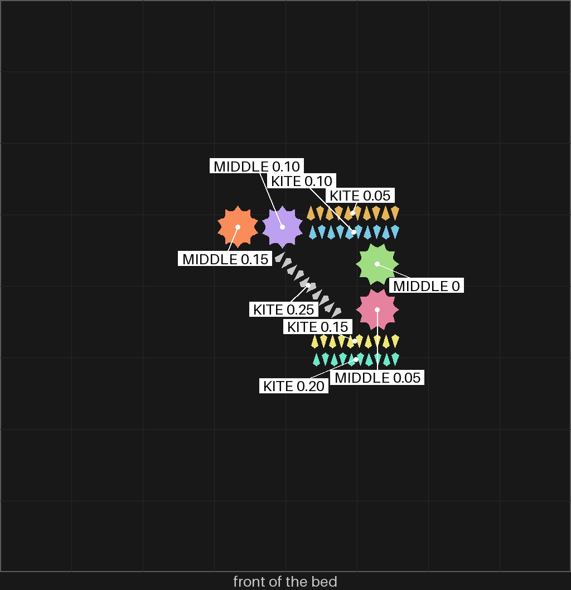
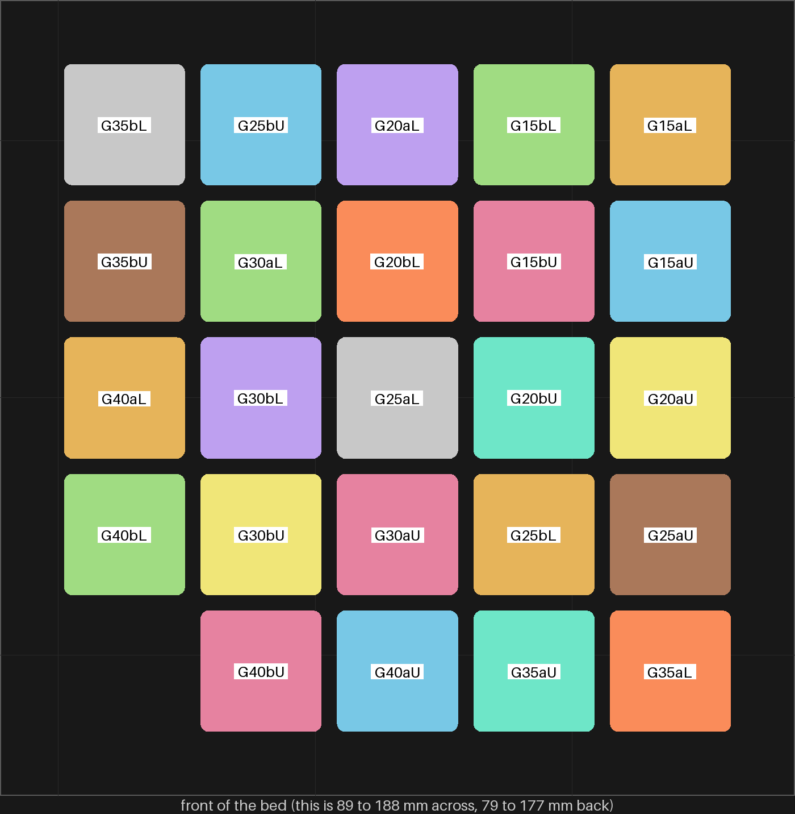
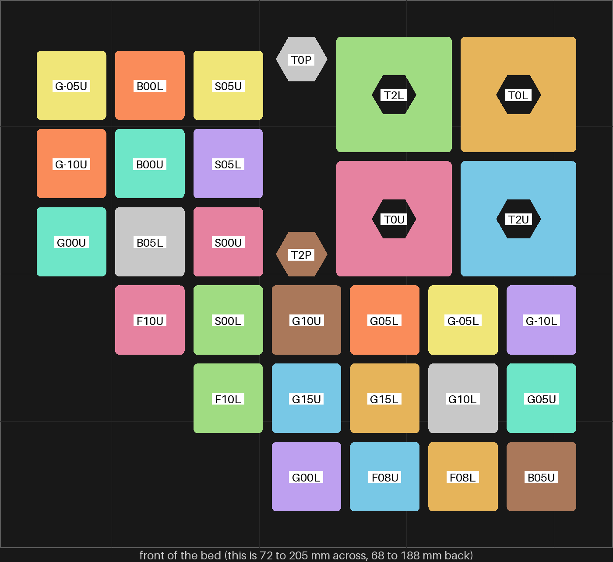
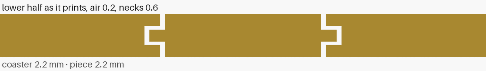
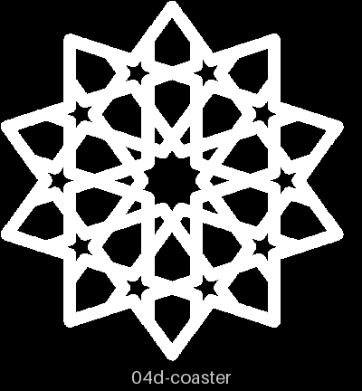
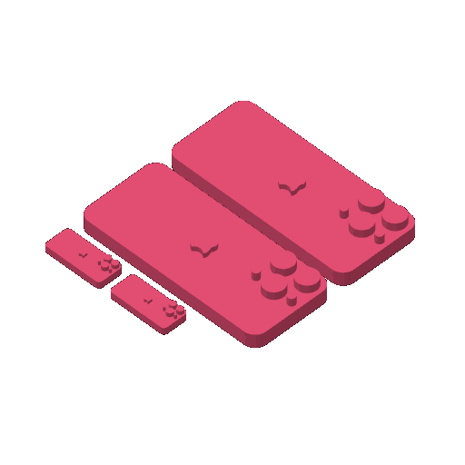
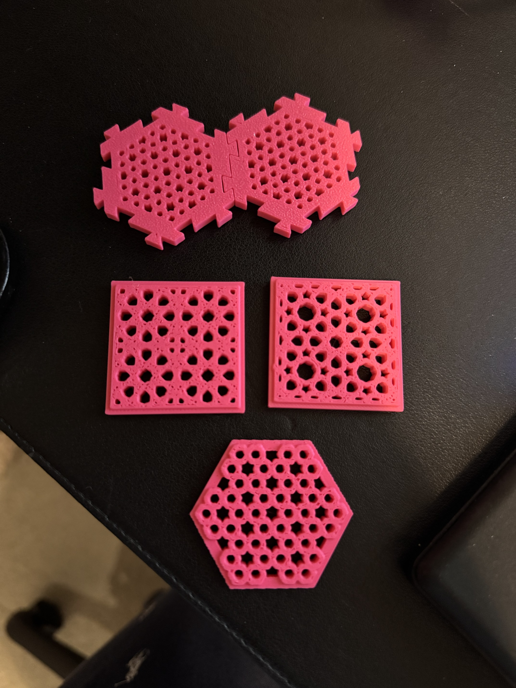

# Prints

A **print** is the one event this repository records nowhere else: a physical
plate came off a machine, taught something, and that lesson belongs to the exact
geometry-and-process that produced it. This page is the reader for those records.
It records nothing of its own — each print is a checked-in directory, and its
format and gate are defined in [the prints-tab design doc](design/printing/prints-tab-design.md)
§4 and [`prints_gate.py`](../.claude/gates/prints_gate.py). Why one register and
not two: [D-046](working-model/decisions-log.md).

The reader is deliberately plain markdown at this rung (S6). The gallery-facing
`prints.html` surface — the styled version a visitor lands on — is a later rung
(S7); see the design doc §8–§9. Nothing here waits on that.

## Lessons — what the prints taught

<!-- lessons:start -->

One line per print, written by `python3 .claude/skills/review-print/scripts/prints_page.py --write` from each record's `feedback.lesson`.

- In the fresh Z coaster, printed on the same bed, the kites fit at 0.05 mm and every looser rung was too small, and the middle piece sits between 4A (gap 0, too tight) and 4B (0.05, good but comes out a little too easily). In the older sheets-04g coaster the same pieces sat about one 0.05 mm rung looser: 4A fit but came out easily, 4B and every kite were loose. So the coaster's holes came out about one rung larger on that print than on this one. One pair of coasters: a first reading, not a rule. ([2026-10-10-sheets-04g-fit](prints/2026-10-10-sheets-04g-fit/index.md))
- A 2 mm stud went in by hand at every gap from 0.15 to 0.40 mm and held from 0.15 to 0.25, though spl-1 needed a hammer at 0.15; and at 0.25 one pair held (1E) while its twin fell apart (1F). So the fit moves about 0.05 to 0.10 mm from print to print (0.4 mm nozzle, 0.42 mm outer and 0.45 mm inner wall lines, 0.20 mm layers). And carved B and D, M and N, look alike at this size. ([2026-10-09-spl-2](prints/2026-10-09-spl-2/index.md))
- Every stud gap from -0.10 to 0.15 mm needed a hammer while the slice kept each gap as drawn, so the printer runs tight (0.4 mm nozzle, 0.42 mm outer and 0.45 mm inner wall lines, 0.20 mm layers); and an id on the upper's cut face is hidden once the pair closes. ([2026-10-09-spl-1](prints/2026-10-09-spl-1/index.md))
- A piece printed in its pocket comes out loose with two layers of air (0.4 mm); with one layer (0.2 mm) both pairs fused (0.4 mm nozzle, 0.42 mm outer and 0.45 mm inner wall lines, 0.20 mm layers). ([2026-10-09-pkt-1](prints/2026-10-09-pkt-1/index.md))
- All three dovetail gaps, 0.10, 0.15 and 0.20 mm a side, worked (0.4 mm nozzle, 0.42 mm outer and 0.45 mm inner wall lines, 0.20 mm layers); which felt best is not said yet. On the glacier plate the printer stopped twice before the first layer, and ran on the gold plate. ([2026-10-07-sld-1](prints/2026-10-07-sld-1/index.md))
- A piece cut with sharp inward corners rattles where the strap rounds its hole, and the thinnest, sharpest pieces (the kites) bind first (0.4 mm nozzle, 0.42 mm outer and 0.45 mm inner wall lines, 0.20 mm layers). ([2026-10-04-sheets-04g](prints/2026-10-04-sheets-04g/index.md))
- One color per plate: the same phones took about 13 minutes in one color against phones-01's 62 in two, and the plate became the first production plate. ([2026-10-04-phones-02](prints/2026-10-04-phones-02/index.md))
- A coaster with no floor holds a loose piece only by friction, so every piece smaller than its hole fell through, at every gap from 0.05 to 0.20 mm (0.4 mm nozzle, 0.42 mm outer and 0.45 mm inner wall lines, 0.20 mm layers). ([2026-10-02-sheets-04](prints/2026-10-02-sheets-04/index.md))
- A slice must carry the whole X2D preset: Studio's command line ignores `inherits`, and its built-in settings fit the tiny holes and the tight pegs. ([2026-09-26-minis-04](prints/2026-09-26-minis-04/index.md))
- At 40 mm a mini is too small to show its pattern, and the dovetail's fixed 5.7 mm frame takes over a quarter of the piece. ([2026-09-26-minis-03](prints/2026-09-26-minis-03/index.md))

<!-- lessons:end -->

## Records — what has actually printed

Each record names its run, its plate, a verdict per piece in Omar's words, and its feedback:
what happened, why, and what it changed. The prints gate checks every record, and
`make validate-prints` fails when this list and the lessons above are not what the records give. When
a print comes back, its record and this page ship in the same PR (the
[review-print skill](../.claude/skills/review-print/SKILL.md#when-a-print-comes-back)).

<!-- records:start -->

Written by `python3 .claude/skills/review-print/scripts/prints_page.py --write` from the records; newest first.

### [2026-10-10-sheets-04g-fit](prints/2026-10-10-sheets-04g-fit/index.md)

- **Plate:** [sheets-04g-fit](design/plates/sheets-04g-fit.md) — the kites and the middle piece at a ladder of gaps, with a fresh coaster to press them into
- **Lesson:** In the fresh Z coaster, printed on the same bed, the kites fit at 0.05 mm and every looser rung was too small, and the middle piece sits between 4A (gap 0, too tight) and 4B (0.05, good but comes out a little too easily). In the older sheets-04g coaster the same pieces sat about one 0.05 mm rung looser: 4A fit but came out easily, 4B and every kite were loose. So the coaster's holes came out about one rung larger on that print than on this one. One pair of coasters: a first reading, not a rule.
- **Nozzle:** 0.4 mm, left nozzle, type HS01
- **Pieces:** 10 (1 keep, 2 adjust, 4 drop, 3 not-judged)
- **What happened:** Z coaster: the 0.05 kites fit well, the 0.10 to 0.25 kites were too small; 4GF 4A fit but too tight, 4GF 4B good but came out a little too easily; 4GF 4C and 4D not judged. Older sheets-04g coaster: 4A fit but came out easily, 4B loose, all kites loose.
- **Why:** Not measured on the pieces (no calipers reading). The older coaster printed on 2026-10-04 in green from another spool; the coaster's source gained two knobs since (hole-point round and weld), both left at 0, which should leave the holes as they were, though the two meshes were not compared. Why its holes come out larger is not known. spl-2 found the stud fit moving 0.05 to 0.10 mm from print to print too.
- **What it changed:** Kites stay at 0.05 mm. Omar asked for a midway between 4A and 4B: a middle piece at 0.025 mm. Because the holes move about one rung between prints, that plate prints its own fresh coaster beside the middle pieces, and the pieces are judged in it.
- **Photos of the print:** none. Rendered pictures from the plate page: [bed](design/plates/sheets-04g-fit-media/bed.png), [ids](design/plates/sheets-04g-fit-media/ids.png), [ids-coaster](design/plates/sheets-04g-fit-media/ids-coaster.png)

### [2026-10-09-spl-2](prints/2026-10-09-spl-2/index.md)

- **Plate:** [spl-2](design/plates/spl-2.md) — the split coupon again, looser: at what gap does a stud go in by hand
- **Lesson:** A 2 mm stud went in by hand at every gap from 0.15 to 0.40 mm and held from 0.15 to 0.25, though spl-1 needed a hammer at 0.15; and at 0.25 one pair held (1E) while its twin fell apart (1F). So the fit moves about 0.05 to 0.10 mm from print to print (0.4 mm nozzle, 0.42 mm outer and 0.45 mm inner wall lines, 0.20 mm layers). And carved B and D, M and N, look alike at this size.
- **Nozzle:** 0.4 mm, left nozzle, type HS01
- **Pieces:** 24 (10 keep, 14 drop)
- **What happened:** Every pair closed by hand. SL2 1A to 1E (0.15 to 0.25 mm) held when shaken; SL2 1F to 1L (0.25 to 0.40 mm) were very loose and fell apart. None broke when pulled. 1D may have clicked in. All the uppers' ids on their top faces read.
- **Why:** Not measured on the pieces (no calipers reading). The same 0.15 mm gap needed a hammer on spl-1, printed earlier the same day with the same nozzle, preset and spool, so the printer varies from print to print by about as much as one or two rungs of the ladder. Why it varies (chamber warmth, the plate, the spool's moisture) is not known.
- **What it changed:** The stud gap on split-01, stud-1 and pkt-2 is 0.25 mm, Omar's pick (D-116), the loosest gap that held here; 1F at the same gap fell apart, so a whole coaster at 0.25 may come out loose. split-01 and stud-1 set it in their recipes; pkt-2's pocket coaster has no stud-gap knob yet, so it waits on a bikar change. Coupon uppers keep their id on top (D-115 stands). Piece letters skip B, D, M, N and O.
- **Decided from it:** [D-116](working-model/decisions-log.md#d-116--a-split-coasters-stud-gap-is-025-mm) (A split coaster's stud gap is 0.25 mm)
- **Photos of the print:** none. Rendered pictures from the plate page: [bed](design/plates/spl-2-media/bed.png), [ids-lowers](design/plates/spl-2-media/ids-lowers.png), [ids-uppers](design/plates/spl-2-media/ids-uppers.png)

### [2026-10-09-spl-1](prints/2026-10-09-spl-1/index.md)

- **Plate:** [spl-1](design/plates/spl-1.md) — the split coupon: how tight a stud, how thick a floor, does a lip hold a piece
- **Lesson:** Every stud gap from -0.10 to 0.15 mm needed a hammer while the slice kept each gap as drawn, so the printer runs tight (0.4 mm nozzle, 0.42 mm outer and 0.45 mm inner wall lines, 0.20 mm layers); and an id on the upper's cut face is hidden once the pair closes.
- **Nozzle:** 0.4 mm, left nozzle, type not recorded
- **Pieces:** 30 (1 keep, 16 adjust, 13 drop)
- **What happened:** Every stud pair needed a hammer to close, from gap -0.10 to 0.15 mm and at 1.5, 2 and 3 mm; only SL1 4F (2 mm, 0.15) went in by hand, and it needed a hammer to sit flush. Nothing snapped.
- **Why:** Not the slice. tools/fit_gap.py studs read the sliced wall paths: every pair's gap came out as drawn, to within 0.005 mm (4A -0.098 for -0.10, 4F +0.155 for 0.15), and the upper prints with its socket opening upward, so first-layer squish cannot narrow the mouth. What is left is the printer: printed holes running smaller than drawn, studs larger, or both. Not measured on the pieces themselves (no calipers reading), and the ladder never went loose enough to find the fit.
- **What it changed:** A looser stud ladder, above 0.15 mm, before any studded coaster (split-01, stud-1, pkt-2, all cut at 0.05) is sent. The 0.6 mm floor stays. Lips hold a loose piece, and room 0 is the room. The upper's letter goes on its outer face, not its cut face, so it can still be read once the pair is closed.
- **Decided from it:** [D-115](working-model/decisions-log.md#d-115--on-a-coupon-the-upper-halfs-id-goes-on-its-outer-face) (On a coupon, the upper half's id goes on its outer face)
- **Photos of the print:** none. Rendered pictures from the plate page: [bed](design/plates/spl-1-media/bed.png), [slice](design/plates/spl-1-media/slice.png), [ids-a-f](design/plates/spl-1-media/ids-a-f.png), [ids-g-l](design/plates/spl-1-media/ids-g-l.png), [ids-trap](design/plates/spl-1-media/ids-trap.png)

### [2026-10-09-pkt-1](prints/2026-10-09-pkt-1/index.md)

- **Plate:** [pkt-1](design/plates/pkt-1.md) — the pocket coupon: does a piece printed in its pocket come out loose
- **Lesson:** A piece printed in its pocket comes out loose with two layers of air (0.4 mm); with one layer (0.2 mm) both pairs fused (0.4 mm nozzle, 0.42 mm outer and 0.45 mm inner wall lines, 0.20 mm layers).
- **Nozzle:** 0.4 mm, left nozzle, type not recorded
- **Pieces:** 8 (4 keep, 4 drop)
- **What happened:** At one layer of air (0.2 mm) the hexagon printed fused to its square in both pairs (4S/OT, 4P/PT).
- **Why:** One 0.2 mm layer of air is too little for the band to print free; both pairs fused, so it was not one bad layer.
- **What it changed:** Way c works at two layers of air (0.4 mm) with 0.4 mm necks and the 0.6 mm band: loose, rims whole, band level, and closed pairs flat and silent. pkt-2 builds there.
- **Photos of the print:** none. Rendered pictures from the plate page: [cut-lower-0.2](design/plates/pkt-1-media/cut-lower-0.2.png), [cut-closed-0.2](design/plates/pkt-1-media/cut-closed-0.2.png), [cut-closed-0.4](design/plates/pkt-1-media/cut-closed-0.4.png), [bed](design/plates/pkt-1-media/bed.png), [slice](design/plates/pkt-1-media/slice.png), [ids](design/plates/pkt-1-media/ids.png)

### [2026-10-07-sld-1](prints/2026-10-07-sld-1/index.md)

- **Plate:** [sld-1](design/plates/sld-1.md) — the dovetail coupon: three rail and slot pairs at 0.10, 0.15 and 0.20 mm a side
- **Lesson:** All three dovetail gaps, 0.10, 0.15 and 0.20 mm a side, worked (0.4 mm nozzle, 0.42 mm outer and 0.45 mm inner wall lines, 0.20 mm layers); which felt best is not said yet. On the glacier plate the printer stopped twice before the first layer, and ran on the gold plate.
- **Nozzle:** 0.4 mm, left nozzle, type not recorded
- **Pieces:** 6 (6 keep)
- **What it changed:** Which of the three gaps felt best is still Omar's to say; the kite pair the joining note adds waits on that gap.
- **Photos of the print:** none. Rendered pictures from the plate page: [side-cut](design/plates/sld-1-media/side-cut.png), [slice](design/plates/sld-1-media/slice.png), [bed](design/plates/sld-1-media/bed.png)

### [2026-10-04-sheets-04g](prints/2026-10-04-sheets-04g/index.md)

- **Plate:** [sheets-04g](design/plates/sheets-04g.md) — the gBV minimal coaster at 1.25 times wide and every one of its 41 pieces, one bed, one color
- **Lesson:** A piece cut with sharp inward corners rattles where the strap rounds its hole, and the thinnest, sharpest pieces (the kites) bind first (0.4 mm nozzle, 0.42 mm outer and 0.45 mm inner wall lines, 0.20 mm layers).
- **Nozzle:** 0.4 mm, left nozzle, type not recorded
- **Pieces:** 6 (2 adjust, 4 not-judged)
- **What happened:** The ten kites were too tight to go into their holes, and the middle piece was loose in its hole; nothing said yet about the hexes, the stars, the outer pieces or the coaster.
- **Why:** Two causes, one per symptom. The middle piece was cut with sharp inward corners, but the coaster's strap rounds those corners off, so at each of its ten inward corners the piece stood 0.45 mm short of the wall: play the piece could rattle in. The kites had no play anywhere, and a kite is the thinnest piece on the plate, with 3.8 times as much edge for its size as the middle piece and a 36 degree point, so any width the printer adds to a piece, or takes from a hole, binds it first. Measured on bikar's own geometry and the slice; the printer's own widening was not measured.
- **What it changed:** bikar now cuts every piece along the strap's real, rounded edge (no more corner play), and a fit plate, sheets-04g-fit, tries kites at five gaps and middle pieces at four in this same coaster.
- **Photos of the print:** none. Rendered pictures from the plate page: [coaster](design/plates/sheets-04g-media/coaster.png), [pieces](design/plates/sheets-04g-media/pieces.png), [bed](design/plates/sheets-04g-media/bed.png)

### [2026-10-04-phones-02](prints/2026-10-04-phones-02/index.md)

- **Plate:** [phones-02](design/plates/phones-02.md) — phones-01 in pink only, with the small phones 1.25 times wider and longer and twice as thick
- **Lesson:** One color per plate: the same phones took about 13 minutes in one color against phones-01's 62 in two, and the plate became the first production plate.
- **Nozzle:** 0.4 mm, left nozzle, type not recorded
- **Pieces:** 2 (2 keep)
- **What it changed:** Omar asked to save it as production ready; the plate is promoted, and a reprint goes out on its standing approval.
- **Decided from it:** [D-098](working-model/decisions-log.md#d-098--production-is-one-good-run-as-laid-out-with-no-fill-bar) (Production is one good run as laid out, with no fill bar)
- **Photos of the print:** none. Rendered pictures from the plate page: [bed](design/plates/phones-02-media/bed.png)

### [2026-10-02-sheets-04](prints/2026-10-02-sheets-04/index.md)

- **Plate:** [sheets-04](design/plates/sheets-04.md) — the gBV fit: loose pieces at four gaps, set into the baseless minimal coaster
- **Lesson:** A coaster with no floor holds a loose piece only by friction, so every piece smaller than its hole fell through, at every gap from 0.05 to 0.20 mm (0.4 mm nozzle, 0.42 mm outer and 0.45 mm inner wall lines, 0.20 mm layers).
- **Nozzle:** 0.4 mm, left nozzle, type not recorded
- **Pieces:** 7 (1 keep, 6 adjust)
- **What happened:** All the small pieces fell right through the coaster's holes, at every gap from 0.05 to 0.20 mm.
- **Why:** The minimal coaster has no floor (frame F3 in the loose-pieces design), so only friction holds a piece, and every gap on the plate was positive: each piece was smaller than its hole. The loose-pieces design said as much for F3 (pieces drop unless the fit is tight). The pieces were also 1.2 mm thin, so most of each wall was first layers, where elephant-foot compensation (0.15 on this preset) narrows the piece further. Not measured.
- **What it changed:** A pieces-only plate (sheets-05) with flat pieces 4 mm tall, flush with the coaster, at gaps from 0.05 down through 0 into a press fit, set into this same coaster.
- **Photos of the print:** none. Rendered pictures from the plate page: [bed-map](design/plates/sheets-04-media/bed-map.png), [fit-in-coaster](design/plates/sheets-04-media/fit-in-coaster.png), [flat-and-peaked](design/plates/sheets-04-media/flat-and-peaked.png), [gbv-frame-and-pieces](design/plates/sheets-04-media/gbv-frame-and-pieces.png)

### [2026-09-26-minis-04](prints/2026-09-26-minis-04/index.md)

- **Plate:** [minis-04](design/plates/minis-04.md) — minis-03 at 80 mm and half the height, plus the twist
- **Lesson:** A slice must carry the whole X2D preset: Studio's command line ignores `inherits`, and its built-in settings fit the tiny holes and the tight pegs.
- **Nozzle:** 0.4 mm, which nozzle not recorded, type not recorded
- **Pieces:** 5 (5 adjust)
- **What happened:** Tiny holes in the print; the pegs pair's border is too big and the pegs fit too tight.
- **Why:** The slice ran on Studio's built-in defaults, not the X2D preset: our slicer passed only the top preset file and Studio's command line does not follow `inherits`, so elephant-foot compensation was 0 (preset 0.15), the top was 4 layers / 0.6 mm (preset 5 / 1.0), walls were Arachne and the top zig-zag. The holes fit those settings; the tight pegs fit compensation 0 plus the slot shape; the border is the dovetail frame rule by design. Causes ranked in docs/design/printing/print-quality-design.md; none measured.
- **What it changed:** Flatten the preset chain and re-slice minis-04 to compare previews; fix the slot offset in bikar; then a clearance ladder at 1.4 mm (T1) before CAL-FIT-01 moves; the narrower joins are on minis-05 and minis-06.
- **Photos of the print:** none, and the plate page has no rendered pictures.

### [2026-09-26-minis-03](prints/2026-09-26-minis-03/index.md)

- **Plate:** [minis-03](design/plates/minis-03.md) — openwork minis at 40 mm
- **Lesson:** At 40 mm a mini is too small to show its pattern, and the dovetail's fixed 5.7 mm frame takes over a quarter of the piece.
- **Nozzle:** 0.4 mm, which nozzle not recorded, type not recorded
- **Pieces:** 4 (4 adjust)
- **What happened:** Minis too small; the mated pegs pair has a wide solid band at the join and fits a bit loose.
- **Why:** Size 40 is too small to show the pattern; the pegs frame is a fixed 5.7 mm per side, so the band is over a quarter of a 40 mm piece; clearance 0.15 mm is loose on this machine by feel.
- **What it changed:** Next sample plate at 70 mm; pegs pairs at clearance 0.10 and 0.05; try a shallower dovetail (depth 2) for a narrower frame.
- **Photos of the print:** [all five pieces, the pegs pair pushed together at the top](prints/2026-09-26-minis-03/photos/plate-overview.jpg), [the CS-1 minimal-frame close up, the mated pegs pair behind it](prints/2026-09-26-minis-03/photos/pegs-pair-and-cs1.jpg)

10 records; 0 measured with a tool, so no bet has moved yet.

<!-- records:end -->

## Queue — what to print next

The order lives on [the plates page](design/plates/README.md), computed from each plate's review page
and the weights in the
[prioritize-prints skill](../.claude/skills/prioritize-prints/scoring.md). This page stores no
rank of its own, because a second scheduler is the one thing the design forbids
([design doc](design/printing/prints-tab-design.md) §6). A plate page also records whether
Omar approved it and how many times it printed, counted from the records above.

The calibration plates the [print register](tasks/coaster-pipeline/backlog.md) §2 sequences —
Plate 1, the machine card, then Plate 4, the star orb — have no plate page yet, so they are not
in that queue. Plate 4 settles no calibration bet at all, which is why the queue's value and
"bets it would settle" are never the same number.

## What a record holds

A record pins the two identities that together decide what a plate can teach
(design doc §3):

- **Geometry** — the `.bkr` source, the blob's `sha256`, the bikar commit it was
  read at, and the piece selected. The same file at two commits is two versions.
- **Process** — the ten-field profile header the print protocol already defines
  ([`protocol.md`](../.claude/skills/calibrate/protocol.md)): machine, material,
  spool, nozzle (its size, its type, and which of the two), layer height, slicer profile,
  ambient, instrument. The same
  geometry at two layer heights is two versions.

On top of that pair: the outcome, the readings (each linked to the bet it moves),
and the photos of the plate. The prose body is the operator's account, and is
ungated on purpose — a plate may measure a number a later audit kills (design doc
§4.2).

## Consumes (read-only)

This page owns none of these; it points at them:

- [`bets.md`](../.claude/skills/calibrate/bets.md) — the calibration bets a
  reading settles.
- [`protocol.md`](../.claude/skills/calibrate/protocol.md) — the measurement
  ceremony and the profile header a reading must carry.
- [`design/printing/calibration-design.md`](design/printing/calibration-design.md) — the machine-card
  expectations a Plate 1 reading is checked against.
- [the prototype catalog](../.claude/skills/prototype/catalog.md) — the backlog of
  prototypes to print, and where a learning lands when it propagates.
