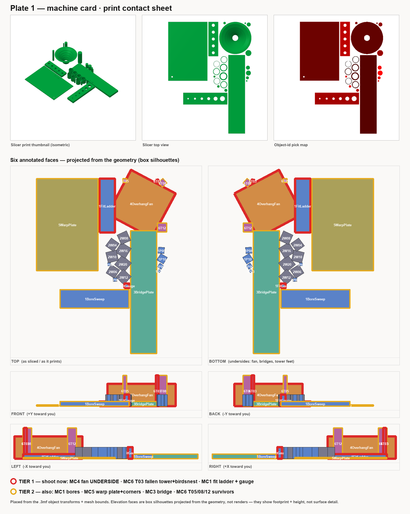

# Plate 1 — machine-card bench sheet

The physical sheet you carry to the printer and mark up **at the bench, not from memory**.
Print it, or copy the fill-in blocks onto paper. It pre-populates every rung, ladder, instrument
and PASS/borderline/FAIL scale so nothing has to be recalled while a warm part is in your hand.

Sources, verbatim: the ladders and the 23-row expectation table are
[`calibration-design.md`](../calibration-design.md) §5–§7; the technique and judgement rules are
the [`calibrate` protocol](../../.claude/skills/calibrate/protocol.md). When this sheet and either
source disagree, the source wins — tell me and I will fix the sheet.

---

## Read these three things first

1. **A rung range is a bracket around an unknown, not a prediction.** The pass is the answer landing
   *inside* the ladder, not near its middle. **Every rung passing, or every rung failing, is a valid
   result** — it tells you which way to re-centre the ladder next time; it is never "the coupon didn't
   work." A reading that *refutes* the design is a success and must not be erased.
2. **A reading without a profile header is anecdote, not calibration.** Fill the header block below
   *before you measure anything*. Print the whole card in **one material, one profile, one session** —
   a card printed across two sessions is two half-cards.
3. **Do not adjust a reading toward what it "should" be.** If a number disagrees with the literature,
   the number wins — that disagreement is why the card was printed.

---

## Profile header — auto-pull it, then complete the blanks

**Do not hand-transcribe this block.** Run
`tools/bambu/bin/bambu header --plate <plate.3mf>` at the bench (read-only — it reaches the printer
without moving it and reads the sliced plate you are about to run), paste its output here, and then
complete **only the blanks it left**: ambient room temp, enclosure open/closed, the caliper line, and
any settings you changed from the profile. The verb fills machine / firmware / material / nozzle /
layer / profile / slicer / date from the machine + the `.3mf`, so a mistyped nozzle or a forgotten
profile name can no longer turn a reading into anecdote. Fields the X2D has not been observed to
answer (spool id, the frame's nozzle, get-version firmware) print `unconfirmed` — never a made-up
value; fill those by hand if you know them. The pre-flight trio below is the **input** to `--plate`:
you slice with it, then `header` reads it back out of the `.3mf`, so this sheet and the file cannot
silently disagree.

```
Machine   ______________________  firmware ____________
Material  brand ______________  type ______  COLOUR ______________  (colour changes flow — record it)
Spool     ______________________  (so a re-measure can rule the spool in or out)
Nozzle    diameter ______  type ______  (brass / hardened / CHT — they do not flow alike)
Layer height ______
Profile   ________________________________  (slicer profile name VERBATIM)
          settings changed from it: ______________________________________
Ambient   room ~____°C   enclosure: open / closed
Date      ____________
Caliper   make ____________  resolution ______  zeroed at session start? y / n
```

## Pre-flight — settled in software 2026-09-16 (transcribe into the header above at the bench)

The slice path is proven headless against a real X2D profile — `bambu slice plate <coupon.stl>` produced
valid X2D G-code (`printer_model = Bambu Lab X2D`, `nozzle_diameter = 0.4,0.4` — the dual nozzle is real
and lives in the *slicer profile*, not the machine target). Select these known-good presets in Bambu
Studio and copy them into the profile header verbatim; the numbers are meaningless without the header.

| Header field | Confirmed value to select | Note |
|---|---|---|
| Slicer | Bambu Studio **2.08.02.61** | ships the full X2D profile family (0.2/0.4/0.6/0.8 nozzle) |
| Machine | **Bambu Lab X2D 0.4 nozzle** | the card is authored at a 0.4 nozzle (min-feature ladder) |
| Process | **0.20mm Standard @BBL X2D** | one profile for the whole card; do not change per coupon |
| Filament | **Bambu PLA Basic @BBL X2D 0.4 nozzle** | one material, one session |

Settings that are **measurements, not preferences** (per [`calibration-design.md`](../calibration-design.md)
§4): MC-4 fan supports **OFF**, MC-6 towers **bare plate, no brim/raft**. Set them before slicing the plate.

**MC-4 fan — pre-flight eyeball done (the check [`calibration-design.md`](../calibration-design.md) §8 asks
for before filament).** Sliced supports-off, the fan renders exactly as §5.4 specifies: a single 360°
`revolve` — a funnel/frustum, base on the bed, flare opening upward, with the six overhang angles as
concentric riser bands increasing bottom-to-top. No dropped features, correct upright orientation (any
other orientation is a *different* test). It is a **full revolved funnel, not a one-way ring** — expect a
bowl, and inspect the **outer underside of the flare** for curl/droop when the part is in hand.

## Technique (the same for every caliper rung)

- **Cool ≥30 min** before the caliper touches the part (longer for PETG/ABS). A warm part reads large,
  and inconsistently.
- **Zero the caliper** at session start; **light, consistent jaw pressure** — close until the jaws just
  contact. Over-clamping is the usual cause of a bore that "measures" 0.1 mm small.
- **Three readings per feature**, at distinct rotations; record all three, report the **median**. A
  spread **> 0.05 mm is itself a result** — write it down, do not average it away.
- **Bores: two orthogonal diameters** (along X and along Y) at mid-height — FDM bores are not round,
  and the X/Y difference is the anisotropy the fit classes live or die by. Never one bore diameter.
- **Walls: away from corners and seams** — the seam is a different thickness and answers a different
  question.
- **Never fill a row from a slicer preview or a render.**

---

## MC-1 — bore & fit plate → `CAL-FIT-01`, `CAL-HOL-01`

**Fit ladder (`MC1FitLadder`, five bores at ⌀6, offset by `FIT_GAP_MM` verbatim).** Judged **by hand**;
record *who judged*. Try the one `MC1FitGauge` rod in all five bores.

| Bore class | gap vs ⌀6 | should behave like | your call |
|---|---|---|---|
| press | −0.10 mm | needs a **tool / bench pressure** to seat | |
| line-to-line | 0 | seats with resistance, no clearance | |
| snug | +0.05 mm | seats with **firm thumb**, won't fall out inverted | |
| sliding | +0.15 mm | moves under its **own weight** with resistance | |
| free | +0.35 mm | **drops** under its own weight | |

> PASS = each named class behaves like its name. If *press* slides or *free* jams, the ladder brackets
> wrong — log it and note which way to re-centre. Judged by: ______________

**Bore + pin sweep (`MC1BoreSweep` bores; `MC1Pin03…10` rods).** Caliper **both** the bore and its
matching pin — only the *difference* is `holeCompMm` (shipped 0.20 / 0.25). The drift of each from its
commanded ⌀ is the number sought.

```
⌀nom | bore X | bore Y | pin X | pin Y | bore med | pin med | Δ(bore−pin) | note
-----+--------+--------+-------+-------+----------+---------+-------------+---------
 3   |        |        |       |       |          |         |             |
 4   |        |        |       |       |          |         |             |
 5   |        |        |       |       |          |         |             |
 6   |        |        |       |       |          |         |             |
 8   |        |        |       |       |          |         |             |
10   |        |        |       |       |          |         |             |
```

## MC-2 — wall ladder → `CAL-FEA-01` (moves the 1.2 mm min-feature floor)

Seven upright walls. The first four rungs are **sub-floor by design** — they were rendered without
`--check` and are *expected* to print badly or drop out. Find the **thinnest wall that prints as one
solid continuous perimeter** (not Arachne'd into a single wandering bead, not silently missing).

```
wall nom | printed? | single clean perimeter? | caliper (median) | note
---------+----------+-------------------------+------------------+---------
0.4  (sub-floor)   |          |          |          |
0.6  (sub-floor)   |          |          |          |
0.8  (sub-floor)   |          |          |          |
1.0  (sub-floor)   |          |          |          |
1.2                |          |          |          |
1.6                |          |          |          |
2.0                |          |          |          |
```

> The result is the **lowest rung that is still solid and clean**. That number is the machine's real
> minimum feature — it moves `DEFAULT_MIN_FEATURE_MM` for every part in the repo.

> **Slicer warning is expected on the 0.4 mm rung only.** When you slice Plate 1, BambuStudio raises one
> `floating regions` advisory — on `MC2Wall04` (0.4 mm) and nothing else (0.6/0.8/1.0 slice clean even
> though they are sub-floor for the mesh gate). That is by design: it is the thin end of this ladder.
> **Do not** re-orient the wall or turn on supports to make it go away — that would ruin the measurement.
> The pre-dispatch warnings gate already whitelists it, so it will not block the print.

## MC-3 — bridge plate → `CAL-BRG-01` (the ≤10 mm rule)

Eight blind bores spanned as bridges; **the bore diameter is the span**. Visual, per rung. Record the
**first rung that _sags_**, not the first that fully fails — the usable limit is the **last clean one**.

```
span mm |  4  |  6  |  8  | 10  | 12  | 16  | 20  | 25
verdict |     |     |     |     |     |     |     |      (clean / sagging / drooping / failed)
```

> First rung that sags: ______  ·  Last clean rung: ______  (this is the usable bridge limit)

## MC-4 — overhang fan → `CAL-OVH-01`

Print with **supports OFF**. A truncated ring of increasing overhang; risers make the angles countable
bottom-up. Record the first angle showing **curl or droop** on the underside, and **photograph the fan**.
Note whether you read from-vertical or from-horizontal (they coincide only at 45°).

```
angle (from vertical) | 20° | 30° | 40° | 45° | 50° | 60°
underside quality     |     |     |     |     |     |       (clean / curl / droop)
```

> First angle to curl/droop: ______   ·   Photo taken? y/n   ·   angle convention: from-vertical / from-horizontal

## MC-5 — warp plate → `CAL-WRP-01` (`warpMm`, today absent from every profile)

120 × 80 × 1.6 mm. On a **flat reference** (granite plate or float glass), measure the gap at **all four
corners** with a feeler gauge (no feelers → caliper the edge-to-reference offset). Record **all four**,
not the worst — the *pattern* separates warp from a bed-levelling artifact. Corner A is by the ⌀3
fiducial, then B/C/D clockwise.

```
corner | A (⌀3 fiducial) | B | C | D
gap mm |                 |   |   |
```

> Diagonal pattern → warp. One-corner outlier → bed levelling. Flat all four → no measurable warp (a
> result: `warpMm` gets a real number, likely 0-ish, replacing the deliberate absence).

## MC-6 — bed-contact towers → `CAL-BED-01`

Four rods on **bare plate, no brim/raft**. Record which **survived** and which **detached**, and — this
is the load-bearing distinction — **never-stuck (adhesion)** vs **stuck-then-snapped mid-print
(stiffness)** are *different* results. Note the height if a snap was seen. Caliper the **elephant's foot**
at each base.

```
⌀ tower | 3 | 5 | 8 | 12
outcome |   |   |   |     (survived / never-stuck / snapped@__mm)
foot mm |   |   |   |     (elephant's foot at base)
```

> `MIN_BED_CONTACT_RATIO` is untestable on a straight rod (reads 100% every rung) — it rides this
> coupon's adhesion result by inference. Do not claim it was measured directly.

---

## What a `--check` PASS does NOT tell you (don't over-claim)

The mesh gate is silent on MC-3's 2 mm bridged ceiling and MC-4's 2 mm fan wall — those PASS marks are
about **mesh soundness only** (watertight, non-degenerate), not printability. Only the physical part
answers the bridge, the overhang, and the wall.

## What to photograph — the plate map

Which coupon is which, and which ones to shoot, read off the plate top-down. Regenerate with
`make plate-photo-map` (from the sliced `.3mf`); the red rings are shoot-now, amber also-useful.
The contact sheet pairs the annotated faces with the slicer's own baked thumbnails — isometric
print thumbnail, top view, id map — then adds all six orthographic faces (top/bottom, front/back,
left/right) projected from the geometry. Top and bottom carry the full id set; the elevations are
box silhouettes that show which coupons stand tall (towers, fan) and where the undersides are, and
label only the ringed coupons. Bottom is the mirror you see when you flip the plate to shoot fan
undersides, bridge undersides, and tower feet.



## Priority order — what to test, most leverage first

1. **MC-1 fit ladder — by fingers, zero instruments.** Do this the moment the plate is off the bed;
   it settles `CAL-FIT-01` on hand-feel alone.
2. **MC-3 bridge · MC-4 fan · MC-6 towers — by eye / camera.** Visual reads; capture photos for the record.
3. **MC-1 bores + MC-2 walls — caliper.** Median of three, orthogonal bores. MC-2 moves the repo-wide
   min-feature floor — the single most consequential number on the card.
4. **MC-5 warp — feeler gauge on the flat reference.**

## Failures and surprises (a failed rung is a result — write them here)

```
_______________________________________________________________________________
_______________________________________________________________________________
_______________________________________________________________________________
```

---

*After the bench: hand these readings back and I run the five-step propagate
([`backlog.md`](../backlog.md) §5) — constant + `Calibrated<T>` status flip together, the entry leaves
bikar's `.calibration-baseline.json`, `bets.md` is regenerated (never hand-edited), the design-doc
Appendix B entry closes with the measured value, and the catalog Status flips with the number and commit
hashes. A refuting reading propagates the same way — it is not deleted.*
