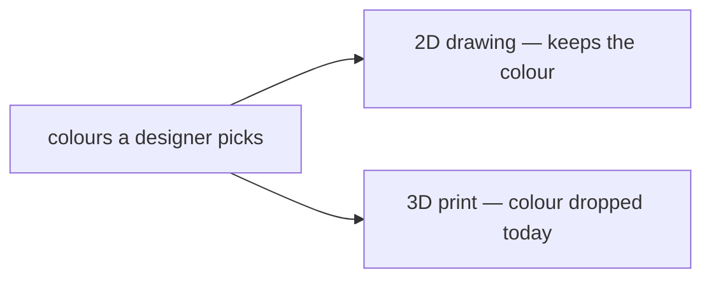
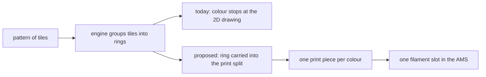
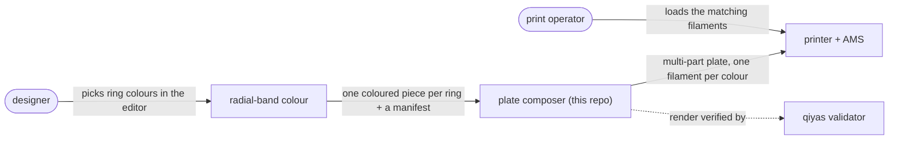
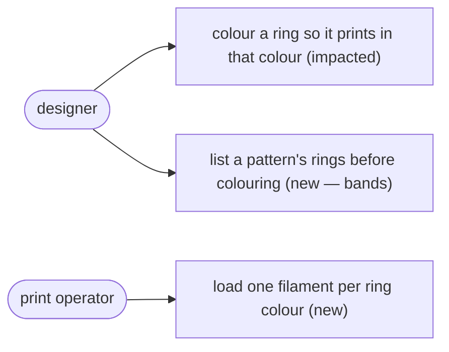
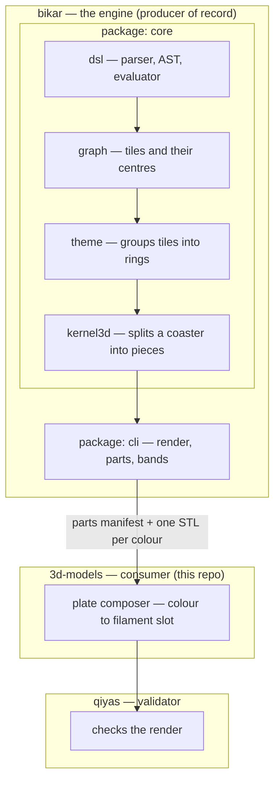
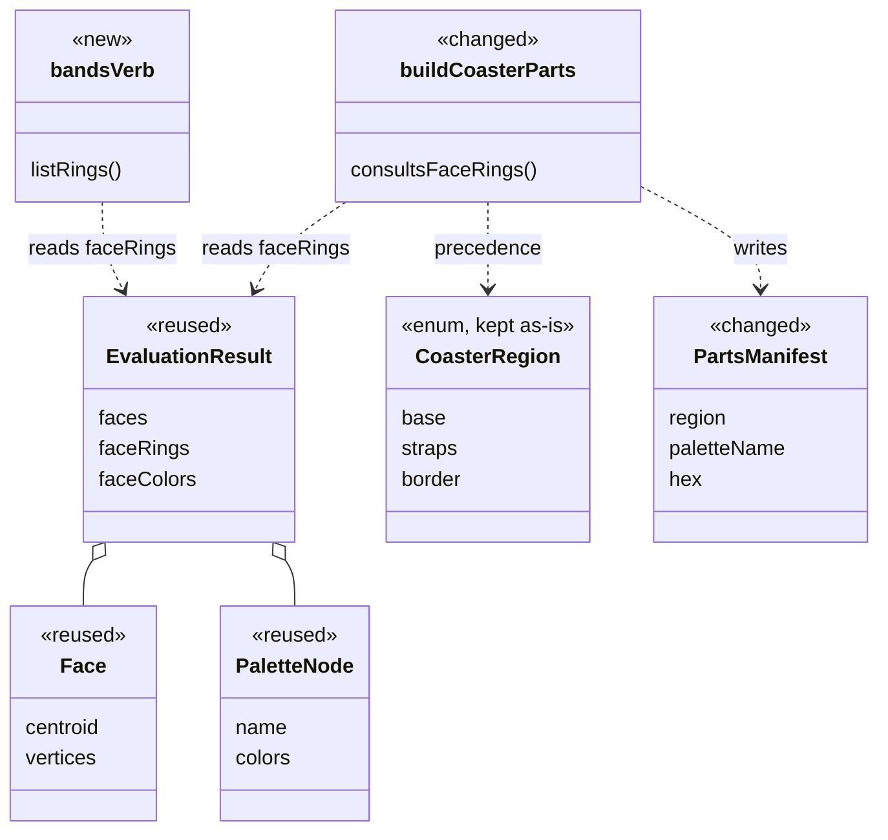
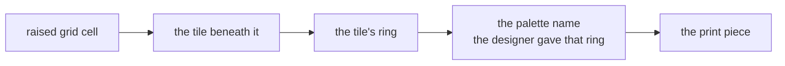
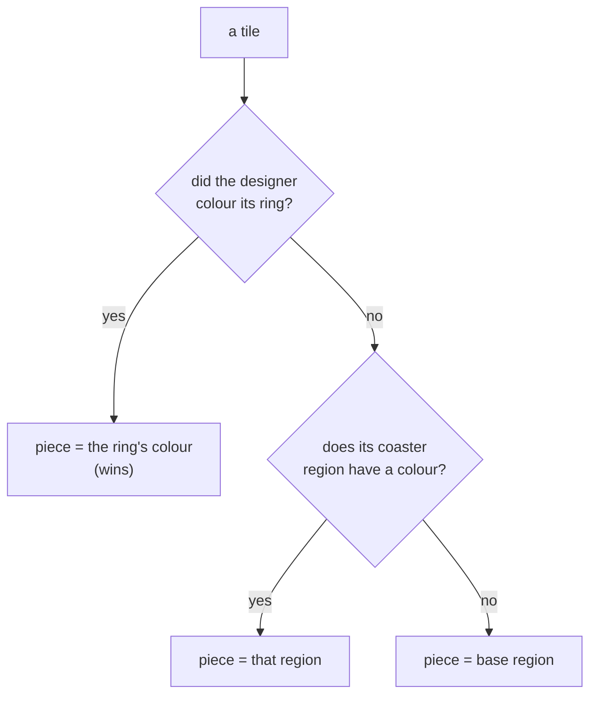

# Radial-band colour — print each ring of a pattern in its own colour

Our decorative patterns are built from many small tiles[^face] arranged in rings around
a centre, like the rings of a dartboard. A designer can already choose a colour for each
ring and see it on screen — but today, when the pattern is 3D-printed, that colour is
thrown away and the whole object comes out in a single material. **This design carries a
ring's colour through to the print**, so a coaster[^coaster] can come off the printer
with a gold inner ring and a copper outer one, each in its own filament[^filament] —
and it does so *without adding any new way to say "this ring is that colour"*, because
our design language already has one.

*Status: designed (task #25, decision [D-078](decisions-log.md); the decision id is
re-verified against `origin/master` at merge, per the id-collision rule). The research
this doc rests on is on file at
[`research/radial-band-colour-research.md`](research/radial-band-colour-research.md).*

## The problem

A designer opens the pattern editor[^editor], picks colours for a pattern's rings, and
sees exactly what they expect on screen. They send it to the printer expecting those
colours. Instead the whole piece prints in one colour.

The reason is that a colour chosen in the editor lives only on the **2D drawing**[^twod].
When bikar[^bikar] turns a design into something a printer can build, it takes a
completely separate path — one that has never looked at those 2D colours. So the colour
is real on screen and gone on the print bed.

Concretely: a designer draws a coaster whose centre tile should be gold and whose outer
band should be copper. On screen it is gold and copper. The printed coaster is one flat
colour. There is, today, no way to get the two colours they drew onto the physical part.



**In the diagram:** the designer picks colours in the editor[^editor]; the
2D drawing[^twod] carries them; the 3D print is where they are lost today.

## Why it matters

Multi-colour is the whole reason to own the printer we have: it carries several
filament spools and can switch between them within a single print (that carousel is the
"AMS"[^ams]). A pipeline that drops colour on the way to the print bed wastes that
hardware — every patterned print is monochrome no matter what the designer drew.

The request is recurring and specific. Omar, 2026-09-19: *"in the color mapping process,
in the same constructions, i want to be able to color different polygons differently"*
and *"have tooling to make it easier to apply colors on polygons that have midpoints
that are equidistant from midpoint of construction."* That second sentence names the
grouping precisely — tiles whose centres are the same distance from the middle — which
is exactly a **ring**.

## The idea

A ring is just the tiles that sit the same distance out from the centre. The key insight
is that bikar **already** works these rings out — it has to, in order to colour them on
screen. So this feature invents no new geometry and no new grammar. It does two things:

1. **Carry the rings the engine already computed into the step that splits a model into
   separately-coloured pieces for printing.** A coloured ring becomes its own piece, in
   its own filament.
2. **Add a small read-only command that lists a pattern's rings** — their radius, how
   many tiles each holds, and what colour (if any) the designer gave them — so a designer
   knows which ring they are about to colour instead of guessing.

That is the entire design: a *bridge* (item 1) and a *listing command* (item 2), plus one
rule for what happens when a ring's colour and a coaster's built-in regions[^region] disagree.



**In the diagram:** the engine is bikar[^bikar]; a tile[^face] is one polygon and a
ring is a set of tiles at the same distance out; the print piece prints in one
filament[^filament], loaded into one slot of the AMS[^ams]. The **proposed** branch is
the whole feature; the **today** branch is what it replaces.

## Context and interactions

Before the internals, here is the landscape this feature sits in — who uses it and what
it talks to. Two people touch it: a **designer**, who chooses the colours, and a **print
operator**, who loads the physical filament spools. Between them sit four systems: the
editor[^editor] where colours are picked, the engine (bikar[^bikar]) where the feature
does its work, this repo's plate composer[^composer] that arranges pieces for a print,
and the printer with its AMS[^ams]. qiyas[^qiyas] checks the result. The arrows say what
crosses each boundary.



**In the diagram:** the feature runs inside the engine (bikar[^bikar]); a designer picks
colours in the editor[^editor]; the plate composer[^composer] lives in this repo; the
printer feeds filament from the AMS[^ams]; qiyas[^qiyas] validates. The rounded nodes are
people; the rectangles are systems.

## Use cases

The feature enables or changes three concrete things an actor can do. Each is marked
*new* (not possible before) or *impacted* (possible before, changed by this design).

- **A designer colours a ring and it survives into the print** — *impacted.* Colouring a
  ring already worked on screen; this design carries that colour through to the 3D print
  instead of dropping it.
- **A designer lists a pattern's rings before colouring** — *new.* The read-only
  `bands` command reports each ring's radius, tile count, and current colour, so the
  designer colours a known ring instead of guessing.
- **A print operator loads one filament per ring colour** — *new.* Because each coloured
  ring becomes its own piece with a named colour in the manifest, the operator can map
  colours to AMS[^ams] slots.

Downstream, the plate composer[^composer] is *impacted*: a single model now arrives as
several coloured pieces rather than one, which it already knows how to lay out.



## The user-facing surface

**Almost none of this is a new screen.** A designer already colours rings in the
editor[^editor]'s Coaster Lab today, with the same controls; nothing about that page, its
tabs, or its buttons changes. What changes is the *result* — a coloured pattern now
prints in those colours instead of coming out monochrome.

The one genuinely new surface is a **command-line command**, `bands`, that lists a
pattern's rings. It adds no page, tab, or button — it is a read-only report an author (or
a script) runs from the bikar[^bikar] CLI. The parts split it feeds (`--format parts`)
already exists. So the honest summary: **one new CLI command; no new GUI surface; the
visible payoff is that printed patterns are finally multi-colour.**

## The pieces and where they live

This feature spans a boundary between two repositories, and knowing which side owns
what is most of understanding it. **bikar**[^bikar] is the engine and the *producer of
record*: it computes the rings and writes the printable pieces. **This product
(3d-models)** is a *consumer*: it reads bikar's output and lays it out for the printer.
**qiyas**[^qiyas] validates the render. Almost all of the work is a bikar change, in two
of its packages; this repo only reads a manifest bikar already emits.



**In the diagram:** the ring grouping lives in bikar[^bikar]'s *theme* package; the
coaster[^coaster] split into pieces lives in *kernel3d*[^kernel3d]; the parts split[^parts]
and the new `bands` command are in *cli*; this repo's plate composer maps each colour to
one AMS[^ams] slot; qiyas[^qiyas] validates. The boxes that change are named in the table
below.

### The data model we touch (and why)

Only the types this feature reads or changes — **not the whole engine.** Each is marked
*reused* (we read it, unchanged), *changed* (existing code we modify), or *new*. Drawing
just the impacted slice is deliberate: the point is to show the blast radius, not the
model. The exact source locations stay in the [research file](research/radial-band-colour-research.md);
here we show the shape and the reason.



**In the diagram:** a tile[^face] is a `Face`; the `faceRings` on the evaluation result is
the ring grouping the engine already computed; a `PaletteNode` is a palette[^palette]; the
three `CoasterRegion` values are the coaster regions[^region]. Solid diamonds are
"contains"; dashed arrows are "reads / writes."

| Type or function | Package | Status | Why we touch it |
|---|---|---|---|
| `Face` (its centre) | core · graph | reused | ring grouping keys off each tile's distance from the centre; already computed and retained |
| `EvaluationResult.faceRings` | core · evaluator | reused | the per-tile ring index the bridge reads; already survives evaluation, so no new geometry |
| `PaletteNode` | core · dsl | reused | the colour name a ring carries becomes the print piece's key |
| `CoasterRegion` | core · kernel3d | kept as-is | the three built-in regions; deliberately **not** extended — the precedence rule lets a ring colour win *alongside* them, leaving this hard-coded enum untouched |
| `buildCoasterParts()` | core · kernel3d | **changed** | today it splits by grid and region only; it must also consult `faceRings` via the grid→tile→ring lookup (the bridge) |
| parts manifest | cli | **changed** | the region key widens from the three-value enum to "one piece per colour"; the `paletteName`/`hex` fields it already emits are reused |
| `bands` verb | cli | **new** | a read-only command that lists a pattern's rings — radius, tile count, colour — so a designer sees what they are colouring |

Why class level and not package level for this table: the impact set is seven units,
small enough to name each with its reason. A larger blast radius would be drawn at
package level instead — the rule is to draw the data model at whatever level lets every
touched unit carry a one-line *why*.

## How it works

### Carrying a ring's colour into the print (the bridge)

Plainly: when bikar splits a coaster into printable pieces, each piece should be "all the
tiles the designer painted the same colour," and a coloured ring is one such group.

The mechanism has one wrinkle worth stating. bikar's print-splitter, `--format parts`
(shipped in [bikar PR #275](https://github.com/NaqshCoffee/bikar/pull/275)), decides
which piece a bit of the model belongs to by walking a **grid** over the coaster's raised
surface[^heightfield] — not by walking the 2D tiles where ring membership lives. So the
bridge is a lookup that connects the two:

1. Each raised grid cell already knows which 2D tile sits under it (the splitter
   walks the tiles to raise the surface in the first place).
2. That tile's ring is read from the grouping the engine already computed.
3. The piece a cell belongs to becomes **the palette[^palette] name the designer assigned
   to that ring** — the colour, not the ring number. Keying on the colour means two rings
   painted the same colour merge into one piece (one filament), and a ring left unpainted
   falls back to the coaster's own regions (see precedence, below). This is what keeps the
   number of printed pieces equal to the number of *colours*, not the number of rings.



**In the diagram:** the grid cell belongs to the coaster's raised surface (height
field[^heightfield]); the tile[^face] is the polygon under it; the palette[^palette]
name (the colour) — not the ring number — is what decides the piece, so same-colour
rings merge.

A pattern that is not a coaster has no raised surface to split, so "reach the 3D print" is
out of scope for it here — this bridges rings into the **coaster** print, the only solid
bikar currently builds. A bare pattern keeps its on-screen ring colour unchanged.

### Listing a pattern's rings (the `bands` command)

Plainly: before a designer can say "colour ring 1 gold," they need to know the pattern
*has* a ring 1 and which tiles are in it. `bikar bands <pattern>` prints that list, one
line per ring — modelled on the existing `points` command, which lists a construction's
named points without drawing anything:

```
ring  radius   tiles  colour
0     0.00     3      —
1     8.24     6      Gold
2     14.10    6      —
```

`radius` is the mean distance of the ring's tiles from the centre; `colour` is the
palette name the designer assigned, or `—` if none. The data already exists after the
pattern is evaluated, so this command is a formatter, not new engine work. It answers
both "which ring number do I write?" and "did my colour land on the ring I meant?"

**Validator:** `bikar bands <pattern>` lists every distinct ring the engine found, each
once, in ascending order, and the number of rings listed equals the number of distinct
ring values in the same pattern's on-screen render.

PASS: a rosette whose tiles fall into three rings lists rings 0, 1, 2 — three lines — and
its on-screen render marks tiles with exactly the ring values {0, 1, 2}.

FAIL: a pattern whose tiles all sit at one radius lists two or more rings, or lists ring 0
twice, or lists a ring that never appears in the render — each means the command and the
renderer disagree about the grouping, which is the bug this validator exists to catch.

### When a ring colour and a coaster region disagree (the precedence rule)

This is the one design choice a reviewer should check, because it is what stops the number
of printed pieces from exploding.

A coaster already divides itself into three built-in regions by shape — `base`,
`straps`, `border`. A ring divides tiles by distance. The two divisions are independent,
so naïvely a coaster could produce one piece for *every* combination of (region × ring) —
mostly empty, and far more pieces than the printer has filament slots. The rule that
prevents this:

**A ring's colour, where a designer set one, wins over that tile's built-in coaster
region.** So the pieces are: one per colour a designer assigned to any ring, plus the
coaster's own `base`/`straps`/`border` pieces for the tiles no ring colour claimed. A
designer gets exactly as many pieces as they used colours — never the full grid of
combinations. Every tile has exactly one owner, so the split is never ambiguous.



**In the diagram:** a tile[^face] takes its ring's colour if it has one; only if it
doesn't does its coaster region[^region] decide. This is the single rule that keeps one
owner per tile.

**Default:** a tile claimed by neither a ring colour nor an explicit coaster-region colour
belongs to the `base` region — the same default
[`coaster-colour-design.md`](coaster-colour-design.md) §3 already ships, and **CAL-PIN-01**
still governs the two-filament pinch floor at any resulting colour boundary, unchanged by
this doc.

## Alternatives and the decision

Three ways to let a designer name a coloured band were on the table, judged on five axes
(the same axes [`coaster-colour-design.md`](coaster-colour-design.md) §2 uses, so the two
colour routes are graded alike): **R1** the language stays about geometry, not hardware;
**R2** one radial system, not two; **R3** the result is checkable; **R4** it costs the
grammar little; **R5** it carries into the on-screen render, the print, and the editor.

| Option | R1 | R2 | R3 | R4 | R5 | Verdict |
|---|---|---|---|---|---|---|
| (a) **Reuse the ring colour a designer already sets on screen** — that ring becomes a print piece, mapped to a filament exactly as coaster regions already are | 2 | 2 | 2 | 2 | 2 | **chosen** |
| (b) A new "colour band *N*" statement naming a band by number | 2 | 0 | 2 | 1 | 1 | adds a *second* way to say "the Nth ring" beside the one that ships — one idea with two spellings, the divergence our [robustness tenet](../CLAUDE.md) calls the defect itself |
| (c) A "colour ring *r0*..*r1*" statement with explicit radii in mm | 1 | 0 | 1 | 1 | 1 | most control, but the designer must know the radii, and it still adds a second radial system |
| (d) Do nothing — the colour stays on screen only | 2 | 2 | — | 2 | — | does not answer the ask; kept as the honest baseline that verifies nothing |

(a) wins because the one thing the language *should* own — which tiles form a band — is
already owned by the shipped ring grouping, and the one thing it should *not* own — which
filament spool — is already handed off by the coaster colour work. The feature adds no way
to name a band because one already exists. Decision **D-078** (2026-09-19; Omar chose (a)
from a rendered comparison of (a)/(b)/(c)).

## Scope and status

- **Grammar:** no new production. The existing on-screen ring-colour clause is reused.
- **Engine:** the bridge (a tile's ring → its print piece) and the precedence rule. One
  bikar change.
- **Command:** the read-only `bands` listing. May ship with the bridge or follow it; it is
  independent.
- **Filament mapping:** unchanged — it already keys on the palette name.
- **Out of scope:** ring colour into a non-coaster solid (bikar builds none); an
  explicit-radius grammar (option (c), rejected); any fixed filament-slot count (see the
  glossary note on the AMS, and the appendix).
- **Calibration bets:** none new. The filament-slot limit is a fact to read off the live
  printer, not a number to earn — the appendix explains why this doc states no slot count.

## Glossary

[^coaster]: **coaster** — a small flat disc (the kind you set a mug on). It is the one
    physical object bikar currently builds a printable 3D solid for, so it is the running
    example throughout this doc.
[^filament]: **filament** — the spool of plastic a 3D printer melts to build a part. One
    part printed in one filament is one colour; multi-colour needs a separate piece per
    filament.
[^editor]: **editor** — the in-browser design tool (the "Lab") where a designer draws a
    pattern and picks its colours before printing.
[^twod]: **2D drawing** — the flat, on-screen version of a design (an image), as opposed
    to the 3D solid that gets printed. Colours have always lived here.
[^bikar]: **bikar** — our in-house engine that turns a design written in our small design
    language into both the on-screen drawing and the 3D model a printer builds. It is a
    separate repository this product consumes.
[^ams]: **AMS** — the printer's Automatic Material System: the carousel that holds several
    filament spools and feeds them in turn, so one print can use several colours. The
    number of spools it holds is a property of the specific printer, not a fixed constant
    (see the appendix).
[^heightfield]: **raised surface / height field** — bikar builds a coaster by raising a
    flat slab to different heights across a fine grid; the pattern's relief is that grid of
    heights. The print-splitter walks this grid, which is why the bridge has to connect a
    grid cell back to the flat tile beneath it.
[^face]: **tile (face)** — one small polygon of a pattern: the enclosed area bounded by the
    lines and circles a designer drew. A pattern is many tiles; a ring is a set of tiles at
    the same distance from the centre.
[^palette]: **palette** — the named set of colours a design declares (e.g. `Slab`, `Gold`,
    `Copper`). A ring or region is coloured by naming a palette entry, and that name is what
    later maps to a filament spool.
[^region]: **coaster region** — one of a coaster's three built-in structural parts, split
    by shape rather than by colour: `base` (the slab), `straps` (raised bands), and
    `border` (the rim). These predate rings and are what the print-splitter uses today.
[^qiyas]: **qiyas** — our validation service (a separate repository). It re-renders a
    design and checks the output matches what bikar produced; it is the last stage before
    a design is trusted, and does not build geometry itself.
[^kernel3d]: **kernel3d** — the part of bikar that turns a flat design into the 3D solid a
    printer builds, as opposed to the 2D on-screen drawing. The coaster's print-splitter
    lives here.
[^parts]: **parts split** — bikar's mode (`--format parts`) that exports a model as several
    separate STL files, one per coloured piece, plus a small manifest naming each piece's
    colour. It is the input a multi-colour print needs.
[^composer]: **plate composer** — the tool in this repo (3d-models) that arranges one or
    more models onto a printer's build plate and maps each piece's colour to a filament
    slot, producing the file the printer slices. It consumes bikar's parts split; it does
    not build geometry itself.

## Appendix — where this lives, and the ungrounded number

The exact source locations for every mechanism above (the ring-grouping function, the
per-tile ring data retained after evaluation, the coaster region enum, and the
`--format parts` splitter) are pinned with file-and-line anchors in the research file,
[`research/radial-band-colour-research.md`](research/radial-band-colour-research.md), and
are cited there against a bikar commit rather than repeated here — bikar internals are
referenced by pull request, not by cross-repo path, so a moved line in the sibling repo
does not silently rot this doc.

Two facts from that research shape the design and are worth stating plainly:

- The coaster region set (`base`/`straps`/`border`) is a fixed three-value list hard-coded
  in three separate places in bikar. The bridge deliberately does **not** extend that list;
  a ring's colour becomes a print piece *alongside* the regions, resolved by the precedence
  rule, precisely so this hard-coded set is left untouched.
- **The printer's filament-slot count is not recorded anywhere in either repository.** The
  printer is dual-nozzle with per-unit spool trays plus one external spool, but the usable
  number is a live device fact. So this doc states the bound qualitatively and pins no
  number: the `bands` command and the plate composer should **warn — not refuse —** when a
  design uses more distinct colours than the live printer reports it can load, and the count
  is confirmed against the real printer before any print. Writing a slot count here as a
  fixed default would be a guess dressed as a fact; the honest record is "read it from the
  device," and the print itself is owner-gated regardless.
