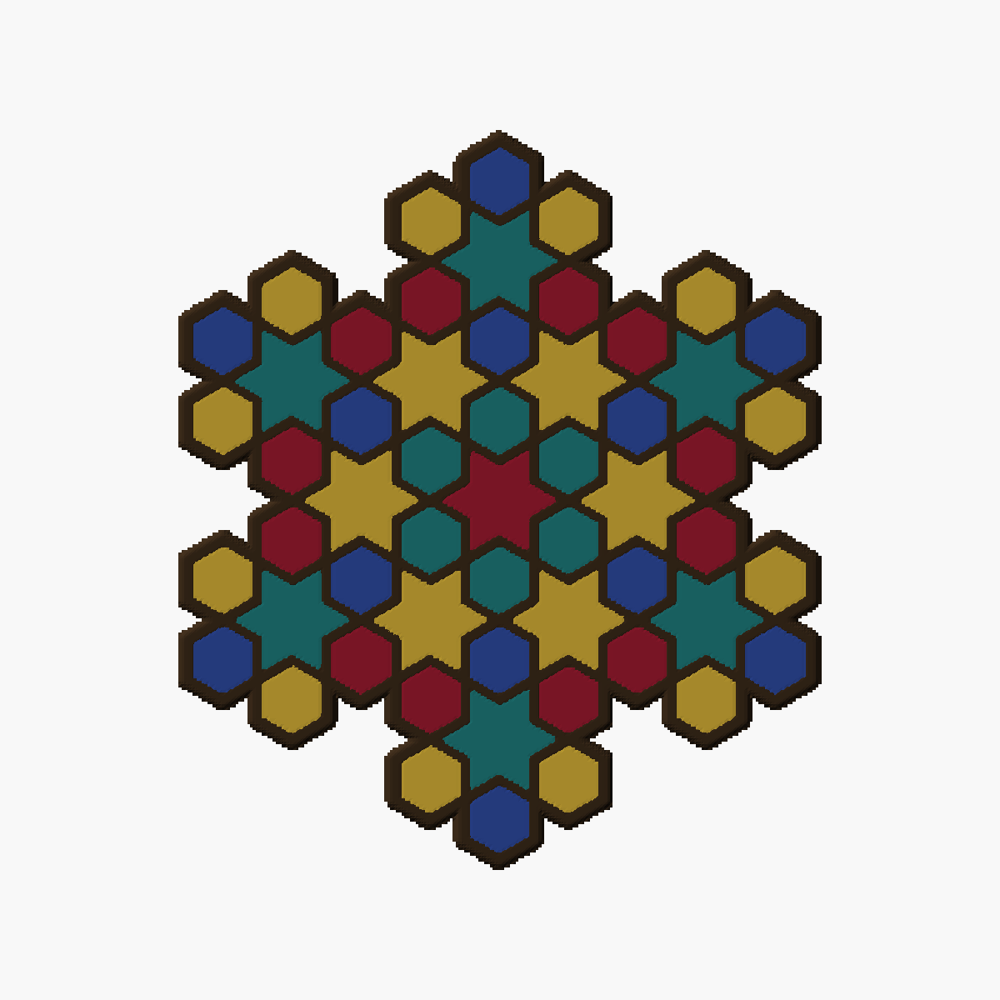

# Colour proofs of concept — is it only an engine change?

- **Date:** 2026-09-28
- **Produced by:** the main session (proofs 1 and 3) and a helper agent (proof 2), run by hand
- **Feeds:** [color-preview-design.md](../design/coaster/color-preview-design.md) §4 (the openwork split) and §5
  (Coaster Lab controls); the flush-or-lowered call in [multicolor-design.md](../design/coaster/multicolor-design.md) §3
- **Question (Omar):** "are there simple pocs we can run to prove it's only an engine change? can we
  craft a simple multi color scad by hand, screenshot it and prove we have control over color" —
  then "any other pocs we can run and document too?"
- **bikar state:** `bikar-work` on `feat/orbit-radial-fill` at `f8796fc` (open PR NaqshCoffee/bikar#270),
  which adds the `orbit` word and the radial CS-1 coaster
  `patterns/Constructions/GimTvN9hw4U-radial-coaster.bkr`.
- **Files kept here:** [`color.scad`](color-poc-2026-09-28/color.scad) (the hand-written colour
  file) and [`poc2-plate.yaml`](color-poc-2026-09-28/poc2-plate.yaml) (the plate proof 2 sliced).
  The STLs were scratch and are not checked in; the commands below rebuild them.

## The short answer

Yes, it is only an engine change. The engine already finds the orbits (the rings of pieces). By hand
we coloured each ring in a picture and changed its height. We also cut the rings into separate solids
and fed them through the real colour-plate tool, which assembled a four-slot 3MF that slices clean.
Nothing downstream of `bikar render --format parts` had to change. What is missing is bikar making
those separate solids itself for an openwork coaster (design §4). Printing one is still untested.

## Proof 1 — colour control by hand (passed)

**How.** Render the radial coaster once with no fills and once per orbit with only that orbit
filled. The per-orbit version is the radial file with its four `fill` lines replaced by one,
`fill void where orbit == $pick color Gold`, plus `param pick = 1 range 0..7`:

```
node packages/cli/dist/index.js render plain.bkr --format stl -o plain.stl
node packages/cli/dist/index.js render one.bkr --format stl --param pick=N -o orbitN-filled.stl   # N = 0..7
```

The volumes rose as expected (plain 14.0 cm³, orbit 1 alone 15.0 cm³, orbit 5 alone 16.0 cm³). Then
[`color.scad`](color-poc-2026-09-28/color.scad) draws the plain coaster in a strap colour and each
filled mesh in its own colour, and OpenSCAD 2021.01 writes a PNG from the command line in under a
second.

**Seen** (looked at each picture):

- every ring in its own colour, top view — the eight rings read as clean concentric bands:
  
- the snowflake (orbits 1, 3, 5, 7), each ring its own colour, centre star open:
  

**What it does not prove.** This is a picture trick, not separate parts: two overlapping meshes, with
the straps lifted 0.02 mm so their tops win. Fill colour bleeds onto some strap side walls, and a few
fill tops show small V-notches where the top-edge fillet of the joined mesh differs from the plain
one. Both are drawing artefacts of the overlap, not features of a part.

## Proof 2 — the printer path takes hand-cut bodies (passed)

**How.**

1. Cut each ring into its own solid in OpenSCAD:
   `difference() { import("orbitN-filled.stl"); import("plain.stl"); }` rendered to STL (about 2
   minutes per ring). Orbit 1 came out as 6 separate volumes, one per hexagon, as it should.
2. Swap only the producer. A throwaway bikar worktree was pointed to by `BIKAR_DIR`. Its CLI answered
   the one `render … --format parts` call by copying the hand-cut bodies plus a `Coaster.parts.json`
   sidecar, and passed every other call to the real bikar CLI.
3. Run the real colour-plate tool on [`poc2-plate.yaml`](color-poc-2026-09-28/poc2-plate.yaml):
   `bambu slice coaster poc2-plate.yaml --dry-run`, then the same without `--dry-run`
   (`-d <scratch> --no-record`). Both exited 0. Slicing was local only; nothing went to the printer.

**Result.** One object with 5 parts, mapped to 4 AMS slots:

| Slot | Colour | Parts |
|---|---|---|
| 1 | plate default | straps |
| 2 | Ruby `#9b1b30` | orbit 1, orbit 7 |
| 3 | Teal `#1f7a7a` | orbit 3 |
| 4 | Gold `#d4af37` | orbit 5 |

- The 3MF was assembled (1019 KB), and the headless slice printed
  `geometry verify: PASS — sliced clean headless, 1 object(s) loaded`.
- A first try with four fill colours was refused: "plate needs 5 logical filament slots … but the
  AMS has 4". That is the tool working as meant. One AMS unit gives the default filament plus 3
  colours, so orbit 7 shared Ruby.

**What it does not prove.**

- **The engine split.** OpenSCAD cut the bodies, not bikar.
- **The colours on screen.** The headless slice cannot read per-part colour. That is a look in
  Bambu Studio (`bambu slice open <3mf>`).
- **The plate picture.** The tool's picture is drawn from the `.bkr`, so it showed the rings as
  Gold or empty, and it warned that orbits 1, 3 and 7 were missing. It can only show the split once
  the engine makes it.
- **Printing.** The colour change inside each layer, how much purge it takes, and a first layer in
  several colours are all unmeasured.

## Proof 3 — flush or lowered, by hand (passed, a look only)

**How.** In `color.scad`, `drop` moves each filled mesh down and clips it at the bed. A lowered
fill is then `height − drop` tall and still stands on the bed. Rendered with `-D drop=0`, `1` and `2`.

**Seen:**


At 1 mm the fills read as inlays with the straps standing proud. At 2 mm (half the 4 mm wall) the
straps dominate. Which to use is Omar's call (#89). These pictures show the look before the
`fills <mm>` clause exists. The camera is off-centre and the proof 1 artefacts are in these pictures
too.

## Not run

- **A first layer printed in several colours.** Only the printer can answer this. It is owner-gated,
  and `calibrate` writes the bet before it prints (design §10 step 8).
- **Colour on a slab coaster.** Not repeated here: researcher B already showed it through the Lab, the
  parts and a picture ([research B](color-preview-2026-09-28-b.md)).
