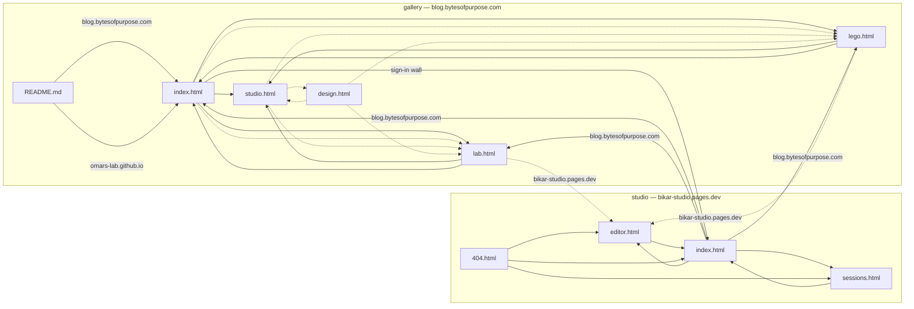

# The site graph — what this project publishes, and where each link lands

Generated from [`site-graph.json`](site-graph.json) by
`.claude/gates/site_graph.py --mermaid`. Regenerate with `make site-graph`.

Solid arrows are links present in the markup. Dotted arrows are computed by
JavaScript at runtime — a crawler that does not execute scripts sees none of
them. Labelled arrows cross a hostname.

## Why a declared graph and not a crawler

The one live defect in this graph is the arrow labelled **sign-in wall**:
[`index.html:277`](../index.html) links the public gallery to
`bikar.naqshcoffee.com`, which sits behind Cloudflare Access. Every visitor but
the owner lands on a login page. Identical bytes are served publicly at
`bikar-studio.pages.dev` and nothing links there.

The survey found a second, simpler one, since fixed: `README.md:7` — the
README's primary call to action, on the deployed branch — pointed at
`3d-models.bytesofpurpose.com`, which is **NXDOMAIN**, while the same file's
§Links section carried a working URL. That is the defect a link checker *would*
have caught, and it is why `README.md` is a node here: the gate's second rule
requires every `viaHost` to name a host some surface declares, and a dead
hostname declares as nothing. The self-test mutates a real edge onto that exact
hostname rather than an invented one.

On 2026-08-02 four crawler runs were pointed at the sign-in link — linkinator against
the live site, linkinator offline against a materialised `gh-pages` copy,
linkchecker, and a headless-Chrome render. **All four reported it OK.** They
cannot do otherwise: Cloudflare answers an unauthenticated request with a login
page and HTTP 200, so a reachability check sees success. linkchecker went
further and rewrote the target to the `cloudflareaccess.com` login URL, which is
the address it would have recorded in any graph it emitted.

Two more measurements from the same survey, which is checked in at
[`research/sitemap-link-graph-survey.md`](research/sitemap-link-graph-survey.md):

- A non-JS crawl of the gallery index sees **8 of its 92** rendered anchors, and
  sees `studio.html` — the site index — as a dead end with zero outbound links,
  because `studio-main.ts` builds its hrefs by concatenation and no URL literal
  survives minification. `design.html` is reachable only through that path, so
  every crawler run missed it entirely.
- The URL-scraping proof-of-concept produced a false positive on its first run:
  a URL inside an HTML comment. That is the failure class
  [`issue-register-evaluation.md`](issue-register-evaluation.md) measured when it
  concluded this repo should have no link checker — ~11% false alarms against a
  true dead-link rate under 1%, and *"a gate that cries wolf gets switched off."*

So the gate never asks whether a URL resolves. It asks whether an edge travels
through a host whose declared exposure makes it a login wall — a fact about two
checked-in declarations, offline, with no false-positive mode. It runs in
milliseconds and needs no network.

## There is no standard to conform to

The survey's central negative finding: **no W3C, WHATWG or IETF deliverable
describes a website's link graph.** In detail —

| To express | Standard | Consumed by |
|---|---|---|
| a flat inventory of pages | sitemaps.org XML | all major crawlers |
| "this page duplicates that one" | [RFC 6596](https://www.rfc-editor.org/rfc/rfc6596.txt) `rel=canonical` — cross-host by spec | Google, as a hint |
| one page's ancestor chain | schema.org `BreadcrumbList` | Google |
| "B is the parent of A" | dropped from HTML on 2011-03-01 | nobody |
| a sequence of pages | `rel=next`/`prev`, still in HTML | not Google |
| **an arbitrary link graph** | **none** | — |

An XML sitemap is a flat node list — its entire vocabulary is `<url>`, `<loc>`,
`<lastmod>`, `<changefreq>`, `<priority>`, with no element for a link — and it
is same-host, same-scheme by spec, so it could not hold this graph even as
nodes: the survey's generator had to emit two files. HTML4's hierarchical
relations (`rel=up`/`index`/`contents`/`chapter`/`section`) were the high-water
mark and were deleted from the WHATWG spec in 2011; they remain IANA-registered
and are acted on by nothing. schema.org's `SiteNavigationElement` has no
properties of its own and no known consumer.

## Maintaining it

**Validator:** every edge whose `viaHost` is declared `exposure: "access"`, and
whose source page sits on a surface with any public host, must carry a
`gated.why`.

PASS: `G.index -> S.index` at `index.html:277` carries a `gated.why` recording
that the sign-in door is deliberate, that both bikar catalogues describe it
wrongly as a walkable loop, and that repointing it at the public twin is the
same decision as task #63.

FAIL: delete that `gated` block and the gate reports —
*"G1: G.index -> S.index at index.html:277 travels through bikar.naqshcoffee.com,
declared exposure=\"access\". G.index is publicly reachable, so every visitor but
the owner gets a login wall."* Run `make site-graph` to watch it: the self-test
mutates the real graph in memory, one defect at a time, and requires each
mutation to be caught by the rule that owns it.

Four more rules, all in [`site_graph.py`](../.claude/gates/site_graph.py): every
`viaHost` must name a declared host; every `file:line` anchor in this repo must
still contain the edge's `evidence` string; `Makefile`'s `LAB_PAGES` must name
exactly the nodes marked `vendored`; and the `fragileIfProtected` list — edges
that die the day a public host goes behind Access — is recomputed and must match
what is checked in. That last one is counted rather than remembered because none
of those edges break a build or turn a test red.

Host exposures are **mirrored** from bikar's `packages/web/public-surface.json`,
which is the authority. bikar is private and is not checked out when this gate
runs, so the gate cross-checks the mirror only when a clone is at hand and says
out loud which mode it ran in. That is the same cross-repo seam `Makefile`
already accepts in as many words: *"Adding a page is two edits, in two repos, and
saying so is cheaper than a cross-repo check that would have to run a build."*
