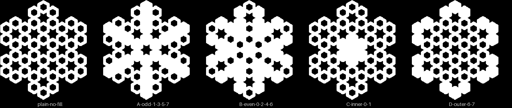

# Backlog — grow the print catalog

Loop: [`catalog-expansion.md`](../../../.claude/loop-prompts/catalog-expansion.md). Done
list: [`done.md`](done.md). How to feed it: [the loop README](../../../.claude/loop-prompts/README.md).

Goal, per pass: the [ledger](../../constructions/ledger.md)'s migrated count up by one, or
the queue of screened candidates grown, each with a written GO or NO-GO.

## Open, in ROI order

1. **`nmEjCTzMbDg` still FAILs O1 and O2, and waits on youtube.** Causes found on
   2026-09-27 ([the FAILs note](../../research/ledger-oracle-fails-2026-09-27.md)). The
   youtube source's `R = Intersect(t, m, 2)` picks the other root in bikar. The patch,
   `Intersect(t, m, S)`, is proposed there and has not been made. Once youtube takes it:
   - regenerate the bikar fixture and goldens;
   - re-vendor the coaster and look at it (it is near-solid now: **do not print it**);
   - re-run O1 and O2.

   What O1 still cannot compare (parabolas, hyperbolas, arcs, the `*_host` circles) is
   youtube's to add. Also youtube's: `naqsh_score.py` treats `ggb_score.py`'s FAIL exit
   (2) as a crash. That patch is in the same note.
2. **Screened queue, 2026-09-27.** Two independent screens and a checker's consolidation:
   [the consolidated screen](../../research/candidate-screen-2026-09-27.md) is the one to act
   on. 10 GO, all from creators other than Sarah Brewer. Coaster fit was judged from
   thumbnails and storyboard frames only, so each still needs its render looked at. In
   rebuild order:
   1. `0ke_GpoBa-s`, Samira Mian, 10-fold rosette: chaptered, and the scaffold items 3, 5–7 reuse.
      **Done 2026-09-28 in youtube: 11/11 steps, mean edge-SSIM 0.869.** It is drawn on paper
      and filmed at a slight angle, so the frames had to be straightened first (`rectify.tsv`).
      The 10-fold grid (Ptolemy's pentagon, the {10/2} and {10/3} stars, the petal lines) is in
      `reconstructions/0ke_GpoBa-s/`, ready for the coaster step.
   2. `88q-u2eWZqg`, Eman Zainab, 16-petal rosette: a new fold; check the crowded centre.
      **Attempted 2026-09-28 in youtube: 6/9 steps, mean edge-SSIM 0.745.** The geometry is
      right. The three busiest steps stop near 0.59 because her pencil compass marks were
      never erased and her compass slipped a little, and no render can draw either. The
      centre was not the problem. For the coaster: the whole rosette is **one closed line**
      (each petal joins the petal three places round, and 3 and 16 share no factor), so it
      suits a single continuous groove. Two octagons, the inner circle and the 16 petals are in
      `reconstructions/88q-u2eWZqg/`, ready for the coaster step.
   3. `n_ICgwOr6qs`, Samira Mian, 5-fold arc motif: rebuild the 1:20–8:06 construction only; needs the arc path.
      **Done 2026-09-28 in youtube: 9/9 steps, mean edge-SSIM 0.886.** Drawn on paper and
      filmed, like 1; the camera zooms out once at about 04:00, so only the petals after it are
      scored. For the coaster: every line is an arc of **one compass size** (the chord across
      two of ten divisions), five front petals and five smaller behind petals, with a small gap
      at the centre where the front arcs stop short. Pure arcs, no straight lines, so it needs
      the arc path the other patterns do not. The ten arc pairs are in
      `reconstructions/n_ICgwOr6qs/`, ready for the coaster step.
   4. `Y6kS1MvnKoc`, Eric Broug, 10-fold star field (Mamluk Qur'an page): crop to the centre star.
      **Done 2026-09-28 in youtube: 17/18 slides, mean edge-SSIM 0.861.** Not paper: a deck of
      clean vector slides, so no camera correction. The whole page was rebuilt, not just the
      centre star. For the coaster: the red pattern is all straight lines, and every corner of it
      sits where two edges of the seven ten-point stars cross, so it can be cut from exact
      points. The page is a rectangle of ratio 1.376 (tan 54°), which is not a coaster shape.
      Crop to a circle round the centre star, or take the page as a tile. Mirror-symmetric both
      ways: a quarter drawn and reflected twice. The construction is in
      `reconstructions/Y6kS1MvnKoc/`, ready for the coaster step.
   5. `NtnlGMTElBk`, Samira Mian, 10-fold interlaced star: clean digital frames, 82 s, no narration.
      **Done 2026-09-28 in youtube: 13/13 steps, mean edge-SSIM 0.930.** For the coaster: the
      finished star is one closed white band, all straight lines, forty segments (a four-segment
      unit turned ten times). Every corner sits where a line of the {10/3} star crosses a line of
      the {10/4} star, so it can be cut from exact points. It already fits a circle (the unit
      circle), so no cropping is needed. The band crosses itself, so it could be cut as an
      over-under interlace. The construction is in `reconstructions/NtnlGMTElBk/`, ready for the
      coaster step.
   6. `yZN_wn0uvTY`, Geogebra_Road to School, 10-fold rosette built in GeoGebra with the algebra list on screen.
      **Swapped 2026-09-28 in youtube for its source, `gBV_JTt3Kxk`** (Samira Mian, "Itimad Ud
      Daula", a 2-minute silent animation of the same pattern). yZN drags the ten divisions by
      eye, so it is held behind gBV. **gBV done: 11/11 steps, mean edge-SSIM 0.906.** For the
      coaster: a ten-fold rosette of straight segments on two line families, pink {10/3} at
      0.588 R and black at 0.139 R, with every vertex a crossing of two named lines. It comes
      with its **repeat cell**, a 72° rhombus with apexes at the top and bottom points and side
      corners at (±tan 36°, 0) = (±0.7265, 0) R. The cell's sides are pink lines already in the
      pattern, so a tile edge never cuts a line at an arbitrary point. The lattice is
      (±0.7265, 1) R. It is either a round coaster (the rosette alone) or a rhombus coaster that
      tiles edge to edge. The construction is in `reconstructions/gBV_JTt3Kxk/`, ready for the
      coaster step.
   7. `_U6G8QSfWnk`, Samira Mian, 5/10-fold girih tiling: conditional; faint tracing steps, may need a one-cell crop.
      **Done 2026-09-29 in youtube: 6/6 steps, mean edge-SSIM 0.895** (pencil on paper, then
      tracing paper; 08:05–17:00 only). The worry did not hold: the pattern is lines, not
      near-solid, and no crop was needed, because the **fivefold rectangle is itself the cell**.
      For the coaster: a rectangle of 1.176 × 1.618 R (aspect tan 54°), with the centres of two
      ten-point stars at opposite corners. Star radii are exact: inner 0.618 R (1/φ), outer
      0.7265 R (tan 36°). The lines inside are a quarter of each star, turned 180° about the
      rectangle's centre; its sides are mirror lines of the tiling, so a rectangular coaster
      tiles edge to edge by reflection. The construction is in `reconstructions/_U6G8QSfWnk/`,
      ready for the coaster step.
   8. `fhGHzop7ULw`, Mohamad Aljanabi, 6-fold rectangle repeat unit: new creator, no new fold.
      **Done 2026-09-29 in youtube: 9/9 steps, mean edge-SSIM 0.921** (a silent animation; the
      scaffold is rebuilt to 06:50, and the finished unit at 11:30). For the coaster: a
      **1 × √3 rectangle** with star centres at two opposite corners, each corner split into
      15° steps. Every line is a tangent to one of two circles about a star centre, radius
      sin 22.5° = 0.383 or cos 37.5° = 0.793 of the short side, touching at 7.5° + 15°·k.
      Turned 180° about the rectangle's centre, the lines give the other star; the sides are
      mirror lines, so a rectangular coaster tiles edge to edge by reflection. The construction
      is in `reconstructions/fhGHzop7ULw/`, ready for the coaster step.
   9. `jlTmt_279M4`, unravelling pattern, 7-point stars in a square (Bourgoin pl. 170): conditional; frames near-white.
      **Done 2026-09-29 in youtube: 17/17 steps, mean edge-SSIM 0.941** (a 2:47 animation; the
      near-white frames were faint grey lines, which score fine). For the coaster: a **square
      tile tilted 90/7° = 12.857°**, with four seven-point stars (radius 0.4725 R) whose centres
      sit on the tile's sides, round an octagon (radius 0.327 R) at the centre. All straight
      lines. Each side runs through a star centre along one of the star's mirrors, so the
      sides are mirror lines: a square coaster tiles edge to edge by reflection, and the half
      stars on the edges close into whole stars. The tile alone has no mirror of its own
      (it turns by quarter turns only). Tile half-width 0.975 R. The construction is in
      `reconstructions/jlTmt_279M4/`, ready for the coaster step.
   10. `A9fefFurD_s`, Lex Wilson, 10-point star from Broug's book: low priority.
      **Done 2026-09-29 in youtube: 17/17 steps, mean edge-SSIM 0.855** (a 3:52 slide deck;
      the dense slides hold at ~0.73 because the slides' own lines are hand-placed slightly off).
      For the coaster: a **single ten-point star medallion**, not a tile. One eight-sided shape
      (corners at the top and bottom points of the circle, (±0.449, ±0.382) R and (±0.172, 0) R)
      turned 36° four times; its ten outer points sit on the circle of radius R, so it fits a
      round coaster. All straight lines, built from one circle by compass and straightedge
      (the pentagon by the golden cut). The construction is in `reconstructions/A9fefFurD_s/`,
      ready for the coaster step.
   11. `1h7iWJaoN80`, Sarah Brewer, Folio 192 of the Anonymous Persian Compendium (Isfahan):
      added from youtube's `make ladder` once rows 1–10 were done.
      **Done 2026-09-29 in youtube: 27/27 steps, mean edge-SSIM 0.862** (a 24-minute narrated
      GeoGebra screencast; the finished panel scores 0.945). For the coaster: a **rectangle of
      1.620 × 1** (the short side is the unit) filled with tan and blue tiles laid out on a
      **regular heptagon** of circumradius 0.2846. The two heptagon centres sit on the long
      sides (one on the bottom, one on the top), so each edge cuts a heptagon. Every edge runs
      along one of the heptagon's seven side directions, all straight lines, from one angle
      (3π/14) by compass and straightedge. The panel turns 180° about its centre onto itself
      but has no mirror of its own. The video says the pattern extends by reflecting the
      rectangle in its sides, so a rectangular coaster tiles edge to edge by reflection. The
      heptagon on the bottom edge is drawn whole and pokes past the rectangle; clip it at the
      edge. The construction is in `reconstructions/1h7iWJaoN80/`, ready for the coaster step.
   12. `kpFgs2e8YGw`, Sarah Brewer, star rosettes on a 3-uniform tiling (12-gon, hexagon,
      square, triangle): added from youtube's `make ladder`.
      **Done 2026-09-29 in youtube: 30/30 steps, mean edge-SSIM 0.911** (a narrated GeoGebra
      screencast with one angle slider). For the coaster: a **six-fold patch** (wallpaper
      group p6m), a ring of 12-fold rosettes round a 6-fold rosette at the hexagon centre,
      with 4-fold rosettes and triangle petals between them. Every line passes through a
      point where two circles touch, at ±30° from the line joining their centres; the circles
      sit on the vertices of a unit-edge tiling (radius ½) and at each polygon's centre
      (radius = circumradius − ½). The 12-gon circumradius is 1.932 of the edge. All straight
      lines, one parameter; at 30° the hexagons come out regular. It fits a round coaster
      centred on the hexagon, clipped at the rosette ring. The construction is in
      `reconstructions/kpFgs2e8YGw/`, ready for the coaster step.
   13. `cKYbKQvmsbs`, Sarah Brewer, Sultan Barsbay 16 & 8 (Cairo): added from youtube's
      `make ladder`.
      **Done 2026-09-29 in youtube: 50/50 steps, mean edge-SSIM 0.837** (a 28-minute narrated
      GeoGebra screencast; the finished field scores 0.915 and 0.921). For the coaster: a
      **square tile of side 2** (wallpaper group p4m) with a 16-fold rosette at its centre
      and a quarter of an 8-fold rosette in each corner. With the centre at (1, 0) and an edge
      midpoint at (0, 0), every line is one line, from (0, 0.541) to (0.324, 0.676), reflected
      over mirrors 11.25° apart at the centre; the 16-point star sits on a circle about the
      centre. All straight lines, by compass and straightedge. The sides are mirror lines, so
      a square coaster tiles edge to edge by reflection, and the quarter rosettes in the
      corners close into whole 8-fold rosettes. The construction is in
      `reconstructions/cKYbKQvmsbs/`, ready for the coaster step.
   14. `1TclLO9JKAA`, Sarah Brewer, a parallel 9-fold star rosette ("Avoiding Open Paths"):
      added from youtube's `make ladder`.
      **Done 2026-09-29 in youtube: 16/16 steps, mean edge-SSIM 0.931** (a 2:39 narrated
      GeoGebra screencast; the finished rosette scores 0.945). For the coaster: a **nine-fold
      rosette** (group D9) of nine petals whose long sides are parallel, inside a nonagon of
      side 1 (circumradius 1.462). One petal is built and rotated eight times about the
      centre; its width is 0.658 of the side. All straight lines, by compass and straightedge.
      It fits a round coaster centred on the rosette, keeping the nonagon as its outline.
      Nine-fold does not tile, so this is a single-piece coaster, not a tiling one. The
      construction is in `reconstructions/1TclLO9JKAA/`, ready for the coaster step.
   15. `ZXKYNvqtFKs`, Sarah Brewer, rings of tangent circles: added from youtube's
      `make ladder`.
      **Done 2026-09-29 in youtube: 26/26 steps, mean edge-SSIM 0.920** (a 3:54 narrated
      GeoGebra screencast). For the coaster: **rings of circles** inside a regular n-gon of
      side 1, any n from 3 to 30 (she shows 11, 8 and 12). A chain of five circles runs from
      a vertex toward the centre, each touching the last, their radii shrinking by a fixed
      ratio (0.606 at n = 11: 0.5, 0.303, 0.183, 0.111, 0.067); each is copied n times about
      the centre, so the rings pack into one another (group Dn). Circles only, no straight
      lines but the polygon. The smallest ring is fine detail at coaster size: two or three
      rings may be the printable cut. The construction is in `reconstructions/ZXKYNvqtFKs/`,
      ready for the coaster step.

   Held: `LoCRh3SOhls` (a variant of 1) and GeoGebra `hzyhmg9p` (9+12 on the page, 8/9/5 in
   its preview; open the applet first, NC licence, goes through import-construction). No
   non-Brewer 9-fold video turned up in the searched space; item 14 is Brewer's.
3. **frame block (P5.3)** — only if a public GeoGebra file needs one; nothing does yet. Moved
   from the coaster-pipeline backlog on 2026-09-25, where it sat by mistake (board #7).
4. **Radial fill on CS-1** — a minimal coaster with chosen rings of pieces made solid
   ([D-081](../../working-model/decisions-log.md)). The `orbit` word and openwork fill are on
   bikar main (bikar #270, 2026-09-29), with `patterns/Constructions/GimTvN9hw4U-radial-coaster.bkr`.
   **Omar picked none of the four fills below** (review thread kpdekz on the
   [2026-09-29 open-calls page](../../working-model/feedback-requests/2026-09-29-open-calls.md),
   2026-09-29). He wants to pick the fill himself in the Coaster Lab: fill a piece, and the Lab
   highlights the other pieces on the same ring (the same distance from the centre) and suggests
   filling them too. The Lab's Orbits panel (bikar #282) already lists each ring with a tick and
   a color. What is missing is clicking a piece in the picture, the highlight of its ring, and the
   suggestion. Built from that, the file keeps fill A as its default until he saves a pick.

   

   | Tile | Filled orbits | Open share |
   |---|---|---|
   | plain | none (the minimal coaster) | 0.38 |
   | A | 1, 3, 5, 7: a six-armed snowflake round an open centre star (the file's default) | 0.21 |
   | B | 0, 2, 4, 6: the centre and alternate rings, mostly solid | 0.17 |
   | C | 0, 1: a solid centre in an open lattice | 0.33 |
   | D | 6, 7: a solid rim round an open centre | 0.28 |

   Rebuilt with the four `fill void where orbit …` blocks the `.bkr` lists as alternatives,
   `bikar render … --format stl --check --param size=90`, then `python3 tools/print_review.py sheet`.
   Asked by Omar on 2026-09-27 (board #96).
   - **Color and Lab controls** (Omar, 2026-09-28) are built: all eight steps of
     [color-preview-design.md](../../design/coaster/color-preview-design.md) §10 (see
     [done.md](done.md)). The radial coaster now splits into a straps body and a Gold body, the top
     fillet kept. Printing it in more than one color still waits on a first-layer coupon, which is
     Omar's to print (write the bet with `calibrate` first).
5. **A prioritize-design skill: which pattern becomes a coaster next.** Omar, 2026-09-29, review
   thread 952r93 on the open-calls page, instead of picking call 4b: a skill that reviews the
   candidate coasters and guesses which customers would like most, which is most unusual, and
   which differs most from the ones already made, "that we can iterate on". Its rubric lives in
   a file next to the skill so it can sharpen. What customers like comes from outside sources,
   so the rubric starts from two independent researchers and a checker. The first run ranks the
   eight video rebuilds ([D-084](../../working-model/decisions-log.md)) and answers 4b.
6. **Coaster Lab: fill height either way, loose inner pieces, and "assemble your own coaster".**
   Omar, 2026-09-29, review thread 3kqnku, on the flush-or-lowered call. Three asks:
   - choose the fill height in the Lab at either end: fills lowered below the straps, or raised
     above them (the `fills <mm>` slider from bikar #283 only goes down);
   - print only the inner shapes, without the straps, as loose pieces that fit into a printed
     frame;
   - a guided page where someone assembles their own coaster.

   The second and third need a design first: how loose pieces fit (the interlock's clearance
   numbers are for a different joint), and what the guided steps are. Call 2 on the page stays
   open until then.
7. **Coaster edges are a 0.4 mm staircase on slanted sides.** Measured 2026-09-29 with
   `tools/edge_stairs.py`: on the CS-1 coaster at 90 mm, four sides step, straying up to 0.27 mm
   either side of the true edge, and two sides are straight. Omar asked for a plainer picture
   (thread 7t9o0t), which is now on the page. **Waits on a look at a printed edge:** if the steps
   can't be seen or felt, close it. If they can, emit the outer wall exactly, as the interlock
   already does ([coaster-interlock-design](../../design/coaster/coaster-interlock-design.md)
   §5.3), and re-run the tool to show every side straight.
8. **CS-6 (`tA8eSdVx_EQ`) has uneven petals.** Found 2026-09-29 by the new symmetry number
   (`print_review.py sheet`, column `sym`): 0.73 at order 7, where every other current coaster
   scores 1.00. The art sheet (`print_review.py art`) shows the seven petals are not the same
   size. It passes its video checks, so either the video's quick seven-fold is itself
   approximate or our rebuild drifts; not checked yet. Omar left it off minis-03, and no other
   number said why. Needs: compare the petal angles with an exact 360/7 and, if the rebuild is
   the cause, fix it in bikar and re-vendor. Hold it from plates until `sym` reaches 0.9
   ([review-print rubric](../../../.claude/skills/review-print/rubric.md), check 6).

## Handed to the video loop

GO candidates not yet reconstructed go to the youtube repo's ladder, not here. Name the id
in this list when you hand it on, and move it to item 2's shape when it comes back done.

Nothing is out with the loop right now (`n_ICgwOr6qs` came back 2026-09-28, item 2.3).
