# Open calls — 2026-09-29

Four calls are waiting on you. Each has the pictures, the options with what each one buys and
costs, and my pick. **To answer:** tick one box per call and add a note if you want. You can also
comment on any line in Obsidian. The next session reads this page back, writes each answer into
the [decisions log](../decisions-log.md) and moves the backlog item. Nothing here gets built
until you tick a box.

| #   | Call                                                           | My pick                                                             | Why, in one line                                                |
| --- | -------------------------------------------------------------- | ------------------------------------------------------------------- | --------------------------------------------------------------- |
| 1   | Which rings of the CS-1 coaster are filled solid               | **A**, the snowflake                                                | The only fill that reads as a shape of its own                  |
| 2   | Color fills: flush with the straps, or lower                   | **Choose from a print with both**, flush until then                 | It is a question of looks, and the pictures can't show that     |
| 3   | The outer edge of every coaster is a staircase of 0.4 mm steps | **Leave it, look at a printed edge**                                | The steps are under 0.3 mm; fix them only if a print shows them |
| 4   | Eight video rebuilds are recorded but stuck off master         | **Accept all eight as one PR**; make **NtnlGMTElBk** a coaster next | The notes are true, and that star builds with what we have      |

At the end: [things only you can do](#things-only-you-can-do-not-decisions), which are not decisions.

---

## 1. Radial fill: which rings are solid ^kpdekz

**In short.** On 2026-09-27 you asked for a CS-1 coaster with some rings of pieces filled solid.
It is built (bikar #270). The rings are numbered from the centre out, 0 to 7. Here are the four
fills next to the plain coaster; all four pass the mesh check at 90 mm. Your pick becomes the
fill in bikar's `GimTvN9hw4U-radial-coaster.bkr`, and the CS-1 catalog note gets a picture of it.

| Option | Rings filled | Open share | Pros | Cons | What it leads to |
|---|---|---|---|---|---|
| Plain | none | 0.38 | The lightest look; it is the minimal coaster we already have | Nothing new; the radial work goes unused | The radial file stays as an example only |
| **A** (my pick) | 1, 3, 5, 7 | 0.21 | A six-armed snowflake round an open star: the fill makes a shape, not only a weight | Busier than the others | Becomes the file's live fill, which is already its default |
| B | 0, 2, 4, 6 | 0.17 | The sturdiest | Mostly solid, so the pattern is hard to see | The heaviest of the four, and the closest to a plain disc |
| C | 0, 1 | 0.33 | A solid centre inside an open lattice; calm | The rim stays thin | A good second, if A is too busy |
| D | 6, 7 | 0.28 | A solid rim, like a frame | Reads as a border, not a pattern | Overlaps with the framed style we already have |

**Your answer:**

- [ ] Plain
- [ ] A
- [ ] B
- [ ] C
- [ ] D
- Notes:

**Redirected 2026-09-29** (your comment): none of the four. You pick the fill yourself in the
Coaster Lab, which highlights and suggests the other pieces on the same ring
(the "Radial fill on CS-1" item in the
[catalog-expansion backlog](../../tasks/catalog-expansion/backlog.md)).

---

## 2. Color fills: flush or lowered ^3kqnku

**In short.** A colored coaster prints as two bodies: the straps (the lines) and the fills
between them. The fills can rise to the same height as the straps (**flush**, 1.2 mm), or stop
lower (**lowered**, about 0.6 mm), so each color sits in a little well with a strap wall round
it. Both are built now; the fill height is one slider in the Coaster Lab (`fills <mm>`). The
full argument is in [multicolor-design §3](../../design/coaster/multicolor-design.md#3-the-look-flush-or-lowered-fills).
No color print can happen until the first-layer coupon is printed.

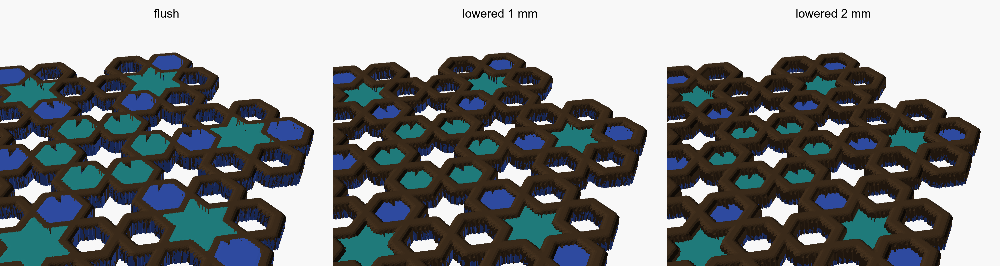

*The lowered strip above shows 1 mm and 2 mm to make the difference easy to see; the design
proposes about 0.6 mm.*

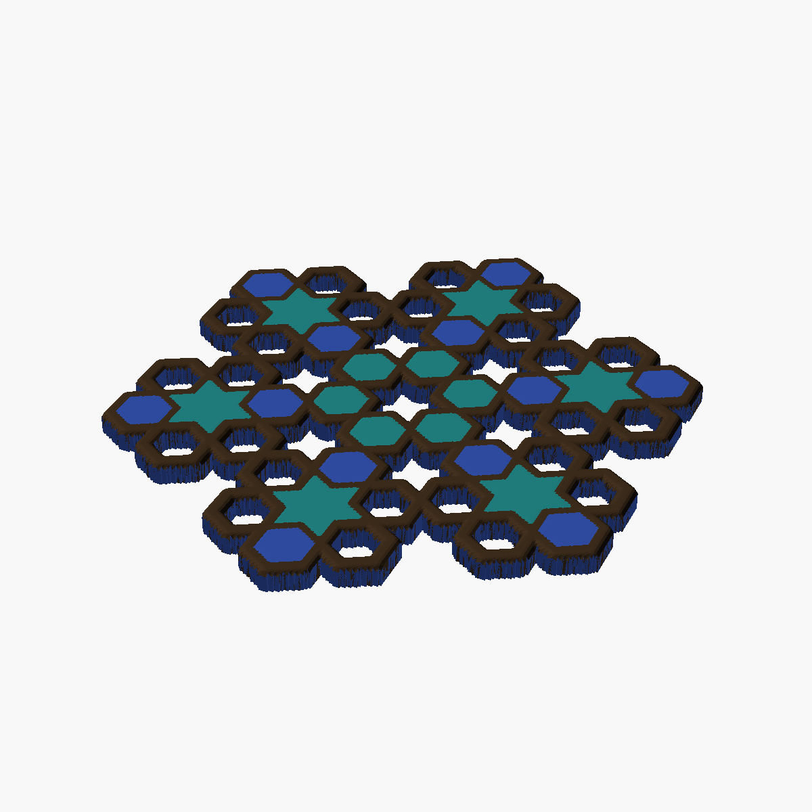

| Option | Pros | Cons | What it leads to |
|---|---|---|---|
| Flush | Built first and passes every check; a flat top like a mosaic; a mug sits on everything | Every raised layer holds both colors, so about twice the color changes; any color bleed shows on the top face | The first color plate prints at fills = 1.2 mm |
| Lowered, about 0.6 mm | About half the color changes (worked out from the layer count, not yet measured on the X2D); a strap wall stands at every color edge and may hide bleed; a mug still sits on the straps | Shallow wells; the right depth is not known yet, and only a print will show it | The Lab's fill-height slider defaults to 0.6 |
| **Choose from a print with both** (my pick) | You decide on the real object, not a render | Waits on the first-layer coupon, and costs a sample plate | Flush stays the default until then; the first color plate carries one of each |

**Your answer:**

- [ ] Flush
- [ ] Lowered (write the depth in the notes if not 0.6 mm)
- [ ] Choose from a print with both
- Colors you want for the straps and the fills:
- Notes:

**Widened 2026-09-29** (your comment): fill height either way in the Lab, loose inner pieces,
and "assemble your own coaster" (the "Coaster Lab: fill height either way" item in the
[catalog-expansion backlog](../../tasks/catalog-expansion/backlog.md)).
This call stays open for the default height.

---

## 3. Coaster edges are a staircase ^7t9o0t

**In short.** The file we send to the printer is built out of tiny 0.4 mm squares, like pixels.
A side that runs along the squares comes out straight. A slanted side can't, so it comes out as
a row of tiny steps. On the six-sided CS-1 coaster, two sides are straight and four are stepped.
The steps stray up to 0.27 mm either side of the true edge, which is less than three sheets of
paper. The Lab preview draws the true edge, so it looks smooth there; only the printed file has
the steps.

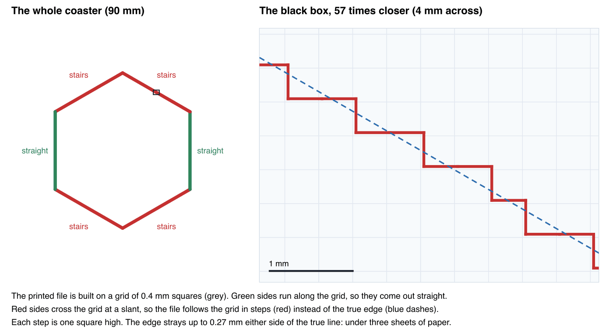

**Is it worth deciding?** Only if the steps show on a real coaster. Nobody has looked yet. Any
coaster already printed has them on its slanted sides, so one look settles it: run a fingernail
along a slanted side and a straight side, and see whether they feel different. If they don't,
tick "Leave it" and this call is closed.

*For the record:* the interlocking pieces already get a true edge, because their joint can't
take the error ([coaster-interlock-design](../../design/coaster/coaster-interlock-design.md)).
Plain coasters were left stepped on purpose.

| Option | Pros | Cons | What it leads to |
|---|---|---|---|
| True outer edge on every coaster | Uses the interlock's edge code, which is already built and checked; the edge you hold and see is smooth | The lines inside the coaster (straps, openings) stay stepped; the interlock design names this code as the part most likely to break a mesh, so every coaster must be re-checked | One bikar PR, then re-render the coaster files kept in this repo |
| True edges inside too | Everything smooth | New mesh code that traces lines instead of grid squares: the biggest and riskiest option. The color split and the openwork cut would have to follow it | A design doc before any code |
| Finer grid (0.2 mm) | No new code | About four times the squares, so slower renders and bigger files; still stairs, just half the size | One constant changes; every check and file is re-run |
| **Leave it** (my pick, changed 2026-09-29) | No work; the steps are smaller than three sheets of paper | The stairs print as they are | Look at an edge on a printed coaster; if the steps show, true outer edge is the next step (the "Coaster edges are a 0.4 mm staircase" item in the [catalog-expansion backlog](../../tasks/catalog-expansion/backlog.md)) |

**Your answer:**

- [ ] True outer edge on every coaster
- [ ] True edges inside too
- [ ] Finer grid
- [ ] Leave it, look at the next print
- Notes:

---

## 4. Eight video rebuilds are stuck off master

**In short.** The video loop rebuilt eight tutorials in the youtube repo and wrote a note on
each in the catalog backlog: what the pattern is and what a coaster of it needs. Each note went
in as its own PR, built on top of the one before. When #404 merged, it went into the PR below
it, not into master. That closed #403 and #405 and left #406–#410 on a closed base. **None of the
eight notes is on master.** The rebuilds themselves are safe in the youtube repo. Each picture
is the video frame, our rebuild, and the difference (pink: only in the video; green: only in
ours). The score is how closely the edges match, from 0 to 1.

| Video | Pattern | Steps, score | As a coaster |
|---|---|---|---|
| `n_ICgwOr6qs` | Samira Mian, 5-fold petals | 9/9, 0.886 | All arcs of one compass size; needs arcs |
| `Y6kS1MvnKoc` | Eric Broug, ten-point star field | 17/18, 0.861 | Straight lines; the page is a rectangle, so crop a circle round the centre star |
| `NtnlGMTElBk` | Samira Mian, ten-fold interlaced star | 13/13, 0.930 | One closed band of straight lines; already fits a circle; could be an over-under weave |
| `gBV_JTt3Kxk` | Samira Mian, Itimad-ud-Daula rosette | 11/11, 0.906 | A round rosette, or a rhombus tile that repeats edge to edge |
| `_U6G8QSfWnk` | Samira Mian, 5/10-fold girih | 6/6, 0.895 | A rectangle tile that repeats by mirroring |
| `fhGHzop7ULw` | Mohamad Aljanabi, 6-fold rectangle | 9/9, 0.921 | A 1 × √3 rectangle tile that repeats by mirroring |
| `jlTmt_279M4` | Seven-point stars in a square | 17/17, 0.941 | A tilted square tile that repeats by mirroring |
| `A9fefFurD_s` | Lex Wilson, Broug's ten-point star | 17/17, 0.855 | One round medallion, not a tile |

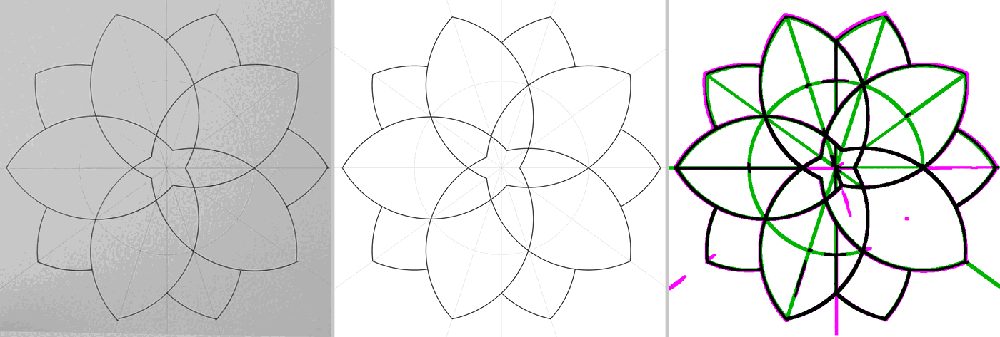
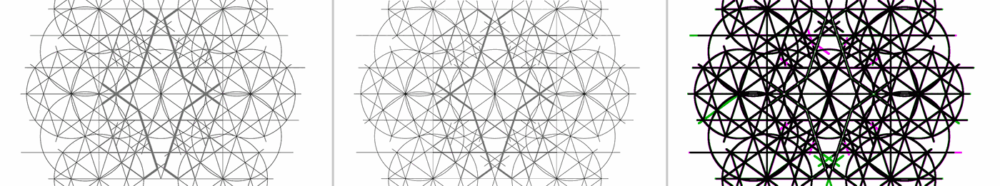
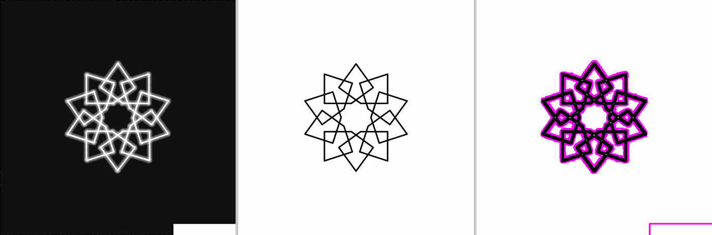
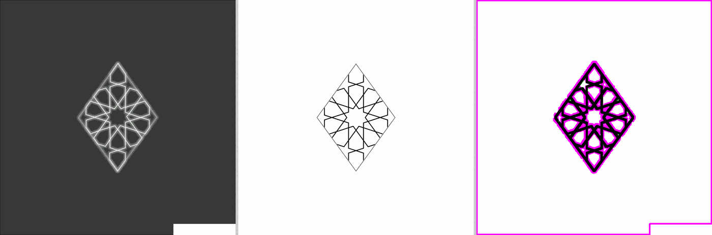
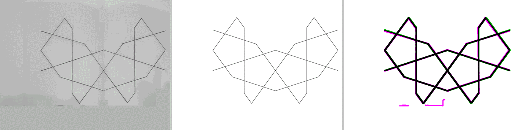
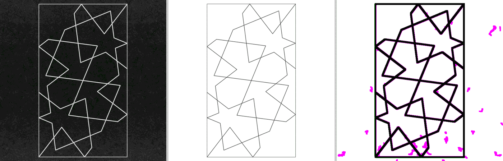
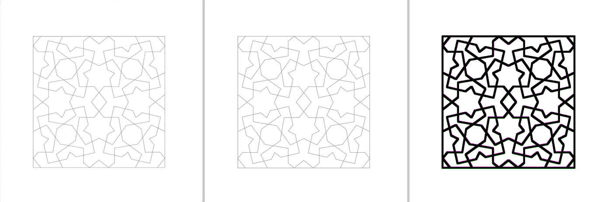
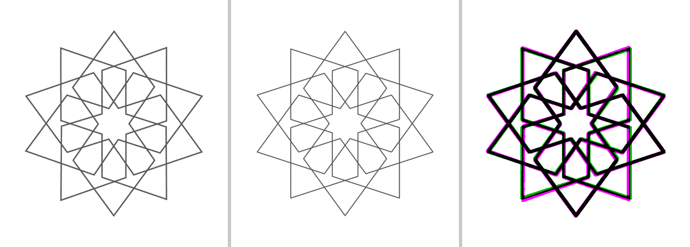

**4a. The notes**

| Option | Pros | Cons | What it leads to |
|---|---|---|---|
| **Accept all eight** (my pick) | One PR off master, merged by hand; the backlog finally shows what is done | You accept all eight at once | I close #406–#410 with a link to the new PR and delete the old branches |
| Accept some | You keep only the rebuilds you trust | One more pass to pick them | The ones you leave out stay on the list as held, with your reason |
| Leave them | No work | The notes stay stranded, and the next video loop redoes the bookkeeping | Nothing |

- [x] Accept all eight
- [ ] Accept some (list the ones to leave out in the notes)
- [ ] Leave them
- Notes:

**Decided 2026-09-29:** accept all eight → [D-084](../decisions-log.md#d-084--the-eight-stranded-video-loop-records-land-on-master-as-one-pr)

**4b. Which becomes a coaster first?** My pick is `NtnlGMTElBk`: it is round already, all
straight lines with every corner at an exact crossing, and it scored 0.930. `A9fefFurD_s` is the
other round one. The tiles (`gBV`, `_U6G`, `fhG`, `jlTmt`) are for coasters that sit side by
side. `n_ICgwOr6qs` needs arcs. ^952r93

- [ ] `NtnlGMTElBk`, interlaced star
- [ ] `A9fefFurD_s`, medallion
- [ ] A tile (name it in the notes)
- [ ] `n_ICgwOr6qs`, arcs
- Notes:

**Redirected 2026-09-29** (your comment): a `prioritize-design` skill ranks the candidates
first, and its first run answers this call (the skill shipped in #437 as
[`prioritize-design`](../../../.claude/skills/prioritize-design/SKILL.md); the run is still owed).

---

## Things only you can do (not decisions)

These are waiting on your hands, not your judgement:

- **Hub step 1:** run the live printer read on the hub page.
- **Hub step 3:** the plate queue, where every send waits for your confirmation. It comes after step 1.
- **Sample prints:** the minis plates, including [minis-06](../../design/plates/minis-06.yaml), with one mated pair per join.
- **The first-layer coupon**, before any color print (call 2).
- **The FAQ proposal** in the docs folder: mark each question keep or drop, and write the answers.
