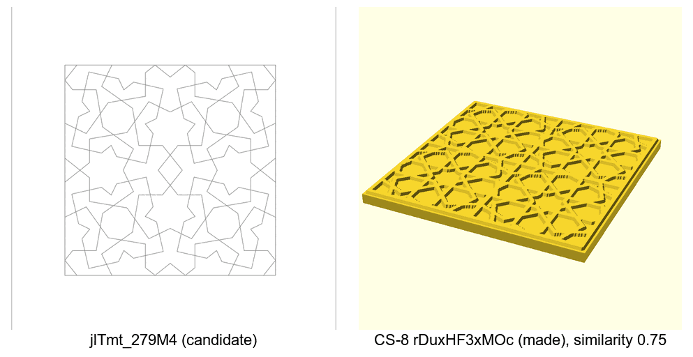
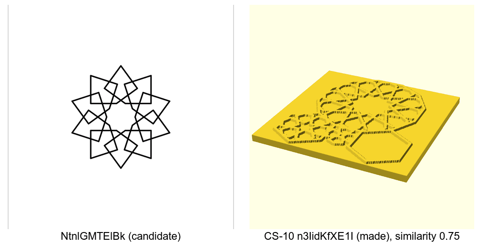
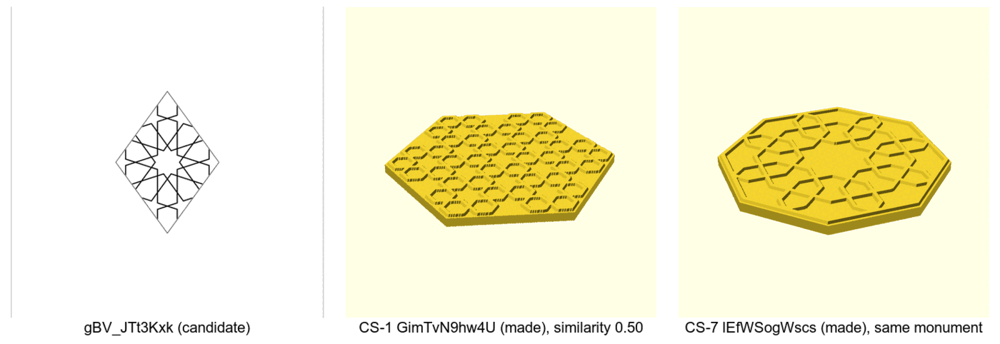

# Open calls — 2026-09-29, which pattern becomes a coaster next

Four calls from the [prioritize-design proposal](../../design/process/prioritize-design.md): three
about how the ranking works, and the pick itself (call 4b on the
[earlier open-calls page](2026-09-29-open-calls.md), which asked for this proposal). Tick one box
per call, or comment on a line. The next session writes each answer into the decisions log and
starts the work it unblocks.

| # | Call | My pick | Why, in one line |
|---|---|---|---|
| 1 | How the three scores combine | Add the ranks | Needs no weights, and nobody can source the weights |
| 2 | Where each pattern's four facts live | New columns in the constructions ledger | One place, and the ledger's check refuses a row that leaves them out |
| 3 | Render the top three before choosing | Yes, render first | The two patterns that came out too open looked fine in pictures |
| 4 | Which pattern goes first | jlTmt_279M4 | Leads or ties in three of four readings, and the only one buildable today |

## 1. How the three scores combine

**In short.** Each candidate gets three scores: would people like it (0 to 8, judged), is it
unusual (0 to 2, judged) and how different it is from the nine coasters we made (0 to 1,
measured). The proposal keeps them apart on purpose: studies both researchers found say people
like a new design only while it still looks like what it is, so "liked" and "unusual" pull
against each other. The question is how to turn three scores into one suggestion. Full argument:
[section 4.5](../../design/process/prioritize-design.md#45-putting-the-three-together).

| Option | Pros | Cons | What it leads to |
|---|---|---|---|
| **Add the ranks** (my pick) | No weights to guess; each question counts the same | Ignores how big a lead is, so the raw scores are shown beside the ranks | The first few rounds show whether "equal" is right; if it keeps feeling wrong, switch |
| Weighted total: appeal + 5 × difference + unusual ÷ 2 | Keeps the size of a lead; can lean toward "liked" on purpose | The 5 and the ½ are guesses; neither researcher found anything to set them | Each round's notes must say whether the weights moved, and why |

**Your answer:**

- [ ] Add the ranks
- [x] Weighted total
- Notes:

**Decided 2026-09-29:** Weighted total → [D-085](../decisions-log.md#d-085--prioritize-design-combines-its-three-scores-as-a-weighted-total)

## 2. Where each pattern's four facts live

**In short.** "Different from ours" is worked out from four facts about each pattern: its fold
family (six-fold, eight-fold, …), its layout, its outline, and its lines (straight, arcs, woven).
Today those facts are one researcher's reading of titles and pictures, stored nowhere. They need
a home for the difference tool to read, for the nine made coasters and every candidate.
[Section 5](../../design/process/prioritize-design.md#5-skill-or-gate).

| Option                                                                             | Pros                                                                                                                  | Cons                                                   | What it leads to                                                     |
| ---------------------------------------------------------------------------------- | --------------------------------------------------------------------------------------------------------------------- | ------------------------------------------------------ | -------------------------------------------------------------------- |
| **Columns in the [constructions ledger](../../constructions/ledger.md)** (my pick) | One place for facts about a pattern; the ledger's existing check can refuse a row without them, so a gap fails loudly | A change to that check, and a wider ledger table       | Every new ledger row needs its four facts before it counts as done   |
| A table in the skill's scoring file                                                | No change to any check                                                                                                | Facts kept in a scoring file can drift from the ledger | The tool has to check for itself that the table covers every pattern |

**Your answer:**

- [ ] Ledger columns
- [x] Table in the scoring file
- Notes:

**Decided 2026-09-29:** table in the scoring file → [D-086](../decisions-log.md#d-086--the-four-facts-per-pattern-live-in-a-table-in-the-skills-scoring-file)

## 3. Render the top three before choosing

**In short.** The top three sit within about one rank point of each other, and one judged point
moving reorders them. For example, NtnlGMTElBk's "reads at 90 mm" is a 1 because its crossings
might close up at that size, which a picture of the drawing cannot show. Both researchers said
the same next step: render jlTmt, Ntnl and gBV in the minimal style at 90 mm (Ntnl flat), run
the print-review check on each, and hold any that no longer read as a coaster.

| Option | Pros | Cons | What it leads to |
|---|---|---|---|
| **Render the three first** (my pick) | The two patterns on record that came out too open (bknV and n3Ii) looked fine in pictures and were only caught at size | One more step before a print | If jlTmt passes it stays the pick; if it fails, the order below without it stands; results come back on a page like this one |
| Build jlTmt now | Fastest to a physical coaster | Skips the one check that has caught real mistakes | A print that may need redoing; the ranking is never tested |

**Your answer:**

- [x] Render the three first
- [ ] Build jlTmt now
- Notes:

**Decided 2026-09-29:** render the three first → [D-087](../decisions-log.md#d-087--render-the-top-three-before-choosing-which-pattern-becomes-a-coaster)

## 4. Which pattern goes first

**In short.** Each picture below is a candidate (the line drawing we rebuilt from the video) next
to the made coaster it is most like. Similarity is 1 for the same four facts and 0 for none in
common. The drawings are our rebuilds, not coaster renders; the yellow ones are the made coasters'
gallery renders. Scores, after the rubric in
[section 8.3](../../design/process/prioritize-design.md#83-the-consolidated-ranking):

| Pattern | Liked (0–8) | Unusual (0–2) | Different (0–1) | Buildable today | Licence |
|---|---|---|---|---|---|
| jlTmt_279M4 | 7 | 2 | 0.61 | Yes: square, straight lines | Clear (Bourgoin, 1879) |
| NtnlGMTElBk | 6 | 2 | 0.53 flat, 0.75 woven | Flat yes; woven not built | Credit the video's author |
| gBV_JTt3Kxk | 7 | 2 | 0.61 | No coaster outline draws a rhombus yet | Credit the video's author |

Two build questions still move the result: is Ntnl woven over-under, and is it framed by a round
rim or printed in the minimal style (no rim)? Rank sums, lowest wins:

| If… | jlTmt | gBV | Ntnl | Suggests |
|---|---|---|---|---|
| round rim, flat lines | **6** | **6** | 10.5 | jlTmt (ties gBV, and is ready) |
| round rim, Ntnl woven | **7** | **7** | **7** | jlTmt (three-way tie, the only one ready) |
| minimal style, flat lines | **7.5** | **7.5** | 9.5 | jlTmt (ties gBV, and is ready) |
| minimal style, Ntnl woven | 8.5 | 8.5 | **6** | Ntnl |

| Option | Pros | Cons | What it leads to |
|---|---|---|---|
| **jlTmt_279M4** (my pick) | Leads or ties in three of four readings; nothing left to decide before building; cleanest licence; most even fill of the eight | Weakest single motif: four seven-point stars round an octagon, no one centre; its nearest made coaster is also square | Straight to the render in call 3, then a coaster |
| NtnlGMTElBk | The most different of all eight, if woven; one strong star | Wins only woven *and* in the minimal style, and no coaster style weaves yet; built flat it falls behind | Weaving in a coaster becomes its own piece of work first |
| gBV_JTt3Kxk | Ties jlTmt on every score; one clear central star | No coaster outline draws a rhombus; untried in the minimal style; same monument as CS-7, which may read as a set or as a repeat | A rhombus outline check first |

**Your answer:**

- [ ] jlTmt_279M4
- [ ] NtnlGMTElBk
- [ ] gBV_JTt3Kxk
- [x] Decide after the renders in call 3
- Notes:

**Decided 2026-09-29:** decide after the renders → [D-088](../decisions-log.md#d-088--which-pattern-goes-first-is-decided-after-the-renders)

## Things only you can do (not decisions)

- Say yes to merging the proposal itself (pull request 427 in 3d-models); an automatic check
  stopped me merging it without your OK.
