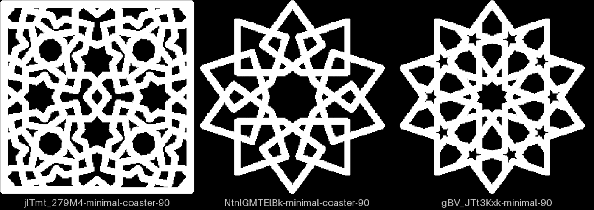
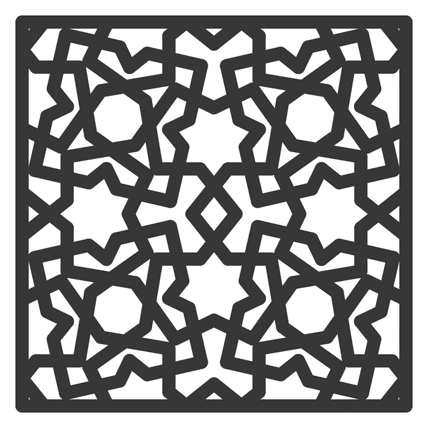
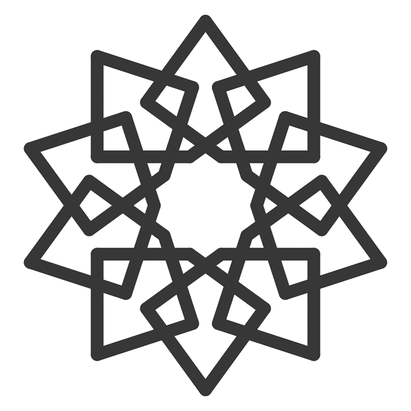
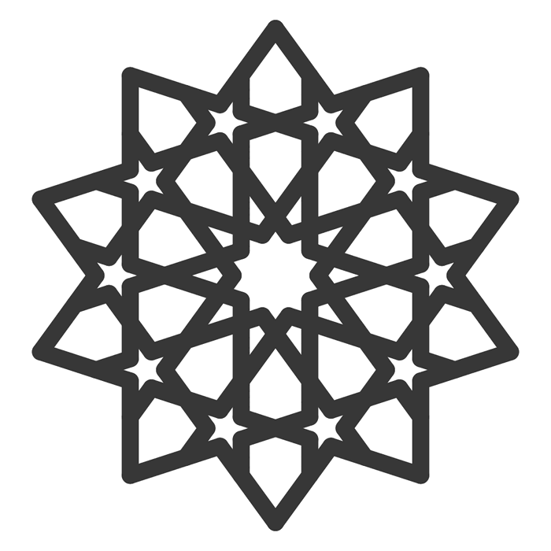
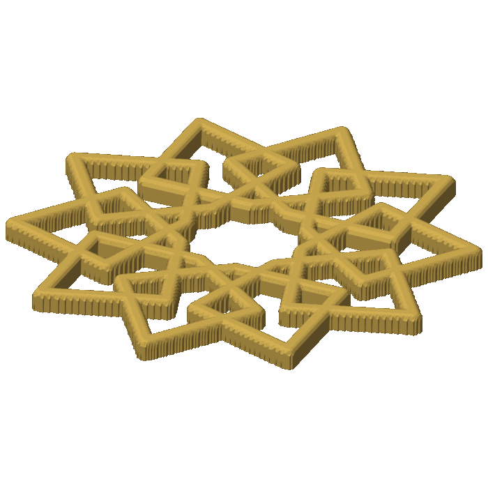
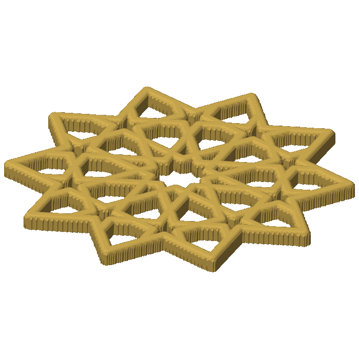

# Open calls — 2026-09-30, the top three patterns rendered as coasters

One call. On the 29th you asked to see the three top-ranked patterns rendered as coasters before
picking which one goes first (calls 3 and 4 on the previous page, decisions D-087 and D-088,
both in [pull request 427](https://github.com/omars-lab/3d-models/pull/427), which is not merged
yet). All three are now built
in bikar, in the minimal style at 90 mm, and checked. Tick one box, or comment on a line. The
next session writes the answer into the decisions log and starts the coaster.

| # | Call | My pick | Why, in one line |
|---|---|---|---|
| 1 | Which pattern goes first | gBV_JTt3Kxk, the ten-fold rosette | Reads cleanest at 90 mm with one strong centre; the other two each show something the eye has rejected before |

## 1. Which pattern goes first

**In short.** Each pattern was imported from its video reconstruction into bikar, built as a
minimal-style coaster (straps only, no rim) at 90 mm, and passed the mesh and linkage checks at
40 and 90 mm. Then the print-review tool measured each one the way it measures every coaster
before a print, and I looked at every picture. All three pass the checks; they differ in what the
eye sees. The three bikar pull requests were all merged on 2026-09-30, so each coaster file is on
bikar main whichever you pick:
[Ntnl, 285](https://github.com/NaqshCoffee/bikar/pull/285),
[jlTmt, 286](https://github.com/NaqshCoffee/bikar/pull/286),
[gBV, 287](https://github.com/NaqshCoffee/bikar/pull/287).

**The numbers**, from the print-review tool, each over the area inside the coaster's outline.
`open` is the share cut through, `biggest` the share taken by the single largest hole, `bare`
the share of an 8 by 8 grid that is almost all hole, `sym` how well the art matches itself
turned, and `order` the turn that matched. The
[review rubric](../../../.claude/skills/review-print/rubric.md) says which values have flagged
trouble on past plates: `biggest` at or above 0.05 flagged both pieces with a gross gap, and
`open` at or below 0.15 flagged both near-solid pieces. Those are hints for the eye, not a gate.

| Pattern | open | biggest | bare | holes | sym | order | What the eye sees |
|---|---|---|---|---|---|---|---|
| jlTmt_279M4 | 0.33 | 0.02 | 0.00 | 89 | 1.00 | 2 | A busy, even field that fills the square; many small slivers of strap along the border |
| NtnlGMTElBk (flat) | 0.45 | 0.08 | 0.07 | 31 | 1.00 | 10 | A clean ten-point star with a wide open centre; the numbers sit near those of the piece left off minis-03 for empty space (0.37, 0.07, 0.08), but here the open centre is the pattern's own design |
| gBV_JTt3Kxk | 0.38 | 0.03 | 0.00 | 44 | 1.00 | 10 | A clean rosette, one centre, ten small stars, no flags |

Two things the numbers cannot say:

- **jlTmt's `order` of 2** is expected: the square field is built by mirroring, so it matches
  itself only after a half turn. It is not a defect.
- **gBV is the rosette alone.** The video draws the rosette, then paints a rhombus tile over it
  with white masks. A strap coaster cannot erase, so the tile and masks were left out, and the
  coaster is the rosette in its own star-shaped outline, not the video's rhombus. The
  "different from ours" score on the previous page was worked out for the rhombus, so it no
  longer describes what would print.

| Option | Pros | Cons | What it leads to |
|---|---|---|---|
| **gBV_JTt3Kxk** (my pick) | Cleanest read at 90 mm; one strong centre; no number flagged; ten-fold, which no made coaster has | The rosette, not the video's rhombus tile; same monument as CS-7, which may read as a set or as a repeat | A ledger row, a gallery card and a samples plate |
| jlTmt_279M4 | Ranked first on the previous page; the most even fill; clearest licence (Bourgoin, 1879) | The border slivers are the kind of thin edge piece you left off the pegs coaster before; four seven-point stars, no one centre | Either print it as is, or first decide what to do with the slivers (trim the field, or widen the frame) |
| NtnlGMTElBk | The most different from our nine if it were woven; the strongest single star | Built flat, it is a plain ten-point star with a wide open centre; weaving in a coaster is its own piece of work first; `biggest` and `bare` sit near a piece you rejected | A weaving job in bikar before it becomes what the ranking scored |
| Print two or all three as minis | Settles it in the hand, not on a page; a 40 mm mini each costs little filament | One more plate before any full coaster; printing is still paused on your side | A minis plate with one of each, and this call comes back after the print |

**Your answer:**

- [ ] gBV_JTt3Kxk
- [ ] jlTmt_279M4
- [ ] NtnlGMTElBk
- [ ] Print minis of two or all three first
- Notes:

## Things only you can do (not decisions)

- Merge the proposal itself, pull request 427 in 3d-models; an automatic check stopped me
  merging it without your OK.
- Land three youtube branches on youtube main, whose remote has no pull-request flow. Two rewrite
  the source constructions into vocabulary the importer supports, with every label proven to
  agree with the original: `ntnl-supported-vocabulary` (commit ec697a1) and
  `gbv-supported-vocabulary` (commit d0732db), both unpushed in their own worktrees. The third,
  `o1-polyline-ray` (commit 9a92134, pushed), teaches the line-by-line check about polylines and
  rays, which jlTmt needs to pass it. Until they land, the bikar files point at source hashes
  that youtube main does not have.
