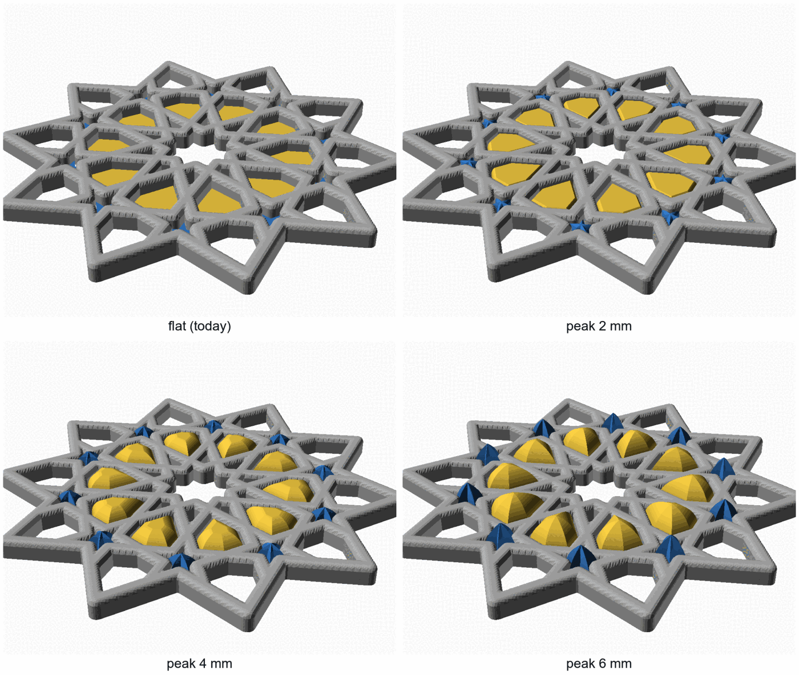
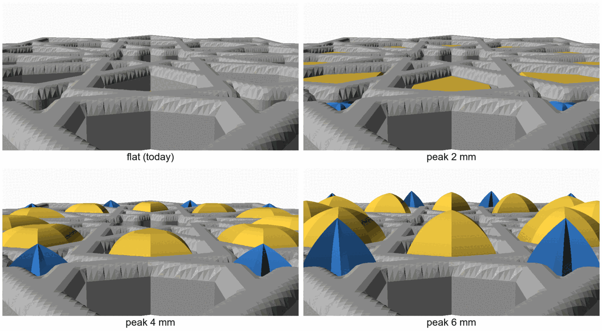
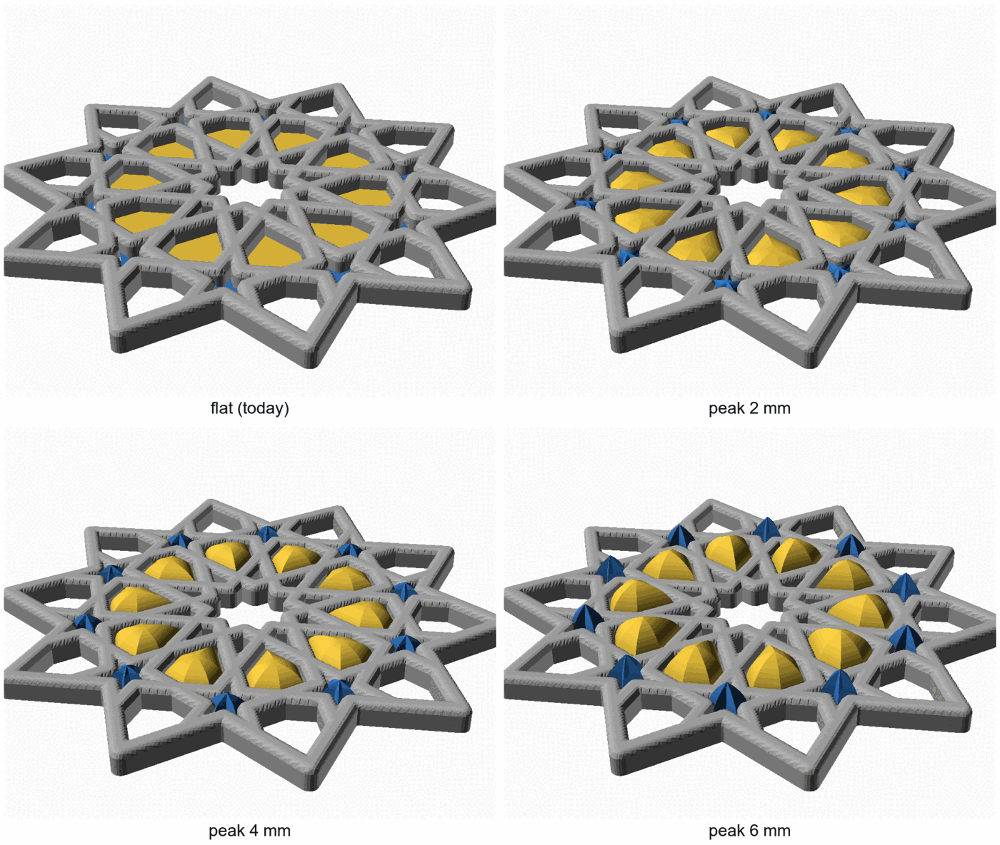
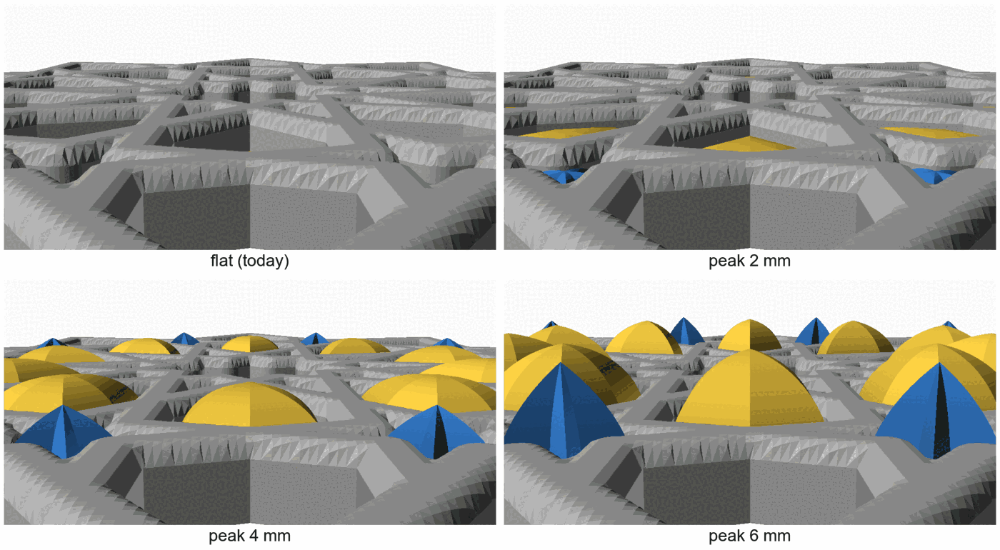

# Open calls — 2026-10-02: peaked pieces

You asked for a SKIMS-style version of the gBV loose pieces: each piece keeps its shape, then
curves up to a point over its middle. It is built, and these are the pictures. There are two
calls. Tick one box per call, or comment on a line. The next session records each answer and
starts the work it unblocks.

| # | Call | My pick | Why, in one line |
|---|---|---|---|
| 1 | How high the pieces rise | 6 mm | At 4 mm the gold hexes read as low domes; at 6 mm they read as points, which is the look you asked for |
| 2 | Where to try it in plastic | Add one peaked set to the gBV fit sheet | The sheet already prints the same pieces flat, so flat and peaked sit side by side for one bed |

## 1. How high the pieces rise

**In short.** A new `peak <mm>` setting on the loose-pieces line keeps each piece's outline and
its 1.2 mm wall exactly as they are. Then the top curves in to a single point over the piece's
middle. The curve leaves the wall going straight up, so the edge of the piece looks the same as
today. It narrows all the way up, so nothing overhangs. Leaving it off gives today's flat
pieces, unchanged. The same height looks different on different sizes: the wide gold hexes
become domes, while the narrow blue stars become sharp cones. Nothing has printed with a peak
yet. The [loose-pieces design](../../design/coaster/loose-pieces-design.md) covers the pieces
themselves.

The pictures are the real meshes from bikar: the minimal coaster with the sheet's pieces at
their default gap.

| Option | Pros | Cons | What it leads to |
|---|---|---|---|
| **6 mm** (my pick) | The hexes read as pointed domes and the stars as tall cones, the clearest version of "curve up to a point" | Tallest, so a cup sits furthest from flat; a sharper tip, which may print rougher than a dome | One peaked set at 6 mm on the fit sheet (call 2) |
| 4 mm | Softer: rounded domes, closer to a melted, pillowy SKIMS look; less tip | The hexes look like domes more than points | The same, at 4 mm |
| 2 mm | Barely raised; a cup still rocks only slightly | Reads as nearly flat from above, so little of the new look shows | The same, at 2 mm |
| Print two heights | You judge the height in the hand instead of from a render | Twice the pieces on the bed | Two peaked sets on the sheet, for example 4 and 6 mm |

**Your answer:**

- [ ] 6 mm
- [ ] 4 mm
- [x] 2 mm
- [ ] Two heights (say which)
- Notes:

**Decided 2026-10-02:** 2 mm → [D-091](../decisions-log.md#d-091--peaked-loose-pieces-2-mm-tried-on-the-gbv-fit-sheet)

**Corrected 2026-10-02, after the decision.** The pictures above had a fault at 2 and 4 mm.
When a peak was lower than the piece is from its edge to its middle, the curve stopped part way
in and the top was cut flat. At 2 mm the gold hexes had a flat lid over most of their top, and
at 4 mm a smaller one. bikar #299 fixed it: a low peak is now a round dome that still
reaches its full height in the middle. These are the same four views drawn with the fix. 6 mm and
the blue stars did not change. The 2 mm hexes are now low domes rather than flat-topped pieces,
so it is worth a second look before the sheet prints. The decision stands until you change it.

## 2. Where to try it in plastic

**In short.** The [gBV fit sheet](../../plates/sheets-04.md) already prints the gBV pieces flat
at four gaps to find the fit. A peaked set fits in the same pocket the same way, because the wall
and the gap do not change. Only the top is new. Putting a peaked set there means one print shows
both the fit and the look. Prints stay last either way, as you asked.

| Option | Pros | Cons | What it leads to |
|---|---|---|---|
| **Add one peaked set to the fit sheet** (my pick) | Flat and peaked side by side on one bed; no extra print | A longer print, and the sheet gets busier; its bed map needs a new label | Re-slice the sheet, update its page and bed map |
| Its own small plate | Keeps the fit sheet as it is | One more print to run | A new plate page with its own review |
| Not yet | No print time spent | The look stays judged from renders only | Nothing until you ask |

**Your answer:**

- [x] Add one peaked set to the fit sheet
- [ ] Its own small plate
- [ ] Not yet
- Notes:

**Decided 2026-10-02:** add one peaked set to the fit sheet → [D-091](../decisions-log.md#d-091--peaked-loose-pieces-2-mm-tried-on-the-gbv-fit-sheet). It is on [sheets-04](../../plates/sheets-04.md) as `PEAK 2`.

## Things only you can do (not decisions)

- Print the sheet when prints come up, since they are held for last.
