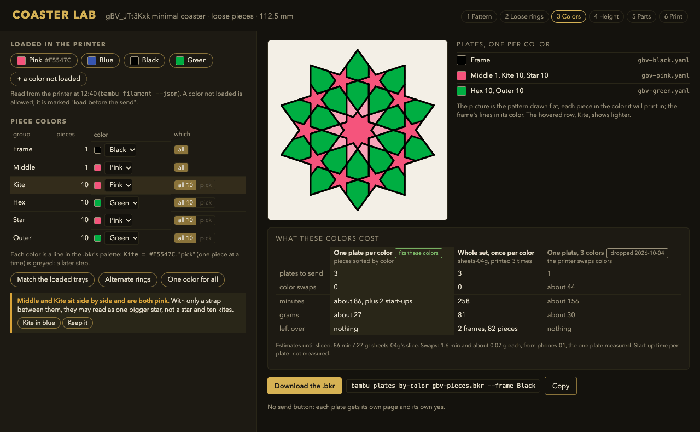
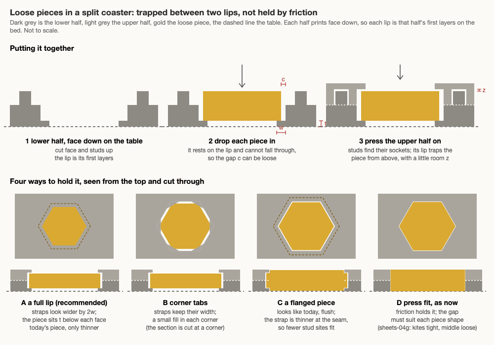
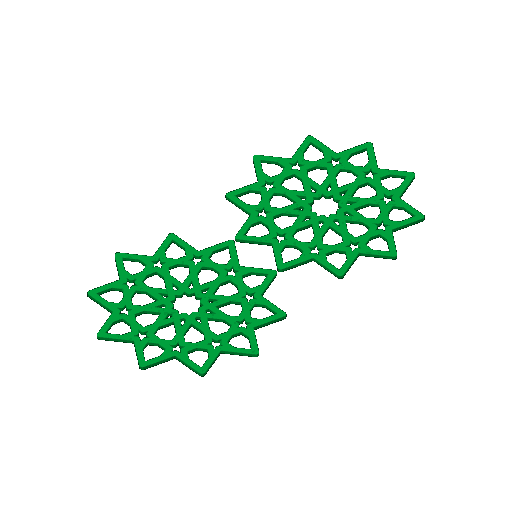
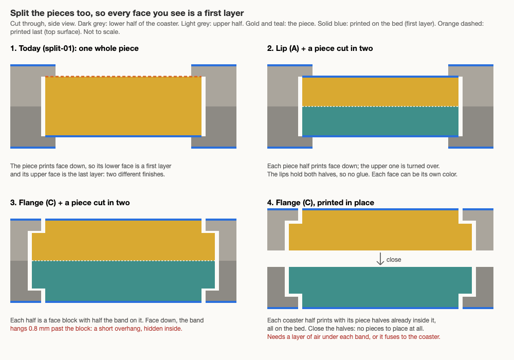
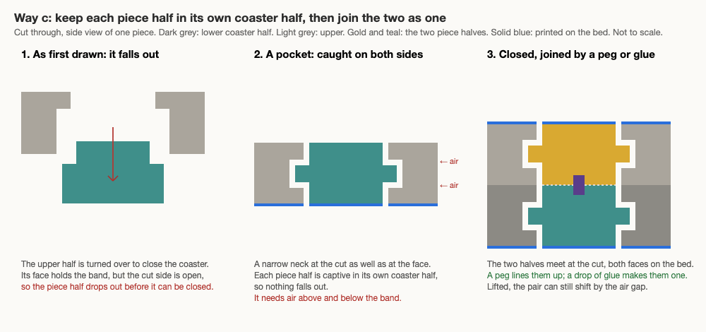
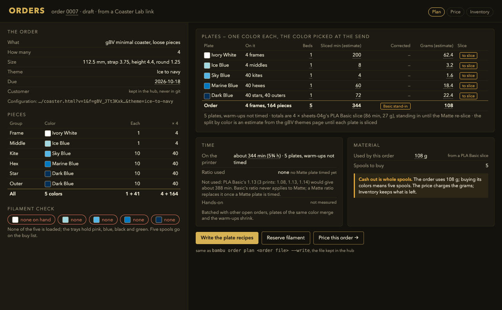
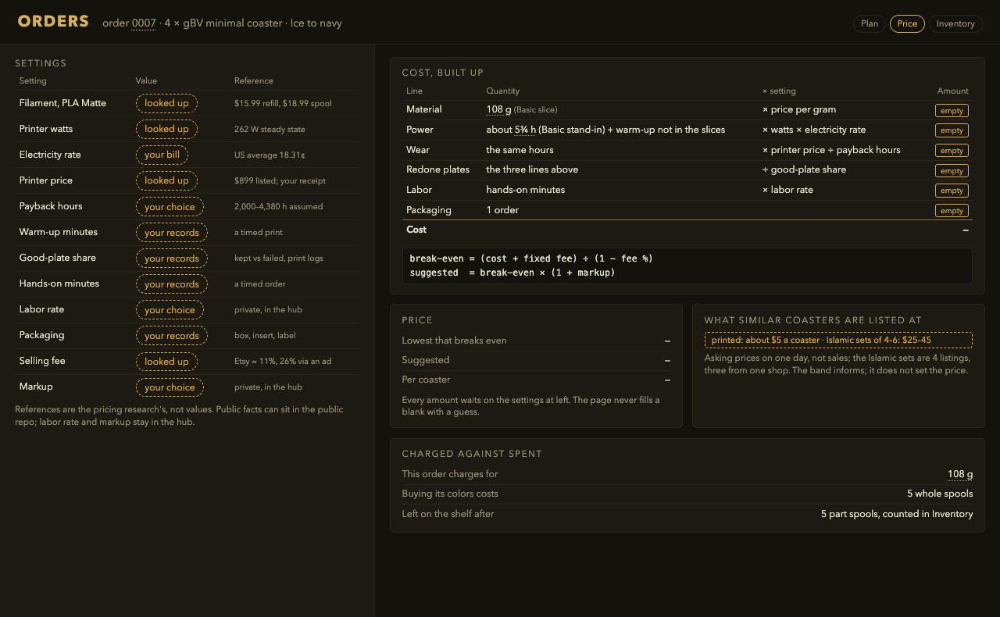
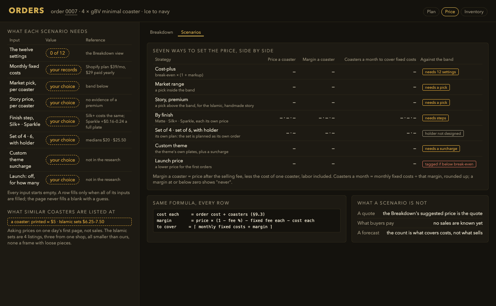
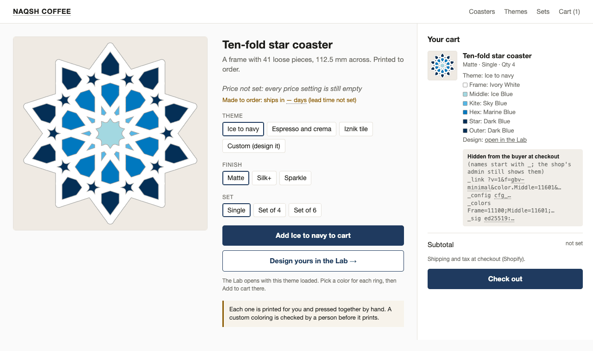
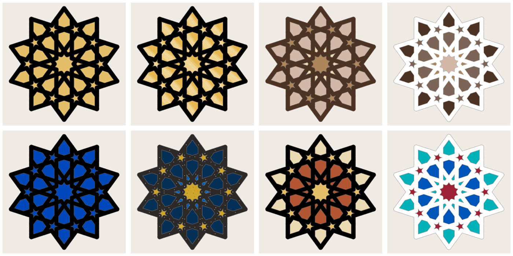

# Open calls — 2026-10-05

Twenty-six calls are waiting on you. They come in six groups: piece colors, the split coaster,
orders and pricing, the store, swatches, and which theme to print first. Tick one box per call, or
comment on a line. The next session writes each answer into the decisions log and starts the work
it unblocks. A call with no tick stays open, and nobody picks for you from the "my pick" column.

Some work has already gone ahead on my pick, so that something could be built. Those calls say so,
and a different tick changes that work.

| # | Call | My pick | Why, in one line |
|---|---|---|---|
| 1 | How the Lab prints a colored coaster | One plate per color | No color swaps and nothing left over; fits the one-color-per-plate rule |
| 2 | A color per group, or per piece too | Per group now, per piece later | Uses only what is built and tested |
| 3 | Where a plate's color is written | In the recipe for per-color plates, at the send for whole-set plates | The pink plate says pink on its page and in its yes |
| 4 | How the Lab learns what is loaded | Paste the printer's tray list | No new connection; the access code stays in the plate tools |
| 5 | Which build plate prints the two faces | Cool Plate SuperTack, if gloss is the point | The nearest to gloss in Bambu's own words |
| 6 | Round the cut edges or not | Sharp edges | Both faces crisp and the same; nothing new to build |
| 7 | Glue or press fit | Press fit, glue optional | Comes apart if a pin is wrong; no glue near hot mugs |
| 8 | How many studs | About 9, 25 mm apart | Easy to press by hand; raise it if the halves gap |
| 9 | Where splitting lives | A bikar coaster clause | A plate recipe can then say "split"; no clicks per send |
| 10 | Split pieces: start with way a or way c | a first, then c | a changes one thing on a plate we have; c needs an unmeasured air gap |
| 11 | If c: how the two piece halves become one | The pocket and nothing extra; glue only if the movement is felt | The pocket is needed whatever else is chosen |
| 12 | Where orders, stock and prices live | The hub | The only option that keeps customers private |
| 13 | How the price is set | Cost plus a markup, with the market drawn beside it | It cannot quote below cost |
| 14 | Orders as files in git | Never in this repo | This repo is public; a committed name stays public |
| 15 | How to try out pricing ideas | The Scenarios view, no skill | Every number from the formula, and tested |
| 16 | A price below break-even | Shown and tagged; quoting it needs a reason | A launch price can be a choice, never an accident |
| 17 | Shopify Basic or Grow | Basic, settled by one test order | $29 to $39 a month; the test tells us if Grow is needed |
| 18 | How a custom order gets its yes to print | One plate per group, color picked at the send | Any coloring reuses the same few plates |
| 19 | Which options carry the price | Finish, set size, how many colors | The price follows the cost |
| 20 | Etsy now or later | Later | One channel right first; Etsy may drop a custom coloring |
| 21 | Lead time and returns | A stated range; custom colorings final sale except damage | Honest about buying colors; custom work cannot be resold |
| 22 | How a design gets into the cart | The Lab in the product page, the hub checks every order | No server and no secret, and the hub checks anyway |
| 23 | Which designs may be sold | A record per design; nothing listed without one | Cheap per design, and a check can enforce it |
| 24 | Which pictures the store opens with | Drawings now, a real photo per design before opening | A buyer sees the real surface and colors before paying |
| 25 | Real swatches before buying colors | Bambu's samples if they sell them, then our own card | See before buying, then see it as we print it |
| 26 | Which theme to print first | Midnight blue now, Black and gold next | Nothing to buy for the first; one spool for the second |

## Piece colors (calls 1 to 4)

**In short.** The Coaster Lab has a Piece colors screen. You give each ring of loose pieces a
color, the screen shows what that costs, and it writes the plate recipes. Phase 1, the
`plates by-color` command, and phase 3, the screen, are built and merged, and both use my picks for
calls 1 and 3. A different tick on either changes that work. The full argument is in the
[piece colors design](../../design/coaster/infill-color-ux-design.md#8-open-calls-for-omar).

*A mockup in the Lab's styles, not the Lab itself. The coaster drawing is bikar's real render of
gBV, recolored per group. The cost numbers are estimates split from one slice, not slices of these
plates.*

*The five groups of the gBV coaster, each in a stand-in color so you can tell them apart. This is
what "per group" means: all ten kites take one color.*

### 1. How the Lab prints a colored coaster

| Option | Pros | Cons | What it leads to |
|---|---|---|---|
| **One plate per color** (my pick) | No swaps, no leftovers, about the time of one plate; fits the 2026-10-04 rule | Three plates, three yeses and three sends for one coaster; the start-up time per plate is not measured | Already built this way: one recipe per color, each with its own plate page |
| The whole set, once per color | No new recipe: sheets-04g plus a color at the send; the spares make more coasters in any mix | Three times the time and plastic for one coaster; two frames and 82 pieces left over | The by-color command shrinks to a cost table |
| One plate, many colors, with its cost shown | One send; nothing to sort by hand | The route you dropped: about 70 extra minutes and a prime tower on this coaster | Reopens the 2026-10-04 decision; a hint for colors bleeding into each other has to be built |

**Your answer:**

- [ ] One plate per color, with the other two shown as costs beside it
- [ ] The whole set, once per color
- [ ] Allow a many-color plate
- Notes:

### 2. A color per group, or per piece too

| Option | Pros | Cons | What it leads to |
|---|---|---|---|
| **Per group now, per piece later** (my pick) | Uses only what is built and tested; groups keep the pattern's symmetry | No single odd piece until the last phase | One piece at a time waits for a test of bikar's `index` path |
| Per piece from the start | Full freedom | Rests on that untested path; every odd piece can add a plate | The screen needs a pick switch and per-piece checks from day one |
| Per group only, never per piece | Simplest, always symmetric | Rules out a single accent piece | The per-piece phase is dropped |

**Your answer:**

- [ ] Per group now, per piece later
- [ ] Per piece from the start
- [ ] Per group only
- Notes:

### 3. Where a plate's color is written

| Option | Pros | Cons | What it leads to |
|---|---|---|---|
| **In the recipe for a per-color plate, at the send for a whole-set plate** (my pick) | The pink plate is pink on its page and in its yes, and the send finds the tray itself; sheets-04g keeps "pick at print time" | Two habits, chosen by kind of plate | Already built this way. Changing a per-color plate's color is a recipe edit, which resets its yes |
| Always at the send | One habit; recipes never change for color | The pink plate's page does not say pink, so the yes covers a color that is only a word in chat | The recipe's color field goes unused |
| Always in the recipe | Every page shows its color | sheets-04g's "pick at print time" goes away | Each color of the whole-set route becomes its own recipe |

**Your answer:**

- [ ] In the recipe for per-color plates, at the send for whole-set plates
- [ ] Always at the send
- [ ] Always in the recipe
- Notes:

### 4. How the Lab learns which colors are loaded

| Option | Pros | Cons | What it leads to |
|---|---|---|---|
| **Paste or drop the printer's tray list** (`bambu filament --json`) (my pick) | No new connection; the printer's access code never leaves the plate tools; works on the hosted Lab | One manual step, and the list goes stale when a spool changes | The screen shows when the list was read |
| The hub serves the list and the Lab asks it | Always current, no manual step | A hosted page asking a home machine for data needs a route that does not exist today | The hub grows a read-only tray page; a hosting question comes first |
| No tray list; any color | Nothing to build | You guess what is loaded; "match the loaded trays" cannot exist | The send's refusal is the only check |

**Your answer:**

- [ ] Paste or drop the tray list
- [ ] The hub serves it
- [ ] No tray list
- Notes:

Where this screen lives (in the Lab, or elsewhere) is not asked again here. It follows the
[loose pieces design's call 2](../../design/coaster/loose-pieces-design.md#7-open-calls-for-omar),
which is still open.

## The split coaster (calls 5 to 11)

**In short.** A split coaster is cut flat through its middle. Both halves print face down, so both
faces you see are first layers, and studs pin the halves back together. How it holds its loose
pieces is decided: a lip and a flange, both built, as the plates
[split-01](../../design/plates/split-01.md) (89 minutes, 30 g) and
[split-02](../../design/plates/split-02.md) (107 minutes, 31 g). Both plates wait on your tick. The
calls below are the rest of the [split design](../../design/pieces/split-with-studs-design.md#10-open-calls-for-omar)
and the [finish techniques brainstorm](../../design/printing/finish-techniques-brainstorm.md#5-open-for-omar).

*Not to scale. Dark grey is the lower half, light grey the upper, gold the piece, the dashed line
the table. A (lip) and C (flange) are the two being printed.*

### 5. Which build plate prints the two faces (and which one is the glacier plate)

You named a "glacier plate". It is not in our notes, and the slicer needs a plate type for every
slice (the send refuses a slice made for another plate). If it is one of these under another name,
tick that one. If it is another maker's, tick the last box and write its name in Notes.

| Option | Pros | Cons | What it leads to |
|---|---|---|---|
| **Cool Plate SuperTack** (my pick, if gloss is the point) | The nearest to gloss in Bambu's words ("approaches a smooth, glossy finish"); made for PLA; less flare at the first layer | A purchase; a plate swap per job; first-layer flaws show more than on texture; "approaches glossy" is the vendor's word, not a measurement | Slice for SuperTack; re-measure the edge flare on it |
| Textured PEI, as now | No purchase, no swap; hides small flaws | Grained, not glossy, though both faces at least match | Gloss is dropped; the split still makes the faces match |
| Smooth PEI | The flattest face and tight fits, by Bambu's description | A purchase; Bambu calls it "smooth and matte", so not the gloss asked for | Slice as the smooth plate type (presumed) |
| The glacier plate is something else (name it in Notes) | Uses the plate you have in mind | Unknown finish until a print shows it | We find its slicer plate type, then re-measure the edge flare on it |

The Engineering plate ("nearly glossy") is left out: it needs glue before every print, and the glue
would sit against the face meant to be seen.

**Your answer:**

- [ ] Cool Plate SuperTack (and buy one)
- [ ] Textured PEI, as now
- [ ] Smooth PEI (and buy one)
- [ ] The glacier plate is something else
- Notes:

### 6. Round the cut edges or not

| Option | Pros | Cons | What it leads to |
|---|---|---|---|
| **Sharp edges on both faces** (my pick) | Both faces crisp and the same; nothing new to build | Loses today's softened top edge | The split drops the rounded top edge it inherits |
| A round-over on each cut edge | Softer to hold | A groove round the whole side wall at the seam | The seam becomes a design line |

**Your answer:**

- [ ] Sharp edges
- [ ] Round-over on each cut edge
- Notes:

### 7. Glue or press fit

| Option | Pros | Cons | What it leads to |
|---|---|---|---|
| **Press fit at the coupon's gap, glue optional** (my pick) | Comes apart if a pin is wrong; no glue on a coaster that meets hot mugs and cold glasses | A PLA press fit "relaxes over months" under constant stress (a 3D-printing blog, not a test of ours), so it may loosen | The test coupon picks the gap that holds by hand; a loosened coaster can be glued later |
| Glue always | Strongest; fills the side hairline | Permanent; squeeze-out on a visible face; Bambu warns super glue on PLA cracks in the cold, so it would be epoxy | The studs only line things up; no measured glue strength on PLA turned up |

**Your answer:**

- [ ] Press fit, glue optional
- [ ] Glue always (epoxy)
- Notes:

### 8. How many studs

*The two halves as they print, a stand-in green. The studs sit where straps cross; there is room
for 56.*

| Option | Pros | Cons | What it leads to |
|---|---|---|---|
| **About 9, 25 mm apart** (my pick, to start) | Easy to press | Straps between studs can lift a little | Raise the count if the halves gap |
| Every crossing, 10 mm apart (56) | Holds everywhere, so no strap can lift | 56 pins to press at once; a tight gap may be too stiff to close by hand | The coupon's gap matters more |

**Your answer:**

- [ ] About 9, 25 mm apart
- [ ] Every crossing (56)
- Notes:

### 9. Where splitting lives

| Option | Pros | Cons | What it leads to |
|---|---|---|---|
| **A bikar coaster clause** (my pick) | A plate recipe can say "split"; every send is the same | A new grammar clause, its cookbook recipe and picture to build | The split plates are made the same way as every other plate |
| The slicer's cut, by hand, each job | Costs nothing now | Every click repeated on every send; no plate recipe can say "split" | Splitting stays a manual step |

**Your answer:**

- [ ] A bikar coaster clause
- [ ] The slicer's cut by hand
- Notes:

### 10. Split the pieces too: start with way a, or go straight to way c

The coaster's two faces are first layers, but each whole piece still prints one face down, so its
other face is the last layer: two finishes on one coaster. Cut the pieces in two as well and every
face you see is a first layer. You said on 2026-10-05 you lean towards c.

*Not to scale. Picture 2 is way a, picture 4 is way c. Solid blue is a first layer, orange dashed a
last layer.*

| Option | Pros | Cons | What it leads to |
|---|---|---|---|
| **a first, then c** (my pick) | a changes one thing on split-01, so one print answers one question: does a cut piece look and hold like a whole one? No glue, and each face can be its own color | Twice the parts to place, and a kite half is small (1.6 mm); the stars stay open holes, as on split-01 | One new bikar knob on the lip hold; split-01 gets twice the pieces; c comes after |
| Straight to c | The bigger win: nothing to place, every face a first layer | Needs a print-in-place mode in bikar and an air gap under each piece nobody has measured; one color per coaster half | The pocket coupon (call 11) comes first |
| Keep it only as a list for now | Nothing spent | The two-finish look stays | Nothing starts |

**Your answer:**

- [ ] a first, then c
- [ ] Straight to c
- [ ] Only a list for now
- Notes:

### 11. If way c: how the two piece halves become one

*Not to scale. The pocket (picture 2) is needed for any version of c: without it the piece halves
drop out of the half you turn over.*

| Option | Pros | Cons | What it leads to |
|---|---|---|---|
| **The pocket and nothing extra; glue only if the movement is felt** (my pick) | No step and no glue; every piece comes apart again | Lifted, a pair can move by the air gap (0.2 mm at one layer) and may click | A small coupon at one and two layers of air shows whether it matters in the hand |
| A drop of glue between the halves | Truly one piece | A step per piece (31 on gBV), fixed for good; glue that spreads fixes the piece to the coaster | A glue to pick; it touches call 7 |
| A peg and socket on the cut faces | Lines up, no glue | The pocket already lines them up; a tight peg is a press fit, the kind that went wrong on sheets-04g | A peg fit to calibrate per shape |
| Pieces a little taller | No movement at all | Each piece face stands out past the coaster face, so it no longer sits on its straps | A look call; probably not |

**Your answer:**

- [ ] The pocket, nothing extra
- [ ] Glue
- [ ] Peg and socket
- [ ] Taller pieces
- Notes:

## Orders and pricing (calls 12 to 16)

**In short.** You type in an order (which coaster, how many, which colors), and the tools work out
the plates, the time, the filament to buy and a price. Planning an order is built
(`bambu order plan`). The stock shelf and the price are not, and they wait on these calls. Every
price setting is empty on purpose: the pages never fill a blank with a guess. The full argument is
in the [order-driven Lab design](../../design/coaster/order-driven-lab-design.md#10-open-calls-for-omar).

*A mockup in the hub's styles. The minutes and grams are four times sheets-04g's PLA Basic slice,
standing in until a Matte plate is sliced.*

### 12. Where the orders, the stock and the three pages live

| Option | Pros | Cons | What it leads to |
|---|---|---|---|
| **The hub** (my pick) | Private by default; it already runs the tools and reads the printer; one store for all three pages | Only reachable on your private network; hub work before the pages appear | The planner stays public here; the Lab gets one "Add to order" button |
| Order files in this repo | One repo, history in git, no new server | Customer names would be public | Rules out storing a customer |
| The Coaster Lab, in the browser | No server | One browser, one device, lost when cleared; the Lab is public, so no private prices | Rules out shared stock across devices |
| A spreadsheet | Fastest to start | Nothing is worked out from the order; numbers drift from the slices | Every later page re-types what the sheet holds |

**Your answer:**

- [ ] The hub
- [ ] Order files in this repo
- [ ] The Coaster Lab in the browser
- [ ] A spreadsheet
- Notes:

### 13. How the price is set

*A mockup. Every amount is empty because the settings are. The market band is one day's asking
prices, not sales.*

| Option | Pros | Cons | What it leads to |
|---|---|---|---|
| **Cost plus a markup, with the market drawn beside it** (my pick) | Never sells below cost; every number explained; the band catches a price far off the market | Needs every cost setting; the markup is a judgment | The twelve settings get filled before any quote: four looked up, five from your records, three yours to choose |
| Market price | Easy to sell at; no cost model | Can sell below cost on a five-color order nobody else makes | The cost lines become a warning only |
| Value price | Can earn most on a striking design | No way to check it; hard to explain a quote | Needs sales history we do not have |

**Your answer:**

- [ ] Cost plus a markup, with the market beside it
- [ ] Market price
- [ ] Value price
- Notes:

### 14. Orders as files in git

| Option | Pros | Cons | What it leads to |
|---|---|---|---|
| **Never in this repo** (my pick) | Nothing private can leak by a commit | Order history lives in the hub's store, which needs its own backup | The planner reads order files from outside the repo |
| In this repo, a code instead of the name | History and review | Order counts, dates and prices are still public for good | Prices and quotes must stay out too |
| In a private repo | History, and private | A fourth repo to keep in step, before there is one order | Could hold the hub's backup later |

**Your answer:**

- [ ] Never in this repo
- [ ] In this repo, with a code
- [ ] In a private repo
- Notes:

### 15. How to try out pricing ideas

*A mockup. Every row is empty until its inputs are filled.*

| Option | Pros | Cons | What it leads to |
|---|---|---|---|
| **The Scenarios view and its check, no skill** (my pick) | Every number comes from the formula and is tested | Shows what each way earns, not whether it sells | Built with the price page; a buyer-persona skill stays possible later |
| The view plus simulated buyers | A second opinion before a first sale | Simulated, not customer research: it cannot say what anyone pays | A persona file to write and keep, labeled simulated everywhere |
| A pricing skill instead of a view | No page work | Numbers typed in chat drift from the plan; nothing checks them | A third place prices are worked out |
| No view, one price only | Nothing to build | No way to compare a set or a launch price | Strategies weighed in your head, unrecorded |

I would look at the simulated buyers again after three priced orders where you wanted a second
opinion.

**Your answer:**

- [ ] The Scenarios view, no skill
- [ ] The view plus simulated buyers
- [ ] A pricing skill instead
- [ ] No view
- Notes:

### 16. A price below break-even

| Option | Pros | Cons | What it leads to |
|---|---|---|---|
| **Shown and tagged; quoting it needs a reason** (my pick) | A deliberate loss is allowed and recorded with its reason | One more field on a quote | The quote stores its reason; the tests check the tag |
| Never shown | No loss can be quoted by accident | Hides exactly what a launch price is about | Launch prices floor at break-even |
| Shown, no tag | Simplest | A loss looks like any other price | The break-even line is the only warning |

**Your answer:**

- [ ] Shown and tagged, with a reason
- [ ] Never shown
- [ ] Shown, no tag
- Notes:

## The store (calls 17 to 24)

**In short.** The Shopify store is built in coffee-house-storefront (decided 2026-10-04), with the
Coaster Lab inside the product page. These calls are what that store still needs. Calls 12 to 16
above hold parts of it up too: no price can be set without call 13. The full argument is in the
[store design](../../design/storefront/shopify-storefront-design.md#16-decisions-to-make-for-the-store).

*A mockup, not the store. The price and lead time are blank because they are not set. The cart's
hidden lines are what the hub reads.*

### 17. Shopify Basic or Grow

| Option | Pros | Cons | What it leads to |
|---|---|---|---|
| **Basic, settled by one test order** (my pick) | $29 a month billed yearly, $39 monthly; one test on the real store settles it | If the shipping address comes back hidden to our app, a move to Grow | Bill monthly until the test is done |
| Grow from day one | No test; certain access to names and addresses | $50 a month more on yearly billing, paid back by lower fees only above about $25,000 a month in card sales | Pays for something we may not need |

These are the design's numbers from Shopify's pages.

**Your answer:**

- [ ] Basic, settled by the test
- [ ] Grow
- Notes:

### 18. How a custom order gets its yes to print

| Option | Pros | Cons | What it leads to |
|---|---|---|---|
| **One plate per group, color picked at the send** (my pick) | Any coloring reuses the same few plates; once they are proven, a custom coloring prints on their standing yes | More plates when groups share a color (a one-color coaster is six plates, not one) | The planner gains a "by group" mode; the five group plates have to reach production first |
| One plate per color, as the planner does now | Fewest plates per order | A new coloring is a new mix of pieces, so a new recipe and a new yes each send | Lead time includes your review on every custom order |
| Each custom order is a new experiment plate | Strictest: every coloring is looked at | A yes per send, forever | Custom stays slow and premium |

This reads the production-plate rule as allowing a new color on a proven plate, because the recipe
names the filament line and not the color. The rule does not say so in words; that reading is part
of this call. It also sits beside call 1, which is about the Lab's own default.

**Your answer:**

- [ ] One plate per group, color at the send
- [ ] One plate per color
- [ ] Each custom order a new experiment
- Notes:

### 19. Which options carry the price

Shopify allows three options per product.

| Option | Pros | Cons | What it leads to |
|---|---|---|---|
| **Finish, set size, how many colors** (my pick) | Follows the cost: each color is a plate | A buyer who adds a color sees the price change | A custom surcharge, if wanted, is a separate add-on |
| Size and set size (the storefront repo's own design) | Simplest for the buyer | Colors are not priced; one size is designed today, so Size has one value | Every price carries the most-colors cost, or the Lab caps the colors |
| Finish, set size, theme or custom | A custom coloring can cost more for the review | A five-color theme and a one-color custom cost the same | Color count is not priced |
| One price, custom by quote only | Simplest store | Every custom order waits for a quote | Custom is not self-serve |

**Your answer:**

- [ ] Finish, set size, colors
- [ ] Size and set size
- [ ] Finish, set size, theme or custom
- [ ] One price, custom by quote
- Notes:

### 20. Etsy, now or later

| Option | Pros | Cons | What it leads to |
|---|---|---|---|
| **Later, after the store sells** (my pick) | One channel to get right first | Fewer buyers at the start | Etsy is added once orders flow cleanly |
| Now, through a sync app | Etsy's buyers from day one | No Etsy channel from Shopify itself was found; whether an Etsy buyer's custom coloring reaches the order was not found in four pages | Etsy fees (about 11% on a $25 order, about 26% with an Offsite Ad) and an app at $9 to $59 a month |

**Your answer:**

- [ ] Later
- [ ] Now
- Notes:

### 21. Lead time and returns

| Option | Pros | Cons | What it leads to |
|---|---|---|---|
| **A stated range per order, made to order, custom colorings final sale except damage** (my pick) | Honest about your yes and buying colors; protects custom work that cannot be resold | A range is less exact | You pick the range and the wording (not researched; yours to set) |
| A fixed promise for everything, returns on everything | Simple for the buyer | A missed promise when a color must be bought; a returned custom coaster has no second buyer | The same wording to write |

**Your answer:**

- [ ] A range, custom final sale except damage
- [ ] A fixed promise, returns on everything
- Notes (the range, if you have one in mind):

### 22. How a design gets into the cart

| Option | Pros | Cons | What it leads to |
|---|---|---|---|
| **The Lab inside the product page adds it to Shopify's cart; the hub checks every order** (my pick) | No server, no signing key; it is the storefront repo's chosen design; one cart | A tampered line is caught after payment and held; a very long design arrives without its text and the hub rebuilds it | The tests are rewritten for a fingerprint, not a signature |
| Our server builds a signed cart | The hub can tell our server priced it | A server, a private key and a store to run and keep safe; not what the storefront repo decided | The storefront repo runs a server with secrets |
| The page adds it, plus a small server that signs it first | Keeps the signature and one cart | Still a server and a key, for the same check the hub runs anyway | Both pieces of work |

Either way, the list of fields an order line carries is written once, in the store design, and the
storefront repo builds against it.

**Your answer:**

- [ ] The Lab in the page, the hub checks
- [ ] A signed cart from our server
- [ ] The page plus a signing server
- Notes:

### 23. Which designs may be sold

No design's right to sell is recorded today, so nothing can be listed until this is decided. This
call is about who decides and where the answer is kept, not whether any design may be sold.

| Option | Pros | Cons | What it leads to |
|---|---|---|---|
| **A record per design (its source, the source's terms, who cleared it, when); nothing listed without one** (my pick) | Cheap per design; a check can refuse a listing with no record | Someone judges each source's terms, and can be wrong | bikar gains the record; the first product waits for gBV's record |
| The same record, after a lawyer reviews each source | The most certain answer | Cost and time, neither known | Launch waits for the review |
| Only designs we drew from scratch at launch | No question about anyone's rights | No such coaster exists; gBV and every traced design are out | The first product waits for a new design |

**Your answer:**

- [ ] A record per design
- [ ] A record, after a lawyer
- [ ] Only our own designs at launch
- Notes:

### 24. Which pictures the store opens with

Every listing can start on drawn pictures today: `themes.py listing` draws a hero, a flat view and
a colors card per theme.

| Option | Pros | Cons | What it leads to |
|---|---|---|---|
| **Drawings now, one photo of a real print per design before opening, every picture labeled** (my pick) | A buyer sees the real surface, colors and size before paying | Opening waits on a print of each listed design and a photo setup | One print of gBV in one theme, photographed; the photo setup is yours |
| Drawings only at opening, labeled | Opens soonest | Screen colors, not filament; no layer lines or sheen; more "not what I expected" | The first orders become the first photos |
| Drawings plus generated scenes around the unchanged drawing, labeled as illustrations | A café-table look without a shoot | A generated scene can get the size, light or finish wrong; another tool's terms on commercial use | A written rule for what the generator may change, checked by eye |

**Your answer:**

- [ ] Drawings now, a photo per design before opening
- [ ] Drawings only
- [ ] Drawings plus generated scenes
- Notes:

## Swatches (call 25)

### 25. Seeing real colors before buying spools

**In short.** The [color catalog](../../design/coaster/themes/bambu-color-catalog.md) has every
Bambu filament color, but a hex there is the maker's label, not a measurement, and a screen does
not show sheen or sparkle. Most themes need colors we do not own. Whether Bambu sells a sample or
swatch pack for each filament line has not been checked here.

| Option | Pros | Cons | What it leads to |
|---|---|---|---|
| **Bambu's samples first, if they sell them; then our own printed card for each color we buy** (my pick) | See before buying full spools, then see each color as our printer lays it down | Two steps; the samples may not exist for every line, and may not look like our print | I check the store for sample packs; the card becomes a small plate |
| Our own printed swatch card only | Shows the real surface, sheen and bed face, in our shape | Needs a spool of each color, which is the purchase the swatch was meant to inform | Only covers colors we own or have bought |
| Bambu's samples only | Cheap way to choose | Not checked; a sample is not our print | No card plate |
| Neither: trust the catalog | Nothing to buy | A spool may not look like its hex | The first coaster in a new color is the swatch |

**Your answer:**

- [ ] Bambu's samples first, then our own card
- [ ] Our own card only
- [ ] Bambu's samples only
- [ ] Neither
- Notes:

## The first theme to print (call 26)

### 26. Which theme to print first, and which colors to buy

**In short.** The [themes gallery](../../design/coaster/themes/gbv-themes.md) has eighteen color
themes for the gBV coaster. Each one prints as one plate per color. The scores are simulated
opinions from six made-up coffee-drinker personas, out of 5: useful for ranking ideas, not customer
research. Checking them against real buyers can only come after something sells.

*Drawn from the gallery's pictures, flat from above; colors are the maker's hexes, and finishes
(silk, sparkle) are drawn roughly. Top row, left to right: Black and gold, Silk black and gold,
Espresso and crema, Latte to espresso. Bottom row: Midnight blue, Night sky, Terracotta souk, Iznik
tile.*

| Option | Pros | Cons | What it leads to |
|---|---|---|---|
| **Midnight blue now, Black and gold next** (my pick) | Midnight blue (3.3) needs nothing bought: two plates, about 86 minutes, 27 g. Black and gold (3.8, the top score) needs one spool, Gold PLA Basic | Midnight blue is the stock blue tray, "the night window story is thin" to one persona | Two per-color plates to page and send; one spool of Gold to buy |
| Black and gold first | The top score; the gift-box look; one color to buy | Waits on the spool | One purchase, then two plates |
| Espresso and crema | The coffee people's favorite (3.7) | Four colors to buy, four plates | Four spools to buy |
| Another theme (name it in Notes) | The one you like | — | Its colors to buy |

**Your answer:**

- [ ] Midnight blue now, Black and gold next
- [ ] Black and gold first
- [ ] Espresso and crema
- [ ] Another theme
- Notes:

## Things only you can do (not decisions)

- **Judge the sheets-04g pieces** off the bed: how each ring fits, and whether the finish is good
  enough ([sheets-04g](../../design/plates/sheets-04g.md)).
- **Print the fit test** ([sheets-04g-fit](../../design/plates/sheets-04g-fit.md)): kites at 0.05 to
  0.25 mm, the middle at 0 to 0.15 mm, and try each in the sheets-04g coaster.
- **Tick split-01 and split-02** if they should print, with the color in the yes
  ([split-01](../../design/plates/split-01.md), [split-02](../../design/plates/split-02.md)).
- **Buy a SuperTack or Smooth plate** if call 5 says so, and any spools call 26 picks.
- **Tell us which plate the glacier plate is**, if it is none of call 5's options.
