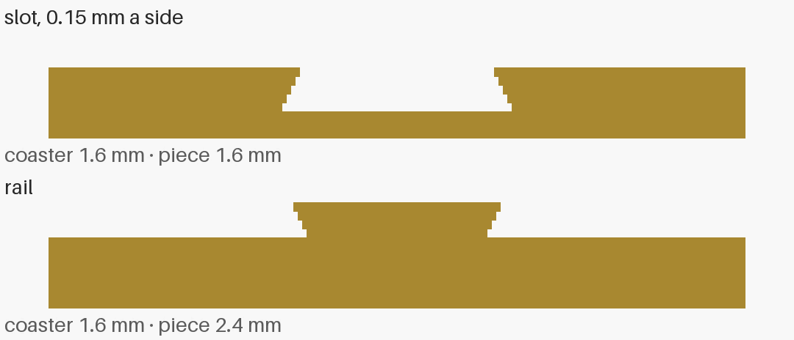
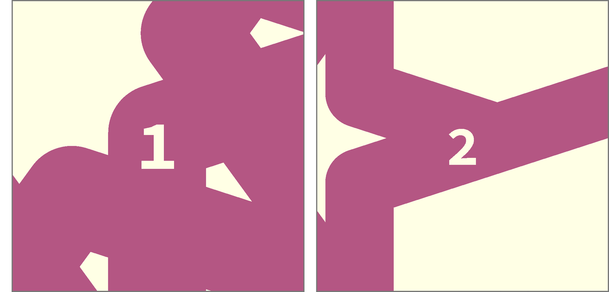
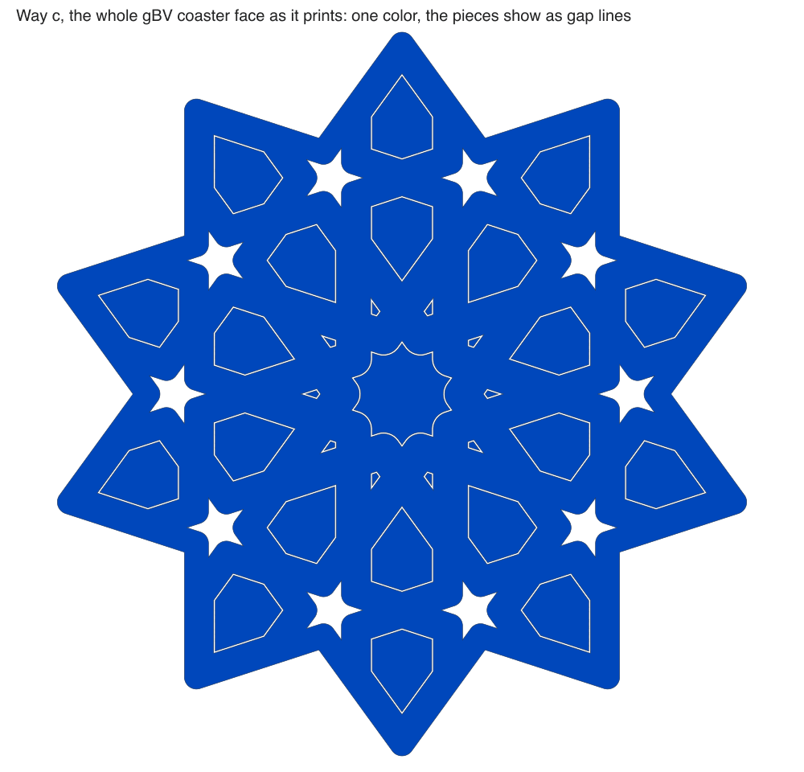

# Open calls — 2026-10-06

Everything waiting on you, on one page: six plates waiting on a yes, three questions about prints
that already ran, and fourteen design calls carried over from the
[2026-10-05 page](2026-10-05-open-calls.md), plus one added the same day (15b, a way-c coaster's
face colors). That page's other twelve calls are decided; they are listed at the end. Tick one box per call, or comment on a line. The next session records each answer
(a plate yes goes into that plate's Approvals table, a call into the decisions log) and starts the
work it unblocks. A call with no tick stays open, and nobody picks for you from the "my pick" column.

**Updated 2026-10-07, after your comments and ticks.** Every prototype now carries an id, as you
asked: a letter pair on each coupon half (`AB` and `AT`, `BB` and `BT`, …), a number on each
split coaster, and dots on each sheets-04g-fit middle piece. Your four yeses are recorded on the
plate pages. Three of those plates (pkt-1, split-01, split-02) changed to carry their ids, and a
changed plate needs a new yes, so each has a fresh box below its old tick. sld-1 did not change
and is ready to send. The answers to your comments are under calls 1, 4, 5, 6 and 15, and the
kites raise one new call, 6b.

The colors in the plate calls are the four loaded in the printer when this page was written
(2026-10-06): pink PLA Basic, blue PLA Silk, black PLA Basic and green PLA Basic. A plate is one
color, picked at the send.

| # | Call | My pick | Why, in one line |
|---|---|---|---|
| 1 | Print spl-1, the stud and lip coupon? | Yes, first | 49 minutes answers the stud fit every split coaster needs |
| 2 | Print pkt-1, the pocket coupon? | Yes, second | The one unknown way c rests on, in 35 minutes |
| 3 | Print sld-1, the dovetail coupon? | Yes | 12 minutes; the join you asked to try |
| 4 | Print split-01, the lip coaster? | After spl-1 | Its studs use the gap spl-1 is about to measure |
| 5 | Print split-02, the flange coaster? | Yes, any time | No studs, so nothing waits on spl-1 |
| 6 | Print sheets-04g-fit, the kite and middle-piece gaps? | Yes | The next sheets-04g needs its gaps |
| 6b | How to tell the kite rungs apart | Keep each rung in its own pile | A kite is too small for a dot; the other ways change the fit being tested |
| 7 | Did minis-01 print? | — | Only you know |
| 8a | How did the sheets-04c coaster come out? | — | It finished on 2026-10-04 and nobody has judged it |
| 8b | Call sheets-04c repeatable, or keep it an experiment | Repeatable, if 8a is a keep | Its pieces have been kept every time |
| 9 | Which build plate prints the two faces | Cool Plate SuperTack, if gloss is the point | The nearest to gloss in Bambu's own words |
| 10 | Round the cut edges or not | Sharp edges | Both faces crisp and the same; nothing new to build |
| 11 | Glue or press fit | Press fit, glue optional | Comes apart if a pin is wrong; no glue near hot mugs |
| 12 | How many studs | About 9, 25 mm apart | Easy to press by hand; raise it if the halves gap |
| 13 | Where splitting lives | A bikar coaster clause | Already built this way; a plate recipe can say "split" |
| 14 | Split pieces: start with way a or way c | a first, then c | a changes one thing on a plate we have; c needs an unmeasured air gap |
| 15 | If c: how the two piece halves become one | The pocket and nothing extra | The pocket is needed whatever else is chosen |
| 15b | If c: the color of each face | Both faces one color, one plate | One send; a way-c face is one color whatever is picked |
| 16 | How the Lab prints a colored coaster | One plate per color | No color swaps and nothing left over |
| 17 | A color per group, or per piece too | Per group now, per piece later | Uses only what is built and tested |
| 18 | Where a plate's color is written | In the recipe for per-color plates, at the send for whole-set plates | The pink plate says pink on its page and in its yes |
| 19 | How the Lab learns what is loaded | Paste the printer's tray list | No new connection; the access code stays in the plate tools |
| 20 | Where the order pages live | The hub | Private by default, and it already reads the printer |
| 21 | How the price is set | Cost plus a markup, with the market drawn beside it | It cannot quote below cost |
| 22 | A price below break-even | Shown and tagged; quoting it needs a reason | A launch price can be a choice, never an accident |

## Plates waiting on a yes (calls 1 to 6)

**In short.** Each of these plates is sliced, has its page with pictures, and passes every check
before the send. None can go out without your yes, and a yes covers one send. Ticking a color here
counts as the yes; the next session writes it onto that plate's page, then sends it with the send
checklist (the printer idle, the bed photo looked at). Each plate's own page has the full detail and
its own Approve box; ticking either one is enough. All six are experiments: each asks one question,
in the hand.

The order I would print them: spl-1 first, because its stud gap feeds split-01; then pkt-1, sld-1,
split-02 and sheets-04g-fit in any order; split-01 last. About 6 hours 10 minutes of printing
in all, and about 115 g.

### 1. Print spl-1, the stud and lip coupon? ^86hk9f

*A flat drawing of the bed from above, each part in a stand-in color so they can be told apart. The
plate prints in the one color you pick.*

[spl-1](../../design/plates/spl-1.md) asks which gap between a 2 mm stud and its socket presses in
and holds, whether a 1.5 or 3 mm stud does better, whether a socket shows through a 0.6, 0.8 or
1.0 mm floor on the top face, and whether a 0.8 mm lip keeps a loose piece in between the halves.
One bed, 49 minutes, about 18.5 g (43 minutes and 18.3 g before the letters).

| Option                        | Pros                                                            | Cons                                   | What it leads to                              |
| ----------------------------- | --------------------------------------------------------------- | -------------------------------------- | --------------------------------------------- |
| **Print it** (my pick, first) | Settles the stud gap for split-01 and every later split coaster | 49 minutes and 18.5 g                  | The gap that holds goes into the split recipe |
| Hold it                       | Nothing spent                                                   | split-01's studs stay at a guessed gap | split-01 waits, or prints on the guess        |

**Your answer:**

- [ ] Yes, in pink
- [ ] Yes, in silk blue
- [ ] Yes, in black
- [ ] Yes, in green
- [ ] Not yet
- Notes:

**Your comment, answered (2026-10-07).** You asked: "Can these all be printeind in smae color? can
we have minimal letters printiend on each AT AB (a top, a bottom), BT, BB, ETC".

- **One color: yes.** Every plate on this page prints in one color, the one you pick at the send.
  The colors in the bed drawing above only tell the parts apart on screen.
- **Letters: done.** Each of the fourteen pairs now has its letter cut into both cut faces, 2.5 mm
  tall: the lower half reads `AB`, the upper `AT`, then `BB` and `BT`, on to `N`. The cut faces
  meet when a pair closes, so the letters are hidden in a closed pair and read when it is opened.
  The same letters went onto pkt-1 (call 2), going on from `O` to `R`, so no two coupons on the
  shelf share one.

*Cut faces seen straight on, drawn from the meshes bikar makes for these plates. Left to right: a
spl-1 trap tile's lower half (`MB`), a pkt-1 tile's upper half (`RT`), and both halves of a spl-1
stud pair (`IB`, `IT`). Nothing with a letter has printed yet, so how crisp a 2.5 mm letter comes
out is still to see.*

spl-1 had no yes, so adding the letters reset nothing. A tick above now means the lettered plate.

### 2. Print pkt-1, the pocket coupon?

*A cut-through side view, closed, at one layer (0.2 mm) of air. Drawn to its real sizes but not to
scale on your screen. The plate also has a pair at two layers (0.4 mm).*

[pkt-1](../../design/plates/pkt-1.md) is way c's one unknown: does a piece half printed in its
closed pocket come out loose at one layer of air, or only at two; does the closed piece move or
click when the coaster is lifted; and is the band's underside, printed over air, flat? You said on
2026-10-05 you lean towards c. One bed, 35 minutes, about 11.6 g.

| Option | Pros | Cons | What it leads to |
|---|---|---|---|
| **Print it** (my pick, second) | Answers whether way c can work at all, before any full coaster is built for it | 35 minutes and 12 g | A yes on the gap lets call 14 pick c with a measured number |
| Hold it | Nothing spent | Way c stays a drawing | Call 14 is decided without the one number it needs |

**Your answer:**

- [x] Yes, in pink
- [ ] Yes, in silk blue
- [ ] Yes, in black
- [ ] Yes, in green
- [ ] Not yet
- Notes:

**Recorded 2026-10-07:** your yes in pink is on [pkt-1's page](../../design/plates/pkt-1.md). Then
each of its four pairs got its letter (`O` to `R`, as under call 1), which changes the plate, so
that yes no longer covers it (D-097). A tick here is the yes for the lettered plate:

- [ ] Yes, with the letters, in pink
- [ ] Yes, with the letters, in another color (name it in Notes)
- [ ] Not yet
- Notes:

### 3. Print sld-1, the dovetail coupon?

*Cut-through side views of one pair at the 0.15 mm gap. Each step is one 0.2 mm layer. The plate
has three pairs, at 0.10, 0.15 and 0.20 mm a side.*

You said "for joints i want to try the dovetail" (D-107). [sld-1](../../design/plates/sld-1.md)
asks whether a 0.8 mm rail in a 1.0 mm slot joins two 1.6 mm piece halves by hand with no glue, and
at which gap it slides in and stays. It suits ways a, b and d, where the piece halves are loose,
not way c. One bed, 12 minutes, about 2.4 g.

| Option | Pros | Cons | What it leads to |
|---|---|---|---|
| **Print it** (my pick) | The cheapest plate here; the join you asked for | Says nothing about way c | If a gap holds, way a loses its worst cost (twice the parts to place loose) |
| Hold it | Nothing spent | The join stays untried | Way a keeps loose half-pieces |

**Your answer:**

- [x] Yes, in pink
- [ ] Yes, in silk blue
- [ ] Yes, in black
- [ ] Yes, in green
- [ ] Not yet
- Notes:

**Recorded 2026-10-07:** your yes in pink is on [sld-1's page](../../design/plates/sld-1.md), and
it still covers the plate. sld-1 did not change: each half already has its gap cut into it, so its
three pairs are told apart without a new mark. It is ready to send on your go.

### 4. Print split-01, the split coaster that holds its pieces under a lip? ^h84hb3

*An exploded view of the two halves and the pieces between them; grey is the coaster, the other
colors only tell the piece groups apart.*

[split-01](../../design/plates/split-01.md) is option A of the decided split hold (D-100): the gBV
coaster cut flat through its middle, each hole 0.8 mm narrower for the first 0.6 mm in from each
face, so a piece dropped into the lower half cannot fall through. The stars stay open holes: a lip
that wide closes up their arms. Studs line the halves up. One bed, 89 minutes, about 30 g.

| Option | Pros | Cons | What it leads to |
|---|---|---|---|
| **Print it after spl-1** (my pick) | Its studs get the gap spl-1 measured | Waits on spl-1's print and your look at it | spl-1's gap goes into the recipe, which needs a new yes for the edited plate |
| Print it now | The first whole split coaster in your hand sooner | Studs at a gap nobody has measured; if they will not close, a 90-minute print shows only that | Possibly a second print once spl-1 is in |
| Hold it | Nothing spent | The lip is never seen in the hand | D-100 says the prints decide between lip and flange; that waits |

**Your answer:**

- [x] Yes, after spl-1, in pink
- [ ] Yes, after spl-1, in silk blue
- [ ] Yes, after spl-1, in black
- [ ] Yes, after spl-1, in green
- [ ] Yes, now (name the color in Notes)
- [ ] Not yet
- Notes:

**Your comment, answered (2026-10-07).** You asked, here and on call 5: "mnake sure we are adding a
label to atleast one main peice so we can distinguish. this proptoty ... every proptoty should
have an id .. this should be aprt of our skills".

- **The id: done.** split-01's lower half now has a "1" cut into its bottom face, 2.5 mm tall,
  mirrored so it reads the right way round from below. split-02's has a "2" (call 5). The bottom
  is the one face that is solid enough: the cut faces of these two coasters are mostly pocket or
  undercut.
- **Part of our skills: done.** The rule "every prototype carries its id" is now in the
  [sample rules](../../../.claude/skills/print-coaster-samples/sample-rules.md) the
  print-coaster-samples skill reads every run, and the prioritize-prints skill checks for it before
  a plate goes on a page. Ids run on from plate to plate, so no two prototypes on the shelf share
  one: spl-1 is A to N, pkt-1 O to R, split-01 1, split-02 2.

*The lower halves seen from below, drawn from the meshes bikar makes for these plates. Each id sits
on solid strap. Nothing with an id has printed yet.*

**Recorded 2026-10-07:** your yes (after spl-1, in pink) is on
[split-01's page](../../design/plates/split-01.md). Adding the id changed the plate, so that yes no
longer covers it (D-097). A tick here is the yes for the plate with its id:

- [ ] Yes, with the id, after spl-1, in pink
- [ ] Yes, with the id, in another color or another order (say which in Notes)
- [ ] Not yet
- Notes:

### 5. Print split-02, the split coaster whose pieces carry a flange? ^mtorlk

*The same exploded view as call 4. Each piece has a band round its middle, 0.8 mm wider than its
hole, that the two halves close on.*

[split-02](../../design/plates/split-02.md) is option C of D-100: both faces look like today's
coaster with the pieces flush, every ring held, stars included. It has no studs (the undercuts leave
no strap wide enough for one), so the halves line up by their outlines. One bed, 107 minutes, about
31 g.

| Option | Pros | Cons | What it leads to |
|---|---|---|---|
| **Print it** (my pick, any time) | Nothing here waits on another plate; the flush look you would sell | The longest plate here; whether the halves line up with no studs is untested | Lip against flange, decided in the hand |
| Hold it | Nothing spent | The flush look stays a drawing | The lip-or-flange decision waits |

**Your answer:**

- [x] Yes, in pink
- [ ] Yes, in silk blue
- [ ] Yes, in black
- [ ] Yes, in green
- [ ] Not yet
- Notes:

**Your comment, answered (2026-10-07).** The same comment as call 4, and the same answer: split-02's
lower half now has a "2" on its bottom (the picture under call 4). One limit is new: on this
coaster the id is cut only 2 mm tall. The undercuts leave only a narrow rib of solid strap under
the bottom face, and a 2.5 mm digit finds no spot on it with room. At 2 mm the hole in a 4 closes
up, so this coaster takes the ids 1 to 9 except 4. It also has room only at its 112.5 mm size: at
80, 90 and 100 mm no id fits. bikar refuses an id that does not fit and says why, so a wrong one
cannot slip through.

**Recorded 2026-10-07:** your yes in pink is on [split-02's page](../../design/plates/split-02.md).
Adding the id changed the plate, so that yes no longer covers it (D-097). A tick here is the yes
for the plate with its id:

- [ ] Yes, with the id, in pink
- [ ] Yes, with the id, in another color (name it in Notes)
- [ ] Not yet
- Notes:

### 6. Print sheets-04g-fit, the kites and middle piece at a ladder of gaps? ^8wfkhe

*A flat drawing of the bed from above, in stand-in colors, redrawn 2026-10-07 with the coaster your
comment added.*

On sheets-04g you said the kites were too tight and the middle piece too loose.
[sheets-04g-fit](../../design/plates/sheets-04g-fit.md) prints ten kites at each gap from 0.05 to
0.25 mm, and the middle piece, now cut along the strap's real edge, at 0 to 0.15 mm, to press into
the sheets-04g coaster you already have. One bed, 25 minutes, about 5 g, before the changes below
(now 78 minutes and about 21 g).

| Option | Pros | Cons | What it leads to |
|---|---|---|---|
| **Print it** (my pick) | Gives the next sheets-04g its gaps from your fingers, not a guess | 78 minutes with the coaster, and trying 54 pieces by hand | The gap per group for the next sheets-04g |
| Hold it | Nothing spent | The next sheets-04g repeats the guess | Kites stay tight, the middle loose |

**Your answer:**

- [ ] Yes, in pink
- [ ] Yes, in silk blue
- [ ] Yes, in black
- [ ] Yes, in green
- [ ] Not yet
- Notes:

**Your comment, answered (2026-10-07).** You asked: "we should re-print minimal consturciton with
this to fit in again. can we use small dots to distingush (on top of peices (3 dots for biggest, 1
dot for smallest, etc?".

- **The coaster: added.** The plate now prints a fresh gBV minimal coaster, as sheets-04g printed
  it, beside the pieces. That makes it 78 minutes and about 21 g, not 25 minutes and 5 g (a new
  local slice, 2026-10-07; all on one bed).
- **Dots: done on the middle pieces.** Four dots on the biggest (gap 0), then three, two, and one
  on the smallest (gap 0.15). Each dot is 1 mm across, cut into the top.
- **Not on the kites.** A dot needs at least 0.8 mm of top left to the piece's edge, or the edge
  prints too thin to hold (CAL-CST-01). The biggest kite leaves 0.71 mm round one dot, so no kite
  can take one. How to keep the kite rungs apart is a new call, 6b, just below.
- **Since then (2026-10-07):** a dot row now sits at the piece's widest spot, not its centre
  (bikar #324). A kite at this size holds one dot at gaps 0.05, 0.10 and 0.15, and none at 0.20
  (0.80 mm left) or 0.25 (0.75 mm). The plate is unchanged.

*The four middle pieces from above, drawn from the meshes bikar makes for this plate, biggest
(gap 0, four dots) on the left. At this size the gaps are too small to see; only the dots tell them
apart.*

sheets-04g-fit had no yes, so these changes reset nothing. A tick above now means this plate, with
the coaster and the dots.

### 6b. How to tell the kite rungs apart

**In short.** sheets-04g-fit prints ten kites at each of five gaps, 0.05 to 0.25 mm. Off the bed
the rungs look the same, and a kite is too small for a dot (call 6). So the question is how you
know which rung a kite came from once it is in your hand. What you are testing is which gap fits,
so a way that changes the kite's shape or size changes the answer.

**A fact for this call, found 2026-10-07 (not a pick).** With the dot row at the widest spot
(bikar #324), a kite holds one dot at gaps 0.05, 0.10 and 0.15, and none at 0.20 or 0.25. One
is the most any kite holds, so dots can sort the kites into two groups, with a dot and without,
not into five rungs. The plate prints no kite dots until you pick.

| Option | Pros | Cons | What it leads to |
|---|---|---|---|
| **Keep each rung in its own pile** (my pick) | Nothing to build; the kites stay exactly the shape being tested | Once two rungs mix, they cannot be sorted again; take one rung off the bed at a time, by the labeled bed picture under call 6 | The plate prints as it is now |
| Step each rung's height: 4.4, 4.2, 4.0, 3.8, 3.6 mm | Each rung can be told by eye or by feel against the coaster's top; a recipe change only, no new bikar work | A shorter kite touches its hole over less height, so it may feel looser than its gap alone would make it, which blurs the very fit being tested; it also sits below the coaster's top | A recipe change and a new slice; the fit read gets a caveat |
| Smaller dots, or a lower edge floor, for kites only | A mark on every piece, like the middles | The 0.8 mm floor is a bet nobody has measured below, and a 0.6 mm dot is about the width of one line from the 0.4 mm nozzle, so it may not form at all | A new calibration bet and a coupon to measure it, before this plate can use it |

**Your answer:**

- [ ] Keep each rung in its own pile
- [ ] Step each rung's height
- [ ] Smaller dots (a calibration coupon first)
- Notes:

## Prints that already ran (calls 7 and 8)

### 7. Did minis-01 print?

[minis-01](../../design/plates/minis-01.md) went to the printer on 2026-09-25, before the print
watcher existed, so nothing records whether it finished or what came off the bed. This is a fact,
not a choice; its page has the same boxes.

**Your answer:**

- [ ] It printed (say per piece in Notes whether it is a keep, if you remember)
- [ ] It did not print, or it failed
- [ ] I don't remember
- Notes:

### 8a. How did the sheets-04c coaster come out?

*The drawing from its page, not a photo of the print.*

[sheets-04c](../../design/plates/sheets-04c.md) is the gBV minimal coaster again, alone. The
watcher logged it finished at 01:20 UTC on 2026-10-04, with no pause. Nobody has said how it looks.

**Your answer:**

- [ ] Keep: as good as the first one
- [ ] Adjust: usable, but something is off (say what in Notes)
- [ ] Drop: not usable
- Notes:

### 8b. Call sheets-04c repeatable, or keep it an experiment

**In short.** A plate's level says how proven it is. The grade tool reads the prints and says
sheets-04c's pieces would carry *repeatable*: the same coaster printed on sheets-04 and was kept.
The page still says experiment. Moving it up is your call; keeping an experiment an experiment is
never wrong. It is not *production*, the level that sends with no new yes: that needs one kept run
of this plate as laid out, and a full bed.

| Option | Pros | Cons | What it leads to |
|---|---|---|---|
| **Repeatable, if 8a is a keep** (my pick) | The page says what the prints show | Nothing yet, because repeatable still needs a yes per send | Next step is production: fill the bed, print it once, keep it |
| Keep it an experiment | Nothing changes | The page says less than the prints | The grade tool keeps noting the difference |

**Your answer:**

- [ ] Repeatable
- [ ] Keep it an experiment
- Notes:

## The split coaster (calls 9 to 15)

**In short.** A split coaster is cut flat through its middle. Both halves print face down, so both
faces you see are first layers, and studs pin the halves back together. How it holds its pieces is
decided: a lip and a flange, both built, as split-01 and split-02 (calls 4 and 5). The calls below
are the rest of the [split design](../../design/pieces/split-with-studs-design.md#10-open-calls-for-omar)
and the [finish techniques brainstorm](../../design/printing/finish-techniques-brainstorm.md#5-open-for-omar),
unchanged from 2026-10-05.

*Not to scale. Dark grey is the lower half, light grey the upper, gold the piece, the dashed line
the table.*

### 9. Which build plate prints the two faces (and which one is the glacier plate)

You named a "glacier plate". It is not in our notes, and the slicer needs a plate type for every
slice. If it is one of these under another name, tick that one; if it is another maker's, tick the
last box and write its name in Notes.

| Option | Pros | Cons | What it leads to |
|---|---|---|---|
| **Cool Plate SuperTack** (my pick, if gloss is the point) | The nearest to gloss in Bambu's words ("approaches a smooth, glossy finish"); made for PLA | A purchase; a plate swap per job; first-layer flaws show more; "approaches glossy" is the maker's word, not a measurement | Slice for SuperTack; check the edge flare on it again |
| Textured PEI, as now | No purchase, no swap; hides small flaws | Grained, not glossy, though both faces at least match | Gloss is dropped; the split still makes the faces match |
| Smooth PEI | The flattest face, by Bambu's description | A purchase; Bambu calls it "smooth and matte" | Slice as the smooth plate type (presumed) |
| The glacier plate is something else | Uses the plate you have in mind | Unknown finish until a print shows it | We find its slicer plate type first |

**Your answer:**

- [ ] Cool Plate SuperTack (and buy one)
- [ ] Textured PEI, as now
- [ ] Smooth PEI (and buy one)
- [ ] The glacier plate is something else
- Notes:

### 10. Round the cut edges or not

| Option | Pros | Cons | What it leads to |
|---|---|---|---|
| **Sharp edges on both faces** (my pick) | Both faces crisp and the same; nothing new to build | Loses today's softened top edge | The split drops the rounded top edge it inherits |
| A round-over on each cut edge | Softer to hold | A groove round the whole side wall at the seam | The seam becomes a design line |

**Your answer:**

- [ ] Sharp edges
- [ ] Round-over on each cut edge
- Notes:

### 11. Glue or press fit

| Option | Pros | Cons | What it leads to |
|---|---|---|---|
| **Press fit at the coupon's gap, glue optional** (my pick) | Comes apart if a pin is wrong; no glue on a coaster that meets hot mugs | A PLA press fit "relaxes over months" (a 3D-printing blog, not a test of ours), so it may loosen | spl-1 (call 1) picks the gap; a loosened coaster can be glued later |
| Glue always | Strongest; fills the side hairline | Permanent; squeeze-out on a visible face; it would be epoxy, since Bambu warns super glue on PLA cracks in the cold | The studs only line things up |

**Your answer:**

- [ ] Press fit, glue optional
- [ ] Glue always (epoxy)
- Notes:

### 12. How many studs

*The two halves as they print, a stand-in green. The studs sit where straps cross; there is room
for 56.*

| Option | Pros | Cons | What it leads to |
|---|---|---|---|
| **About 9, 25 mm apart** (my pick, to start) | Easy to press | Straps between studs can lift a little | Raise the count if the halves gap |
| Every crossing, 10 mm apart (56) | Holds everywhere | 56 pins to press at once; a tight gap may be too stiff to close by hand | spl-1's gap matters more |

**Your answer:**

- [ ] About 9, 25 mm apart
- [ ] Every crossing (56)
- Notes:

### 13. Where splitting lives

This is already built on my pick: bikar's `split at` clause made split-01 and split-02. A different
tick changes that work.

| Option | Pros | Cons | What it leads to |
|---|---|---|---|
| **A bikar coaster clause** (my pick) | A plate recipe can say "split"; every send is the same | Nothing more to build; it is built | Split plates are made like every other plate |
| The slicer's cut, by hand, each job | No bikar code to keep | Every click repeated on every send; no plate recipe can say "split" | The clause is removed and splitting is manual |

**Your answer:**

- [ ] A bikar coaster clause
- [ ] The slicer's cut by hand
- Notes:

### 14. Split the pieces too: start with way a, or go straight to way c

The coaster's two faces are first layers, but each whole piece still prints one face down, so its
other face is the last layer: two finishes on one coaster. Cut the pieces in two as well and every
face you see is a first layer. You said on 2026-10-05: "Only one of the faces will be glossay here,
and I want the coaster to be flat ... leaning towards c". The coupons for both are built: sld-1
(call 3) for a, pkt-1 (call 2) for c.

*Not to scale. Picture 2 is way a, picture 4 is way c. Solid blue is a first layer, orange dashed a
last layer.*

What way c looks like on the whole coaster, drawn 2026-10-06 from bikar main (`hold pocket`, one
layer of air; both halves pass the mesh check). It is the lower half's face, cut 0.3 mm up, as it
prints. The pieces print inside the half, so they are the half's color. The pattern shows only as
the thin gap round each piece and the open stars. Way a keeps a color per group of pieces, as in
the [piece groups](2026-10-05-open-calls-media/gbv-groups.png), each with a lip-wide border.

| Option | Pros | Cons | What it leads to |
|---|---|---|---|
| **a first, then c** (my pick) | a changes one thing on split-01, so one print answers one question; each face can be its own color | Twice the parts to place, unless sld-1's dovetail holds; a kite half is small (1.6 mm) | One new bikar setting on the lip hold; c comes after |
| Straight to c | The bigger win: nothing to place, every face a first layer | Rests on pkt-1's air gap, unmeasured until it prints; one color per coaster half | pkt-1's result decides whether a full c coaster is built |
| Keep it only as a list for now | Nothing spent | The two-finish look stays | Nothing starts |

**Your answer:**

- [ ] a first, then c
- [ ] Straight to c
- [ ] Only a list for now
- Notes:

### 15. If way c: how the two piece halves become one ^mdy7df

*Not to scale. The pocket (picture 2) is what pkt-1 tests.*

| Option | Pros | Cons | What it leads to |
|---|---|---|---|
| **The pocket and nothing extra; glue only if the movement is felt** (my pick) | No step and no glue; every piece comes apart again | Lifted, a pair can move by the air gap (0.2 mm at one layer) and may click | pkt-1 shows whether it matters in the hand |
| A drop of glue between the halves | Truly one piece | A step per piece (31 on gBV), fixed for good | A glue to pick; it touches call 11 |
| A peg and socket on the cut faces | Lines up, no glue | The pocket already lines them up; a tight peg is a press fit, the kind that went wrong on sheets-04g | A peg fit to calibrate per shape |
| Pieces a little taller | No movement at all | Each piece face stands out past the coaster face | A look call; probably not |

**Your answer:**

- [ ] The pocket, nothing extra
- [ ] Glue
- [ ] Peg and socket
- [ ] Taller pieces
- Notes:

**Your comment, answered (2026-10-07).** You asked: "waht happened to the dove tail slider".

- **It is still on, as sld-1** (call 3). Your yes in pink is recorded on its page, the plate has
  not changed, and it is ready to send on your go.
- **Why it is not one of the options here.** A dovetail joins by sliding one half in from the
  side. In way c each piece half is printed inside its pocket, in its coaster half, and the two
  coaster halves close straight down onto each other, lined up by the studs. A piece half held in
  its pocket has no room to slide, so a rail on it would never reach its slot.
- **Where it does fit.** Ways a, b and d, where the piece halves are loose and you put them
  together by hand before they go in. There it would turn each pair of halves into one piece, so
  way a would no longer mean twice the parts to place (call 14, way a's con). sld-1 says which gap
  slides in and stays.

### 15b. If way c: the color of each face

Each face of a way-c coaster is one color, its half's. The halves print one at a time, so the two
faces can differ without a color change during a print. Added 2026-10-06. This is the last call
before a full way-c coaster can print; the air gap is not a call, because pkt-1 decides it (the
thinnest air whose band comes free; if both fuse, way c is out and way a is next).

| Option | Pros | Cons | What it leads to |
|---|---|---|---|
| **Both faces one color, both halves on one plate** (my pick) | One send, no color changes; either face can go up | The pattern shows only as gap lines and open stars, on both faces | One plate, about the size of split-01 (89 minutes, 30 g there; not sliced yet) |
| A different color on each face | A coaster that flips between two looks; still no color change during a print | Two sends, one per half; still one color per face | Two plates, one color each |
| Two colors on one plate | One send | A color change every layer of the two halves; phones-01 took about 62 minutes against 22 sliced for the same reason | Not worth it; listed so it is ruled out on purpose |

**Your answer:**

- [ ] Both faces one color: pink / silk blue / black / green
- [ ] A different color on each face (name the two in Notes)
- [ ] Two colors on one plate
- Notes:

## Piece colors (calls 16 to 19)

**In short.** The Coaster Lab has a Piece colors screen: you give each ring of loose pieces a
color, it shows what that costs, and it writes the plate recipes. The `plates by-color` command and
the screen are built and merged on my picks for calls 16 and 18; a different tick changes that
work. The full argument is in the
[piece colors design](../../design/coaster/infill-color-ux-design.md#8-open-calls-for-omar).

*A mockup in the Lab's styles, not the Lab itself. The cost numbers are estimates split from one
slice, not slices of these plates.*

*The five groups of the gBV coaster, in stand-in colors. "Per group" means all ten kites take one
color.*

### 16. How the Lab prints a colored coaster

| Option | Pros | Cons | What it leads to |
|---|---|---|---|
| **One plate per color** (my pick) | No swaps, no leftovers; fits the one-color-per-plate rule of 2026-10-04 | Three plates, three yeses and three sends for one coaster | Already built this way |
| The whole set, once per color | No new recipe: sheets-04g plus a color at the send; spares make more coasters | Three times the time and plastic for one coaster | The by-color command shrinks to a cost table |
| One plate, many colors, with its cost shown | One send; nothing to sort by hand | About 70 extra minutes and a prime tower on this coaster | Reopens the 2026-10-04 decision |

**Your answer:**

- [ ] One plate per color, with the other two shown as costs beside it
- [ ] The whole set, once per color
- [ ] Allow a many-color plate
- Notes:

### 17. A color per group, or per piece too

| Option | Pros | Cons | What it leads to |
|---|---|---|---|
| **Per group now, per piece later** (my pick) | Uses only what is built and tested; keeps the pattern's symmetry | No single odd piece until the last phase | One piece at a time waits for a test in bikar |
| Per piece from the start | Full freedom | Rests on an untested path; every odd piece can add a plate | The screen needs per-piece picking from day one |
| Per group only, never per piece | Simplest, always symmetric | Rules out a single accent piece | The per-piece phase is dropped |

**Your answer:**

- [ ] Per group now, per piece later
- [ ] Per piece from the start
- [ ] Per group only
- Notes:

### 18. Where a plate's color is written

| Option | Pros | Cons | What it leads to |
|---|---|---|---|
| **In the recipe for a per-color plate, at the send for a whole-set plate** (my pick) | The pink plate is pink on its page and in its yes | Two habits, chosen by kind of plate | Already built this way; changing a per-color plate's color resets its yes |
| Always at the send | One habit; recipes never change for color | The pink plate's page does not say pink | The recipe's color field goes unused |
| Always in the recipe | Every page shows its color | sheets-04g's "pick at print time" goes away | Each color of the whole-set route becomes its own recipe |

**Your answer:**

- [ ] In the recipe for per-color plates, at the send for whole-set plates
- [ ] Always at the send
- [ ] Always in the recipe
- Notes:

### 19. How the Lab learns which colors are loaded

You asked on 2026-10-05, "cant it lookup on printer with cli". The command does read the printer (it
gave this page its four colors), but the Lab is a web page and cannot run a command on your machine.
The hub can, which is the second option.

| Option | Pros | Cons | What it leads to |
|---|---|---|---|
| **Paste or drop the printer's tray list** (my pick) | No new connection; the printer's access code never leaves the plate tools; works on the hosted Lab | One manual step, and the list goes stale when a spool changes | The screen shows when the list was read |
| The hub runs the command and the Lab asks it | Always current, no manual step | A hosted page asking a home machine for data needs a route that does not exist today | The hub grows a read-only tray page; a hosting question comes first |
| No tray list; any color | Nothing to build | You guess what is loaded | The send's refusal is the only check |

**Your answer:**

- [ ] Paste or drop the tray list
- [ ] The hub runs the command
- [ ] No tray list
- Notes:

## Orders and pricing (calls 20 to 22)

**In short.** You type in an order, and the tools work out the plates, the time, the filament to buy
and a price. Planning an order is built. Two parts are settled: order files never go in this repo
and sit in an iCloud folder (D-101), and pricing ideas get tried on simulated buyers and a charted
view (D-104). The stock shelf and the price page wait on these calls, and every price setting is
empty on purpose. The full argument is in the
[order-driven Lab design](../../design/coaster/order-driven-lab-design.md#10-open-calls-for-omar).

*A mockup in the hub's styles. The minutes and grams stand in until a Matte plate is sliced.*

### 20. Where the order pages live (Plan, Price, Stock)

The iCloud folder answers where the order files sit, not which app shows them.

| Option | Pros | Cons | What it leads to |
|---|---|---|---|
| **The hub** (my pick) | Private by default; it already runs the tools and reads the printer; can read the iCloud folder | Only reachable on your private network; hub work before the pages appear | The Lab gets one "Add to order" button |
| The Coaster Lab, in the browser | No server | One browser, one device, lost when cleared; the Lab is public, so no private prices | Rules out shared stock across devices |
| A spreadsheet | Fastest to start | Nothing is worked out from the order; numbers drift from the slices | Every later page re-types what the sheet holds |

**Your answer:**

- [ ] The hub
- [ ] The Coaster Lab in the browser
- [ ] A spreadsheet
- Notes:

### 21. How the price is set

*A mockup. Every amount is empty because the settings are. The market band is one day's asking
prices, not sales.*

| Option | Pros | Cons | What it leads to |
|---|---|---|---|
| **Cost plus a markup, with the market drawn beside it** (my pick) | Never sells below cost; every number explained | Needs every cost setting; the markup is a judgment | The twelve settings get filled before any quote |
| Market price | Easy to sell at; no cost model | Can sell below cost on a five-color order | The cost lines become a warning only |
| Value price | Can earn most on a striking design | No way to check it | Needs sales history we do not have |

**Your answer:**

- [ ] Cost plus a markup, with the market beside it
- [ ] Market price
- [ ] Value price
- Notes:

### 22. A price below break-even

| Option | Pros | Cons | What it leads to |
|---|---|---|---|
| **Shown and tagged; quoting it needs a reason** (my pick) | A deliberate loss is allowed and recorded with its reason | One more field on a quote | The quote stores its reason |
| Never shown | No loss can be quoted by accident | Hides exactly what a launch price is about | Launch prices floor at break-even |
| Shown, no tag | Simplest | A loss looks like any other price | The break-even line is the only warning |

**Your answer:**

- [ ] Shown and tagged, with a reason
- [ ] Never shown
- [ ] Shown, no tag
- Notes:

## Already decided, from the 2026-10-05 page

Nothing to tick here; these are for the record.

- Orders never in this repo; they live in an iCloud folder (D-101).
- The store: Basic plan, priced by finish, set size and colors; Etsy later; lead time as a range,
  custom colorings final sale except damage; the Lab in the product page with the hub checking every
  order; a record per design before it is sold; drawings now and a photo per design before opening
  (D-102).
- A custom order prints one plate per color (D-103).
- Pricing tried on simulated buyers and a charted view (D-104).
- Swatches are our own printed card, from Bambu filament first (D-105).
- The first themes are the bottom row: Midnight blue, Night sky, Terracotta souk, Iznik tile
  (D-106).
- A split coaster holds its pieces by a lip or a flange, both printed (D-100).
- The first join to try between piece halves is the dovetail (D-107).

All are in the [decisions log](../decisions-log.md).

## Older calls still open on other pages

Not repeated here, so each keeps its own pictures and threads:

- The radial fill pick, on the [2026-09-29 page](2026-09-29-open-calls.md).
- The smooth-lines calls, held until the sampler sheets are designed
  ([smooth lines §6](../../design/coaster/smooth-lines-design.md#6-open-calls-for-omar)).
- Loose pieces calls 2 to 4
  ([loose pieces §7](../../design/coaster/loose-pieces-design.md#7-open-calls-for-omar)).
- The three reconstruction intake calls
  ([intake §7](../../constructions/reconstruction-intake-design.md#7-open-calls-for-omar)).

## Things only you can do (not decisions)

- **Say go for sld-1.** It has your yes in pink and has not changed. It goes out when you say so
  in chat; prints stay last until you do.
- **Judge the sheets-04g pieces** off the bed: how each ring fits, and whether the finish is good
  enough ([sheets-04g](../../design/plates/sheets-04g.md)).
- **Buy a SuperTack or Smooth plate** if call 9 says so.
- **Buy the colors for the four picked themes** (D-106), then they get plates like any other.
- **Merge two youtube branches**, each one commit ahead of youtube's main and not merged:
  `coaster-0ke` (the 0ke_GpoBa-s petal ring as one whole orbit) and `coaster-n_I` (the n_ICgwOr6qs
  free points on the frame, with arc checks). A push to youtube's main from here was refused, so the
  merge is yours.
- **A faster bikar push for a tag**: skipping bikar's full ten-minute check when a tag is pushed on
  a commit main already passed. The permission check refused it when I tried, so it is yours to make
  or to say no to.

### Yours to do, by id

Plates: spl-1, pkt-1, sld-1, split-01, split-02, sheets-04g-fit, minis-01, sheets-04c. New boxes
since your ticks: calls 2, 4 and 5 (the plates with ids), and call 6b. Decisions:
D-100 to D-107. Task board: #4 (minis-01 record), #131 (bikar tag push), #171 (calls 16 to 19),
#172 (calls 9 to 12 and the SuperTack buy), #173 (judge sheets-04g), #174 (theme colors), #196
(calls 20 to 22), #198 (sheets-04g-fit).
